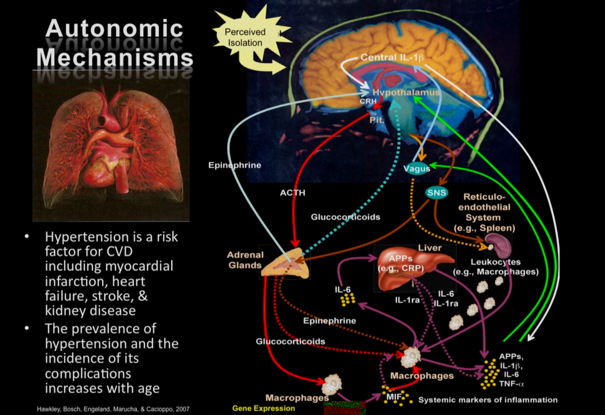
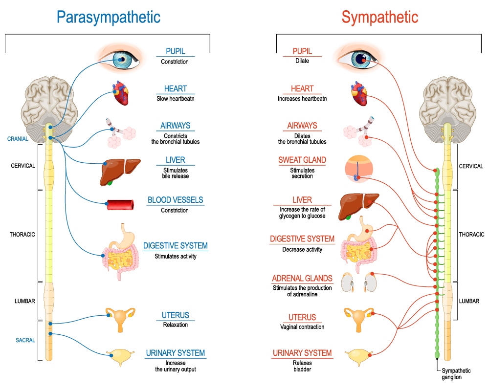
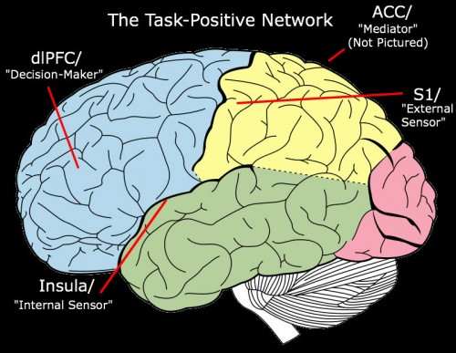
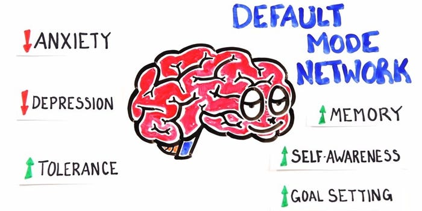

= Codename _Phoenix_

Reborn from ashes.

To burn, but to never burn out.

How to stay healthy in a sick world. +
Wie gesund bleiben, in einer kranken Welt. +
Ako zostať zdravý v chorom svete.

_This document is in a constant work-in-progress state._

== Human needs / Menschliche Bedürfnisse / Ľudské potreby

by / nach / podľa Manfred Max-Neef, Marshall B. Rosenberg and me

---

The needs is *the only reason*, why I'm feeling the way I'm feeling. Not the actions of other people, or the state of the environment. These are only the stimulus for my feelings.

---

*What is a need? / Was ist ein Bedürfnis?*

* Sign of life. / Ein Zeichen des Lebens. / Prejav života.
* Life seeking expression within oneself.
* Manifestation of the divine energy in each living phenomenon, in each life form. link:https://www.youtube.com/watch?v=sHcq9BEXt4I&feature=youtu.be&t=767[Dr Julia Kim - The Gross National Happiness of Bhutan: 12:47-13:01]
* A *need* is a manifestation of life, a manifestation of divine energy within us. All human beings have the same needs. A *value* is a need with a particular level of importance. The importance of a need changes with time, circumstances and preferences.
* A present manifestation of divine energy within us. It's a life force. It's beauty. The life energy within me. link:https://www.youtube.com/watch?v=WfJ_NasCFfQ&feature=youtu.be&t=1422[Marshall Rosenberg Experiencing Needs as Gifts CD NVC Nonviolent Communication: 23:42-26:29]
* The need is "Why you want something?" ... Then you will discover a pool of why's that all humans share. link:https://www.youtube.com/watch?v=mErG7mSzwkc&feature=youtu.be&t=4085[Miki Kashtan - Liberation 1: 1:08:05]
* A need is something that all infants have. When an infant doesn't need it, it's not a need. link:https://www.youtube.com/watch?v=mErG7mSzwkc&feature=youtu.be&t=4085[Miki Kashtan - Liberation 1: 1:08:05]
* values, reasons, causes, motives, purpose, meaning
* filter [Marek Hayden]
* nadhľad
* prostriedok, ako nebrať veci osobne; ako sa odosobniť od vecí [Peter Buček]
* link:https://forum.earlyretirementextreme.com/viewtopic.php?p=61330&sid=bce5b9f50cde4a2243267c00f09f0905#p61330[emotional distance]
* noncontroversial essence
* level of abstraction above strategies that fulfil that are the purpose of these strategies
* dary Ducha Svätého
* gift of God / ein Geschenk Gottes / Boží dar
* precious gift
* blessing / Segen / poženhnanie
* something I want to be always aware of 
* something that I want to always keep in my life link:https://www1.odusu.sk/o-nas-2/[[Psychoterapie (JŠ) - Mittwoch 3.2.2021]] +

     O            /~~~\
    .┼.          (|oo |)
   / | \          \ - /
    / \       (----   ----)
   /   \      (/|       |\)
              |||   O   |||
              |||       |||
              |||       |||
              || ------- ||
              ## | / \ | ##
                 | | | |
                 | | | |
                 ( ) ( )
                 | | | |
                 | | | |
                 |_| |_|
                /__| |__\

link:https://storage.googleapis.com/cdn.thenewstack.io/media/2018/03/4d780610-screenshot-from-star-asciimation-wars.png[Inspiration]
* things that you cannot buy, that are not even things, but that matter the most
* foundation of life

Properties of needs:

* Needs are universal and nonconflicting link:https://veganvanguardpodcast.com/47-social-emotional-learning-sel-for-socialism-and-animal-liberation-with-pierce-delahunt/[47. Social Emotional Learning (SEL) for Socialism and Animal Liberation with Pierce Delahunt: 16:49-17:30]
* They contain no reference to any particular activity or person

---

* Alle Bedürfnisse sind wichtig. Ihre Wichtigkeit ändert sich mit der Zeit,  Umständen und Präferenzen.

---

* *need [bold face] / das Bedürfniss [dick geschrieben] / potreba [tučne zvýraznené]*
* _not a need - feedback / kein Bedürfniss - eine Rückmeldung / nie je potreba - spätná väzba_ - Only as a feedback that the needs were or were not fulfilled. / Nur als Rückmeldung, dass die Bedürfnisse erfült oder nicht erfüllt wurden.
* [line-through]#not a need - a strategy / kein Bedürfniss - eine Strategie / nie je potreba - stratégia#

---

* *subsistence / das Lebensunterhalt / živobytie*
* long life / langes Leben / dlhý život
* air / die Luft / vzduch
* fresh air / frische Luft / čerstvý vzduch
* clean air / saubere Luft / čistý vzduch
* water / das Wasser / voda
* drinking water / Trinkwasser / pitná voda
* nature / Nature / príroda
* physical health / physische, körperliche Gesundheit / fyzické, telesné zdravie
* mental health / psychische, mentale Gesundheit / psychické, mentálne zdravie
* clothes / die Kleidung / oblečenie
* food / das Essen / jedlo
* movement / Bewegung / pohyb
* sleep / der Schlaf / spánok
* shelter / Obdach / prístrešie
* cleanliness / Sauberkeit / čistota
* bodily flexibility / körperliche Gelenkigkeit / telesná pružnosť
* warmth / Wärme / teplo
* people / Menschen / ľudia
* energy / Energie / energia
* enrichment of life / Bereicherung des Lebens / obohatenie života
* to make life wonderful / das Leben wunderbar machen
* light / das Licht / svetlo
* sunlight / Sonnenlicht / slnečné svetlo
* hygiene / Hygiene / hygiena
* environment / Umwelt, Umgebung / prostredie
* _pain / Schmerz / bolesť_
* _illness / Krankheit / choroba_

---

* *protection / die Schutz, Geborgenheit / ochrana*
* stability / Stabilität / stabilita
* safety / Sicherheit, Geborgenheit / bezpečnosť, bezpečie, istota
* security / Sicherheit / bezpečnosť, zabezpečenie
* order / Ordnung / poriadok
* equality / Gleichheit / rovnosť
* foreseeability, predictability / Voraussehbarkeit, Vorhersehbarkeit / predvídavosť, predvídateľnosť
* prevention / Prävention / prevencia
* power (with) / Macht (mit) / moc (s) +
link:https://www.youtube.com/watch?v=KdFc2B-tZLc&feature=youtu.be&t=2486[Marshall Rosenberg - Making Life Wonderful 2/4 - Nonviolent Communication NVC: 41:26-43:06]
* (direct) democracy / (direkte) Demokratie / (priama) demokracia
* strength / Kraft / sila
* protective use of force / beschützende Nutzung der Kraft / použitie sily na obranu
* protecting the nature / Umweltschutz / ochrana prírody
* ecology / Ökologie / ekológia
* sustainability / Nachhaltigkeit / udržateľnosť
* preservation / Erhaltung / zachovanie, udržanie
* durability / Haltbarkeit / trvácnosť
* robustness / Robustheit / odolnosť, robustnosť
* recycling / Wiederverwendung / recyklácia, znovupoužiteľnosť
* cautiousness, carefulness / Vorsichtigkeit / opatrnosť
* economy, thrift / Sparsamkeit / úspornosť, šetrnosť
* [restorative] justice, fairness, equity / [wiederherstellende] Gerechtigkeit / spravodlivosť [založená na obnove (vzťahov) a oprave škôd]
* compensation / Ausgleich / kompenzácia, odškodnenie - nie ako odplata alebo trest, ale ako pomoc pri napĺňaní nenaplnených potrieb pre niekoho iného
* _fragileness / Zerbrechlichkeit (Bedürfnis nach Schutz (physisch) oder Empathie (psychisch)) / krehkosť_
* [line-through]#power (over) / Macht (über) / moc (nad)#
* [line-through]#domination / Herrschaft / dominancia#
* [line-through]#retributive justice / vergeltende Gerechtigkeit / spravodlivosť založená na odplate#
* [line-through]#war / Krieg / vojna#
* [line-through]#violence / die Gewalt / násilie#
* [line-through]#government / die Regierung / vláda#
* [line-through]#colonization / Kolonisation / kolonizácia#

---

* *affection / Zuwendung, Zuneigung / náklonnosť*
* love / Liebe / láska
* tenderness / Zärtlichkeit / neha
* sensuality / Sinnlichkeit / zmyselnosť
* passion / Leidenschaft / vášeň
* touch / Berührung / dotyk
* intimacy / Intimität / intimita
* closeness / Nähe / blízkosť
* trust / Vertrauen / dôvera
* faithfulness, loyality / Treue / vernosť, loajalita
* commitment, dedication, devotion / Hingabe / oddanosť
* care / Pflege / starostlivosť
* connection / Verbindung / spojenie, kontakt
* empathy _(Giraffe Dance)_ / Empathie (Precondition: courage / Mut) / empatia, súcit
* honesty _(Giraffe Dance)_ / Ehrlichkeit (Precondition: vulnerability / Verletzlichkeit) / úprimnosť
* reassurance / Beschwichtigung / uistenie, utešenie
* help, aid / Hilfe / pomoc
* support, aid / Unterstützung / podpora
* generosity / Großzügigkeit / veľkorysosť
* unconditionality / Bedingungslosigkeit / nepodmienenosť, bezpodmienečnosť
* communication / Kommunikation / komunikácia
* friendship / Freundschaft / priateľstvo
* mourning / Trauern / smútenie
* importance (of my needs) / Wichtigkeit (meiner Bedürfnisse) / dôležitosť (potrieb)
* consciousness that my needs matter, that my needs are important and taken into consideration, that I mean something to somebody / +
Bewusstsein, dass meine Bedürfnisse wichtig sind, und in Frage genommen sind, dass ich jemandem etwas bedeute / +
vedomie, že na mne a mojich potrebách záleží, že moje potreby sú dôležité a brané do úvahy, že pre niekoho niečo znamenám
* consideration / Rücksicht / ohľad (Precondition: importance / that my needs matter)
* respekt / Respekt / rešpekt (Precondition: importance / that my needs matter)
* honor / Ehre / úcta (Precondition: importance / that my needs matter)
* dignity / Würde / dôstojnosť (Precondition: importance / that my needs matter)
* tolerance / Toleranz / tolerancia
  ** I disaggree, but I understand. +
    Ich stimme nicht zu, aber ich verstehe. +
    Nesúhlasím, ale rozumiem.
* relationships / Beziehungen / vzťahy
* nurturing, upbringing / Erziehung / výchova
* humanity / Menschlichkeit / ľudskosť
* interdependency / Abhängigkeit [basiert auf Mitarbeit] / závislosť [na základe vzájomného napĺňania potrieb s ohľadom na druhých ľudí a prostredie]
* humility / Bescheidenheit / pokora, skromnosť
* _recognition, acknowledgement / Anerkennung / uznanie_
* _appretiation / Wertschätzung / ocenenie_
* _gratitude / Dankbarkeit / vďačnosť_
* [line-through]#apology Verzeihung / ospravedlnenie#
** *apology* is just a *masked need for empathy*: link:https://www.youtube.com/watch?v=KdFc2B-tZLc&feature=youtu.be&t=4602[Marshall Rosenberg - Making Life Wonderful 2/4 - Nonviolent Communication NVC: 1:16:42-1:17:39], When we empathize, there is nothing to forgive. link:???[(San Fran Workshop)], Forgiveness and empathy are the same thing [in the language of life.] link:???[(SELF EMPATHY)]
* [line-through]#codependency / Abhängigkeit [] / závislosť [na základe napĺňania potrieb na úkor druhých ľudí alebo prostredia]#
* [line-through]#approval / Genehmigung / dovolenie, odobrenie#
* [line-through]#affirmation / Bestätigung / potvrdenie#
* [line-through]#sex / Geschlechtsverkehr#
* [line-through]#sexuality / Sexualität / sexualita#
* [line-through]#duty, obligation / die Pflicht / nutnosť, povinnosť#
* [line-through]#commitment / Verpflichtung / obetavosť, oddanosť#

---

* *understanding / Verständnis / porozumenie*
* critical thinking / kritisches Denken / kritické myslenie
* logical thinking / logisches Denken / logické myslenie
* curiosity / Neugier / zvedavosť
* interest / Interesse / záujem
* intuition / Intuition / intuícia
* concentration / Konzentration / sústredenie
* learning / Lernen / učenie sa
* competence / Fähigkeit / schopnosť
* utility / Nutzen / úžitok
* sense, purpose / Sinn, Zweck / zmysel
* goal / Ziel / cieľ
* effectivity [Does it work, or not? - boolean] / Effektivität / efektivita
* efficiency [How well does it work? As much as possible in as little time as possible, e.g. in case of algorithms or other things not people!] (in comparison to other things, not people) - float, percent) / Effizienz / efektivita
* sufficiency / Suffizienz, Angemessenheit / dostatočnosť
* excellence / Exzellenz / výnimočnosť
* growth / Wachstum / rast
* development / Entwicklung / rozvoj, vývoj (Precondition: individual initiative, dedication link:https://www.youtube.com/watch?v=lfkZJDxC-YY&feature=youtu.be&list=PLAWpwCQqndn68ADSHK1vsFUQ93n3hLcv4&t=1584[(source)])
* consciousness / Bewusstsein / vedomie
* repetition / Wiederholung / opakovanie
* solution / Lösung / riešenie
* answer / Antwort / odpoveď
* feedback / Rückmeldung / spätná väzba
* understandability, clarity / Verständlichkeit, Klarheit / zrozumiťeľnosť
* education / Ausbildung / vzdelanie
* overview / Überblick / prehľad
* universality / Allgemeinheit, Universalität / univerzálnosť
* generality / Allgemeinheit / všeobecnosť
* specificity / Genauigkeit, Spezifizität / konkrétnosť
* control / Kontrolle / kontrola - možnosť ovládať prostredie okolo seba
* explanation / Erklärung / vysvetlenie
* knowledge / Kenntnise / vedomosti
* expertise / Fachkenntnisse / odborné znalosti, odbornosť, expertíza
* randomness / Zufälligkeit / náhodnosť
* compatibility / Kompatibilität / kompatibilita
* completeness / Vollständigkeit / úplnosť
* holism / der Holismus / celostnosť
* depth / die Tiefe / hĺbka
* uniformity (in Data) / Uniformität, Einheitlichkeit, Gleichmäßigkeit (in Daten) / uniformita (v dátach)
* readability / Lesbarkeit / čitateľnosť
* brevity / Kürze / stručnosť
* thoroughness / Gründlichkeit / dôkladnosť, dôslednosť
* correctness / Richtigkeit / správnosť
* validity / Gültigkeit / platnosť
* match / Übereinstimmung / zhoda
* seriousness / Ernsthaftigkeit / vážnosť
* transparency / Transparenz / transparentnosť, priehľadnosť
* links, coherences, context / Zusammenhänge, Kontext / súvislosti
* consecutiveness / die Aufeinanderfolge / následnosť
* _complication / Komplikation_
* _problem / Problem_
* _mistake, error / Fehler / chyba_
* [line-through]#chaos / Chaos, Durcheinander#
* [line-through]#school / Schule / škola#
* [line-through]#work / Arbeit / práca#
* [line-through]#consumption / Konsum / spotreba#

---

* *participation / Teilnahme / účasť*
* acceptance (by others) / Annahme / prijatie
* community / Gemeinschaft / komunita, spoločenstvo, spoločnosť
* receptiveness (from others) / Annahmefähigkeit / prijímanie
* company / Gesellschaft / spoločnosť (ľudí)
* oneness, unity / Einheit / jednotnosť
* belonging / Zugehörigkeit / spolupatričnosť
* cooperation / Zusammenarbeit / spolupráca
* presence / Anwesendheit / prítomnosť
* sharing / Teilen / zdieľanie
* inclusion / Einbeziehung / začlenenie
* integration / Integration / integrácia
* common good / das Gemeinwohl / verejné blaho
* contribution / der Beitrag / prínos
* [line-through]#competition / Wettbewerb, Wettkampf / súťaž#
* [line-through]#competition / Konkurenz / konkurencia#
* [line-through]#race / Rennen / závodenie, preteky#

---

* *leisure / Freizeit / voľný čas*
* serenity / Gelassenheit / pokoj
* peace / Frieden / mier
* rest / Erholung / oddych
* harmony / Harmonie / harmónia
* calmness / Ruhe / pokoj
* awareness / Aufmerksamkeit / pozornosť
* celebration / Feier / oslava
* mindfulness / Achtsamkeit / vnímavosť
  ** reference to Default Mode Network (DMN)
* fun / Spaß / zábava
* humor / Humor
* amusement / Vergnügen / potešenie, zábava
* enjoyment / Genuss / pôžitok
* softness / Weichheit / mäkkosť
* silkiness / Geschmeidigkeit / hebkosť
* culture / Kultur / kultúra
* silence / Stille / ticho
* relaxation / Entspannung / uvoľnenie
* well-being / Wohlergehen, Wohlbefinden / blaho, spokojnosť
* relax / Erholung / oddych
* comfort / Bequemheit / pohodlie
* gratification / Befriedigung / uspokojenie
* contentment, satisfaction / Zufriedenheit / spokojnosť
* balance / Gleichgewicht / rovnováha
* gentleness / Sanftheit / jemnosť
* agility / Beweglichkeit / pohyblivosť
* _discomfort / Unbehagen / nepohodlie_
* [line-through]#instant gratification / sofortige Befriedigung / okamžité uspokojenie#

---

* *creation, creativity / Schöpfung, Kreativität / tvorivosť*
  ** reference to Default Mode Network (DMN)
* imagination / Vorstellungskraft / predstavivosť
* fantasy / Fantasie / fantázia
* inventiveness / Ideenreichtum / nápaditosť
* play / Spiel / hra
* beauty / Schönheit / krása
* inspiration / Inspiration / inšpirácia
* art / Kunst / umenie
* challenge / Herausforderung / výzva
* discovery / Entdeckung / objav
* stimulation / Anregung / podnietenie
* music / Musik / hudba
* rhythm / Rhythmus / rytmus
* adaptability / Anpassbarkeit / prispôsobiteľnosť
* smell, scent / der Duft / vôňa
* flow / Flow, Strömung / prúdenie
* change / Änderung / zmena
* intrinsic motivation / eigene Motivation / vlastná motivácia
* fulfilment / Erfüllung / naplnenie
* quality / Qualität / kvalita
* innovation / Innovation, Erneuerung / inovácia
* performance / Leistungsfähigkeit / výkonnosť
* flexibility / Flexibilität / pružnosť, prispôsobiteľnosť
* freshness / Frischheit / čerstvosť
* handling (e.g. of a car) / Handling, Steuerungsfähigkeit / ovládateľnosť
* tightness / Dichtheit / tesnosť
* thickness / Dichte / hustota
* humidity / Feuchtigkeit / vlhkosť
* dryness / Trockenheit / sucho
* style / Stil / štýl
* alternative / Alternative / alternatíva
* rigidity / Steifheit / pevnosť
* ductility / Dehnbarkeit / rozťažnosť
* elasticity / Elasizität / elasticita, pružnosť
* plasticity / Plastizität / plasticita
* viscosity / Viskosität / viskozita
* cohesion / Kohäsion / kohézia, súdržnosť
* coupling / Kopplung / väzbovosť
* encapsulation / / zapuzdrenie
* abstraction / Abstraktion / abstrakcia
* polymorphism / Polymorphismus / polymorfizmus
* diversity / Vielfalt(igkeit) / rôznorodosť, diverzita
* roughness / Rauheit / drsnosť
* smoothness / Glätte / hladkosť
* saturation / Sättigung / sýtosť
* transparency / Durchsichtigkeit / priesvitnosť, transparentnosť link:https://www.lernhelfer.de/schuelerlexikon/physik/artikel/lichtdurchlaessigkeit-von-stoffen[[1]]
* translucency / Lichtdurchlässigkeit / priehľadnosť link:https://www.lernhelfer.de/sites/default/files/lexicon/article_image/BWS-PHY-0651-03.gif[[1]], link:https://duckduckgo.com/?q=Lichtdurchl%C3%A4ssigkeit&iax=images&ia=images&iai=http%3A%2F%2Fgrund-wissen.de%2Fphysik%2F_images%2Flichtdurchlaessigkeit.png&pn=1[[2]]
* opacity / Undurchsichtigkeit, Lichtundurchlässigkeit / nepriesvitnosť, nepriehľadnosť link:https://iniciativastic3eso.files.wordpress.com/2015/03/transparenttranslucentopaque.png[[1]]
* adventure / das Abenteuer / dobrodružstvo
* _extrinsic motivation / extrinsische, äußere Motivation / vonkajšia motivácia_
* _smell / der Gestank / zápach_
* [line-through]#productivity / Produktivität / produktivita#
* [line-through]#talent / Talent#
* [line-through]#destruction / Zerstörung / ničenie#

---

* *identity / Identität / identita*
  ** Ja som Andrej Šišila. Opravujem, čo sa pokazilo, spájam, čo sa rozdelilo. +
  Ich bin Andrej Šišila. Ich repariere, was kaputt wurde, ich verbinde, was getrennt wurde.  +
  I am Andrej Šišila. I repair what got broken, I connect what got separated.
* consistency / Konsistenz / pravidelnosť, vytrvalosť
* integrity / Integrität / integrita, súlad
* authenticity / Authentizität / autenticita, svojskosť
* spontaneity / Spontaneität / spontánnosť
* reliability / Verlässlichkeit / spoľahlivosť
* accuracy / Genauigkeit / presnosť
* precision / Präzision / precíznosť
* privacy / Privatsphäre / súkromie
* simplicity /Einfachheit / jednoduchosť
* punctuality / Pünklichkeit / dochvíľnosť
* trustworthiness, credibility / Glaubwürdigkeit / dôveryhodnosť, kredibilita
* spirituality / Spiritualität / spiritualita
* lightness / Leichtigkeit / ľahkosť
* fluency, smoothness / Flüssigkeit / plynulosť
* gracefulness / Anmut / ladnosť
* elegance / elegancia
* endurance, tenacity / Ausdauer, Beharrlichkeit / vytrvalosť, húževnatosť
* naturalness / Natürlichkeit / prírodnosť, prirodzenosť
* resonance / Resonanz / rezonancia, súzvuk
* determination / Entschlossenheit / rozhodnosť
* intensity / Intensität / intenzita
* dedication / Einsatz / nasadenie
* self-fullness / Selbsvölligkeit / sebanaplnenie
* maintainability / Wartbarkeit, Wartungsfreundlichkeit / udržovateľnosť
* patience / Geduldigkeit / trpezlivosť
* speed, velocity / Geschwindigkeit, Schnelligkeit / rýchlosť
* responsiveness / Schlagfertigkeit / promptnosť, pohotovosť, bystrosť
* tradition / Tradition / tradícia
* habit / Gewohnheit / zvyk
* courage / Mut / odvaha (Precondition: mutual aid -> mutual confidence)
* responsibility / Verantwortung / zodpovednosť
* altruism / Altruismus / altruizmus
* solidarity / Solidarität / solidarita
* humanity / die Menschlichkeit / ľudskosť
* consensual rules / gemeinsam bestimmte Regeln / spoločne stanovené pravidlá
* [line-through]#rules / Regeln / pravidlá#
* [line-through]#power (over) / Macht (über) / moc (nad)# link:...[Ökonomische Pseudowerte: https://www.youtube.com/watch?v=7mRe1ntgbj8&feature=youtu.be&t=1260]
* [line-through]#obedience / Gehorsamkeit / poslušnosť#
* [line-through]#compliance, conformity / Übereinstimmung / súhlas, poslušnosť, poddajnosť#
* [line-through]#money / Geld / peniaze#
* [line-through]#success / Erfolg / úspech#
* [line-through]#[social] status / [soziales] Status / [spoločenský] status,  stav, postavenie#
* [line-through]#popularity (to be liked by other people) / Popularität (unter Leuten beliebt zu sein) / popularita (byť oblúbený medzi ľuďmi)#
* [line-through]#individualism / Individualismus / individualizmus#
* [line-through]#ownership (to have and to have more) / Eigentum / vlastníctvo#
* [line-through]#religion / Religion / náboženstvo#

---

* *freedom / Freiheit / sloboda*
* risk / Risiko / riziko
* hope / Hoffnung / nádej
* space / Raum / priestor
* choice / Auswahl / voľba
* availibility / Verfügbarkeit /  dostupnosť
* time / Zeit / čas
* access / Zugriff / prístup
* mobility / Mobilität / prenosnosť
* transportation / Transport / preprava, doprava, transport
* autonomy / Selbstständigkeit, Autonomie / samostatnosť
* willfulness / Eigenwillen / vlastná, slobodná vôľa
* faith / Glaube / viera
* voluntariness / Freiwilligkeit / dobrovoľnosť
* willingness, good will / Bereitschaft, Entgegenkommen / ochota

---

link:https://static1.squarespace.com/static/52898555e4b0d5b9928e8aa5/t/575773a58259b5658351e8d3/1465349030412/Needs+%26+Feelings+List.pdf[Feelings and Needs list]

== Feelings at unfulfilled needs (Sweet pain - Girrafe mourning) / Gefühle bei unerfüllten Bedürfnissen

These feelings come from needs, from the connection to our needs or the needs of others.

The connection to our needs is supported by our thinking.

The thinking that is connected to needs and peace promoting produces these kind of feelings. These feelings are natural to us.

*So it's not only about our connection to _needs_. It's also about the _thinking_ that strenghtens our connection to our needs.*

I found out that *gratitude* and *thanksgiving* for things that [repeatedly] annoy me helps me promote calmness and understanding for these things or other people's remarks or for what other people do. Maybe *gratitude* will help me to cope with things that I take personally. So even when my needs aren't getting met, *I can still think in a way that helps me understand the good reasons, why may be the person do something*, by thanking them for what they had done. So that *I can be more robust and exercise my gratitude, peace promoting thinking and Nonviolent Communincation skills and principles* for what they had done. +
*I can use all the traumatic experiences to exercising my power to empathize and to support peace in my thinking by gratitude.*

What needs of mine are not being met?

What needs of the other are not being met?

* terrified / erschrocken / vystrašený (vystrašiť, báť sa)
* frightened / verängstigt / vystrašený (vystrašiť)
* alarmed / erschrocken / vystrašený (vystrašiť)
* scared / erschrocken / vyľakaný (vyľakať)
* anxious / besorgt / ustarostený (robiť si starosti, mať starosti, obávať sa)
* fearful / ängstlich / ustarostený (robiť si starosti, mať starosti, obávať sa)
* concerned / bekümmert / ustarostený (robiť si starosti, mať starosti, obávať sa)
* worried / besorgt / ustarostený (robiť si starosti, mať starosti, obávať sa)
* shocked / schockiert / šokovaný (šokovať)
* surprised / überrascht / prekvapený (prekvapiť)
* disturbed / beunruhigt, gestört / znepokojený, rozrušený, vyrušený (znepokojiť, rozrušiť, rušiť, vyrušovať, rozptyľovať, vadiť)
* irritated / irritiert / iritovaný, nervózny (iritovať, znervózniť)
* nervous / nervös / nervózny (znervózniť)
* discontented / unzufrieden / nespokojný
* tense / angespannt / napätý (napínať)
* frustrated / frustriert / frustrovaný (frustrovať)
* disgusted / geeckelt, angeeckelt / znechutený (znechutiť)
* sick (e.g. upset stomach) / übel (z.B. Magen-Verdauungsbeschwerden) / zle, nevoľno (napr. od žalúdka)
* hesitant / zögernd / váhavý (váhať)
* distrusting / misstrauend / nedôverčivý (nedôverovať)
* doubting / zweifelnd / pochybovačný (pochybovať)
* sceptical / skeptisch / skeptický, pochybovaťný (pochybovať)
* imatient / ungeduldig / netrpezlivý (I can't wait / ich kann nicht warten / nevedieť sa dočkať)
* confused / durcheinander / zmätený (zmiasť)
* bewildered / verwirrt / zmätený (zmiasť)
* discouraged / entmutigt / odradený (odradiť)
* lonely (this one manifests as a pain and weakness in heart) / einsam / osamelý
* apathetic / apathisch / apatický, ľahostajný (to loose interest in something, burn out / die Interesse an etwas [Akk.] verlieren, ausbrennen / stratiť záujem, vyhorieť)
* bored / gelangweilt / znudený (nudiť sa, unudiť)
* indifferent / gleichgültig / ľahostajný (lose interest / Interesse verlieren / stratiť záujem)
* tired / müde / unavený (unaviť)
* exhausted / erschöpft / vyčerpaný (vyčerpať)
* regretful / bedauernd / byť ľúto
* helpless / hilflos, ratlos / bezradný (nevedieť si rady, nevedieť si poradiť)
* powerless (often misunderstood as _stress_) / +
machtlos (häufig verwechselt mit _Stress_) / +
bezmocný (často zamieňaný so _stresom_)
* disappointed / enttäuscht / sklamaný (sklamať)
* sad / traurig / smutný (smútiť)
* hurt / verletzt / ranený, zranený, dotknutý
* hopeless / hoffnungslos / beznádejný (stratiť nádej)
* desperate / verzweifelt / zúfalý (zúfať)
* vulnerable / verletzlich / zraniteľný
* leiden / suffer / trpieť
* suffer / sich quälen / trápiť sa
* pain (to ache) / der Schmerz (wehtun) / bolesť (bolieť)

*Bitter pain - Alarm feelings / Bittere Schmerzen - Weckgefühle*

Unnatural feelings

Thinking that is disconnected from needs / unterbunden von Bedürfnissen +
Connected to violence provocative *thinking*. The needs are not the problem. The problem is the thinking. The violence provocative thinking.

Violence provocative thinking consists of moralistic judgements and Amtssprache.

Feelings caused by *thinking* that is *disconnected from life/needs* and *violence provocative*. These feelings are *not caused by needs* that have not been met, but *are caused by violence provocative thinking that is diconnected from needs* and connected to moralistic judgements (blame, criticism) and Amtssprache (should, shouldn't, must, can't).

*These feelings represent violence* directed at oneself (depression, guilt, shame) or others (anger, rage, hate).

*These feelings and this thinking are perpetuating [and sustaining] the violence.*

* Type A personality traits: Research from Friedman and Rosenman (1976) [link:https://en.wikipedia.org/wiki/Type_A_and_Type_B_personality_theory#Criticism[Type A and Type B personality theory]]
** high correlation between the feelings of hostility and heart disease [although different studies had shown different correlations with different personality traits and other variables such as hereditry, substance abuse or magnesium defficiency].

* *angry / ärgerlich / nahnevaný (hnevať sa)*
* indignant / empört / rozhorčený (rozhorčiť sa)
* furious, mad, enraged / wütend, zornig, aufgebracht / zúrivý (zúriť)
* hating / hassend / nenávidiaci, nenávistný (nenávidieť)
* *depressed / deprimiert (in Depression fallen) / deprimovaný (upadnúť do depresie)*
* *guilty / schuldig / vinný*
* *ashamed / beschämt / zahanbený (hanbiť sa)*
* envious / neidisch / závistlivý (závidieť)
* jealous / eifersüchtig / žiarlivý (žiarliť)
* embarassed / verlegen / rozpačitý, v rozpakoch
* anxious [when there's no immediate danger] / ängstlich [wenn es da keine unmittelbare Gefahr gibt] / ustráchaný [keď nie je žiadna bezprostredná hrozba]

*Not-feelings - thoughts, analyses, diagnoses, interpretations, criticisms / Nicht Gefühle / ne-pocity*

link:???[Feelings vs Thoughts pdf]

* resentful
* overwhelmed
* lost
* abandoned
* abused
* attacked
* belitted
* betrayed
  ** feelings: hurt, in pain, sad, disappointed
  ** needs: trust, support, 
* blamed
* bullied
* boxed in
* caged
* cheated
* coerced
* cornered
* critcized
* disconnected
* discounted
* diminished
* disliked
* distrusted
* dumped on
* harassed
* hassled
* horny / geil / nadržaný
* ignored
* insulted
* interrupted
* intimidated
* invisible
* isolated
* judged
* left out
* let down
* manipulated
* mistrusted
* misunderstood
* neglected
* overpowered
* patronized
* pressured
* provoked
* put down
* rejected -> disappointed
* ripped off
* screwed
* smothered
* suffocated
* taken for granted
* threatened
* trampled
* walked on
* tricked
* unaccepted
* unappreciated
* unheard
* unloved
* unseen
* unsupported
* unwanted
* used
* victimized
* violated
* wronged
* resentful

*Not feelings - Moralistic judgements - Social constructs*

* smart
* talented
* dumb
* generous
* lazy
* considerate
* inconsiderate
* responsible
* irresponsible
* guilty
* innocent
* good
* bad
* right
* wrong
* normal
* abnormal
* weird
* awkward
* sick
* awesome
* nice
* sinful
* wretched
* creepy
* perverse
* unfair
* pretty
* handsome
* ugly
* handsome
* sexy
* reasonable
* unreasonable
* lucky
* unlucky
* hyperactive
* crazy
* professional
* unprofessional
* amateur
* _all vulgarisms_
* vulgar
* ridiculous
* decent
* appropriate
* selfish
* generous
* disrespectful
* spoiled
* naïve
* fast
* slow
* competent
* incompetent link:https://en.wikipedia.org/wiki/Peter_principle[Peter Principle]
* adequate
* inadequate
* inferior
* important
* unimportant
* significant
* insignificant
* charismatic
* würdig
* unwürdig

== Feelings at fulfilled needs - Dream Feelings - Flow

Gefühle bei erfüllten Bedürfnissen / Pocity pri naplnených potrebách.

How do I want to feel? [RPM]

---

[line-through]#(November 2019) Ich kann meine Gefühle beschreiben, die ich bei meinen Traumaktivitäten erleben möchte, weil ich nicht den Wortschatz an Gefühle habe. Ich brauche mir die Äußerung meiner Gefühle erreichern. Ich brauche die Fähigkeit, die Gefühle in mir bewusst werden und sie benennen. Dann kann ich mir an maine Traumgefühle erinnern und sie gleich wiederherstellen.#

---

Flow - a state of highest human performance and happiness +
*_optimal human performance_* means the same as *_happiness_* link:...[(Cedric Dumont - TEDx; Flow - Mihály Csíkszentmihályi)]

Celebration of life / Feier des Lebens / oslava života

link:https://sci-hub.st/10.1080/10413200290103545[The Dream - Dream Feelings: Doug Newburg]

link:...[Nonviolent Communication (NVC) - Feelings at fulfilled needs]

[quote, Marshall B. Rosenberg - Chief from one of the tribes in northern Nigeria, Making Life Wonderful ?/4; San Francisco Workshop]
____

If we know how to speak this language, we don't have to kill each other.

____

Wie will ich mich fühlen wenn ich: +
spreche, mit jemandem spreche, schreibe, zuhöre, mich dusche, mich mit kaltem Wasser dusche, programmiere, UML-Diagramme zeichne, lerne, Algorithmen ausdenke, nachdenke, Akkordeon spiele, nach etwas suche, esse, Wäsche wasche, Wäsche aufhänge, einkaufe, schlafe, einschlafe, Pilates übe, Yoga übe, laufe, TRX übe, Augen übe, Atem übe, übe, mich bewege, ausruhe, meditiere, plane, Fremdsprachen lerne, Bücher lese, Bücher höre, zu gesprochenem Wort höre, Musik höre, mir Videos anschaue, Artikel lese, Artikel schreibe, lehre, forsche, in C++ programmiere, in Fremdsprachen Geschichten schreibe, zu Projekten beitrage, "Nein" höre, ein Auto fahre, mich vorbereite, Musik komponiere, übersetze, Musik in Noten überschreibe, Aussagen in gewaltfreie Kommunikation übersetze, Noten eines Liedes lese, experimentiere, Fehler mache, nach Zusammenhängigkeiten suche, von Fehlern lerne, präsentiere, einen Quellcode lese, einen fremden Quellcode lese, einen fremden Quellcode lese, einen fremden Quellcode ändere, einen fremden Quellcode bearbeite, einen komplizierten Quellcode ändere, einen komplizierten Quellcode bearbeite, einen kompliziertes Software entwerfe, einen, ein kompliziertes Software entwickle, ein kompliziertes Software analysiere, ein fremdes Software analysiere, schnell an die Tastatur schreibe, schnell programmiere, Probleme löse, Fragen beantworte, mich in mich oder anderen hineinfühle, Empathie zeige, Konflikte löse, Fragen beantworte, mich mit meinen Gefühlen und Bedürfnissen verbinde, Fragen stelle, aufräume, mir das Essen vorbereite, das Geschirr spüle, die Gefühle und Bedürfnisse hinter jeder Aussage rate, programmieren lerne, Programmiersprache lerne...

^^ Das mache ich...

\... und so will ich mich dabei fühlen:

* free / frei / voľný, slobodný
* relaxed / entspannt / uvoľnený
* excited / erregt / vzrušený
* courageous / mutig / odvážny
* energetic, full of energy / energisch / energický
* optimitstic / optimistisch / optimistický
* concentrated, focused / konzentriert, fokusiert / sústredený
* calm / ruhig / pokojný
* curious / neugierig / zvedavý
* interested / interessiert / zaujímajúci sa
* wondering / wundernd / čudujúci sa
* glad / froh / rád
* cheerful / fröhlich / radostný
* friendly / freundlich / priateľský
* joyful / freudvoll / veselý (tešiť sa, zabaviť sa, pobaviť, zasmiať sa z ...)
* happy / glücklich / šťastný
* confident / selbstsicher / sebaistý (Precondition: mutual aid link:https://www.youtube.com/watch?v=lfkZJDxC-YY&feature=youtu.be&list=PLAWpwCQqndn68ADSHK1vsFUQ93n3hLcv4&t=1584[(source)])
* safe / sicher, geborgen / v bezpečí
* light / leicht / ľahký
* fulfilled / erfüllt / naplnený
* content / zufrieden / spokojný
* satisfied / befriedigt / uspokojený
* immersed / eingetaucht / ponorený
* strong / stark / silný
* powerful / kräftig, kraftvoll / silný
* mighty / machtvoll / mocný
* attentive / aufmerksam / pozorný
* determined / entschlossen / rozhodný
* blissful / glückselich / blažený
* lively / lebendig / nažive
* vigorous / lebhaft / húževnatý
* hungry (before exercising) / hungrig / hladný
* unstoppable / unaufhaltbar / nezastaviteľný
* dedicated / eingesetzt / v nasadení
* patient / geduldig / trpezlivý
* full of expectations / erwartungsvoll / plný očakávaní
* sleepy / schläfrig / ospalý
* on fire (at hardening) / in Brand gesetzt (bei Härten) / ako v ohni (pri otužovaní)
* rested / erholt / oddýchnutý
* deeply rooted / tief verwurzelt / hlboko zakorenený
* impressed / beeindruckt / ohúrený
* touched / berührt / dojatý
* relieved / erleichtert / uľavený (uľaviť)
* encouraged / ermutigt / odhodlaný
* hopeful / hoffnungsvoll / plný nádeje
* goot (vague feeling - needs to be more closely specified in order to make a closer connection) / gut / dobre
* passionate / leidenschaftlich / vášnivý
* in trance, ecstatic / in Trance, verzückt / v extáze, nadšený

^^ Dream feelings [Doug Newburg - RPM]. Diese Gefühle habe ich bei erfühlten Bedürfnissen. [NVC Buch]

== Comparisons

- Punishment and Rewards vs Discipline, Care, Reason *Unconditional* Love and Empathy  - link:https://www.youtube.com/watch?v=Qk8fOOMWOGc[Shaping Discipline with a Restorative Approach - Part 4], Alfie Kohn, Samuel P. Oliner + Pearl M. Oliner [Altruistic Personality + Samuel Oliner Testimony], Miki Kashtan [Exiting the Either/Or Trap - 17th minute]
- Shame, Punishment and Revenge vs Safety, Respect, Responsibility, Care and Unconditional Love - Miki Kashtan-Bullying, link:https://www.youtube.com/watch?v=2KXwnbsQUrI&feature=youtu.be&t=87[Restorative Justice Continuum - Howard Zehr Ph.D EM 1:27-2:12], link:https://www.youtube.com/watch?v=0pleCht2jN4&feature=youtu.be&t=439[NVC Guilt and Shame - Kirsten Kristensen: ???-???, Alfie Kohn, James Gilligan - Shame]
- Production and Comsumption vs Care and Freedom - link:https://www.youtube.com/watch?v=kikzjTfos0s&feature=youtu.be&t=2958[On Bullsh*t Jobs | David Graeber | RSA Replay: 49:18-49:44]
- Gratitude and Appreciation vs Reward, Praise and Compliments - M. B. Rosenberg, Alfie Kohn, Peter Gray
- Criticism, Punishment, Praise and Compliments vs Observation, Feeling, Need, Request and Unconditional Love - M. B. Rosenberg, Alfie Kohn
- Criticism, Punishment, Praise and Compliments, Strictness, Self-Discipline, Grit, Burnout vs Unconditional Love - link:https://www.youtube.com/watch?v=x4qRZt0VCak[Alfie Kohn at the OFJCC: Performance vs. Learning - The Costs of Overemphasizing Achievement: 26:10-27:28-30:04]
- Education as an obligation, contest, competition or transaction vs Education as a gift and Education as a play. link:https://soundcloud.com/user-350469784/interviu-alfie-kohn-14-may-2016[Alfie Kohn - Interviu: 21:42-21:43]
- Needs as an obligation, contest, competition or transaction vs Needs as a gift [M.B. Rosenberg - Experiencing Needs As a Gift]
- Observation vs Evaluation - Jiddu Krishnamurti, M.B. Rosenberg, link:https://www.youtube.com/watch?v=mErG7mSzwkc&feature=youtu.be&t=1711[Miki Kashtan - Social Change Series – Liberation in Three Chapters - 1: 28:31-29:40]
- Honesty vs Criticism and Blame - M. B. Rosenberg [Making life wonderful - part 1/4 - somewhere at the beginning]
- Feedback and life-serving Judgement and Evaluation for decision-making vs moralistic Evaluation and Judgement, Praise, Compliments, Reward, Blame, Criticism and Punishment - Alfie Kohn
- Natuar vs Habitual - M. B. Rosenberg - San Francisco Workshop, Gandhi
- Request vs Demand - M. B. Rosenberg - Portland Workshop time: ??? + resolving conflicts with children workshop time: ???
- Power over (people and nature) vs Power with (people and nature) - Mary Parker Follett, link:https://sci-hub.st/10.5840/pom20033221[Power, Freedom and Authority in Management: Mary Parker Follett’s ‘PowerWith’ - Domènec Melé, Josep M. Rosanas] Miki Kashtan [Exiting the Either/Or Trap - 30th minute], M. B. Rosenberg, Alfie Kohn, Mark Shepard-"Power over nature vs Power with nature"
- Authority based on 'power with' model or 'working with' approach vs Authority based on 'power over' model or 'doing to' approach - M. B Rosenberg [interview with paula gloria], Mary Parker Follett, link:https://www.youtube.com/watch?v=x4qRZt0VCak[Alfie Kohn at the OFJCC: Performance vs. Learning - The Costs of Overemphasizing Achievement: ~38:00]
- Obedience vs Responsibility - link:https://www.youtube.com/watch?v=HLgGt7yLhJg&feature=youtu.be&t=3373[Atelier communication non violente - Marshall Rosenberg - Danemark - sous-titres français: 56:13-57:15]
- Respect vs Obedience - link:https://www.youtube.com/watch?v=HLgGt7yLhJg&feature=youtu.be&t=3373[Atelier communication non violente - Marshall Rosenberg - Danemark - sous-titres français: 56:13-57:15], link:https://www.youtube.com/watch?v=Qk8fOOMWOGc[Shaping Discipline with a Restorative Approach - Part 4]
- Respect [of authority] vs Fear [of authority] - link:https://www.youtube.com/watch?v=Qk8fOOMWOGc[Shaping Discipline with a Restorative Approach - Part 4], Life Enriching Education - M.B. Rosenberg - chap. 6, section "Conflict Resolution"
- Respect vs Approval - link:https://www.youtube.com/watch?v=Qvmqeeme42M&feature=youtu.be&t=1008[(Miki Kashtan: Exiting the Either/Or Trap - Beyond Consensus vs. Command and Control: 16:48-22:20)]
- Empathy, Power with People and Respect vs Obedience - link:https://www.youtube.com/watch?v=NqJ-0EIsy9U&feature=youtu.be&t=5658[Marshall Rosenberg - NVC Workshop 2004 Portland, OR: 1:34:18-1:36:18], Mary Parker Follett, Power, Freedom and Authority in Management: Mary Parker Follett’s ‘Power With’-Domènec Melé and Josep M Rosanas-10.5840@pom20033221
- Intrinsic motivation vs Extrinsic motivation - link:https://www.youtube.com/watch?v=x4qRZt0VCak[Alfie Kohn at the OFJCC: Performance vs. Learning - The Costs of Overemphasizing Achievement]
- Internal motivation vs Extrinsic motivation - link:https://www.youtube.com/watch?v=x4qRZt0VCak[Alfie Kohn at the OFJCC: Performance vs. Learning - The Costs of Overemphasizing Achievement]
- Excellence vs Superiority - Is Meritocracy a Sham? | Amanpour and Company: link:https://www.youtube.com/watch?v=BLEvJUNfyBY&feature=youtu.be&t=592[9:52-11:32], link:https://www.youtube.com/watch?v=BLEvJUNfyBY&feature=youtu.be&t=910[15:10-16:24]
  ** https://www.alfiekohn.org/article/excellence/
- Duty and Obligation vs Freedom and Choice - Maria Montessori, Peter Gray, Alfie Kohn, M. B. Rosenberg
- Retributive justice vs Restorative justice - M. B. Rosenberg, Miki Kashtan, Howard Zehr, link:https://www.youtube.com/watch?v=msWYVhmuQhw&feature=youtu.be&t=604[(Albany Addresses Bullying: Miki Kashtan: A Compassionate Perspective on Bullying 3/5/2011: 10:04-12:43)]
- Violence vs Justice - link:https://www.youtube.com/watch?v=msWYVhmuQhw&feature=youtu.be&t=604[(Albany Addresses Bullying: Miki Kashtan: A Compassionate Perspective on Bullying 3/5/2011: 10:04-12:43)]
- Oikonomia vs Chrematistike - Aristoteles, link:https://www.youtube.com/watch?v=5EURJI9x9Qs&feature=youtu.be&t=273[(Manfred Max-Neef, Father of "Barefoot Economics" - Keynote at Zermatt Summit 2012: 4:33-6:41)], link:https://sci-hub.st/10.2307/40295009[Oikonomia versus Chrematistike: Learning from Aristotle about the Future Orientation of Business Management  - Claus Dierksmeier, Michael Pirson]
- Growth vs Development link:???[Manfred Max-Neef - Democracy Now]
- Agriculture vs Permaculture and link:https://www.youtube.com/watch?v=PLlNNTmBTmo&feature=youtu.be&t=4616[Agroecology] - Mark Shepard
- Efficiency vs Sufficiency and Well-being - link:https://www.ncbi.nlm.nih.gov/pmc/articles/PMC3357638/#Sec4title[Manfred Max-Neef - The World on a Collision Course and the Need for a New Economy: Chapter "Crisis of Crises"]
- School vs Education - Peter Gray
- Education vs Indoctrination - link:https://www.youtube.com/watch?v=5EURJI9x9Qs&feature=youtu.be&t=771[(Manfred Max-Neef, Father of "Barefoot Economics" - Keynote at Zermatt Summit 2012: 12:51-13:41)], Peter Gray
- Education vs Training - link:https://keydifferences.com/difference-between-training-and-education.html[Difference Between Training and Education]
- Consensual Rule and Dogma - M. B. Rosenberg [Consensual rules: Resolving conflicts with children workshop], link:https://www.youtube.com/watch?v=5EURJI9x9Qs&feature=youtu.be&t=771[(Manfred Max-Neef, Father of "Barefoot Economics" - Keynote at Zermatt Summit 2012: 12:51-13:41)]
- Interdependency vs Codependency - Alfie Kohn
- Process vs Product - Rachel Rainbolt - episode with peter gray, Peter Gray - Play
- Empathy vs Sympathy - link:...[M. B. Rosenberg], link:https://youtu.be/KX_tgRM84RA?t=370[(Nonviolent Communication (NVC): Yoram Mosenzon full workshop: 'Connecting in Conflict': 6:10-8:08)]
- Empathy vs Forgiveness - link:...[M.B. Rosenberg - Creating Life Serving System Withing Oneself: ???]
* Intensity vs Consistency - link:???[Simon Sinek]
* To need something vs To deserve something
* Robustness vs Perfection link:https://www.youtube.com/watch?v=kzHrBM6CHfE&feature=youtu.be&t=1889[An Interview with Elinor Ostrom: 31:29-31:53]
* Participatory Democracy, Flatpack Democracy (Frome), Democratic Confederalism, Communalism, Stateless Democracy, Anarchist Communism, Libertarian Socialism, Libertarian Marxism, Mutual Aid (Emmaüs Lescar-Pau) vs Autocracy, Representative Democracy, Authoritarianism, Populism, Fascism, Nazism and Nationalism, Dictatorship etc. link:https://mesopotamia.coop/the-internal-system-of-the-communes-in-rojava/[(THE INTERNAL SYSTEM OF THE COMMUNES IN ROJAVA)]
* Einsamkeit (Loneliness) vs Selbstständigkeit (Autonomy)
* Einsamkeit vs Alleinsein
* Work vs Paid Employment link:https://forum.earlyretirementextreme.com/viewtopic.php?p=104923#p104923[Burnout: bradley]
* Self-Discipline vs Self-Fulfillment
* neurology, neuroanatomy, neurophysiology, neurochemistry, neuropharmacology, or neurosurgery vs psychiatry [thanks Thomas Szasz]
* productivity, growth and profit with purpose and mindfulness vs productivity, growth and profit at all cost
* Manager vs Kommandant, General, Diktator
* Spirituality vs Religion
  ** I can live a deep, spiritual life without the violence and oppresion of any religion. I can make my own religion and be consistent with it.
  ** So much violence had been, and still is being commited in the name of God, in the name of religion, sacrificing for other or greater good link:http://www.faithfreedom.org/jesus-the-revolutionary-versus-muhammad-aka-allah-the-antigod-of-the-muslims/[[JESUS THE REVOLUTIONARY VERSUS MUHAMMAD AKA ALLAH (THE ANTIGOD) OF THE MUSLIMS]]
  ** God has no religion. [Ghandi]
* Canadian values: Peace, Order and Good Government vs US values: Life, Liberty and Pursuit of Happiness
* freedom of speech vs responsibility of speech
* link:https://www.fachverband-gfk.org/wp-documents/anlage_3_schluesselunterscheidungen.pdf[und mehr Unterschiede...]

Culturally learned beliefs - Life-harming beliefs - irrational beliefs:

- spare the rod, spoil the child - Bible, Proverbs 13:24, Rosenberg - Resolving conflicts with children
- No pain, no gain. [RPM contradiction]
- Čím väčším peklom si prejdeš, tým silnejší z toho výjdeš. Ak z toho výjdeš. - (Jaroslav Slávik, Československo má talent), link:https://forum.earlyretirementextreme.com/viewtopic.php?p=186596&sid=36c795012f8e72974a8903dd2051bb30#p186596[Burnout - Bankai]
- Tréning robí majstra.
- Better get used to it! (BGUTI - Alfie Kohn)
- Like it or not! [Alfie Kohn]
- That's just how it is. link:https://veganvanguardpodcast.com/how-competition-dominates-our-lives/(Mexie - 2. The Trope of “Competition” Dominates Our Lives: 2:04-2:28)
- There is no alternative. [M. Thatcher]
- Für jeden Preis.
- Es war schwierig zu schreiben, deshalb muss es schwierig zu sein, das zu lesen. [Kevlin Henney]
- You can have everything that you want only if only you just worked a litter harder. link:https://text.npr.org/908456873[Having and Being Had]
- *I can't do anything right. / Ich kann nichts ordentlich machen. / Nič neviem urobiť poriadne.*
- I can't do anything good enough. / Ich kann nichts gut genug machen. / Nič neviem urobiť dosť dobre.
- "Netreba sa stále vyhovárať na prostredie." [Lenže, čo ak to nie sü výhovorky. Valídne sú vždy vnútorné aj vonkajšie príčiny a okolnosti. Ak by som pripisoval väčší význam iba tým vnútorným, osobným okolnostiam väčšiu váhu a zanedbával vplyv prostredia, dopustil by som sa základnej chyby atribúcie (Fundamental Attribution Error). Rastlinu tiež nesadíme medzi chemikálie. A toxické prostredie, pesticídy, počasie a zloženie pôdy tiež ovplyvňujú jej kvalitu a obsah živín, bez ohľadu, aká silná a odolná rastlina je. To isté platí pre zvieratá. To isté platí pre ľudí.]
- Keď sa tomu nerozumieš, nechaj to tak [mamina]
- Chcieť? Môžeš. [mamina]
- Work has to be suffering. Work has to be unpleasant. Work has to be toil. [Miki Kashtan, Peter Gray]
- „Keby si sa viac snažil, mohol by si byť ako Ondrej!“ +
„ Ako je možné, že Fero mohol mať jednotku a ty nie?“ +
„Pozrite sa na Aničkin zošiť, takto má vyzerať krásny zošit!“ +
„Tá písomka nemohla byť taká ťažká, keď to Evka, Lenka a Peťko zvládli bez akýchkoľvek problémov.“ +
link:https://eduworld.sk/cd/zuzana-granska/457/jana-novackova-sutaze-by-v-skolach-mali-mat-minimalny-priestor[Jana Nováčková: Súťaže by v školách mali mať minimálny priestor - Zuzana Gránska]

== Resonance Performance Model [RPM]

by Doug Newburg

The importance of inner attitude and outer support, environment.

You can try so hard, as hard as you can, to achieve something, when you don't have the support from outside.

---

*The goal:* C++ programmer in Austria

*Das Ziel:* C++ Programmierer in Österreich

*1.) The Dream / Der Traum*

*Dream feelings / Traumgefühle:*

* Ruhe in der Seele
  ** Konspirationstheorien, die das Beste in den Leuten suchen, beschützen meine Ruhe in der Seele, meine innere Ruhe und Frieden.
* freedom to choose my own interpretation - freedom to choose the interpretation that will enrich my life the most and protect my peace of soul with the respect to others
* unconditional tolerance
  ** tolerance to other people's beliefs, ideologies and worldviews
* vzťah plný hlbokého porozumenia, nehy a nesexuálnej intimity (túlenia, maznania, dotýkania, hladkania, škrabkania, šteklenia, bozkávania)
* deep, healing, unconditional, emotional, respectful, empathic understanding = empathy
* sincere, healing, unconditional, empathic gratitude
  ** for the diversity of people, animals, things, events and experiences in the world
  ** "Thank you, that you are. / Danke, dass du bist. / Ďakujem, že si."
* Bewusstsein, dass ich immer zur Auswahl habe
* Entspannung unter Leuten und in einem Kollektiv
* unconditional love and empathy
  ** because unconditional empathy is a practical sign of unconditional love
  ** Everything everybody does, does it to fulfill one's own needs, which is a sign of life. That's beautiful. Even though the strategy that one uses may come for an enourmous cost of other needs. Sometimes even at the cost of human lifes. Let's choose and learn other strategies that will meet our needs better with less cost, without hatered of our mistakes.
* greater contact with my body, feelings and needs
* greater control over my mind and body
* comfort in my own body / Bequemheit in meinem eigenen Körper
* joy of learning / Freude an Lernen
* courage to make mistakes / Mut Fehler zu machen
* Bewusstsein, dass Fehler zu machen ist eine natürliche Folge des Lernens
* Genuss, Fehler zu machen
* willingness to learn from mistakes / Bereitschaft von Fehlern zu lernen
* productivity with mindfulness
* productivity with purpose
* Pflege um Sachen, als ob sie lebending wären. / care of things, as if they were alive / starostlivosť o veci, ako keby boli živé

---

* relaxed speed / entspannte Geschwindigkeit
* easy effort / einfache Mühe
* connection to feelings and needs also under the most painful circumstances / Verbindung mit Gefühlen und Bedürfnissen auch unter den schmerzhaftesten Umständen
* empathic connection before correction / empathische Verbindung vor der Korrektur
* huge and accurate memory / riesengroßes und genaues Gedächtnis
* energy of a powerhouse / Energie eines Kraftwerkes
* empathy for everyone everytime / Empathie für jeden jederzeit
* calm limbs / ruhige Glieder
* quick reading with understanding / schnelles Lesen mit Verständnis
* energy without violence - joyful energy / Energie ohne Gewalt - freudvolle Energie
* success without victory - collective success / Erfolg ohne Sieg - gemeinsamer Erfolg
* programming with joy, lightness and relax / Programmieren mit Freude, Leichtigkeit und Entspannung
* empathy with the ease of a hot knife cutting through a butter / Empathie mit der Leichtigkeit eines Messers, das durch die Butter geht
* joy of every single line of code that I write / Freude an jeder Zeile des Codes, die ich schreibe
* fulfilment of my needs that will be more effective and less costly to my and other people / die Erfüllung meiner Bedürfnisse, die effektiver und weniger kostlich für mich und andere Menschen ist
* Freude an Programmieren.
* Zufriedenheit mit meinen Fähigkeiten.
* Glauben an meine Fähigkeiten.
* fähige Unfähigkeit / competent incompetence, able disability / schopná neschopnosť +
link:https://en.wikipedia.org/wiki/Peter_principle#Summary[Peter Principle: Peter's Plateau / Final Placement]
* Schritt für Schritt
  ** wie immer Kompliziert die Aufgabe sein mag, früher oder später komme ich auf die Schritte, und mache die Änderungen, implementiere die Lösung
* strength in diversity
* breathing in the not knowing, playing in the not knowing / Atmen in Ungewisse, Spielen in Ungewisse link:[(Yoram Mosenzon - ???)], link:https://www.youtube.com/watch?v=mErG7mSzwkc&feature=youtu.be&t=4512[Miki Kashtan - Social Change Series – Liberation in Three Chapters - 1: 1:15:12-1:16:30]
* Leidenschaft an Experimentieren
* Begeisterung an Fortschritt
* emotional power / emotionale Kraft
* *critical thinking / kritisches Denken / kritické myslenie*
* Life Long Learner (The Big Tripple-L)
* ruhige, empathische Authoriät
* Interesse an Entdeckung und Genuss von meinen selbstzerstörenden, depressiven, Ärger und Gewalt provozierenden Gedanken und Überzeugungen
* *Dankbarkeit* für alle Gedanken, Sprache, Amtssprache, Vorstellungen, Urteile, Vorurteile, feindliche Bilder, Schmerzen, Ereignisse, Tätigkeiten die in mir Schuld, Scham, Ärger, Depression, Eifersucht, Neid hervorrufen.
  ** Ich kann zumindest dankbar dafür sein, dass ich diese Stimulen, Gefühle und dahinter liegende Bedürfnisse wahrnehmen und benennen kann, obwohl ich in dem Moment nicht weiß, was ich damit tue. Ich atme in Ungewisse. Dankbarkeit für solche Möglichkeiten und Ereignisse, wiel ich das Denken, das den Frieden unterstützt üben kann, statt des Denkens, das die Gewalt provoziert und genussbar macht. Gewalt gegen mir. Gewalt gegen Anderen. Hoffnung, dass Empathie mir dabei hilft.
* healing power of nonviolence
* úcta k práci druhých ľudí
* expecting the best of others [link:https://www.youtube.com/watch?v=p6Jp_xt2Xo4[John Cacioppo: Social Isolation], [Loneliness]]
* expecting the best of myself [link:https://www.youtube.com/watch?v=p6Jp_xt2Xo4[John Cacioppo: Social Isolation], [Loneliness]]
* eine Gruppe Leute, auf die ich mich immer verlassen kann, und die ich vertrauten kann
* eine intime Beziehung, in der wir beide uns gegenseitig vertrauen

*2.) Preparation / Vorbereitung*

* Training
* Exercise / Übung
** body / Körper
** mind / Geist
* (Perfect) preparation precedes mastery. +
  (Perfekte) Vorbereitung geht der Meisterschaft voraus. +
  link:???[Cedric Dumont - From Fear to Flow: ???-???], link:???[Daniel Markovits - Meritocracy and Its Discontents: ???-???]

*3.) Obstacles, Successes / Hindernisse, Erfolge*

* Gefühle, erfüllte Bedürfnisse, Erfolge und Ergebnisse bei der Vorbereitung
* loosing connection with dream feelings / die Verbindung zu meinen Traumgefühlen wird schwächer

*3.5) Obstacle-Preparation Loop / Hindernis-Vorbereitungs-Schleife*

* Burn-out spiral / Ausbrennungsspirale
* Lose of interest, energy, meaning, intrinsic motivation
* Depression
* ???

*4.) Revisiting the dream / Wiederverbindung mit dem Traum*

* Reconnection with my dream feelings. / Wiederverbindung mit meinen Traumgefühlen.
* Ask myself "How do I want to feel?". / Ich frage mich "Wie ich mich fühlen will?".
* Revisit my feelings, needs and the dream. / Meine Gefühle, Bedürfnisse, und den Traum wiederholen
* Revisit the feelings at unfulfilled and fulfilled needs. / Die Gefühle bei unerfüllten und erfüllten Bedürfnissen wiederholen.
* Burn-out prevention / Ausbrennungsprävention / Prevencia proti vyhoreniu.
* Expressing gratitude / Dankbarkeit äußern
* Empathize / Fühle dich hinein
* Empathy / Empathie
* Nonviolent Communication - NVC / Gewaltfreie Kommunikation - GFK
* Expressive writing link:...[(James W. Pennebaker - Researchgate link???)]
** Showing empathy to me, my inner educator and my inner chooser through NVC - talking or writing about my feelings and needs *in the present moment*, stimulated by various events. Talking about the past is the domain of psychotherapy and doesn't contribute to the healing of the pain. The more we spend in the past, the less healing takes place.
* How you feel is more important than what you do. +
  Wie du dich fühlst ist wichtiger als das, was du machst. +
  link:???[Cedric Dumont - From Fear to Flow: ???-???]
* Attitude is more important than aptitude. +
  Innere Einstellung ist wichtiger als Fähigkeit. +
  link:???[Cedric Dumont - From Fear to Flow: ???-???]
* The act of learning is more important than how well [or fast] I'm learning.
  Das, dass ich lerne ist wichtiger, als das, wie gut [oder schnell] ich lerne. +
  link:???[Alfie Kohn ??? + Cedric Dumont - From Fear to Flow ???]
* People who I let myself to inspire from / Leute von denen ich mich inspirieren lasse:
** Ivo Toman - TAXUS Learninig - Lernen einer Fremdsprache durch gleichzeitiges Hören und Lesen eines wortwortlichen Textes in der Mutter- oder Fremdsprache, der zu dem gehörtem Text gehört.
** *Wim Hof - Wim Hof Methode*
** Marie Kondo - Konmari-Methode
** Blue Zones / Blaue Zonen - Forschung; überdurchschnittliche Gebiete mit überdurchschnittlicher Lebenslänge, z. B. Moai: Okinawa-Japan
** Simon Sinek - Intensity vs Consistency
** Josh Millburn & Ryan Nycodemus - minimalizmus
** Fumio Sasaki - minimalizmus
** *Maria Montessori - education; Buch: Montessori method / Il metodo della pedagogia scientifica applicato all'educazione infantile nelle case dei bambini* link:[(Maria Montessori - thehistorychicks: 1:24:24-1:24:32)]
** *Lucia Rolcekova - Pilates, Physiotherapie; ActiveClinic*
** *Kristina Zanova - Yoga; Rücken Rollen; ActiveClinic*
** Matus Chochlik - FRI UNIZA -> GlobalLogic
** Zdenko Pavlik - Scheid & Bachmann Zilina - Tankstellenabteilung -> GlobalLogic
** James W. Pennebaker - Expressive writing
** *Marshall B. Rosenberg - NVC: Nonviolent Communication*
** *Alfie Kohn - education, parenting*
** *Peter Gray - SDE: Self-Directed Education; play; Buch: Free to Play*
** Bethany Butzer - Stop trying so hard. Achieve more by doing less. Reference to Doug Newburg's research.
** *Doug Newburg - RPM: Resonance Performance Model*
** Milan Ondrasovic - Referenz zu Autophagozytose von Yoshinori Ohsumi
** Yoshinori Ohsumi - Autophagozytose: Hungern und seine Folgen aufs Gesundheit
** *Mihály Csíkszentmihályi - Flow*
** Cedric Dumont - From fear to Flow
** Miki Kashtan - NVC Management and Leadership
** *Daniel Markovits - Buch: The Meritocracy Trap*; Excellence vs. Superiority; "It's not about working hard, it's about doing the hard work." - connection to research from Doug Newburg: Resonance Performance Model
** Lawrence Chong - Economy of Communion
** *Manfred Max-Neef - Barefoot Economy*: Economy based on fulfilling of each other's needs; **Human Scale Development**
** Christian Felber - Economy of Common Good / Gemeinwohl-Ökonomie
** Scott Meyers - Effective C++, More Effective C++
** Martin Fowler - Refactoring to Patterns
** Howard Zehr - Restorative Justice
** David Barter - Restorative Justice with NVC
** Carl R. Rogers - Humanistic Psychology; Humanism; Reference from M. B. Rosenberg and Alfie Kohn
** Mark Shepard - Permaculture; Buch: Restoration Agriculture
** Peter Kropotkin (Pyotr Alexeyevich Kropotkin) - Anarcho-Communism, Kommunistischer Anarchismus; Bücher: Anarchist Communism: Its Basis and Principles; The Conquest of Bread
** David Harvey - Buch: The 17 Contradiction of Capitalism
** Ha-Joon Chang - Buch: 23 Thing They Don't Tell You About Capitalism; heterodox/heterogenous economy
** Mark Fisher - Buch: Capitalist Realism
** David Graeber - Bücher: Debt: The First 5000 Years; Bullshit Jobs
** Paulo Freire - Buch: Pedagogy of the Oppressed; Critical Pedagogy
** Sugata Mitra - link:https://en.wikipedia.org/wiki/Minimally_invasive_education[Minimally invasive education]
  *** Minimally invasive education is a form of learning in which children operate in unsupervised environments.
** Samuel P. Oliner, Pearl M. Oliner - Buch: _The Altruistic Personality: Rescuers of Jews in Nazi Europe_
** Sepp Holzer - Permakultur; Buch: Zahrada k nakousnuti
** Walter Kaufmann - Without Guilt and Justice: From Decidophobia to Autonomy
    *** breaking the concept of "deserve"
    *** suicidal effects and contradictory nature of retributive justice
** James Gilligan - Violence: Our Deadly Epidemic and its Causes
** Elizabeth M. Elliott - Security, with Care: Restorative Justice and Healthy Societies
** Elinor Ostrom - Book: Governing the Commons: The Evolution of Institutions for Collective Action; The Tragedy of the Commons research; Design Principles for Collective Managing of Shared Resources - Arguments for collective ownership, collective decision making, direct democracy, and their mix with private [land] ownership
  *** https://www.davidharvey.org/media/Harvey_on_the_Commons.pdf
** Bruce Lipton, Peter Spork - Epigenetics
** Thomas Szasz - Bücher: The Myth of the Mental Illness; Liberation by Oppression
** John Cacioppo - Loneliness; Buch: Loneliness: Human Nature and the Need for Social Connection
** Rafah Harfoush - born in Syria, lives in Canada, teaches in Paris,France; Buch: Hustle and Float: Reclaim Your Creativity and Thrive in a World Obsessed with Work [similarity to Bethany Butzer]
** Brian Robertson - Holacracy [self-management system - transforming Superiority into Excellence - similarity to Daniel Markovits': link:https://www.youtube.com/watch?v=BLEvJUNfyBY&feature=youtu.be&t=592[Is Meritocracy a Sham? | Amanpour and Company - Difference between Excellence and Superiority: 9:52-11:32]]
** Juraj Čokyna - Buch: link:https://www.martinus.sk/?uItem=681899[A okraje máš kde?]; Teach for Slovakia
  *** pedagogy of the poor [similarity to the Paulo Freire]
** Júlia Šimeková - Psychologin/Psychoterapeutin bei *O dušu o.z.*
  *** systemický prístup (systemic approach): Krátka terapia zameraná na riešenie (Steve de Sheizer); Naratívna systemická terapia (Epston)
** Robert Schleip - Fascia and its reactions to chemicals, emotions and movement

== Questions

Sources: +
link:https://www.goodreads.com/review/show/1151152216?book_show_action=true[Doug Newburg - The Most Important Lesson No One Ever Taught Me] +
link:https://www.researchgate.net/publication/254102089_The_process_of_performance_of_four_track_athletes_A_resonance-based_intervention[Doug Newburg - The process of performance of four track athletes: A resonance-based intervention → The Components of the RPM → ...Specific research questions
included...]

↓ +

* How do you like to feel every day? link:https://www.youtube.com/watch?v=nraBwnT2XlY&feature=youtu.be&t=302[(bromont 1 - Doug Newburg - RPM - Resonance Performance Model: 5:02-5:12)]
* *Does how you feel affect how you perform?* Everyone says "yes", and yet most of you don't know how you like to feel. [Is this applied *emotional intelligence*? That the most successful are not the ones who have the highest IQ, but the highest EQ?] link:https://www.youtube.com/watch?v=nraBwnT2XlY&feature=youtu.be&t=312[(bromont 1 - Doug Newburg - RPM - Resonance Performance Model: 5:12-5:22)]
* * * *
* *_How do I want to feel when I engage in my activities?_*
* How do I want to feel every day?
* How do I want to feel about my life in general?
* _*How do I perceive these feelings?*_
* _*How do these feelings affect my performance?*_
* _*How do these feelings affect my overall well-being?*_
* _What enables me to experience these feelings?_
* When these feelings happen?
* Where these feelings happen?
* Around whom these feelings happen?
* _*What inhibits me from experiencing these feelings?*_
* What takes these feelings away?
* What gets in the way of these feelings?
* _*How do I reconnect with my dream feelings when I face obstacles?*_
* How do I recreate these feelings?
* How do I experience these feelings again?
* Am I willing to accept the risk that I can fail in the activities I engage in? / Bin ich bereit dem Risiko unterzuziehen?
* Am I willing to accept the responsibility that I can succeed in the activities I engage in?

---

* Ist daran etwas schlechtes?
* Ist Angst vor Urteilen und Bewertungen mit Aufblasen verbunden?
* Wie hängt die Angst vor Urteilen und Bewertungen und Aufblasen und andere Gesundheitsbeschwerden mit dem Hirnnerv *Nervus Vagus* zusammen?
* If every activity that serves life and fulfills my needs is play, does it mean that when I get disconnected from my needs, I loose the ability to play?
* Wie kann ich über meine Schwächen und Fehler mit jemandem sprechen, ohne mich schuldig oder beschämt zu fühlen?
* Wo finde ich Energie für meine aktivitäten?
* How can I enjoy other people's pain?

---

* Wie fühlt sich vielleicht der andere Mensch?
* Wie fühle ich mich?
* Wie will ich, dass der Andere sich fühlt?
* Wie will ich mich fühlen?
* Wo finde ich Energie für Einfühlung?
* How can I learn from my mistakes without hating myself?
* Wie kann ich mich mit meiner Angst hineinfühlen und sie zu überwinden?
* What happens to me when I don't do what others want? → *Fear of punishment*
* What happens to me when I don't do what others want? → *Desire for reward*
* Do I want my failures and concerns to stop me from following my dreams?
* What keeps you from saying "yes"?
* What keeps you from fulfilling my needs?
* Was sage ich mir im Kopf, wenn ich diese Gefühle spüre?
* *Who benefits from this? / Wer profitiert davon?*
* Wie kombiniere ich Empathie und Optimismus?

---

* What makes people to enjoy violence?
* Why did we start to educate people to enjoy violence?
* Who benefits from education to violence and obedience?
* What makes people to enjoy contributing to the well-being of other people?
* What is this person feeling and needing?

---

* Do the activities have sense?
* What value has the task I engage in?
* What is the point of this task?
* Unterstützen Hausaufgaben die Ausbrennung in den Studenten?
* Auf welcher Weise formt die Erziehung durch Bestrafungen und Belohnungen die Sprache meines inneren Lehrer? link:???[Alfie Kohn - Unconditional Parenting + Punished by Rewards], link:???[M.B. Rosenberg - How do you talk to yourself when you're making mistakes?]
* Why punishment and reward never work?
** What would I want the other person to do differently? → _punishment sometimes works_
** What do I want the other person's reasons to be for doing what I request of them? → _punishment never works_
* What teaches punishment and rewards other people?
* What are my long term goals for other people to be?
* How I like them to turn out?
* What would I want the to be like?
* Aké deti chceme, aby vychádzali zo škôl? link:https://videoportal.joj.sk/noviny/epizoda/84549-noviny-tv-joj[Noviny TV JOJ: 13.11.2020 - 19:51-19:58; 17:13-20:13]
* Is that what I'm doing consistent with what I want?
* Is that what I'm doing consistent with my long-term goals?
* Do the things that I say and do contribute to my long term goals?
* What are my long-term goals for other people to feel about themselves?
* What are my long-term goals for other people to feel about their life in general? [connection to Doug Newburg - Resonance Performance Model questions]
* Do my practices support these long-term goals?
* Is what I do consistent with what I say and believe in?
* What can I do for you to dissolve your concerns and doubts?

---

*How can I take responsibility for my life when there is always some authority who knows better than me, what I need and who tells me what should I do?*

---

* Does religion, childhood trauma, disfunctional families, oppression and obedience training in families, schools, work promote guilt, shame, ruminescing and regrets  about the past (spytovanie svedomia), worries and fear of the future (the great savior will come, but nobody knows when; will I go to heaven or to hell?; how can I buy the way to heaven most effectively? by following the rules of authority? really?); obedience instead of respect and responsibility, default mode network (DMN) hyperconnectivity, depression, compulsions, obsessions, anger? Well, they might say one thing and do another that totally contraditcts the words. Just because it's Holy Word doesn't mean it's nonviolent. Acts that negate and oppose the words. Let's remind us religious violence. Violence in the name of God. Destroying gifts of life that God is giving to us. Just like in the academy...
* Can Nonviolent Communication (NVC) alter the inner voice of our inner educator and inner chooser [Dorso-Lateral Prefrontal Cortex (DLPFC)] in a way that can lead to calmer emotional state in rest and time wandering during Default Mode Network (DMN) activation? [reference do Default Mode Network (DMN)]
* Warum sind ökologisch nachhaltige Produkte teurer als traditionelle? Warum kann nich jeder dieselben Möglichkeiten ökologisch zu leben haben? Wie der Kapitalismus und der Markt diese Ungleichheit unterstützen? Was für Änderungen brauchen wir, damit ökologisch nachhaltige Produte billiger als traditionelle Produkte werden,, und von den Menschen bevorzugt wurden?
* Was is die Beziehung zwischen Krankheiten und chronischen Erkrankungen und systemischen Problemen in z. B. Ökologie, Ökonomie, Politik, Ausbildung, Management oder Erziehung?
* Where are the people in positions of authority that show empathy?
* Why can't I find any authorities in my work that can show me empathy?

---

* kto si, keď nepracuješ? link:https://dennikn.sk/1016804/v-mladosti-vyhorel-teraz-ako-psycholog-uci-inych-aby-sa-tomu-vyhli-neskoro-domov-nechodia-len-rodicia-ale-i-deti/[Matúš Bakyta o vyhorení]

---

* Ako by som preložil to, čo som počul do nenásilnej komunikácie?
* Čo by som chcel, aby ten druhý povedal, aby to bolo v súlade s princípmi nenásilnej komunikácie?

---

* Ako žiť s nepredvídateľnou chronickou chorobou?

---

* Wie diese Nachricht beeinflüsst mein Leben jetzt? [Kritik der Nachrichten in Medien - sie sind immer länger, aber ihre Wert ist immer geringer. Sie behandeln über Probleme, die mich nicht direkt berühren. Ich habe genug meiner Sorgen.]

=== Connection Requests

* "Can you live with it?" link:https://www.youtube.com/watch?v=6rFMoUY6KpM&feature=youtu.be&t=3730[(Making Collaboration Real: Miki Kashtan: Maximizing Willingness for Collaboration Decision-Making: 1:02:10-1:02:15)]
* What do you think about it?
* How do you feel about it?
* Would this work for you?
* Do you like it?
* Do you have an idea what we can do?
link:https://www.youtube.com/watch?v=AJ-ctpWQkZA&feature=youtu.be&t=4216[Nonviolent Communication (NVC): Yoram Mosenzon workshop: 'Ask for the Moon': 1:10:16]
* What do you say about it?
* What feeling do you have from it?
* Did something like this already happen to you? - Had something like this already happened to you? / Hat dir etwas änliches schon mal passiert?

=== Strategy Requests

* Will you do ...?
* Will you talk to ...?
* Will you tell me ...?

== The Socrates Method

also known as Socrates Questioning, Socrates Teaching

Clarification

* What do you mean when you say X?
* Could you explain that point further? Can you provide an example?

Challenging

* Assumptions	Is there a different point of view?
* What assumptions are we making here? Are you saying that?

Evidence and reasoning

* Can you provide an example that supports what you are saying?
* Can we validate that evidence? Do we have all the information we need?

Alternative viewpoints

* Are there alternative viewpoints?
* How could someone else respond, and why?

Implications and consequences

* How would this affect someone?
* What are the long-term implications of this?

Challenging the question

* What do you think was important about that question?
* What would have been a better question to ask?

link:https://positivepsychology.com/socratic-questioning/[Socratic Questioning in Psychology: Examples and Techniques]

Clarification Questions

* What do you mean by ______? 
* What is your main point? 
* How does ____ relate to ____? 
* Could you put that another way? 
* What do you think is the main issue here? 
* Let me see if I understand you; do you mean _____ or _____? 
* Jane, would you summarize in your own words what Richard has said?...Richard, is that what you meant? 
* Could you give me an example? 
* Would this be an example: ____? 
* Could you explain that further? 
* Could you expand upon that? 

Questions About the Initial Question or Issue

* How can we find out? 
* What does this question assume? 
* Would ____ put the question differently? 
* How could someone settle this question? 
* Can we break this question down at all? 
* Is the question clear? Do we understand it? 
* Is this question easy or hard to answer? Why? 
* Does this question ask us to evaluate something? 
* Do we all agree that this is the question? 
* To answer this question, what questions would we have to answer first? 
* I'm not sure I understand how your are interpreting the main question at issue. 
* Is this the same issue as ____? 
* How would ____ put this issue? 
* Why is this question important? 
* Does this question lead to other questions or issues? 

Assumption Probes:

* What are you assuming? 
* What is Karen assuming? 
* What could we assume instead? 
* You seem to be assuming ____. Do I understand you correctly? 
* All of your reasoning depends on the idea that ____. Why have you based your reasoning on ____ rather than ____? 
* You seem to be assuming ____. How would you justify taking this for granted? 
* Is it always the case? Why do you think the assumption holds here? 
* Why would someone make this assumption? 

Reason and Evidence Probes

* What would be an example? 
* How do you know? 
* Why do you think that is true? 
* Do you have any evidence for that? 
* What difference does that make? 
* What are your reasons for saying that? 
* What other information do we need? 
* Could you explain your reasons to us? 
* Are these reasons adequate? 
* Can you explain how you logically got from ____ to ____? 
* Do you see any difficulties with their reasoning here? 
* Why did you say that? 
* What led you to that belief? 
* How does that apply to this case? 
* What would change your mind? 
* But is that good evidence to believe that? 
* Is there reason to doubt that evidence? 
* Who is in a position to know if that is so? 
* What would you say to someone who said ____? 
* Can someone else give evidence to support that response? 
* By what reasoning did you come to that conclusion? 
* How could we find out whether that is true? 

Origin or Source Questions

* Where did you get this idea? 
* Do your friends or family feel the same way? 
* Have you been influenced by media? 
* Have you always felt this way? 
* What caused you to feel this way? 
* Did you originate this idea or get it from someone else? 

Implication and Consequence Probes

* What are you implying by that? 
* When you say ____, are you implying ____? 
* But if that happened, what else would happen as a result? Why? 
* What effect would that have? 
* Would that necessarily happen or only probably happen? 
* What is the probability of this result? 
* What is an alternative? 
* If this and this are the case, then what else must also be true? 
* If we say that this is unethical, how about that? 

Viewpoint Questions

* You seem to be approaching this issue from ____ perspective. Why have you chosen this rather than that perspective? 
* How would other groups/types of people respond? Why? What would influence them? 
* How could you answer the objection that ____ would make? 
* What might someone who believed ____ think? 
* Can/did anyone see this another way? 
* What would someone who disagrees say? 
* What is an alternative? 
* How are Ken's and Roxanne's ideas alike? Different? 

link:https://app.oncoursesystems.com/school/webpage/documents/GG6ffVDA49fQG2fTQH/5401583-348053/downloadFile.aspx[Socratic Questioning Cheat Sheet - OnCourse Systems]

=== Restorative justice

A form of justice that concentrates on the restoring the relationships in the human, and between the human and the community. +
link:???[Barter - What is Restorative Justice - Youtube] +
link:https://peacetheology.net/pacifism/biblical-bases-for-restorative-justice/[Biblical Bases for Restorative Justice] +
link:https://www.amazon.com/gp/customer-reviews/R2DAAW85AQT7LG/ref=cm_cr_dp_d_rvw_ttl?ie=UTF8&ASIN=1563383624[Jesus Against Christianity: Reclaiming the Missing Jesus - Jack Nelson-Pallmeyer - Customer Review]

* Questions of justice

. What was the observable behavior of the perpetrator?
. Empathy of the perpetrator for the victim. - What needs was the perpetrator trying to meet? - Empathy with the perpetrator's inner chooser. Empathy with the victim's unfulfilled needs. The cost or impact of the perpetrator's behavior to the needs of other people.
. Giraffe mourning on the part of the perpertator. - What needs the perpetrator didn't meet by his/her behavior? - Self-forgiveness within the perpetrator
. Searching for ways to get everybody's needs met that would be more efficient and less costly. - Repairing the harm and healing the pain with concrete activities of the perpetrator that will contribute to life well-being of others.

[options="header"]
|===========================
| Retributive Justice | Restorative Justice (H. Zehr) | Restorative Justice (M. B. Rosenberg [NVC])
| What law was broken? | What happened during the crime? +
                         What happened before the crime? |
                                                           - *Helping the perpetrator to empathize with the pain of the victim.* +
                                                           1.) What was the  observable behavior of the perpetrator? +
                                                           2.) What was the  observable behavior of the victim? +
                                                           3.) How dit the victim feel? +
                                                           4.) What needs weren't met by the victim? +
                                                           5.) How is the victim is feeling after the perpetrator empathized with the victim?
| Who broke that rule? | Why did it happen? | *Giraffe mourning on the part of the perpetrator. Empathy with the perpetrator's inner educator* +
                                              1.) What needs weren't met on the part of the perpetrator? Unfulfilled needs +
                                              
                                              *Empathy with the perpetrator's inner chooser* +
                                              2.) What needs was the perpetrator trying to meet? The needs may be the same as the needs that didn't get met. Or did get met at the cost of other needs. +
                                              3.) How is the perpetrator feeling after empathizing with the victim?
| What the punishment will be? | What can we do to repair the harm? | *Searching for ways to meet everybody's needs that will be more effective and less costly.* +
                                                                      1.) What can we do to fulfil these needs?
|===========================

** link:https://slideplayer.com/slide/6835782/[Building Positive Relationships Through Restorative Justice - Joan Packer]
** link:https://www.youtube.com/watch?v=Ccz55SO4Ah4&feature=youtu.be&t=2221[Howard Zehr - Human Rights Meets Restorative Justice: 37:01-???]
** Phases of restorative justice by NVC link:...[M.B. Rosenberg - Creating a Life Serving System Within Oneself ???]

== Play

by Peter Gray, author of _Self-Directed Education [SDE]_

Ich kämpfe nicht. Ich übersetze alles in die Sprache des Lebens.

Ich arbeite nicht. Ich spiele. Ich lerne. Ich mache.

Keine Produktivität für jeden Preis. Produktivität mit Sinn. Produktivität mit Achtsamkeit.

Hypothese: Jede Aktivität hat in sich Elemente eines Spiels.

Hypothese: Jede Aktivität ist ein Spiel, solange sie unsere Bedürfnisse erfüllt.

Hypothese: Alles, was ich mache, mache ich, um meine Bedürfnisse zu erfüllen.

* *Don't do anything that isn't play.* link:...[M.B. Rosenberg: ???-???; Joseph Campbell]

** How to make every activity a play? +

*** *It will be play if you're connected to your needs.* link:...[M.B. Rosenberg San Francisco Workshop ? : ???-???]
*** Everything I do is play.
*** I do everything that serves life as if it was play.
*** I do everything as if it was play. [At least I'll try :P ]

* Work as toil vs Work as something productive, as play [or socially meaningful, Work as caring] [link:https://www.montessorieducation.com/podcast-jesse-mccarthy/[MONTESSORI EDUCATION WITH JESSE MCCARTHY - Play | Peter Gray: 25:35-32:46]]
  ** [32:28] But there's no point at which they say ... "Now I'm no longer playing, now I'm working." Then they go into their adult lifes with the same playful attitude that they took as children when engaged in playing in these activities.
  ** link:https://www.instagram.com/tv/B99CefzAbdl/[Sonya Renee Taylor on Instagram: "Productivity as currently defined is an ableist construct born out of capitalism that ties your self worth to what you are capable of…" - Redefining Productivity]
    *** The problem is not productivity. The problem is, how we define productivity. The problem is that we were productive in service of profit and we weren't productive in care, affection and community. ... Redifine and redirect productivity to sustainability and well-being of yourself and others.
    *** Caring for yourself and for others is productive.
    *** Sleep is productive.
    *** Finding and doing things that you enjoy doing is productive.
    *** Sense of humor is productive.
    *** Taking care of your immune system is productive.
    *** It's hard to get off the 'shoulds' when you 'should' all over your stuff.
    *** ... being in service without being in martyrdom [or slavery] ...

*What is play?* +
Play is children's work. [Montessori]
Play is an activity that has following _[5 - may be more, may be less]_ characteristics: +
[link:https://www.stack.com/a/what-counts-as-play-5-criteria-of-the-most-vital-activity-for-kids[What Counts as Play? 5 Criteria of the Most Vital Activity for Kids]], +
[link:https://rachelrainbolt.com/podcast27/[27: Play with Peter Gray]]:

. *It's freely chosen and self-directed.*

    * Adults do not direct children's activities. [Adults trust children. They presume that they know what they're doing] [40:59]
    * Freedom to change the rules.
    * Freedom to choose the activity.
    * Freedom to quit the activity at any time.
    * Balance between skills and challenge: what you can do and what can be done [Flow]. link:???[Happiness and Its Causes - Mihály Csíkszentmihályi 2014 Living in Flow: ???-???]

. *You are doing it for its own sake.*

    * The activity is autotelic. link:???[Happiness and Its Causes - Mihály Csíkszentmihályi 2014 Living in Flow: ???-???]
    * You are not doing it for some reward that's outside of the play itself.
    * Means over the end.
    * Process over product.
    * Skill over result.
    * Intrinsic over extrinsic.
    * The joy of play is in the doing, not in the end product.
    * You do the activity do make the next step in the activity. link:???[Happiness and Its Causes - Mihály Csíkszentmihályi 2014 Living in Flow: ???-???]
    * You do the activity not because of the end result. +
    You do the activity because you want to do the activity. Because you like how you feel when you do the activity. And you like it so much you want to do it every day. link:https://youtu.be/nraBwnT2XlY?t=255[bromont 1 - Doug Newburg - RPM - Resonance Performance Model: 4:15-5:02]
    * How you feel is more important than what you do. link:???[Cedric Dumont - From Fear to Flow: ???-???]
    * The act of learning is more important than how well you are learning. link:???[Alfie Kohn: ???-???]

. *Play is always guided by rules.*

    * The rules create the structure. The structure is the rules.
    * There is no such thing as unstructured play. Play always has a structure. Play is not a random activity. link:???[Rachel Rainbolt - Episode ??? - Peter Gray: ???-???]
    * The structure is always determined by the players. The players themselves choose which rules they want to follow. link:???[Rachel Rainbolt - Episode ??? - Peter Gray: ???-???]
    * Consensual rules [M.B. Rosenberg]

. *Play involves elements of imagination.*

    * Play encourages hypothetical thining: "If this was true, what follows from that?" link:???[Rachel Rainbolt - Episode ??? - Peter Gray: ???-???]
    * *Hypothetical thinking is the highest form of human thinking. _[IQ]_* link:???[Rachel Rainbolt - Episode ??? - Peter Gray: ???-???]
    * *Observing without evaluating is the highest form of human intelligence. _[EQ]_* link:???[Jiddu Krishnamurti]
    * That's why we can plan for the future, prepare for tomorrow, invent things. link:???[Rachel Rainbolt - Episode ??? - Peter Gray: ???-???]
    * None of these abilities can be taught by lecturing, although they are essential life skills. These abilities can only be obtaines through practical experience, through practice. For children is this practical experience, mainly, play. They are preparing themselves for a responsible life. link:???[Rachel Rainbolt - Episode ??? - Peter Gray: ???-???]
    * Both, hypothetical thinking and observing without evaluating helps me to concentrate on what's alive in me and other people - our feelings and needs. Even if it involved screaming my feelings and needs!

. *Play involves relaxed, highly attentive, but not highly stressed attitude.*

    * Why not highly stressed?
    ** Because there are no consequences to it.
    ** You are free to fail.
    ** You are not going to blame anybody. [There is no need for it.]
    ** There is no trophy; there is no cake. link:???[The cake is a lie. (Portal)]
    ** You are not going to get an F from some teacher.
    ** You are free to quit.
    ** You are not concerned about even succeeding. link:???[Happiness and Its Causes - Mihály Csíkszentmihályi 2014 Living in Flow: ???-???]
    ** You're trying to do your best, but there's no problem with not doing your best because there are no real world consequences. [link:https://www.montessorieducation.com/podcast-jesse-mccarthy/[MONTESSORI EDUCATION WITH JESSE MCCARTHY - Play | Peter Gray: 29:22-29:35]]

. *Play always involves challenges.*

    * One of the challenge is: "How much fear can I tolerate?".
    * You are playing with your own fear.
    * We develop a sense of our own abilities.
    * We learn how to manage fear.
    * *I can feel fear, and I can survive it.*
        ** This discovery can be very empowering. It makes you less affraid of life. It helps you live your life courageously. Things can happen that are scary and I can deal with them.
        ** If you are deprived of this kind of risky play that involves deliberately putting yourself into a scary situation, then the first time you feel a real emergency in your life, you might fall apart because you didn't have the opportunity to practice how to deal with fear, how to control your body, how to control your mind, [how to control your own emotions and show yourself empathy,] when you feel fear.
    * If something serious happens, [or you get stuck,] ask for help.
    * *To protect children from any possible harm by not allowing them adventures or risky play, and never allowing them to get out of our sight and control, is having harmful long-term consequences on children.*
    * Someone who is willing to take more eisks in the daily life will not only become better and improve, expand the comfort zone, but also more fulfilled, happy and satisfied. link:???[Cedric Dumont - From Fear to Flow: ???-???]
    * You'll learn how to accept and learn from failure. It leads to sustainable resuslts, more engagement, satisfaction, [instrinsic] motivation. link:???[Cedric Dumont - From Fear to Flow: ???-???]
    * When you stop taing risks, you stop living a life. link:???[Cedric Dumont - From Fear to Flow: ???-???]
    
---

link:https://soundcloud.com/greatergoodsojai/peter-gray[Peter Gray - Biological Foundations for Self-Directed Education: 38:46-55:03]

* Part of their egalitarian view is an *extraordinarily respect for individual autonomy*. *They don't believe it is proper to tell somebody else what to do.* Even if you do better than somebody else, you see them doing it 'wrong', you don't go and tell them a better way to do it ... you might find some way of demonstrating it ..., by joking, or something to help convey them, help them out, but you don't just go and say "This is how you should do it!" because that would make it seem like you believe you're better than the in some sense. You don't really have the right to tell somebody else how they should do things or what they should do. ... this applies to children as well. They don't believe it's right to tell children what to do. And apparently they don't tell children what to do. +
This survey of antropologists lead me to three conclusions that I think are really significant regarding the self-directed education: +
  . *Adults do not direct childrens activities.* +
    *** *"Hunter-gatherers do not give orders to their children, for example no adult anounces bedtime. At night children remain around adults until they feel tired and fall asleep. Adults do not interfere with their children's lives. They never beat, scold or behave aggresively with them physically or verbally, nor do they offer praise or keep track of their development."* _[I cried at this on Tuesday 3.11.2020]_ ... Praise, if you think about it, we kind of think that praise is good, but criticism is bad, or punishment is bad, but a praise is really just the flipside, so witholding praise... *If you're somebody who praises, the frst time you withhold it, that's punishment*... So they just make the assumption that their kids are gonna be okay, they don't feel like they've gotta direct the kid's behavior by praising what they want them to do, or criticising or punishing them for what they don't want them to do. They just assume that their kids are gonna be okay. +
     +
    *"The idea that this is my child or your child does not exist. Deciding what another person should do no matter what his age is outside of ... vocabulary or behavior. There is great interest in what everybody does, but no impulse to influence, let alone coerce anyone.* +
    *The child's will is his motor force"* +
    I talked about *will* as one of the basic drives. The hunter-gatherers were people who respected will. They thought that the development, the elaboration of your own will is really, really important so *they would not suppress [they would promote] the child's wilfullness*. +
     +
    *Infants and young children are allowed to explore their environments to limits of their physical capacities, and with minimal interference from adults. Thus when a child picks up a hazardous object parents generally leave it to explore the dangers on its own. The child is presumed what it is doing.* +
    Why don't the parents stop them?
    **** *Well, that's what he wants to do, you know? Why should I stop them?*
    **** *That's how children learn. How else is he going to learn? He's otta learn how to use these tools. He's gotta learn how to handle fire, how to handle knives.* And I think, implicitly they understand, the sooner you begin to play with these things, the more these will become extensions of your own body, the more you will be skilled with them. So ... it wouldn't make sense for them to stop their children from doing these things because it's very important that they develop real skill with this. +
    On the other hand, they are not negligent parents. They hide the poisen darts way, way up high in a tree. That's something you would more than injure yourself with. ... *They just make different judgments about what's tragedy and what isn't. Poking yourself with a poisoned dart is tragedy. Burning yourself, cutting yourself - not tragedy.*
  . *Children, including teenagers, have essentially unlimited time to play and explore* [45:19]
    *** "Both, boys and girls had almost all day every day free to explore."
    *** "Children were free to play nearly all the time. Noone expected children to do serious work until they were in their late teens."
    *** Children are aged approximately from 4 to 16, 17 years old. From 4 years the adults assume that the child ackquires *common sense*.
  . *In their exploration and play children ackquire the knowledge in practicing skills that are essential for success in their culture.* [49:12]
    *** Not because anybody tells them to, but because they're drawn to.
    *** ... they learn at things to become a competent adult in their culture ...
    *** playful arguing - *If you're growing up in a culture where decisions are made by consensus, the ability to present your view in a convincing way without getting other people mad is a very important ability.*
    *** playing at hunting at tracking
      **** *"Tracking is the origin of science"*: you're bringing data to bear, you're developing hypoteses, you're testing the hypoteses, you're discussing the hypoteses with your colleagues ...
      
* Anthropologists told me *"I never have seen a happier, more well-behaved, in the sense of truly well-behaved, consciencious people and children in the culture ..."*
* *"You know, of all the time I lived there I don't think I've ever heard a child whine."* ... The kids are apparently remarkably self-controlled, self-regulated. And I think it's because they're playing all the time. ... Play is how you learn self-control and regulation because you're always practicing behaving within the rules and getting along with others in the process. 

---

* SDE - Self-Directed Education
  ** *What is education?*
    *** *[Education is] everything that a person learns that enables that person to live a meaningful and satisfying life.* +
    link:https://soundcloud.com/greatergoodsojai/peter-gray[Peter Gray - Biological Foundations for Self-Directed Education: 4:18-4:36]
  ** *The six optimizing conditions* +
  Self-Directed Education works best when the following conditions are present... +
  *Children are biologically designed to educate themselves. They do it joyfully through play, questioning and exploration. We don't need to educate children.* +
  *All we need to do, is to provide the conditions that would allow them to educate themselves. The basic instincts of childhood: their playfulnes, curiosity, wilfulness, sociobility have been honed by natural selection to serve the function of education* +
  *But we take those abilities away [we dampen their sharp senses and suffocate their curiosity] when we put them in school [or when we go to work] and prevent them from educating themselves.* My argument is that +
   +
  *when we provide the conditions the children need to educate themselves, we really can do away with schools as we know them.* +
  *[when we provide the conditions the people need to educate themselves, we really can do away with workplaces as we know them.]* +
   +
  [link:https://www.youtube.com/watch?v=G2BAJ_svbhA&feature=youtu.be&t=711[Peter Gray: Mother Nature's Pedagogy: Insights from Evolutionary Psychology: 0:49-1:43]] +
   +
  [link:https://www.self-directed.org/sde/conditions/[The Six Optimizing Conditions]] +
  [link:https://www.youtube.com/watch?v=G2BAJ_svbhA&feature=youtu.be&t=711[Peter Gray: Mother Nature's Pedagogy: Insights from Evolutionary Psychology: 11:51]] +
  [link:https://soundcloud.com/greatergoodsojai/peter-gray[Peter Gray - Biological Foundations for Self-Directed Education: 1:18:59]]
    . *The clear understanding that education is children’s responsibility*
      *** *Education is the child's responsibility. When children know that they're responsible for their education, they take that responsibility.*
      *** *When they're led to believe that somebody else is responsible for their education*, and all they have to do is do what they're told, then *they tend to do that in an minimal way*, and they don't tend to take responsibility for their education.
    . *Unlimited time to play, explore, and pursue one’s own interests*
      *** I need time to understand things.
    . *Opportunity to play with the tools of the culture*
      *** driving a car, operating a computer
    . *Access to a variety of caring adults, who are helpers, not judges*
      *** "The last person you wanna go to, to help you learn something, is somebody who's evaluating you. You're nervous about that person. That person is a person you go to in more of frame of mind of trying to impress that person with how much you know, not to say 'I really don't know this, and I would like some help with this." So by not judging the children the staff members are much better to be helpers to the children, than teachers in a typical school could be.
    . *Free age mixing among children and adolescents*
      *** ... that's absolutely key to the school. *The school would not work if there were children of all the same age* because children don't have much to learn from others who are the same age. They learn from children who are older, and from children who are younger than themselves.
      *** *scaffolding*
    . *Immersion in a stable, supportive, respectful community*
      *** ... democratic community ... [where the children have some say about what they're being taught and how they're being taught - Alfie Kohn]
      *** They're communities in which every child knows that their ideas, that their actions influence the others involved in the community. So they're growing up in a setting where they feel responsible not just for themselves, but for the community within which they're developing.
      *** ... one of the difficulties is that people need to slow down a little bit [patience]. Because as you said, there's no way the child's gonna be [quick]. ... Even tieing down the shoes can take fifteen minutes or so ... +
      >> You have to slow down, and you have to lower your standards a little bit [tolerance, respect]. ... you have to recognize *"Is really more important that my child feels part of a family when my child is doing this, than my table be perfectly clean?"* [link:https://www.montessorieducation.com/podcast/play-peter-gray[MONTESSORI EDUCATION WITH JESSE MCCARTHY - Play | Peter Gray: 38:36-39:05]]
  ** *The Benefits of Play* +
  link:https://www.self-directed.org/tp/evidence-emerges-to-support-sde/[Evidence Emerges to Support SDE] +
  link:https://muddysmiles.com/unschooling-evidence/[THE EVIDENCE BEHIND UNSCHOOLING] +
    . *Develops intrinsic motivation and self-determination*
    . *Stimulates passion for life-long learning*
    . *Improves self-directed executive function*
    . *Relieves stress and anxiety*
    . *Increases family closeness and harmony*
    . *Boosts creativity*
    . *Builds personal responsibility*
    . *Develops advanced thinking skills*
    . *Encourages discovery and pursuit of own interests*
    . *Nurtures sophisticated social skills*
    . *Improves task focus*
    . *Tackles fears and phobias*
    . *Boosts problem-solving skills*
    . *Encourages entrepreneurship*
    . *Reading happens naturally, often becoming a passion*
    . *_Kids suffer less and kill themselves less_*
      *** We are in an age when we're involved in a horrid social experiment: "What happens if we take play away from children?" "What happens if we take freedom away from them?" So that they're pretty much always either at school, or they're under adult direction outside of school. And they have almost no time to just be children away from adults, figuring out the world themselves, learning how to get along with other people. Much of my research in writing has to do with the fact that children, and young adults too, are suffering these days because of *play deprivation*. [reference to self-directed executive functioning] +
      [link:https://www.montessorieducation.com/podcast/play-peter-gray[MONTESSORI EDUCATION WITH JESSE MCCARTHY - Play | Peter Gray: 6:13-7:08]]
      *** ... I've written a lot about the fact that over the same decades that we have gradually been taking children's freedom away from them and gradually been having them spending more and more time in school, more and more time under adult direction, less and less time playing, exploring, following their own interests, over this period of time that we've seen huge decreases in children's freedom, we've seen huge increases in all sorts of mental disorders in childhood and young adulthood. Huge increases, no comparison. The rates of anxiety, depression, childhood suicide, are way, way greater, than they were in the past. ... *There is in my mind no question that there is a causal link. When you take children's freeedom away from them and when you put them more or less always in situations where they're being judged and evaluated by adults, these are anxiety provoking situations, you are going to produce children who are depressed, anxious and sometimes even suicidal. And that is the tragedy of our times. *Play is not a luxury for children. Play is a necessity.* If we want our children to grow up psychologically and socially healthy, we have to stop being so concerned about testing and academics. *There is no evidence that all of this homework, all of this focus on academia, that even in terms of academic learning there is no evidence they're learning more, than they would be if they were spending half as much time on that.* We need to go in the other direction. We need to reduce the amount of time that children will spend under adult direction, and increase the amount of time that they have to learn how to take care of themselves which they do through play. +
      ... [We're] coming full circle to that internal locus of control. One of the things with anxiety and depression, and definitelly suicide, is that *"I can't controll my life."* And that is one of the core elements of it. ... He didn't learn to control his life. The teacher and his parents have been controlling his life [all the time]. So how would we expect him to [take responsibility] later?
      [link:https://www.montessorieducation.com/podcast/play-peter-gray[MONTESSORI EDUCATION WITH JESSE MCCARTHY - Play | Peter Gray: 39:25-42:17]]
      *** link:https://www.researchgate.net/publication/265449180_The_Decline_of_Play_and_the_Rise_of_Psychopathology_in_Children_and_Adolescents[The Decline of Play and the Rise of Psychopathology in Children and Adolescents] +
      link:https://www.theatlantic.com/health/archive/2011/10/all-work-and-no-play-why-your-kids-are-more-anxious-depressed/246422/[All Work and No Play: Why Your Kids Are More Anxious, Depressed] +
      link:https://www.youtube.com/watch?v=coMXLy8RBIc&feature=youtu.be&t=172[How Our Schools Thwart Passions | Peter Gray | TEDxAsburyPark: 2:52-4:49]
  ** *Self-Directed Executive Functioning*
    *** ... [33:46] *those children who had more free time to play and explore, figure out their own things were much better on average in this test of self-directed executive functioning, than those children who were more controlled by adults. Adults may think they're putting their kids to a lot of classes and teaching them a lot of stuff, in order to make them 'smarter', but in reality, at least by this measure of 'smartness', those children who had more time to figure things out on their own were scoring higher on this ability ... the ability to think things through, to solve problems* ... +
    [link:https://soundcloud.com/greatergoodsojai/peter-gray[Peter Gray - Biological Foundations for Self-Directed Education: 31:30-34:34]]
    *** We’re interested in how children begin to coordinate those executive functions *to carry something out without being told that they need to do it and when*. link:https://www.dailycamera.com/2014/06/18/cu-boulder-study-kids-with-less-structured-activities-better-at-setting-completing-goals/[CU-Boulder study: Kids with less-structured activities better at setting, completing goals - Jane Barker on Self-Directed Executive Functioning]
    *** ... less-structured activities may give children more self-directed opportunities. From this perspective, *structured time could slow the development of self-directed control*, since adults in such scenarios can provide external cues and reminders about what should happen, and when. link:https://www.frontiersin.org/articles/10.3389/fpsyg.2014.00593/full[Less-structured time in children's daily lives predicts self-directed executive functioning]
    *** *"Children who do not have the opportunity to control their own actions, to make and follow through on their own decisions, to solve their own problems, and to learn how to follow rules in the course of play grow up feeling that they are not in control of their own lives and fate. They grow up feeling that they are dependent on luck and on the goodwill and whims of others...." [reference to internal locus of control and external locus of control]* link:https://www.theatlantic.com/health/archive/2011/10/all-work-and-no-play-why-your-kids-are-more-anxious-depressed/246422/[All Work and No Play: Why Your Kids Are More Anxious, Depressed]
    *** ... *if there is and an adult there solving your problems for you, you're not learning how to do it.* +
    [link:https://www.montessorieducation.com/podcast/play-peter-gray[MONTESSORI EDUCATION WITH JESSE MCCARTHY - Play | Peter Gray: 8:06-8:11]]
    *** Self-Directed Executive Functioning: Advice for getting started with tasks with more ease (Meta Thinking - "What works?" and "Why it works?") +
    [link:https://www.youtube.com/watch?v=0RTwK-9p404&feature=youtu.be&t=698[6 Executive Function Strategies that Really Work for People with ADHD: 11:38-16:22]]
      **** ... starting tasks is difficult for me ...
      **** I ask my brain to just take on a tiny little piece of [the task], and see how it feels. Because even when I take on a tiny little piece of it, then I've already gotten started, and the starting is the hard part.
      **** For example, ... "Do you want to come for a walk with us ... ?" ... I just say "Ok. What I'm gonna do is I'm gonna go get my shoes." ... and then I'll decide whether I'm gonna come out for a walk or not.
      **** ... by the time I've gotten started on the tash, following through on the task is so much less difficult.
      **** Tell yourself you're just gonna do the very, very beginning stages of the task, and then ... spend less than a minute on the beginning stages, and if you still don't feel like doing that task, then you just give yourself [a break for, let's say] an hour [or empathy], [without] shame, [without] judgement.
  ** *Locus of Control* +
  [link:https://soundcloud.com/greatergoodsojai/peter-gray[Peter Gray - Biological Foundations for Self-Directed Education: 1:18:59-]] +
  [link:https://www.montessorieducation.com/podcast/play-peter-gray[MONTESSORI EDUCATION WITH JESSE MCCARTHY - Play | Peter Gray: 7:40-9:25]]
    *** *Internal Locus of Control*
      **** ... the main thing that children develop through [self-directed executive functioning and] freedom away from adults is what's called an internal locus of control.
      **** *I can take charge of my own life.*
      **** *I can solve my own problems.*
      **** *I can figure things out myself.*
      **** *I don't need a powerful other person to do things for me.*
      **** *I'm not a victim of faith or circumstance.*
      **** *I can be in charge of my own life.*
      **** *I can take responsibility for my own life.*
      **** There's actually a psychological test for clinical questionare that assesses the degree to which people have this internal locus of control. And no surprise, ever since the test was developed, around 1960, the scores on internal locus of control for school age children has been continuously going down. I'm convinced that this is because they're not allowed to take control of their own lives. They're always being controlled. They're always being told what to do. *This sense of ... responsibility for [our] own life. is way more important than the academic things that we learn in school. The academic things you learn in school are easy to learn once you have learned to take control of your own life.*
    *** *External Locus of Control*
      **** control by circumstances outside of the person
      **** The system, structures, institutions, outside environment control my behavior and shape my reality. link:https://www.youtube.com/watch?v=jVXqB2CnR6s["Nonviolent Communication": Paula Gloria´s Interview with Marshall Rosenberg]
      **** There is good reason to believe that the rise of external locus of control is causally linked to the rise in anxiety and depression. Clinical researchers have shown repeatedly—with children, adolescents, and adults—that the helpless feelings associated with an external locus of control predispose people for anxiety and depression [20]. *When people believe that they have little or no control over their fate, they become anxious. They think, “Something terrible can happen to me at any time, and I will be unable to do anything about it.” When the anxiety and sense of helplessness become too great, people become depressed.* They feel, “There is no use trying; I’m doomed.” Research has also shown that those with an external locus of control are less likely to take responsibility for their own health, their own futures, and their community than are those with an internal locus [21].
      **** She refers also to evidence that the pursuit of extrinsic goals at the expense of intrinsic goals correlates with anxiety and depression [30].
      **** ... *play deprivation* would lead to an external locus
of control.
      **** Individuals suffering from anxiety disorders describe losing emotional control as one of their greatest fears [41].
      **** ... inability to control anger in conflicts with other people, in childhood as well as in adulthood, is part and parcel of narcissists’ inability to make positive, intimate, social connections [43].
      **** *Perhaps the most straightforward explanation for the rise of depression and anxiety in children and adolescents is that, as a society, we have increasingly forced them into settings that make them unhappy and anxious and have deprived them of the activities that make them happy.*
      **** *Somehow, as a society, we have come to the conclusion that to protect children from danger and to educate them, we must deprive them of the very activity that makes them happiest and place them for ever more hours in settings where they are more or less continually directed and evaluated by adults, settings almost designed to produce anxiety and depression. If we wish children to be happy and to grow up to become socially and emotionally fulfilled and competent adults, we must provide them, once again, with opportunities to spend many hours per day playing freely with friends.*
      **** [link:https://www.montessorieducation.com/podcast/play-peter-gray[MONTESSORI EDUCATION WITH JESSE MCCARTHY - Play | Peter Gray: 39:25-42:17]]
      **** link:https://www.researchgate.net/publication/265449180_The_Decline_of_Play_and_the_Rise_of_Psychopathology_in_Children_and_Adolescents[The Decline of Play and the Rise of Psychopathology in Children and Adolescents]
      **** link:https://www.mccc.edu/~jenningh/Courses/documents/Rotter-locusofcontrolhandout.pdf[Rotter's Locus of Control Scale]

And you play at [self-chosen] activities until you become good at them. [link:https://soundcloud.com/greatergoodsojai/peter-gray[Peter Gray - Biological Foundations for Self-Directed Education: 53:15-53-20]]

== Nonviolent Communication (NVC) / Gewaltfreie Kommunikation (GFK) / Nenásilná Komunikácia

Nonviolent Communication is a *communication protocol* that supports unconditional giving and receiving based on mutual trust, voluntariness, willingness and empathy.

---

The communication that saved my life from suicide. +
Die Kommunikation, die mich vom Selbstmord geretet hat.

---

Nonviolent communication is a way of

* talking (language),
* thinking (emotional intelligence, need consciousness, clear observations, doable requests),
* communication (communication skills, dialogue) and
* using power (means of influence, leadership, management, parenting, pedagogy)

that is connected to life and stimulates peace.

Sources: +
link:https://www.youtube.com/watch?v=jArsTeP66FE&feature=youtu.be&t=614[Self Empathy: 10:14-11:16] +
link:https://www.youtube.com/watch?v=GZnXBnz2kwk&feature=youtu.be&t=92[CNVC org Session #1 Introduction Nonviolent Communication Training Course Marshall Rosenberg: 0:01:32-0:01:57]

---

* What is the message of all religions?
** To live compassionately. To not do anything that isn't play. Unfortunately, religions are vague in the specific ways, how to live compassionately and enjoy compassionately.
* What skill do we need to live compassionately?
** Language, thinking, communication and use of power.
* Why don't we educate peopleto live compassionately, but instead we educate them to enjoy violence?
** We have been educated to enjoy violence, in order to contribute to the structures [institutions] of the society. In these structures are people that claim to be superior and know what's right for others, and have the power to impose what they believe is right on others. That way of living requires a certain way of thinking, communication, talking and using power. That is the problem. [The sustaining of the structures is more than contributing to the well-being of the society.]
* How are we meant to live?
** To live naturaly, compassionately.
* How to live natrally?
** Natural living is the usage of our power to enrich my and other people's needs.

* The entire concept of a mental illness and the attribution of the violence as a cause of the mentall illness takes the focus away from the education [and upbringing] that the structures provide which create the [environment for] violence.

=== Nurturing, parenting, upbringing to violence

Source: link:???[M.B. Rosenberg - Erziehung zur Gewalt]

. Educate people to use *jackal language* link:???[(CNVC Training Session 1 - ??? - ???)]
* Jackal language = Static language
** Language of obedience to authority
** A language of domination, Punishment (criticism, blame), Rewards (praise, compliments)
** A language that is
*** disconnected from life [i.e. feelings and needs] and
*** violence provocative link:https://www.youtube.com/watch?v=jArsTeP66FE&feature=youtu.be&t=6137[Film 02 SELF EMPATHY Session 1 - M.B. Rosenberg - 1:42:17-1:44:56]
in order to maintain domination structures.
** A language that makes it difficult to resolve differences. link:???[NVC Denmark Workshop, CNVC Session 1]

* Educate people to think what's wrong with them. Educate people to think what they are, so that they in each moment wonder whether they are right or wrong, good or bad, normal or abnormal, appropriate or inappropriate [inferior, valuable] etc. +
Judge yourself with moralistic judgements.

* Educate people to think what other people are. Educate people to think what's wrong with other people. Whether other people are normal or abnormal, kind or unkind, responsible or irresponsible, selfish or generous, lazy or hard-working etc. +
Judge other people with moralistic judgements.

* Educate people to think what other people think of them. What will other people say? What will other people think?

* Teach people the concept of *deserve* link:https://www.youtube.com/watch?v=jArsTeP66FE&feature=youtu.be&t=1230[Film 02 SELF EMPATHY Session 1 - M.B. Rosenberg - 20:30-], link:https://www.youtube.com/watch?v=jArsTeP66FE&feature=youtu.be&t=6137[Film 02 SELF EMPATHY Session 1 - M.B. Rosenberg - 1:44:56-1:45:15]
** Teach them that you need to deserve love. That you have to earn it.
** But if they behave in a way that's judged _bad_, teach them they deserve to suffer.
** Teach them that if other people behave bad, they deserve to suffer.
** We've been systematically educated in a way that makes violence enjoyable. [e.g. through media, television, society, institutions and religion]. ... Always for good reasons: to serve the God and serve the country. link:https://youtu.be/jArsTeP66FE?t=6222[Film 02 SELF EMPATHY Session 1 - M.B. Rosenberg: 1:43:42-1:44:56]
** The concept of deserve makes violence enjoyable.
** There are whole cultures and countries who speak nonviolent communication [Rojava - northern Syria, Orang Asli - Malaysia]. They have hardly any violence. They don't know what punishment means. It doesn't make any sense to them, why one person wanna hurt another person. It only makes sense when you believe they deserve it. Why do they deserve it? Because are labeled negatively by moralistic judgements. link:https://www.youtube.com/watch?v=jArsTeP66FE&feature=youtu.be&t=6528[Film 02 SELF EMPATHY Session 1 - M.B. Rosenberg: 1:48:58-1:49:18]

* Teach them that punishment is sometimes necessary. +
Teach them to use punishment to get their needs met.

* Teach them to use rewards to get what they want.

* Teach them to use guilt and shame to manipulate.

* Teach them to do things to get influence out of the concept of duty and obligation.
** This requires teaching them a language that denies choice. *Amtssprache*.
** Such as there are some things you gave to do. That you have no choice. It's your duty and obligation.
** Amtssprache link:???[M.B. Rosenberg - San Francisco Workshop ???-???], link:???[Eichmann in Jerusalem]
*** a language that denies responsibility and denies choice, i.e. it implies that we have no choice
*** a language that denies reponsibility for my actions
*** a language that implies that I have no choice
*** Examples: +
**** "There is no alternative." [TINA; you must!] - link:https://en.wikipedia.org/wiki/There_is_no_alternative[Margaret Thatcher]
**** "There is no such thing as society." - link:https://newlearningonline.com/new-learning/chapter-4/margaret-thatcher-theres-no-such-thing-as-society[Margaret Thatcher]
**** "There are just some things you have to do!"
**** Can you give us some examples? *must, mustn't, have to, should, shouldn't, ought, can't, don't <do something. Don't go there! Don't scream! Don't run!>;* +
*Commands, You can only do <something>! ; It's a duty; I don't have a choice;* +
*Better get used to it! (BGUTI - Alfie Kohn); Like it or not! [Alfie Kohn];* +
*That's just how it is. link:https://veganvanguardpodcast.com/how-competition-dominates-our-lives/[Mexie - 2. The Trope of “Competition” Dominates Our Lives: 2:04-2:28];* +
*There is no alternative. [M. Thatcher];* +
*Für jeden Preis. Ich habe nicht zum Auswahl.* +
*Za čo ťa platím.* +
*Nevyhováraj sa!* +
*Čo si ostatní o tebe pomyslia? / Was würden die Anderen über dich denken? / What will the others think of you?* [Chcel by som, aby si mysleli, že to čo robím, je tá najúžasnejšia vec na svete, akú môžem robiť. Chcel by som, aby ostatní videli, aký krásny je dar rozmanitosti. Ako nás Boh požehnal rôznorodosťou. Že existujú aj iné spôsoby, ako premýšľať nad ostatnými, nad udalosťami, ktore podporuju sucit, pokoj a radost zo zivota.]
**** Why do you have to, jackal? *It's the [company] policy, rule, law, order, tradition, habit*

. Teach people *retributive justice* link:???[(CNVC Training Session 1 - ??? - ???)], link:https://www.youtube.com/watch?v=jArsTeP66FE&feature=youtu.be&t=1230[Film 02 SELF EMPATHY Session 1 - M.B. Rosenberg - 20:30-]
* It's all about the word *deserve*.

But why did we start to educate people to enjoy violence?

Because this education works in sustaining dominantion structures. [M.B. Rosenberg - Experiencing Needs As Gifts] +
This education makes us obedient to authority. +
This language makes us obedient to authority. [It's a language of domination.] link:???[CNVC #1 ~31:00]

What happens to people if we educate them to enjoy violence?

. [Either] they become nice, dead people. +
They do what they're told by the people above. They do what their parents want. They do what their teachers want. What the bosses want. What the government wants. They are nice, dead people.
. Or they become monsters.

The education to violence is just a temporary thing. Although it takes for approximately 5000 years. By the paleontologist Pierre Teilhard de Chardin, we are gradually returning back to the ways of living that are more natural.

Everything that we do out of penitence or self-hate, fear of punishment, desire for reward, concept of deserve, duty, obligation, submission, rebellion, giving in or self-sacrifice, buying love, guilt, shame, anger, depression, everybody pays for it. Therefore *don't do things for other people. Do things only when you do so willingly to enrich your and other people's life.* If you do things from the energy that damages life, it will affect commitment to values that serve life, care about other people, depth of thinking, interest in learning, preference to challenge link:???[M.B. Rosenberg] link:???[tilt parenting - alfie kohn], link:https://www.youtube.com/watch?v=x4qRZt0VCak[Alfie Kohn at the OFJCC: Performance vs. Learning - The Costs of Overemphasizing Achievement]

== Managing the commons

*The commons* are those things that we all own together, that are neither privately owned, nor managed by the government on our behalf.

. *Commons have clearly defined boundaries* +
In particular, who is entitled to access to what? Unless there’s a specified community of benefit, it becomes a free for all, and that’s not how commons work. [Everyone contributes to the common good of the commons - the shared resource - and the community. Everybody 'pays' for using the common resource by taking care of it. Just like bees or ants. Reference to Mutual Aid - Peter Kropotkin - Chapter 1]

. *Rules fit local circumstances* +
There is no one-size-fits-all approach to common resource management. Rules are set consensualy by *local* people by their *needs*.

. *Decisions are adopted by consensus* +
There are all kinds of ways to make it happen, but people will be more likely to follow the rules if they had a hand in writing them. Involve as many people as possible in decision-making. [Maybe Nonviolent Communication (NVC) can help to simplify and accelerate this process.]

. *Commons are monitored* +
Once rules have been set, communities need a way of checking that people are keeping them [taking care of them]. Commons don’t run [not only on] good will, but [also] on accountability.

. *Sanctions for those who abuse the commons are graduated* +
Ostrom observed that the commons that worked best didn’t just ban people who broke the rules. That tended to create resentment. Instead, they had systems of warnings and fines, as well as informal reputational consequences in the community [that gradually increased the intensity of consequences. The consequences are not taken by the community as punishment, but as a way to educate the perpetrator through resotrative justice and mediation to learn how to use the resource.]

. *Conflict resolution is easily accessible* +
When issues come up, resolving them is informal, cheap and straightforward. That means that anyone can take their problems for mediation, and the needs of everybody are taken into consideration. Problems are solved rather than ignoring them because nobody wants to pay legal fees [fees for lawyers and then wait forever for final decision of the court].

. *Commons need to organise* +
Your commons rules needs to be acknowledged by the local authorities as legitimate.

. *Commons work best when nested within larger networks* +
Some things can be managed locally, but some might need wider regional cooperation – for example an irrigation network might depend on a river that others also draw on upstream.

The ‘tragedy of the commons’ is real, but it is not inevitable. It is possible to create and operate thriving commons, a third way besides private ownership and government control. +
... *we all depend on global commons such as the atmosphere or the oceans* ... +
*[Our life depends on the conditions we create for ourselves on the earth.]*

link:https://earthbound.report/2018/01/15/elinor-ostroms-8-rules-for-managing-the-commons/[Elinor Ostrom’s 8 rules for managing the commons]

== Fascism and other authoritarian regimes

Mussolini created the _Fasci Italiani di Combattimento (Liktorské zväzky prútov)_ which consisted mostly of men [patriarchy] and *glorified violence* [glorification of violence]. Violence lies at the heart of fascism. link:https://www.youtube.com/watch?v=uE-ewzt9Yfg[What is Fascism? | World History Project: ] +
_Liktor_ - služobník, ktorý chráni kráľa.  link:https://de.wikipedia.org/wiki/Liktor[Liktor - Wiki]

*What is Fascism?* link:https://www.mtholyoke.edu/courses/rschwart/hist151/Paxton_Fascism/Paxton_mainpoints.htm[Robert Paxton] +
Fascism may be defined as +
a form of political behavior +
marked by obsessive preoccupation with community decline, humiliation, or victimhood +
and by compensatory cults of unity, energy, and purity, +
in which a mass-based party of committed nationalist militants, +
working in uneasy but effective collaboration with traditional elites, +
abandons democratic liberties +
and pursues with redemptive violence and without ethical or legal restraints goals of internal cleansing and external expansion.

Socialism, marxism, communism did the same. They were also violent, totalitarian, authoritarian, despotic and patriarchal. This is not democracy. Not representative, nor direct. They have nothing to do with freedom and fulfilling needs of EVERYBODY, not just a some "elected" group of people that "lives closer to God". link:https://www.youtube.com/watch?v=iTJQXKUR6mM[The Soviet Story], link:https://en.wikipedia.org/wiki/Democracy_in_Marxism[Democracy in Marxism], link:https://en.wikipedia.org/wiki/Dictatorship_of_the_proletariat[Dictatorship of the proletariat] +

* The second part of the quote had been proven fake. link:https://www.youtube.com/watch?v=iTJQXKUR6mM&feature=youtu.be&t=964[Quotes from Marx] +
link:https://www.quora.com/Why-did-Karl-Marx-say-in-1856-that-the-weak-classes-and-races-must-perish-in-a-revolutionary-Holocaust?share=1[discussion] +
link:http://otaviopinto.com/index.php/2016/08/04/did-marx-write-this/[another discussion]

* Fascism, authoritarianism or populism support *power over* people, not *power with* people, like Mary Parker Follett, Mahatma Gandhi, Marshall B. Rosenberg did.

*What do all of these regimes have in common? VIOLENCE!* +
Glorification of violence. As if it was the ultimate means to achieve anything. What about nonviolence? Ethics? Humanity? Trustworthiness? Freedom? Autonomy? Joy of life? Hm? They didn't think about that, did they? +
*Why it always ends up with violence? WHY?*

When we have evidence that restorative (instead  of retributive) approaches solves the violent acts to a much deeper and longer lasting way.

Because of pseudo-scientific assumptions of human nature? In order to justify violence? I just feel sick of all these ideologies.

What about *critical thinking*? Pluralism? Diversity? Tolerance? Thinking for ourselves and questioning authorities? Inviting descent, discussion, mutual compassion and understanding?

== Quotes

plain, paraphrased, with added comments for further references

*The Montessori Method*

* Chapter 15: Intellectual Education (librivox)

** 0:49-1:33

    *** The directress/educator intervenes to lead the child from sensations to ideas, from the concrete to the abstract and to the association of ideas. For this, she uses a method which isolates the inner attention of the child and to focus it upon the perceptions. As in the first lessons, his objective attention was fixed in isolation upon single stimuli. The teacher, in other words, when she gives a lesson, limits the field of the child's consciousness to the object of the lesson. As, for example, during the sense education, she isolated the sense which she whished the child to exercise.
        **** When the teacher gives a lesson, he limits the field of consciousness of the student to a single stimuli - to the object of the lesson - e.g. by exercising only one of the student's senses at a time.

** 1:39-1:53

    *** The educator limits his/her intervention to the greatest possible extent, and at the same time shows care for the other person's well-being by *requesting* the other person to stop the autoeducation when the educator sees that the other person feels tired.
      **** Intervention: As much as necessary, but as little as possible.
      **** Burnout prevention.
      **** Learning of emotional intelligence and mindfulness.
    
** 2:01-2:10

*** ... in other words, in the quality of the teacher's intervention lies the art which makes up the individuality of the teacher.
  **** maybe NVC will improve that quality)

** 2:10-2:17

*** An important part of the teachers work is that of teaching an *exact nomenclature*.
**** Describing things accurately
**** pronouncing clearly and loudly
**** explaining the meaning and differences understandably

** 4:56-6:23

    *** But, if he has not done this, that is, if he makes a mistake, she does not correct him, but suspends her lesson to take it up another day. Indeed, why correct him? If the child has not succeeded in associating the name with the object, the only way in which he succeeds would be to repeat both the action of the sense stimuli and the name. In other words, to repeat the lesson. But when the child has failed, we know, that he was not at that moment ready for the psychic association which we wished to provoke in him. Therefore, we choose another moment. If we correct the child by saying "No, you have made a mistake!", all these words, which, being in the form of reprove, would strike him more forcibly and would remain in the mind of the child retarding the learning. On the contrary, the silence which follows the error leaves the field of consciousness clear and the next lesson may successfully follow the first. In fact, by revealing the error we may lead the child to make an undue effort to remember, or we may discourage him. And it is our responsibility to avoid, as much as possible, all unnatural effort, and all the pressure [depression].

** 8:08-8:17

    *** The teacher carefully watches when and how the child arrives at the generalization of ideas.

** 9:13-9:21

    *** The goal of education is to promote the *spontaneous* development of a human. / Das Ziel der Ausbildung ist, die spontane Entwicklung des Menschen zu unterstützen.

** 10:50-11:20

    *** We can not create observers by saying "Observe!", but by giving them the power and the abilities for these observations. And these abilities are obtained through the education of the senses. Once we have aroused such an activity, autoeducation is assured. Refined, well-trained senses, lead us to a closer observation of the environment, and this with its infinite variety attracts the attention and continues the psychosensory education.

** 13:16-13:28

    *** The spontaneous development of the child continues indefinitely and is in direct relation to the psychic potentiality of the child himself and not with the work of the teacher.

** 13:28-13:39

    *** The spontaneous activity starts from the education of the senses, and is maintained by observation.

** 13:29-13:49

    *** The human receives his/her ability, not from the education given by the master, but from special acuteness/sensitivity of his/her senses.

** 13:49-14:03

    *** When somebody is in an environment where he/she can apply his senses in his/her's spontaneous activity, the activity itself gives him/her the pleasure, joy and fulfillment

    **** Develpoment of intrinsic motivation (Alfie Kohn)
    **** The activity becomes *autotelic* (Mihály Csíkszentmihályi - Flow)
    **** Process over Product (Rachel Rainbolt, Peter Gray)

* Montessori put her theories into practice in *Casa dei Bambini* in San Lorenzo, 1907. +
Until that time people had thought of children as empty vessels or cups which had to be filled with knowledge. Knowledge was simply poured into them. All he children had to do was to sit still and take it in. Maria Montessori observed that children learned in a very different way. That they spontaneously reached out for knowledge, that they explored they created. Looking at very young children we can see the spontaneity. And in fact, a lot of what was happening in schools was preventing that and stopping children [from being spontaneous]. +
She believed that, if given the opportunity, children would rather focus their attention on work than idleness. +
Montessori discovered so many years ago what modern research is confirming today: that children learn best from their own activity. They learn best when they're active and exploring. And she found a way to make this possible. +
It was a scientific experiment. What she observed in a San Lorenzo project became the basis of Montessori education. She created a new environment. One completely diffrent from mainstream schools in Italy. +
All inovation in Montessori education didn't come about necessarily because Montessori said "We have to do that!". She saw "Well, this is something that I observed children do, and I'm curious how this will affect their experience." And then she applied the science to it. +
As she watched the children engaging with the new materials, she observed that this formally naughty children thrived on learning. They would work for the sake of working and would become completely engaged in their task. +
One child of 4 became so engrosed in her work that when Maria had the other children dance around, and make as much noise and fuss as possible, the girl never deviated from her task. Maria then lifted her from her seat, but the girl just continued working. [Is this a demonstration of *Flow* by Mihály Csíkszentmihályi?] +
Maria also observed that children had an innate love for order. +
The parents often say "Oh, my child doesn't like to tidy up at all." But actually they enjoy doing it, they like the idea of putting something back in order so that it's ready for someone else to use. And at the end of the day you'll often find children on their own deciding around the children's house rolling up matts, making things straight on the shelf. It's a sense of caring for a space, caring for the community. [Is this a demonstration of *The Altruistic Personality* from Samuel and Pearl Oliner?] +
She thought them simple acts of cleanliness, like how to blow their nose. No one had ever told them how to to this before. Montessori understood that children have a sense of personal dignity often not recognized by adults. Neither they require rewards or punishments. The acts they were engaged in were rewarding enough. But the most surprising and remarkable of all her observations was when these children without her orchestrating it taught themselves to read. She had introduced some paper letters mounted on wood as a multisensory tool. The children could trace them with their fingers, feelilng the shape and learning the sound of the letter. She gave them no other instructions. +
The children began put together sounds of words they knew. When they heard a word they didn't know, they could decompose it to letters by sound and write it down. *Montessori managed to ignite an explosion of ideas in children.* +
The *Casa dei Bambini* was an enormous success. Montessori method was starting to get more popularity and attention. Legislators, teachers, parents and doctors [were impressed by the results of this method and] soon started to use this method in their practice. In 1909 she published her book *Il metodo della pedagogia scientifica applicato all'educazione infantile nelle case dei bambini*. In 1912 this book was translated to English and published with the title *The Montessori Method*. The book was translated into multiple languages and spread across the world. link:https://www.kpbs.org/news/2014/jul/16/extraordinary-women-maria-montessori/[Image: Popularity of Montessori method in the world in ~1912]. *Almost the entire world wanted to use Montessori method.* Even the academia. Maria started a revolution in education. link:https://youtu.be/TXqeTYHn0p4?t=1282[(Maria Montessori: 21:22-28:03)] +
By 1913 were in USA almost 100 Montessori schools. +
Then in 1914 war broke out across the Europe. +
To Maria, the appaling devastation convinced her that *there should be a connection between education and pacifism*. "Now comes the time for our work. We are working for peace and humanity midst the inhumanity of war. Our eyes are turned to a little child where lies the future and the hope of our world." +
In France and Belgium Montessori schools were set up for the orphans of the conflict. +
After the first world war, Maria Montessori returned to Italy, only to walk into the path of the world's most ambitious man. *Benito Mussolini* was impressed ... by the discipline of the students educated by Montessori method. He wanted to build a new efficient and industrial country. Mussolini supported Montessori and her's education. ... Mussolini and Montessori cooperated, but neither of them were happy with it. *The trouble was that Montessori believed that children learn best as  [responsible,] independent, free thinkers.* But free thinking was not something that Il Duce was intrested in. *Mussolini's aim was to create a nation of [obedient,] disciplined and loyal fascist.* The idea of Montessori education was educating people to think for themselves, and act for themselves, and was *scientific* rather than political. ... *"The goal [of education of Mussolini and fascism] is total indoctrination. From childhood to the soldiers grade. Fascism shapes young minds with Italy's destiny and the beauty of war."* In 1931 Mussolini announced that all schools must conform to fascism. Maria refused outright. Maria Montessori and her partner left in a hurry. In 1931 she lef her homeland never to live there again. *Within months Mussolini closed all Montessori schools in Italy.* ... Maria Montessori met with Gandhi in London. They had a great connection. Gandhi supported her philosophy: the element of community, an education that can work with all children in all cultures. *Hitler closed down all Montessori schools in Germany. In Berlin, all Montessori books were thrown on burning piles.* [Mussolini and Hitler (and fascist) didn't like citizens that ask "Why?" and complain about regulations] link:https://www.youtube.com/watch?v=TXqeTYHn0p4&feature=youtu.be&t=1785[Maria Montessori: 29:45-38:47], link:???[Episode_143-Maria_Montessori-thehistorychicks: 1:24:01-1:40:38] +
The world piece can only be achieved by the education of the children. link:https://www.youtube.com/watch?time_continue=7&v=TXqeTYHn0p4&feature=emb_logo[Maria Montessori: 43:19-43:28] +
But in the absence of Maria Montessori, much of her work had been forgotten. link:https://www.youtube.com/watch?v=TXqeTYHn0p4&feature=youtu.be&t=2638[Maria Montessori: 43:58-44:04] +
In 1945 Maria Montessori started to revive and reestablish her education in preschools and schools in Europe. Many of the creative people benefitted from early Montessori education. *The life should be challenging, and the challenge should be fun. [Larry Page & Sergey Brin - Founders of Google - both educated in Montessori method]* link:https://youtu.be/TXqeTYHn0p4?t=2647[Maria Montessori: 44:07-46:00] +
*Don't look at me. Look at the way I'm pointing.* link:https://youtu.be/TXqeTYHn0p4?t=2647[Maria Montessori: 47:21-47:40]

* Maria Montessori didn't see any virtue in obeying. link:???[Episode_143-Maria_Montessori-thehistorychicks: 1:35:48-1:35:53]

* Unnecessary external discipline would actually provoke rebellion. +
link:https://www.international-montessori.org/wp-content/uploads/2013/12/March-2016-Newsletter-English.pdf[From concrete to abstract thinking - What is abstract thinking - Montessori Motion 25/2 2016 March page 9]

* Concrete adult thinkers discourage others who explore new angles. They
do not like alternatives routes or questioning 'facts', or spending time on 'useless' ideas. +
link:https://www.international-montessori.org/wp-content/uploads/2013/12/March-2016-Newsletter-English.pdf[From concrete to abstract thinking - Progression of the mind of the growing child - Montessori Motion 25/2 2016 March page 12]

* link:https://www.youtube.com/watch?v=x4qRZt0VCak[Alfie Kohn at the OFJCC: Performance vs. Learning - The Costs of Overemphasizing Achievement]
  ** 12:36-13:22
    *** *Praise, like other rewards, are just control through seduction.*
    *** Little people don't like being controlled even more than big people. ... So when we try to manipulate them with "Good job!", on some level, while they like getting a response that's positive, they don't like being manipulated, and sa anything that we've rewarded them for doing becomes less appealing by that fact alone.
    *** *So either you're serious about compassionate kids, or you're determined to continue treating kids like pets by giving them verbal doggie biscuits when they please or impress you ...* [Praise vs Appreciation - M.B. Rosenberg]
  ** 17:32-17:53 https://www.youtube.com/watch?v=x4qRZt0VCak&feature=youtu.be&t=1051
    *** The ... psychoanalyst Erich Fromm said: *"Few parents have the courage to care more about their children happiness, than about their children success."* And we are, [the kids] are paying the price for parents preoccupied with conventional success. [Erich Fromm; Alfie Kohn - Unconditional Parenting: Moving from Rewards and Punishments to Love and Reason: ch. 5 - "Pushed to succeed", p. 75]
  ** 21:46-22:19 https://www.youtube.com/watch?v=x4qRZt0VCak&feature=youtu.be&t=1316
    *** Furthermore, *the seventh graders who reported that their parents placed a lot of emphasis on academic achievement*, always justifying it as "giving them more options" and "being in their interest", the kids interest, *those kids were likely to show signs of distress and "maladaptive perfectionism".*
  ** 25:31-26:09
    *** When you listen to these *"BIRG" (link:https://en.wikipedia.org/wiki/Basking_in_reflected_glory[Basking in Reflected Glory])*, these boastful parents, you start to get the sense that in many cases the accomplishments they're talking about on the part of their children didn't exactly happen on their own [spontaneously - reference to Montessori Method], but were sort of squeezed out of them by a parent who has hovering a little too close, pushing a little too hard, and maybe loving in a way that is problematic. *You can't help wondering, whether those children would still be loved if the kids stopped being so damned impressive.*
  ** 26:10-
    ***  *It is not enough to love our children.* +
    *We have to love them unconditionaly* which is to say *for who they are, not for what they do.* +
    *We have to love for no damn good reason [Deborah Meier]*
    *** That is ... a very difficult posture to strike in a society wheere most advice we get in parenting is to be a *conditional parent*. *To take things that kids like and use them as rewards, witholding them and offering them strategically in order to manipulate their behavior.* And *it's not* just *desert* I'm talking about *or money. It's affection ... and care.* +
    *Care that has to be earned isn't worthy of being called care.* +
    That's what praise it's about. Praise saying "Good job!" takes our excitement ... and attention, and says "You have to jump through these hoop to get it." ["And if you fail, then you don't *deserve* my care." That's probably what's behind this belief.]
    *** *The alternative to praise isn't criticism or chilly silence. The alternative to praise is love that is continuous [and unconditional] where they never feel "I have to do a good job. There are strings attached to my parents excitement about me. Where I have to do well in school, or in sports [or in music], or i have to be 'well behaved' (which our society values apparently more than any of the adjectives you came up with. Which is 'not a pain in the ass to me')"* Our highest icona, a good child, somebody who's easy to care for, not a nusance in public.
  ** 28:12-30:04
    *** Whatever the conditions. [People] start to internalize what Carl Rogers half a century ago called *conditions of worth*. +
    *"I'm only valuable when I'm [doing certain things certain way, or looking a certain way.] funny, thin, smart, or did something my parents can brag to their friends about"*. But it doesn't matter what the condition is, *it matters that there are conditions at all.*
    *** *What happens too is that kids who feel that they were conditionaly parented feel as if they're being controlled by remote controll. That they are unable to take real pleasure and pride in their own accomplishments.* [reference to Impostor Syndrome, Internal locus of control, External locus of control]
  ** 30:05-33:05- https://www.youtube.com/watch?v=x4qRZt0VCak&feature=youtu.be&t=1804
    *** intrinsic [own] and extrinsic [outside] motivation
      **** *Intrinsic motivation* - you do something because you find it gratifying in its own right [because you like how you feel when you do an activity]
      **** *Extrinsic motivation* - you do something to get a reward, a sticker, a gold star, a pizza or an ice cream, a dollar or a patronizing pat on a head: "Good job!"
    *** [Intrinsic and extrinsic motivation] are not only different, and not only differently valuable, which is to say that *intrinsic is more powerful than extrinsic*. *They tend to pull in opposite directions.*
    *** *
    *** *The more you reward people for doing something, the more they tend to lose interest in whatever they had to do to get the reward.*
    *** *
    *** *If I say something like that to her [if I praise her], the research shows, she's likely to be a little more selfish as a result of that interaction because she's learned that the reason to help [somebody else] is not how it makes [somebody else] feel [or what needs the behavior fulfilled], but she's gonna get something out of it! She's been taught that the purpose of helping is self-interest.* ... *The extrinsic* motivator of the verbal reward *reduced the intrinsic commitment* to help. ... *If you want to destroy children's interest in [something they like doing], give them a prize for that activity, give them a pizza, give them an 'A' [give them a reward] because now they've learned that [the activity they enjoy doing] is a tedious prerequisite to getting the good thing.* ... Now they've learned that books are a tedious prerequisite to getting the good thing. ... What did you just teach? Two words: Math sucks. Kid learns, *if they have to reward me to do this, it must be something I wouldn't want to do!*
  ** 34:20-35:33 https://www.youtube.com/watch?v=x4qRZt0VCak&feature=youtu.be&t=2060
    *** Internally, yes. Intrinsically, doubtful. We're talking about internally motivated kids who are workaholics in training [fertile soil for burnout]. Many of them are joyless. Many of them are in real trouble. But because they good grades and good test scores, the parents are pleased instead of looking for help. Internal is not sufficient. *Internalizing self-discipline is often toxic! Grit often leads kids not to give up when they should let go. ... Grit [is] taking over our schools calling our attention away from whether the kids have been given something to do worth doing! The people focusing on grit and self-regulation are not fixing the schools [or institutions and systems] to make them better [or making them serve life of more people], they're fixing the kids to make them conform to whatever they're told to do! Qui bono? ... Who benefits from focusing on self-regulation and grit, and fixing the kid?* The people who now don't make the schools worth going to [and must obey laws, rules and regulations that interfere with learning and create a hostile environment for interest in learning, depth of thinking and preference for challenge, altruism, helpfulness, mindfulness, etc.] *because the problem has been now individualized [individual solutions for systemic problem are like a band-aid on the leg - we're treating the symptoms of individuals, not the cause of the system]*.
  ** 35:40-36:09
    *** *[Parenting with the consciousness] that we love [our children] no matter what!* Becuse [people] don't need to have love turned into a commodity, a trophy, something they have to *earn*, as if it was an economic transaction. [Parenting as an economic transaction]
  ** 36:10-39:00
    *** letter from a woman who was conditionally parented
    *** "... their parenting style is very much what you call the 'doing to' kind, it wasn't much working with. Feelings and emotional needs were not valued or seldom even acknowledged ... but their push, their subtle message that *I'm not ok for them as I am*, coupled with their *denial of my emotional needs*, made a profound impact on my fundamental beliefs about my self-worth and lovability. And feelings of grief, despair and dread are what I'm left with. ... Why did I pick up your book. *Because I have to learn to reparent myself.*"
  ** 39:01-39:25
    *** Were you listening to that as the adult child of parents, or a the parent of children. It's interesting to flip the perspectives, and to move to the latter to ask *"Is it possible that something I'm doing inadvertently will lead my kids to feel this way?"*
  ** 40:48-40:57
    *** ... there are people still desperately trying to win the affection of parents who are already ... dead.
  ** 41:44-42:00
    *** I'm talking about better parenting that communicates unconditional love for them. Because the conditionality helps to explain ... why so many kids are suffering.
  ** 42:17-43:27
    *** *The schools doesn't challenge the structures that are doing this to the kids. Like grit, they place the blame and the responsibility squarely on the individual kid's shoulders for how you can fix the problem.*
  ** 43:37-44:46
    *** ... the emotional and social costs ... of these kind of characterstics of high pressured schools, with grades and tests ... and all traditional teaching in which kids have almost nothing to say about their own learning. +
     +
    *[People] learn to make good decisions by making decisions*, not by following directions [like sheep]. +
     +
    One of the things that is so stressful about traditional schools including those that are extremely high pressured and competitive, is that *students have almost nothing to say*. In fact the average kindergardener has more say about what she does during the day, than the average high schooler, despite the fact that the kid who's ten years older has more life experience and ability to make responsible decisions. +
     +
    *The average american [and non-american] high school [college or university] is excellent preparation for the real world, assuming you happen to live in a totalitarian society.*
  ** 45:46-49:21
    *** Intrinsic motivation suffers ... in particular because of this 'preparation H' mentality [preparation for top ranked colleges - Ivy League - reference to Daniel Markovits - Meritocracy] that starts at a very early age. *The thing that's even more toxic than the pressure to succeed, is the pressure to outperform everyone else.* +
    *If you want to double the extent all of the harms, ... I would set up a situation where it's not just about achievement. It's about victory.* Where [people] are explicitly pitted against one another [reference to Social Darwinism - the opposite of Mutual Aid - Peter Kropotkin], and they're not just given rewards. *They're given something much more dangerous for everyone concerned.* *Awards.* And *awards is a reward that has been made artificially scarce.* So when I get one, you all can't. Or at least are much less likely to. *Now it is in my interest to hope for the worst for everyone around me. [That's where competition for 'scarce' resources lead.]* [Environments] that are not only pressure coockers, but competitive pressure coockers, do the additional damage of teaching [people] the overwhelming message that they learn: +
     +
    *Other people are potential obstacles to your success.* +
     +
    That is a disfunctional message based on the research showing that collaboration is actually much more successful even in conventional terms, in most environments, than working alone, *let alone working against everybody else*. +
    But when [people] start to elbow each other away, they become *counterempathic* [Schadenfreude]. +
    Social psychologists find that when they encourage people to compete against other people, they start +
    *to feel pleasure when the other person fails or is sad*, and +
    *to feel sad when the other person succeeds or is pleasurable*. +
    That's not [only] a matter of attitude. That's [also] a matter of structure. *Putting ordinary people into competitive situation undermines empathy.* ...  +
    [48:32] *Living around someone who issuffering from a psychological disability called 'Needing to beat people to feel good about themself' is enough to whop off to the [other people] who learn the message* +
    *'I don't wanna help other people. That might hurt me!* +
    The problem is not in the neurosis of the individual or the lack of charity. The problem is with the fact that all of our games in the society [and to some extent our economic system] are set up, so that I can succeed only if you fail. Or we need to cooperate only for the purpose of trouncing that group of people who are cooperating. Such that cooperation becomes merely a means, not an end.
  ** 49:22-53:35
    *** Educational psychologists have found that *there's an enourmous difference between getting [people] to focus ... on their performance, their achievement, how well they're doing, and getting them to focus on the learning itself, which is to say, what the're doing.*
    *** There's a big difference between a kid that comes in the morning in school who's question is: +
     +
    "Is there a different way to solve this math problem, besides the way the teacher showed us to get the right answer?" +
    "Why did the character in that story we've read leave home at the end when he didn't seem to be unhappy?" +
    "Is there a way to design an experiment that would prove whether what we're talking about is true?" +
     +
    and on the other hand a kid who comes in in a morning who's goal is: +
     +
    "Can I get an A?" +
    "Am I gonna get a high test score?" +
    "Is the teacher gonna say 'Good job!'?" +
     +
    Those are completely different sets of goals. One set is about learning, and the other set is about achievement. +
    *** If your kid reads something, are you focused as a parent on *what* the kid is reading, or *how well* the kid is reading?
    *** If you're a teacher, is your instructional strategy aligned with your goal? [Contradictions]
    *** [Your kid] writes an essay in school and talks about it at dinner. What question does the parent ask? A parent could ask: +
     +
    "How did you decide what will you write about?" assuming you're lucky enough to have a ... teacher who lets you decide. +
    "Did you already know what conclusion you'd come to at the end before you started writing, or did the act of writing kind of changed your mind about this?" +
     +
    Those are interesting, generative questions. But ... there are other parents who's first question is: +
     +
    "What did you get?" +
    "What did the teacher think?" +
    "Is it better that the essay that you wrote couple of months ago?" +
     +
    Those are deeply anti-intelectual questions. *But parents can't ask "What did you get on it?" if the schools know enough to stop giving grades.* +
    *The teachers have to stop blaming the parents when the structure drives the parental as well as the child's behavior in uniquely and uniformly destructive directions.*
  ** 54:10-1:09:02
    *** ... 'bad things' ... tend to happen when you get [people] too focused on how well they're doing. This is not an argument against excellence [reference to Excellence vs Superiority - Daniel Markovits, Meritocracy]. It's an argument about what happens when you overemphasize achievement in [someone's] head based on the structures in the classroom in schools [or workplaces, or homes]. Here are some of the things that we find tend to happen when kids get too focused on achievement:
    . *[People] tend to become less interested in the learning itself* [55:19]
      **** LLL - The Big Tripple-L - Life Long Learner
      **** The goal of education is to enable individuals to continue their education [John Dewey (1859-1952)]
      **** ... or paraphrased: The goal of education is more education.
      **** ... *the more you get [people] focused on performing well in school, the less likely they are [to focus on what they're learning] to get a kick out of playing with words, or numbers, or ideas.* +
      *They're less likely to get interested in a whole discipline, like writing or science.* +
      *They're likely to find the school itself as something they have to get through, because now the point isn't to make sense of stuff. It's to get better at it. Two completely different frames of mind.*
    . *How [people] explain their success or failure* [56:54]
      **** *When you get [people] focused on achievement, they tend to attribute their success or failure to factors they believe are outside their control, like ability [or luck]* [1:02:30-1:02:46]
      **** ... but if you know anything about educational psychology, you know that *what leads to future success, the best [most accurate] predictor, is not earlier success. It's the reason [somebody] thinks he was successful.*
      **** *This is example ... of how we have to stop focusing on behavior that can be seen and measured.* [An example how insignificant the behavior of somebody else tells us about his motives.]
      **** *Kohn's law* +
      *The more you hear educator or parenting advisors use the word behavior, the less valuable their advice is likely to be.* +
      link:???[??? TILT parenting? source of Kohn's law]+
      [Perhaps] because they are still in a twirl of a totally repudiated field of psychology associated with the late Boris Frederic Skinner B. F. Skinner, man who did most of his research on rodents and pigeons, wrote most of his books about people. *The focus is on the stuff you can see and measure. [Data!] But that's not what tends to drive what happens. It's the needs, the values, the motives that underlie the behaviors that are under the surface.* +
      *What matters for [somebody's] success is not how well he's doing in school, it's WHY he thinks he's doing well in school.* [reference to Locus of control, SDE] +
      ... *not everybody who tries hard and makes an effort does so because they like the subject. This is why the idea of effort as opposed to ability, is another example of our fixation on behavior. What matters isn't just how much effort [people] put in, it's WHY they decided to make the effort.* +
      *If the kid sitting next to him put in at least as much effort because she's desperate for her mum's love, or affraid of being punished, that's not the same kind of effort even though the behavior is the same.* [reference to Epigenetics - genes of identical twins are the same, but one of them becomes an illness and the other doesn't - How outside factors influence human biology.] +
      So be vary of people who just talk about getting [people] to develop a 'growth mindset' where they think everything is within their capability. *'Cause that's just about effort, regardless of what's going on in [somebody's] head, and whether it's worth making an effort at!*
      **** [Bernard Weiner] *For any given task somebody might explain his or her success by saying "I got successful [or I failed] because of:* +
      *effort* [I learned really hard because I liked the subject; I'm able to do what I need to learn this stuff on my own without anybody telling me what to do or how to do it [reference to Internal locus of control] / I didn't study] +
      *task difficulty* [The task was easy / The task was hard] +
      *ability* [I have talent for this / I can't do anything right; I'm not cut out for this [reference to External locus of control]] +
      *luck* [I got lucky / It wasn't my day]
      **** [now jump to the beginning of this point for the conclusion]
    . *[People] tend to pick the easiest possible task if given a choice* [1:02:57]
      **** ... *when you tell that what matters is "Being successful!"*
      **** What she knew that I didn't was *"When you told me you think I can get a better grade in here, you were saying 'Pssst! This is not about intellectual risk taking [reference to Cedric Dumont - From Fear to Flow]. It's about avoiding risks. Of course I'm picking the shortest book. Of course I'm picking a project on a topic I'm already familiar with where I know I can be successful. Because all you care about is success!'"* +
      *Any mother, father, any principal or teacher who talks about kid's success especially on a report card, and that be important, is actively telling kids to avoid things that are challenging.* +
      *And then when the kids do that [when they do pick the easiest possible task] we blame them for not having sufficient grit or motivation. We say: "This kid needs to be more motivated to push himself to try a little harder."* +
      *Yea, maybe the kid will try that, when we get rid of the structural barriers to doing that. Including, but not limited to grades.*
    . *[People] tend to fall apart when they stop succeeding* [1:04:32]
      **** [When you] meet a kid who always gets a 100, and then one day gets a 92 and *the world has ended!* *And our tendency is, once again, to think the problem is rooted in the kids head - attitudes.* +
      *Maladaptive perfectionism.* +
      We say: "Oh, c'mon honey. Don't be so hard on yourself. A 92 is still a very good grade." (We're trying to say exactly the wrong thing: trying to be sympathetic [instead of empathetic - reference to NVC].) ERRR! +
      or: "I'm sure you get a 100 next week." ERRR! +
      What we're saying is a strong, bright line with "OK" on the top, and "not OK" on the bottom. And you made the mistake, you're such a perfectionist, of drawing that line too high. +
      Psychological research says *the problem is the line itself at its salient, not where we draw it.* +
      Most of the people who talk proudly about "raising the bar" in American education. A phrase, by the way, I'm mostly sure it was derived from the world of show horses, which tells you pretty much everything you need to know about the people who talk this way about children. People who have created this *cult of rigor*, *rigorous education*, are *people who are talking about higher standards, are often turning kids off of learning, and discouraging them from challenging themselves from things that are harder to do.* +
       +
      ... *when you get rid of all rewards, [people] tend to spontaneously pick harder things to do. Something just beyond what they're comfortably capable of doing.* +
       +
      *So if they're not doing that because they're lazy. It's because they're rational.* And they fall apart when they suddelny stop performing. And some of those kids do it after really becoming the big fish in a small high school pond, and they get to a smart college where everybody is smart, and they fall apart. They implode. +
      Other kids get this message "I'm not cut out for this." when they're 6 years old, and it's a tragedy.
    . *The more you overemphasize achievement, the more damage you do to kid's social environments* [1:07:13]
      **** ... *because even if it's not explicitly competitive, you have to fail in order for me to succeed, nevertheless the emphasis is not on helping each other, but instead the focus is on doing better than each other.* [reference to Mutual Aid - Peter Kropotkin]
    . *The more you overemphasize achievement, the less successful [people] are at meaningful indicators of intellecutal proficiency* [1:07:36]
      **** ... because I have to admit that if you just give multiple choice tests of memorized how many forgettable facts you crammed into short-term memory, some of the kids with the strong achievement orientation will do well on those tests. But *the more meaningful the measures of learning, the more it turns out almost like a Zen paradox that the [people] who are pushed hardest to succeed often are least successful.* Especially at being able to transfer or generalize something about a lesson, and apply it to a new kind of problem. [reference to Generalization in neural networks; my problems with speed of learning: learning rate - also a reference to neural networks]
      **** thinking in a more superficial way
  ** 1:09:03-1:13:56
    *** What are the causes in schools? +
    Grades [or other kind of dimensional reduction, like points, credits (ECTS), titles, money]
    *** link:https://www.youtube.com/watch?v=KdFc2B-tZLc&feature=youtu.be&t=1350[Marshall Rosenberg - Making Life Wonderful 2/4 - Nonviolent Communication NVC: 22:30-25:29]
      **** *What about grades? The only purpose I see in grades is to maintain a cast system in our society and to hide it as a meritocracy or democracy.*
      **** "... also, research shows that *the more grades are given the more students lose perspective on what they're learning.* So *then they learn not for the value of what they're learning, but for the extrinsic rewards*", which of course is the *purpose in the jackal culture*. *You want people to get used to working for extrinsic rewards, things like salaries [points, grades, credits, titles, etc. so they'll be able to pollute the environment and do anything else as long as the boss tells them to do it. And then they get their rewards. So that's what you want to train them for in school.*
      **** ... *"We have to have accountability!"* and I said "Now that I share the universitie's desire at that level. *We do need to know, whether people have learned, what ... the course involved.* ... *I will give you at the end of the course an instruction, a measurable assessment, of what students could do at the end that they couldn't do at the beginning.* I this respect I'm far more accountable, than a teacher who gives you a C or D. You don't know what that student could do? You will know what each of my students can do at the end what they couldn't do at the beginning." So because of that, I was being more accountable.
    *** I wanna ask you, what about schools and classrooms? Would you think quite logically leads to students to be focused constantly on how well they're doing, besides just grades?
      **** [1:10:00-1:11:05] So *"one size fits all" instruction. Why does everybody read the same book? Why in kindergarden ... are kids doing the same thing? Why do teachers prepare a syllabus in high school or college for kids that they've never met?* +
      *What they're saying is: "Who you are as my students is irrelevant! I've already planned this course. I don't care who you are or what interests you" which might lead to this focus ... just on achievement [instead of learning]. Process of elimination.*
      **** link:https://www.youtube.com/watch?v=G2BAJ_svbhA&feature=youtu.be&t=955[Peter Gray: Mother Nature's Pedagogy: Insights from Evolutionary Psychology: 15:55-17:07] +
      *I'm absolutely sure that some day people are going to look back at us now, and they're going to say: "What were those people thinking? Why on earth did they ever believe that coersion is essential for education? That's like believing you have to force people to eat, or you have to force people to breathe. Why on earth did they ever think that standardization so that people regardless of their interest, regardless of their predilections, should all learn the same thing? In the same way? Be tested by the same test? What kind of crazy idea is that? I'm sure that we'll reach the day that people will look back and say that. I hope we reach that day sooner rather than later. I would like to see it come in my lifetime. And I hope that some of you, maybe really all of you, I hope, will play a role in bringing that time about before too long."* [I cried at this at Fri Nov  6 09:01:39 PM CET 2020] +
      [It there a similarity between forced education and forced labour? link:https://www.ilo.org/global/topics/forced-labour/definition/lang--en/index.htm[What is forced labour, modern slavery and human trafficking]]
  ** 1:13:57-1:21:53
    *** There are two key underlying premises I've identified that I think drive this overachievement fanaticism:
    . *BGUTI - "Better Get Used To It"* [acronym]
      **** Effects of presence of grades [on average]:
        . Less interest in the task
        . If given a choice pick the easiest possible task
        . Think in a more supreficial fashion +
      **** To the best of my knowledge, every study that has ever looked at the effect of grades, as opposoed to no grades, has found a *diminuition in intrinsic motivation to learn*. The research is very clear. *This research goes from early elementary to university.* +
       +
      *There is litelary no excuse for turning what [people] do into a letter or number.* [1:15:51]
    . *"Harder is better" - The Cult of Rigor* [1:18:05]
      **** assumption or prejudice that a more difficult task, test or teacher is necessarily a higher quality
      **** If it is too hard, [I feel frustrated and discouraged]. If it is too easy, [I feel bored]. *Optimal difficulty is not the same thing as maximum difficulty.*
      **** Learning vs Rigor [1:21:12-1:21:45]
      **** It's a structural problem. It's not a problem with [people] who push themselves too hard. And the schools [and companies] who matter, take that responsibility for [the environment they create for their members in order to support their learning, well-being and responsibility].
  ** 1:21:54-1:23:51
    *** *Tests*
      **** measure what matters least. [reference to Meritocracy, Daniel Markovits]
      **** [Terific teachers] by various criteria have in common that they almost never gave tests because:
        . Tests don't measure stuff that matters [interest in learning, depth of thinking, prefernce for challenge] +
        If the teacher needs to give a test, the teacher needs help in learning how to teach. +
        . Tests [tend] create more anxiety and this kind of achievement pressure.
  ** 1:23:51-1:28:50
    *** *Homework*
      **** No study, to the best of my knowledge, has ever found any benefit to any kind of homework below the highschool level. And increasingly newer studies are raising questions about, wheter homework is necessary even in high school.
      **** The arguments behind homework:
        . BGUTI - "They're going to destroy your evening in the high school, start making you miserable right now!"
        . "It teaches self-discipline, independence, responsibility, good work habits." - An urban myth
    *** Homework is literally all pain and no gain [mainly in the elemantary schools]. *What it [is likely to] produce is frustration, exhaustion, family conflict and nagging, less time for [people] to do stuff they care about when they get home, and lost of interest.* +
     +
    *Homework may be the greatest extinguisher of curiosity yet invented.*
    *** "When I stopped giving homework, a lot of the kids started to coming in and showing me articles for the newspaper they've seen that recapitulated some of the themes from the history we've been learning. That never happened when I gave them homework." It wasn't just disadvantageous. *It was intellectually advantageous to get rid of homework.*
    *** *6 hour of academics is [likely to be] enough*
    *** *What right does the school have to interfere with what family is doing during family time through homework?* except in very rare occasions
 ** 1:28:50-1:33:53
  *** Talk to your kids [and other people] ... about what they are learning [or working] ..., never how well their teacher [or boss] thinks they're learning it [or working].
  *** *The absence of grades and indifference towards grades increased the engagement in what we're learning.* ... *The good you've done by removing grades [or points and other measures] from the occasion, and from the trust you've shown to the [poeple] far outweights the advantages of grades [which are advantageous mainly for the teachers in the process of evaluation and elimination].*

* ... because if I persuade you that something ... you're doing with kids is getting in the way, not what I happen to like, but of your own long-term goals for other people then either you have to rethink the practice or you have to rethink the outcome. +
link:https://www.youtube.com/watch?v=x4qRZt0VCak[Alfie Kohn at the OFJCC: Performance vs. Learning - The Costs of Overemphasizing Achievement: 10:45-11:04]

* *The more you reward people for doing something, the more they tend to lose interest for the activity that they're being rewarded for.*

* link:https://www.alfiekohn.org/article/whos-cheating/[Who’s Cheating Whom?]
  ** when teachers don’t seem to have a real connection with their students, or when they don’t seem to care much about them, students are more inclined to cheat. +
  link:https://www.alfiekohn.org/article/whos-cheating/[5: See the research conducted with undergraduates and high school students by Gregory Schraw, Lori Olafson, Fred Kuch, Trish Lehman, Stephen Lehman, and Matthew T. McCrudden, “Interest and Academic Cheating,” in Psychology of Academic Cheating, edited by Eric M. Anderman and Tamera B. Murdock (Burlington, MA: Elsevier Academic Press, 2007)]
  ** Grades, however, are just the most common manifestation of a broader tendency on the part of schools to value product more than process, results more than discovery, achievement more than learning.   If students are led to focus on how well they’re doing more than on what they’re doing, they may do whatever they think is necessary to make it look as though they’re succeeding. Thus, a recent study of more than 300 students in two California high schools confirmed that the more classrooms drew attention to students’ academic performance, the more students “observed and engaged in various types of cheating.”[11]
  ** There was less cheating when [the teachers] made it clear that the point was to enjoy the learning, when understanding mattered more than memorizing, and when mistakes were accepted as a natural result of exploration.[13] link:https://www.alfiekohn.org/article/whos-cheating/[Alfie Kohn - Who's Cheating Whom, paragraph 11], link:https://montessoritraining.blogspot.com/2013/09/montessoris-three-levels-of-obedience.html[Mistakes - Montessori]
  ** How, then, do students develop certain goals?  What leads them to display an interest in what they’re doing as opposed to a concern about how well they’re doing it? ... To lose sight of that fact, that environment [dataset for neural network] is decisive in determining how pervasive cheating will be [15], by condemning the kids who cheat and ignoring the context is to fall into the trap that Lee Ross warned us about, of the trap of fundamental attribution error.
  ** A *competitive school is to cheating as a warm, moist environment is to mold* ... *Competition is the ultimate example of focusing on performance rather than on learning*, so it’s no wonder that *“cheating qualifies as part of* the unhealthy legacy that results from *having tied one’s sense of worth to achieving competitively,” as the eminent psychologist Martin Covington* explained. ... How ironic, then, that *some of the adults who most vociferously deplore cheating also support competitive practices – and confuse competitiveness with excellence [Excellence vs Superiority - Daniel Markovits]* – with the result that cheating is more likely to occur.
  ** *Schools then become*, in the words of educational historian David Labaree, *“a vast public subsidy for private ambition,” places where “self-interested actors [seek] opportunities for gaining educational distinctions at the expense of each other.” And if the point is just to get ahead,* he continues, *individuals may seek “to gain the highest grade with the minimum amount of learning.” Cheating could be seen as a rational choice in a culture of warped values.* link:https://books.google.sk/books/about/How_to_Succeed_in_School_Without_Really.html?id=_8UXjg_PJtUC&redir_esc=y[David F. Labaree, How to Succeed in School Without Really Learning: The Credentials Race in American Education]
  ** "Human behavior is more influenced by things outside of us than inside. The situation is the external environment. The inner environment is genes, moral history, religious training." link:https://quotefancy.com/quote/1481779/Philip-Zimbardo-That-human-behavior-is-more-influenced-by-things-outside-of-us-than[Philip Zimbardo]
  ** What he had in mind, presumably, was helping students to learn as well as to take pleasure in doing so.  And detecting or deterring cheating more effectively, as one language arts teacher explains, fails to address the “educational damage” caused by whatever systemic forces have taught students that “the final product takes precedence over learning.” link:http://web.mit.edu/21w.784/www/BD%20Supplementals/Materials/Unit%20Two/Plagiarism/cut-n-paste%20ethics.pdf[Lisa Renard, “Cut and Paste 101:   Plagiarism and the Net,”]
  ** Rebecca Moore Howard, who teaches writing at Syracuse University, put it this way: “In our stampede to fight what some call a ‘plague’ of plagiarism, we risk becoming the enemies rather than the mentors of our students; we are replacing the student-teacher relationship with the criminal-police relationship. . . .Worst of all, we risk not recognizing that our own pedagogy needs reform. . . [if it] encourages plagiarism because it discourages learning.”[32]

* link:https://soundcloud.com/user-350469784/interviu-alfie-kohn-14-may-2016[Interviu Alfie Kohn - 14 MAY 2016]
  ** 0:23-2:26
    *** Reflecting on "good" education and parenting with question "What are your long term goals for your students and children?" Then we work backwards from the answers on this question, which sets goals for the "good" education and parenting. And the best kind of education is not certainly not one, that sets kids against other kids in a competition for medals and other artificially scarce distinctions that leads them to view everyone else as obstacles to their own success. +
     +
    *Other people are potential obstacles to your success.* +
    link:https://www.youtube.com/watch?v=x4qRZt0VCak[Alfie Kohn at the OFJCC: Performance vs. Learning - The Costs of Overemphasizing Achievement: 47:00-47:18] +
     +
    A "good" education is not one that raises scores on exams that are merely about cramming forgettable facts into short term memory. *A good school is one where the students have a lot to say about the curriculum and the pedagogy which means what they're being taught and how they're being taught. A really good school is one that's* not just *about* memorizing facts and practicing skills, but *understanding ideas from inside out. A really good school is one where students feel a part of a caring community.* They don't feel alone or lonely, or worse, set against others in a contest.
  ** 3:24-4:03
    *** What looks like a question of a parental motivation, quickly reveals itself to be a question about *"What's wrong with traditional education?" The best schools around the world do not make students to commit this kind of stuff to memory that could be looked up on a computer or phone. They are doing a very different kind of education at the first place. The kind that is trully authentically engaging where students are inclined to pursue meaningful projects of their own design that help them to think more carefully about questions that matter.*
  ** 5:45-8:50
    *** A lot of young adults are not busy thanking their parents for having compell them do things they held no interest in them. What those young people are doing is thinking *"Why did you destroy my childhood in search of trying to get me toward a goal of making more money in the future?"* ... We want our children to earn a living. But that's very different from sacrificing happiness, morality, interest in learning, critical thinking, and so on, to the goal of making a lot of money, because you and I both know, that an awful lot of people who are affluent, are also miserable, and many of them are not particulary ethical human beings. Conversely, a lot of the people I most respect, and are most content in their lives, are not earning a lot of money. Education isn't a means to an end, even when the end is merely wealth in their adulthood. *We want to help them fall in love with thinking, with asking deep critical questions and being creative.* ... *so they come to understand the idea and learn to think like scientists. That's how you learn when you don't have to bribe or threathen kids into doing the activities, and you certainly don't have to see math as just a way to make more money when you're older.*
  ** 10:17-11:15
    *** Generative questions help people become thinkers. They generate ideas, and make learning something worth doing, as opposed to whipping people into doing whatever meaningless garbage they're told to do, is actively undermining the intellectual development, and putting a strain on our relationships. Parents are involved in the kid's intellectual development, but that doesn't mean that they want to become an enforcer of school rules, regulations and demands, that turn out not to be good for kids in the first place.
  ** 11:27-14:31
    *** Grades and tests tell us the least interesting things about the peoples's intellectual development. If people come home chattering excitedly about something they've figured out how to do that day in school [or in work], that's an excellent sign. If people together continue debating a topic after the school [or work] is over, that's a good sign. If kids not only can read, but choose to read on their own time, that's an excellent sign. If people are asking themselves increasingly sofisticated questions about ideas, and seen genuinely engaged in figuring things out, these are good signs about the kind of education people are getting. And they are also good signs about the progress that people are making intellectually. If you refer to grades instead, that my child get an 8 this time, instead of a 4, that's very worrysome. Because what research tells us about grades or marks, is that there are 3 reliable effects on getting students to focus on improving their grades:
    . Kids become less interested in learning instead.
      **** To the best of my knowledge, every study that has looked on this question, has found a negative effect on people's interest in learning [or working] as a result of being focust on their marks.
    . People tend to pick the easiest possible task when you give them a choice.
      **** Not because the're lazy or unmotivated, but because they're rational. The people say "Duh! Of course! If the goal is to get a higher grade [or a higher test score], I'm going to pick the shortest book, or the easiest project, or a topic that I already know something about where I don't have much to learn." Because the goal of getting a better grade is the antithesis, the opposit of taking intellectual risks.
    . People tend to think in a superficial, or shallow fashion
      **** They're less likely to ask questions like "How do we know that's true?" or "Doesn't that contradict what we were learning last week?", and instead they're more likely to ask questions like "Do we have to know this?", "Is this gonna be on the exam?". And then you've lost them as learnens. +
      As a parent of a child that goes to a "traditional" school that is still using grades, my job, as a parent, is to make grades as invisible as possible for as long as possible. To ignore the numbers that the schools are still "stupidly" giving out, and encourage people to think about ideas instead. +
      If I'm a teacher teaching in a school like that, I never would put a numerical grade on any individual project or task that kids do, so that I can help kids to forget about grades and engage with ideas until the end when I will give them one.
  **  14:47-17:33
    *** [Grades, points or credits] are not a genuine indication of human's capacities. First of all, most kids already have a sense from when engaging in a task what they have trouble with and what they do more easily without any feedback from a teacher. They know that they are having trouble reading, or they solved a problem or come up with an experiment in science quickly. They don't need a grade for that. Although there are some times when they require informational feedback from a teacher. First of all, grades [points or credits] are not a feedback. They're not an [meaningful] information. They're a judgement. They say "I think I like what you do or how well you do this particular task." Secondly, there are authentic forms of assessment where students actually do something to show what they understand about an idea, and have the teacher offer responses or even have other students offer responses about where they may need some help to improve. Never does this require reducing people into numerical [or alphabetical] term. What that does leads to the 3 effects that I've just mentioned, without providing any useful information that they couldn't get more informative and less destructive with other forms of feedback. Maybe a kid can translate something that did by themselves into a foreign language, or picking a situation from a real life and learning from it. Then we are not only learning more authentically, than just memorizing facts in the short term memory. What the teacher is getting information about how well I'm learning it without ever having to give a test or a grade [or points]. And they can share in a conversation or in a paragraph of a narrative report, with the student, how things are going. *"Good" teachers never need a test to get a sense of how well the people are learning, and they never need a grade to report the quality of learning to anybody.*
  ** 18:10-20:12
    *** The research overwhelmingly shows that competition holds people back from doing their best work as adults in the workplace, and holds them back from the most effective learning in a classroom, and isn't necessary to have a good time in recreation and play, and is terribly destructive psychologically for people as well. We live in cultures that have turned competition, the idea of being "number one" (#1), and defeating other people, into practically a state religion. And it turns out, that:
      . it's bad for people psychologically, when you constatly feeling "I'm not good enough because there are always more people I have to beat."
      . it's very bad for our relationships because competition creates envy of winners and contempt for losers, and aggression, hostility and rivalry, it undermines helpfulness, trust and open communication. Competition is completely different from excellence [Excellence vs Superiority distinction by Daniel Markovits]. Study after study shows that if I'm thinking about how I have to beat other people at work, at school, at home, at play [at games], I'm not able to do the best job that I'm capable. Because now the task is seen as just something I have to get through, in order to get [this cookie, this goodie] a trophy, to get recognition, be seen as "number one". And I'm not able to draw from the skills and knowledge from the people around me. Real excellence comes from cooperation when all of us try to learn or produce something together. But if those people have to be defeated, in order for me to succeed, because that's what competition means, then I'm certainly not gonna help them, they're not gonna help me, and all of us end up losing in the race to win.
  ** 20:48-end
    *** Test scores are lousy measures. Standardized tests measure what matters least about actual learning. Standardized test scores are largely a matter of socioeconomic status where richer countries and richer neighborhoods do better on those tests. So a low score is not necessarily a bad sign, and a high score is not necessarily a good sign. And the worst thing to do is think of it in relative terms as a competition, when we as ourselves "How do we compare to other countries?" That is I think a morally bankrupt question. We want people all over Europe and the world to learn effectively. We don't want to look upon other countries in order to say "We're number one!" as if it's a football game or something. Education is not a contest. Therefore, I would for many reasons ignore the score. When you asking people about their experiences about the education, the answers may be valid and important. Anwers by the people who feel lonely and unhappy with their educational experience, may be the best answers to the question "What's wrong with ["traditional education"] grades, tests, homework, competition?" The answer is you're destroying the people and children because you don't understand how counterproductive those practices are. Maybe that's what they're telling us. And maybe the place to start is by actively asking people more often about their experience in school, and helping them to bring them in on the process of changing the education. based on the experience of the people we're educating. If they're feeling lonely, unhappy, isolated [discouraged from attempts for inclusion, cooperation, importance and changing of current rules] and alienated [i.e. when they feel unpleasant when they feel frustrated from the failing attempts to integrate themselves to the community and don't see the meaning in the tasks they're doing], they cannot learn effectively, even when they have the best curriculum and pedagogy available, which apparently they don't. It doesn't only make sense to me to create a better education system for people we want to educate. It makes more sense to me to create a better education system with people we want to educate. Because people are most likely to flourish, be happy, and succceed, when they have something to say about what it is they're doing every day.

* ... *forced learning doesn’t work.* link:https://liveandlearn88.com/2016/03/07/why-i-hate-the-education-system/[Why I hate the Education System]

* We would like to think that school is a place for children to develop their curiosity, love for learning, passions for what they want to pursue, creativity, critical thinking, all these wonderful things, but we're stuck because of history with *the school system that was developed to suppress those things deliberately, not to promote those things.* And you really *can't use that system that was developed for obedience, indoctrination and obedience training to do these other things!* *No way can you expect to have 20 or 30 kids in a room all doing the same thing because they're curious!* ... *No way could you deal with critical thinking if they all begin to criticise the lessons you're teaching!* ... *We've got a system that was well designed for indoctrination and obedience training, and it's still good at that!* Even when that's not what we're trying to do. But [we're] stuck with the system that was designed for that purpose. link:https://soundcloud.com/greatergoodsojai/peter-gray[Peter Gray - Biological Foundations for Self-Directed Education: 1:03:54-1:05:21]

* My claim is that attempt to kind of modify link:[[August Hermann] Francke]'s system of schooling is not gonna work. You've gotta just throw it out. And you've gotta start from scratch with something designed for what we think of as education today [not with something that was developed in late 17th and early 18th century]. Designed not for indoctrination and obedience training, but designed for curiosity, playfulness and all the kinds of things that we think are important for children to develop if they're going to be successful in today's world. link:https://soundcloud.com/greatergoodsojai/peter-gray[Peter Gray - Biological Foundations for Self-Directed Education: 1:06:12-1:06:50]

* Leadership is not defined by the exercise of power but by the capacity to increase sense of power among those led. The most essential work of the leader is to create more leaders. link:https://scontent.fbts2-1.fna.fbcdn.net/v/t1.0-9/31781853_10156828091695628_8027792006530990080_n.png?_nc_cat=106&_nc_sid=8024bb&_nc_ohc=sdfVZfeBPpoAX84ENlX&_nc_ht=scontent.fbts2-1.fna&oh=35dff8d3e47555a204245ba9ae13be32&oe=5F25FD09[(Mary Parker Follett)]

* *Homo economicus* - Other critics of the homo economicus model of humanity, such as Bruno Frey, point to the excessive emphasis on extrinsic motivation (rewards and punishments from the social environment) as opposed to intrinsic motivation [not internal!]. For example, it is difficult if not impossible to understand how homo economicus would be a hero in war or would get inherent pleasure from craftsmanship. Frey and others argue that too much emphasis on rewards and punishments can "crowd out" (discourage) intrinsic motivation: paying a boy for doing household tasks may push him from doing those tasks "to help the family" to doing them simply for the reward. +
Another weakness is highlighted by economic sociologists and anthropologists, who argue that homo economicus ignores an extremely important question, i.e. the origins of tastes and the parameters of the utility function by social influences, training, education, and the like. The exogeneity of tastes (preferences) in this model is the major distinction from homo sociologicus, in which tastes are taken as partially or even totally determined by the societal environment (see below). +
Further critics[citation needed], learning from the broadly defined psychoanalytic tradition, criticize the homo economicus model as ignoring the inner conflicts that real-world individuals suffer, as between short-term and long-term goals (e.g., eating chocolate cake and losing weight) or between individual goals and societal values. Such conflicts may lead to "irrational" behavior involving inconsistency, psychological paralysis, neurosis, and psychic pain. Further irrational human behaviour can occur as a result of habit, laziness, mimicry and simple obedience. +
The emerging science of "neuroeconomics" suggests that there are serious shortcomings in the conventional theories of economic rationality.[16] Rational economic decision making has been shown to produce high levels of cortisol, epinephrine and corticosteroids, associated with elevated levels of stress. It seems that the dopaminic system is only activated upon achieving the reward, and otherwise the "pain" receptors, particularly in the pre-frontal cortex of the left hemisphere of the brain show a high level of activation.[17] Serotonin and oxytocin levels are minimised, and the general immune system shows a level of suppression. Such a pattern is associated with a generalised reduction in the levels of trust. Unsolicited "gift giving", considered irrational from the point of view of homo-economicus, by comparison, shows an elevated stimulation of the pleasure circuits of the whole brain, reduction in the levels of stress, optimal functioning of the immune system, reduction in cortico-steroids and epinephrine and cortisol, activation of the substantia nigra, the striatum and the nucleus acumbens (associated with the placebo effect), all associated with the building of social trust. Mirror neurons result in a win-win positive sum game in which the person giving the gift receives a pleasure equivalent to the person receiving it.[18] This confirms the findings of anthropology which suggest that a "gift economy" preceded the more recent market systems where win-lose or risk-avoidance lose-lose calculations apply.[19] +
Sources:+
16 Schmitz, Sigrid; Köeszegi, Sabine T.; Enzenhofer, Bettina; Harrer, Christine (2015). "Quo vadis homo economicus? References to rationality/emotionality in neuroeconomic discourses". Recent Notes on Labor Science and Organization. University of Vienna (Universität Wien). Pdf.
17 Rilling, J.K.; Sanfey, A.G.; Aronson, J.A.; Nystrom, L.E.; Cohen, J.D. (2004). "Opposing BOLD responses to reciprocated and unreciprocated altruism in putative reward pathways". NeuroReport. 15 (16): 2539–2543. doi:10.1097/00001756-200411150-00022. PMID 15538191.
18 Kosfeld, M.; Heinrichs, M; Zak, P.J.; Fischbacher, U.; Fehr, E. (2005). "Oxytocin increases trust in humans". Nature. 435 (7042): 673–676. doi:10.1038/nature03701. PMID 15931222.
19 Bowles, Samuel and Herbert Gintis "A Cooperative Species: Human Reciprocity and its Evolution" (Princeton University Press; Reprint edition)

* Dôvera je krehká. +
 [Júlia Šimeková - naše 2. terapeutické sedenie]

* Menežment ťa vidí ako súčiastku v stroji. ... Keď sa pokazíš, ideš k lekárovi a tam ťa opravia. [Ale keď si ani lekári s tým človekom nevedia rady, tak má smolu.] +
 [Martin Ďuriš - 17.3.2021]

* link:https://adobeindd.com/view/publications/181b67bb-0047-40ce-9e13-18c17d5b39be/1/publication-web-resources/pdf/AO_2_FINAL_WEB.pdf[Konšpiračné teórie - SAV 2021]
  ** Na rozdiel od krajín pod nacistickým či komunistickým vplyvom bola vo Veľkej Británii zachovaná pluralita tlače, a dokonca ani počas vojny nebolo zakázané počúvanie nepriateľského rozhlasu. Veľa pozornosti sa však venovalo osvete. Odborníci aj politici v britských médiách vysvetľovali, ako nacistická propaganda funguje, a motivovali poslucháčov, aby si pri prípadnom počúvaní nepriateľského rozhlasu sami všímali propagandistické nástroje, prvky manipulácie verejnej mienky a šírenia dezinformácií.
  ** V oblastiach pod vplyvom nacistických a komunistických vlád sa presadil reštriktívny prístup, ktorý kombinoval viaceré nástroje. Informačným dáždnikom sa obyvateľstvo izolovalo od vonkajších zdrojov, napríklad zákazom dovozu tlačovín, plombovaním rádií či rušičkami signálu. Domáce médiá boli zbavené nezávislosti a podriadené preventívnej cenzúre. Šírenie nepotvrdených správ bolo vnímané ako akt vzdoru, a preto bolo rôznymi spôsobmi postihované. Mohlo byť klasifikované napríklad ako trestný čin šírenia paniky, prezradenia štátneho tajomstva, znižovania vážnosti štátnych predstaviteľov a podobne. Aj na výsledky týchto politík dnes s odstupom možno hľadieť ako na dáta prirodzeného experimentu, ktoré potvrdzujú, že socializačná funkcia fám zvyšuje ich odolnosť voči úradným zákazom. Napríklad správy Štátnej bezpečnosti o verejných náladách potvrdzujú, že na šírení fám sa zúčastňovali aj ľudia, ktorí sami boli profesijnou súčasťou vtedajšej „oficiálnej“ sféry. Zapájaním sa do reťaze neoficiálneho spravodajstva mohli pred svojím okolím dávať najavo, že majú prístup k exkluzívnym zdrojom informácií. Prezentovali sa ako „ten, čo také veci vie a má odkiaľ vedieť“ a tiež potvrdzovali lojalitu k skupine ďalších „dôveryhodných“, medzi ktorými „také veci možno povedať“.
  ** Je pre nás mentálne namáhavé prekonať automatický sklon vysvetľovať správanie druhých na základe ich vnútorných vlastností a zamyslieť sa nad situačnými faktormi, ale ešte náročnejšie je pripustiť, že niečo neblahé je výsledkom náhody.
  ** Skupinová identita však niekedy preváži epistemickú racionalitu, pretože pre mnohých ľudí je dôležitejšie niekam patriť, ako mať pravdu [napĺňanie potreby po spolupatričnosti na úkor kritického myslenia a spoľahlivosti informácií].
  ** Autoritárske znaky znamenajú, že jednotlivci sú ochotnejší podriadiť sa spoločenským autoritám. Autoritárske osobnostné znaky sú typicky žiaduce v politických systémoch, kde jednotlivci disponujú malou mierou osobných slobôd, teda napríklad fašizmus alebo stalinizmus [čiže totality. Žeby demokracia [priama demokracia - anarchia - decentralizácia, overovanie legitimity autorít, a podpora súcitu a kritického myslenia v inštitúciách a výchove] bola jedným z faktorov, ktorý by zvýšil vedomie o rizikách takýchto teórií].

* There are three ways of dealing with difference: domination, compromise and integration [consensus]. By domination only one side gets what it wants; by compromise neither side gets what it wants; by integration [consensus - voluntary compromise] we find a way by which both sides may get what they wish. [NVC supports integration ;) ] link:https://www.toolshero.com/toolsheroes/mary-parker-folett/#:~:text=Mary%20Parker%20Follett%20quotes,is%20to%20create%20more%20leaders.%E2%80%9D[Mary Parker Follett], link:miki.kashtan_2020[(Miki Kashtan: Exiting the Either/Or Trap - Beyond Consensus vs. Command and Control: 30:14-32:57)]

* Internalized Powerlessness: link:https://www.youtube.com/watch?v=Qvmqeeme42M&feature=youtu.be&t=1008[(Miki Kashtan: Exiting the Either/Or Trap - Beyond Consensus vs. Command and Control: 16:48-22:20)]
    ** The upbringing to powerlesness and obedience starts with teaching kids the question "Can I ...?" +
    [Alternative questions: "Will I take <something> / Will I <do an action>? / I want to <...> What do you say?"]
    ** *When I say someone, e.g. a child, that he can not do something, then I interfere with what is true physically.* I not only control the others, but also mess with their understanding of the reality. If I tell the somebody *No, you can not turn on the TV* when in reality I'm saying *I really don't want you to turn on the TV, and if you turn on the TV I will punish you!*
    ** Between the somebody's action and my reaction is my choice. [Choice to take responsibility for my feelings, needs, for what I say, do and think. I can think in a way that promotes my peace of soul and quality of relationship with other people. The strategy I'm trying to choose at any moment is consistent with the ideology of nonviolence. I'm trying to fulfill my needs *with respoect* to the other people's needs. Never at the cost of their needs and well-being.]
    ** We are not sufficiently inner oriented to our own needs and our willingness to decide which consequence to my action am I willing to accept. So Nonviolence is to face whatever will be the consequeces of our action so long as they are inline with our needs.
    ** If we are trained to be fearful of our consequeces we're less likely to feel powerful.
    ** Samuel P. Oliner, Pearl M. Oliner - *The Altruistic Personality*
        *** *People who saved Jews, tended to come from nonpunitive households.*
        *** [big]*If you come from a nonpunitive houshold, you're less oriented towards fear, and more more oriented towards needs and intrinsic motivation.*

* Flatpack Democracy - Frome, England link:https://www.youtube.com/watch?v=Qvmqeeme42M&feature=youtu.be&t=4434[(Miki Kashtan: Exiting the Either/Or Trap - Beyond Consensus vs. Command and Control: 1:13:54-1:14:39)]
    ** ... if you don't have facilitation, you're less likely to have an integrated result.
    
* link:https://www.youtube.com/watch?v=mErG7mSzwkc[Miki Kashtan - Social Change Series – Liberation in Three Chapters - 1]
  ** 7:20- https://www.youtube.com/watch?v=mErG7mSzwkc&feature=youtu.be&t=440
    *** Problems of capitalism
      **** exchange: mutual selling and buying, as opposed to mutual giving and receiving
      **** accumulation: removing resources from the flow
  ** 8:29- https://www.youtube.com/watch?v=mErG7mSzwkc&feature=youtu.be&t=509
  ** 9:21-9:42 https://www.youtube.com/watch?v=mErG7mSzwkc&feature=youtu.be&t=561
    *** All indigenous cultures that I'm aware of have a fundamental faith that *if every being takes enough [takes only as much as he or she needs] there is going to be enough [for everybody].* [reference to Gift economy] link:https://money.howstuffworks.com/moneyless-world.htm[What would a moneyless world look like?] +
    So if you accumulate you remove things from circulation, and in this way you create scarecity.
  ** 9:57- https://www.youtube.com/watch?v=mErG7mSzwkc&feature=youtu.be&t=597
  ** 12:36- https://www.youtube.com/watch?v=mErG7mSzwkc&feature=youtu.be&t=756
  ** 15:50- https://www.youtube.com/watch?v=mErG7mSzwkc&feature=youtu.be&t=950
  ** 17:59- https://www.youtube.com/watch?v=mErG7mSzwkc&feature=youtu.be&t=1079
  ** 21:01- https://www.youtube.com/watch?v=mErG7mSzwkc&feature=youtu.be&t=1261
  ** 22:23- https://www.youtube.com/watch?v=mErG7mSzwkc&feature=youtu.be&t=1343
  ** 26:31- https://www.youtube.com/watch?v=mErG7mSzwkc&feature=youtu.be&t=1591
  ** 27:53- https://www.youtube.com/watch?v=mErG7mSzwkc&feature=youtu.be&t=1673
  ** 30:11- https://www.youtube.com/watch?v=mErG7mSzwkc&feature=youtu.be&t=1811
  ** 39:06- https://www.youtube.com/watch?v=mErG7mSzwkc&feature=youtu.be&t=2346
  ** 42:37-42:54 https://www.youtube.com/watch?v=mErG7mSzwkc&feature=youtu.be&t=2557
  ** 46:05- https://www.youtube.com/watch?v=mErG7mSzwkc&feature=youtu.be&t=2765
  ** 48:09- https://www.youtube.com/watch?v=mErG7mSzwkc&feature=youtu.be&t=2889
  ** 50:34- https://www.youtube.com/watch?v=mErG7mSzwkc&feature=youtu.be&t=3034
    *** *Restoring the centrality of the needs is an entirely subversive move.*
    *** *In society at large, it is incredibly destabilizing for people to imagine, shifting from _"you earn what you deserve"_ to _"you receive what you need on the basis of there being enough"_. ... It question too much of what we take for granted.*
  ** 51:47- https://www.youtube.com/watch?v=mErG7mSzwkc&feature=youtu.be&t=3107
  ** 54:50- https://www.youtube.com/watch?v=mErG7mSzwkc&feature=youtu.be&t=3290
  ** 55:47- https://www.youtube.com/watch?v=mErG7mSzwkc&feature=youtu.be&t=3347
  ** 1:04:12- https://www.youtube.com/watch?v=mErG7mSzwkc&feature=youtu.be&t=3852
  ** 1:04:40-1:05:47 https://www.youtube.com/watch?v=mErG7mSzwkc&feature=youtu.be&t=3880
    *** *When you put needs at the center everything changes. ... What it would look like to put needs in the center rather than concepts?* Not even the concepts of rights. Because rights, again, it's a human construct, and then we can debate about it. *Needs are biologically and relationaly given. [Needs] are indisputable. [... because all human beings have the same needs. - M.B. Rosenberg]* [The needs is what connects us to each other.] "The human beings of the future will be rich in needs. Whereas the human being under capitalism is reduced to one need, which is the need to have [and have more]".
  ** 1:08:05- https://www.youtube.com/watch?v=mErG7mSzwkc&feature=youtu.be&t=4085
  ** 1:08:28- https://www.youtube.com/watch?v=mErG7mSzwkc&feature=youtu.be&t=4108
  ** 1:09:21- https://www.youtube.com/watch?v=mErG7mSzwkc&feature=youtu.be&t=4161
  ** 1:09:56- https://www.youtube.com/watch?v=mErG7mSzwkc&feature=youtu.be&t=4196
  ** 1:12:33- https://www.youtube.com/watch?v=mErG7mSzwkc&feature=youtu.be&t=4353
  ** 1:13:03- https://www.youtube.com/watch?v=mErG7mSzwkc&feature=youtu.be&t=4383
  ** 1:15:12-1:16:30 https://www.youtube.com/watch?v=mErG7mSzwkc&feature=youtu.be&t=4512
    *** *Instead of having an expectation, you can have faith in it. And by moving from expectation to faith, you are aligning with life. Because faith by necessity has no control and no knowing. When you have an expectation of receiving, you have a contract with life. And the contract says "life is going to give me enough". Contract can be broken. Faith has no limit, no end. It can't be proven or unproven. Embracing not knowing is one of the most curative things I know to the illness of patriarchy. ... And to trully embrace not knowing is so liberating.*
  ** 1:22:33- https://www.youtube.com/watch?v=mErG7mSzwkc&feature=youtu.be&t=4953
  ** 1:24:53- https://www.youtube.com/watch?v=mErG7mSzwkc&feature=youtu.be&t=5093
  ** 1:27:01- https://www.youtube.com/watch?v=mErG7mSzwkc&feature=youtu.be&t=5218
    *** The allure of capitalism [or money] is that if you have enough money you can do what you want. And this is because money is extraordinarily versatile. You can exchange it for almost anything. Not for any of the things that truly matter, but you can exchange it for almost anything else.
  ** 1:28:08- https://www.youtube.com/watch?v=mErG7mSzwkc&feature=youtu.be&t=5288
  ** 1:28:54- https://www.youtube.com/watch?v=mErG7mSzwkc&feature=youtu.be&t=5334
  ** 1:30:13- https://www.youtube.com/watch?v=mErG7mSzwkc&feature=youtu.be&t=5413
  ** 1:35:30- https://www.youtube.com/watch?v=mErG7mSzwkc&feature=youtu.be&t=5730
  ** 1:37:33- https://www.youtube.com/watch?v=mErG7mSzwkc&feature=youtu.be&t=5853
  ** 1:38:24- https://www.youtube.com/watch?v=mErG7mSzwkc&feature=youtu.be&t=5904
  ** 1:39:32- https://www.youtube.com/watch?v=mErG7mSzwkc&feature=youtu.be&t=5972
  ** 1:42:14- https://www.youtube.com/watch?v=mErG7mSzwkc&feature=youtu.be&t=6134
  ** 1:44:53- https://www.youtube.com/watch?v=mErG7mSzwkc&feature=youtu.be&t=6293
  
* link:https://www.youtube.com/watch?v=mCyWaSPmRkA[Miki Kashtan - Social Change Series – Liberation in Three Chapters - 2 - From Competition, Command & Control to Collaboration for a Shared Purpose]
  ** 0:17-2:44
    *** *Collaboration is a voluntary activity that starts with togetherness, shared purpose and willingness to come up with a joint strategy. Collaboration means constantly adapting to our differences.* If that's true then structures that we have in the world are fundamentally opposed to that happening. Within the context of *competition* it is incredibly difficult to create collaboration. [We assume scarce resources, not that it will be enough for everyone.] Because competition, by definition, means individuals against each other, or teams against each other, or always something against something else. 
  ** 3:24-4:05
    *** *Competition is one obstacle to collaboration. The other one is the structure of command and control.* Our current structures have *competition horizontally [among people at the same position in a hierarchy]* and *command and control vertically [from top to bottom, among different levels in a hierarchy]*. There is some competition between levels [when we deal with promotions].
  ** 4:53-
    *** How command and control interferes with collaboration? If I am in power, you are less likely to speak truthfully to me. If you don't speak truthfully to me, we don't collaborate. There are 4 things that you are less likely to tell me if you have less power:
    **** *Your needs*. Because the needs of the powerful, the ones on the top in a hierarchical structure, are prioritized.
    **** (7:26) *Your perspective on things*, when a decision is dictated on you from above, and you have no say about it. It creates lack of trust and apathy.
    **** (8:43) *Your creativity*. There is a myth that wisdom emerges from universities and the more elite the university, the more wisdom you have. [intellectual vs emotional wisdom]. Wisdom in sharing and mutual aid of people living in poverty.
    **** (10:24-13:53) *Your 'No'*. Having power means you rarely hear no [or descent]. That increases the likelihood that we're going to create unsustainable agreements. Because if you can't say 'No', you can't say 'Yes'. We can only say 'Yes' [or agree] when we can say 'No' [or say what keeps us from saying 'Yes']. I believe that most broken agreements are broken because they have never been entered in the first place. Do your children, your students, your colleagues, people around you, ever have a true option to say 'No' to whatever agreement you proposed? [Without responding with power over tactics?] Deciding together. Power sharing [distributed power]. 
  ** 13:55-14:04 https://www.youtube.com/watch?v=mCyWaSPmRkA&feature=youtu.be&t=835
    *** *If I want to have collaboration, and I am in a position of power, I need to do something to make it happen.*
  ** 14:25-17:00 https://www.youtube.com/watch?v=mCyWaSPmRkA&feature=youtu.be&t=865
    *** Why do we even want to collaborate? What do we gain from collaboration?
      **** creativity - diversity of thinking based on different needs
      **** increasing sense of power among individuals in the grouphave the power to make changes
      **** exercising need consciousness
      **** increasing the sense, that an individual matters
  ** 17:09- https://www.youtube.com/watch?v=mCyWaSPmRkA&feature=youtu.be&t=1029
    *** Division of labor vs Collaboration: Dividing task among people [no sharing] vs Creating the task and figuring it out [sharing]
  ** 20:40-23:24 https://www.youtube.com/watch?v=mCyWaSPmRkA&feature=youtu.be&t=1240
    *** *If I am part of creating the strategy that we're going to carry out I am more likely to be committed to carrying it out. If [somebody else] decides what's gonna happen and I just have to carry it out, and I was not part of somehow coming up with the design, I'm less [intrinsically] motivated [because now the meaning of the activity is clearer]. ... There is more energy to a project if it's done collaboratively than when it's dictated from above.
    *** (21:58) (Most people goes to work, clocks their time, goes home and are disengaged.) *Disengagement [alienation, burnout] is the fundamental symptom of absence of shared purpose.*
  ** 24:37-24:57 https://www.youtube.com/watch?v=mCyWaSPmRkA&feature=youtu.be&t=1477
    *** *Work is supposed to be suffering: if it's not suffering it's not work; and pleasure is supposed to be useless. If it has use it cannot possibly be pleasurable.* (an environment where burnout can thrive)
    
* link:https://www.youtube.com/watch?v=xbto_pUFD08[Miki Kashtan - Social Change Series – Liberation in Three Chapters - 3 - From Compromise to Integrated Solution that Work for Everyone]
  ** 0:41-4:14 https://www.youtube.com/watch?v=xbto_pUFD08&feature=youtu.be&t=41
    *** Mary Parker Follett: researcher in management science; investigated the term *_win-win_*; coined the terms *_power over_* and *_power with_*; Three ways to resolve conflicts: Domination, Compromise and Integration; Compromise is quantitative but Integration is qualitative - Compromise operates in the world of scarecity, Integration opens the options to resolve a conflict and differences among people
  ** 4:15-5:08 https://www.youtube.com/watch?v=xbto_pUFD08&feature=youtu.be&t=255
    *** the need to matter; to know that I matter; *"How to give everyone honestly a sense that they matter"*, *"How do I honestly show people that they matter to me?"*
  ** 5:09-
    *** Every time we make a request, we ask two questions; first question gets asked out loud: it's the request - the request is an opportunity for someone to make the life of the other person more wonderful by mutualy fulfilling their needs; the other question gets asked silently, internaly, but carries much more emotional weight: *"Do I matter to you?"*, *"Do you care about me?"*, *Am I important to you?* which serves to fulfil *the need of importance, the need to matter*. If I say "No" to the first question, and the other person who asked the question doesn't have the consciousness about empathy and "no" being a poor expression of a yes, or dogging for the needs, then the other person takes the "no" as the answer to the latter question: "So I don't matter to you." I may think I got an adequate answer. But in the end the relationship suffers, because we are in a permanent defficit around the need to matter. But we may feel vunlerable wenn we talk about the need to matter, to be important, because of our gender roles, education and other outside influences. Our dignity depends on our need to matter.
  ** 7:56- https://www.youtube.com/watch?v=xbto_pUFD08&feature=youtu.be&t=476
    *** *If I want to make decisions together that build on integration, I need to show you that you are important.* We can also not do what is requested of us, [and give the other person an opportunity to make our life wonderful,] and still give the other person a sense that they matter. For example by deferring the task, or doing something else for the other person instead.
  ** 10:57- https://www.youtube.com/watch?v=xbto_pUFD08&feature=youtu.be&t=657
    *** A key to collaboration is co-owning the problem [shared ownership of the problem; holding the problem, the pain of the other; being present with the other person, showing empathy] it's one way to give me a sense that I matter.
  ** 11:20-11:54 https://www.youtube.com/watch?v=xbto_pUFD08&feature=youtu.be&t=680
  *** *The more trust an familiarity there is between us, the less explicit we need to be [about the need to matter].* [the importance of trust and how trust simplifies communication]. [NVC - Nonviolent Communication is a tool that is available that can be very effective] when our trust is broken and then it can mend it.
  ** 13:10-13:23
    *** *You make it easy to say "No" to you. That's one of the highest compliments to a boss.*
  ** 14:01-18:37 https://www.youtube.com/watch?v=xbto_pUFD08&feature=youtu.be&t=841
    *** ... *when you have a sense that you matter, your creativity, your willingnes to experiment, your willingness to stretch, your willingness to accept things that are not your preference increases.* ... wanting and willing: we all have preferences and the range of our preferences is almost invariably narrower than the range of our willingness. ... Let's say I have some favourite meal - my preference. But I have a wider range of other meals that contain similar ingredients that I am willing to eat - my willingness. *It's not possible to make everyone happy. It's not possible and it's not the goal. The goal is to come up a decision, a solution, that is acceptable to everyone within their range of willingness. That range increases when the people know that they matter. ... If I know what really matters to you, [what needs you want to fulfil, if you reveal the meening, the sense, the purpose, why it matters to you,] my heart opens and understanding increases. It's from both ends, both from "I care about you" and "I would like to care about me" that willingness increases. [that you value my needs equally as your own.* M.B. Rosenberg - Resolving Conflicts with Children]
  ** 18:39-19:56 https://www.youtube.com/watch?v=xbto_pUFD08&feature=youtu.be&t=1119
    *** *What would be a solution that would work for everyone? What would work for everyone?* We are unhabituated to think in that way because of centuries an millenia of competition and scarecity. We are not habituated to think what would work everyone, only for either-or thinking and the perpetual sense of protecting and giving up.
  ** 20:00-20:21 https://www.youtube.com/watch?v=xbto_pUFD08&feature=youtu.be&t=1200
    *** *Conditions of Integration:*
      **** *having a shared purpose*
      **** *clarity of what the problem is*
      **** *co-ownership of the problem*
      **** *co-ownership of the solution*
      **** *knowing that I matter*
      **** *knowing that you matter and what matters to you*
    *** *Result of integration: _a solution that works for everyone_*
  ** 24:01-24:51
    *** If somebody doesn't have the willingness to sit in a room and solve a problem they have a meaningful contribution in, you're in a entirely different position. Then it can be more effective to use strategies such as link:https://en.wikipedia.org/wiki/Nonviolent_resistance[*Nonviolent Resistance*]. The problem with nonviolent resistance is that it requires a whole lot more people because if you individually try to do nonviolent resistance against a corporation, it's almost impossible. You don't have enough power for that. ... We come to a limit of dialogue, not nonviolence. Violence creates only more violence [Gandhi].
  ** 25:10-
    *** people converge way more on practical issues than on ideological differences. And the more the problem affects them they have a stake in solving it, and when they have the authority to solve [*a practical problem*, not an ideological one], the more likely they are to converge, because they live with the result of their deliberation. These people don't need to have direct authority. It's enough that they have moral authority. A group has moral authority when they are different groups, positions, opinions involved in the negotiation.
  ** 31:34-31:57 https://www.youtube.com/watch?v=xbto_pUFD08&feature=youtu.be&t=1894
    *** *Extracting, from what people say, the underlying principles [or non-controversial essences] that describe what matters to them*, and bringing together all the different principles that all the different positions [or people] in the room have into *one list of principles [or non-controversial essences]*.
  ** 36:19-37:33 https://www.youtube.com/watch?v=xbto_pUFD08&feature=youtu.be&t=2179
    *** I'm looking for what I call *_the non-controversial essence_ [or _principle_]*. Essentialy I look for something that captures in *positive language* what's wanted, not in negative language of what's not wanted, but in positive language of what's wanted, capturing something that has the essential meaning that the person is talking about while being noncontroversial. [The list of needs can help, but it's too abstract, too general. We're looking for an essence that describes the meaning of the situation. The essence is *more concrete than a need* but *more general than a concrete situation* and *still refers to the discussed situation*.] The one word needs allow you to create basic connection, but not to create the parameters for proposal. Find the most specific way to reach non-controversy, *because the more of the specificity you are able to capture in the principle [in the non-controversial essence that everybody agrees to - an obvious main idea of the situation], the easier it is later to solve the problem [and create a proposal - or formulate a clear, present request].*
  ** 49:47-50:18 https://www.youtube.com/watch?v=xbto_pUFD08&feature=youtu.be&t=2987
    *** [By extracting the non-controversial essence or the principle, that everybody agrees to] out of everything, and getting to the essence of whats wanted, that makes sense [and is obvious to people] where it would be very strange for somebody to disagree because it makes perfect sense. And if you make it in positive language, concrete, practical, non-ideological, it's way more likely [to create a proposal and to formulate a clear, present request].
  ** 50:28-52:26 https://www.youtube.com/watch?v=xbto_pUFD08&feature=youtu.be&t=3028
    *** *Creating the proposal:* There is a process of methodically *putting together a list of all the principles that make up the space of the decision.* ... *That list needs to be owned by the entire group that is going to be making the decision.* That group can be just one person. You can do it internally, because there is an internal choir, an you can get from each part of within you all the different voices what is the non-controversial essence of each different voice within you and you have a whole long list and you will know: *"I need to make a decision that honors all these principles."* instead of being in a fight of internal voices. Once that list is in place, you can get the shared ownership. ... *all these principles capture within them everything that matters to everyone.* *If [the list contains] all these principles it will be a decision that is very likely to work for everyone. Based on all these principles people can then come up with proposals [that consider all the principles on the list]*.
  ** 52:35-54:11 https://www.youtube.com/watch?v=xbto_pUFD08&feature=youtu.be&t=3155
    *** Once you have a proposal, ... how do you then get from proposal to decision. A lot of collaborative processes that exist out there in one form or another put pressure on people to agree. I instead advocate very counterintuitive thing [which] is to *invite descent*. Inviting descent is once again a way to show people that they matter. ... The question is *_Who disagrees?_*, but how to aks the question is an art and almost a science. I'm looking for a question that will give me as much discussion as is relevant to where we are.
  ** 54:35-57:33
    *** There is significant trust that you generate through creating a shared list of principles. But that trust can disappear in an instant. If we are early in the process *I sustain the trust, the creativity, the collaboration, by making it very easy to express descent.* Especially [for long term development] I want to have a lot of discussion so that all different points of view, all different needs, all different concerns will be integrated. *[Gradually increase the level of descent.]* So I will ask the question, inviting descent, in a very open way, which could look something like: +
    "We have the first version of the proposal. Now is the time to express any concern that you have. Small or large, it doesn't matter. Right now we are going to discuss all the remarks that are brought up [in order to adjust the proposal by these remarks in the next version]. *Does someone has any concerns [or remarks] about this proposal?*" +
    In the next version I will increase the level of descent, by asking a question: +
    *It looks like we considered all mentioned remarks. But we still want you to ask you if you still have some objections about this proposal. Do you have any significant doubts or concerns about this proposal that you believe would interfere with us working well? Please, express them. But otherwise, if it's something small, that time is over.* +
    In the next version I increase the level of descent again: +
    *Okay, everything is prepared. Is here somebody who would like to leave the community if we adopt this proposal?* +
    *By then you established so much trust, that if there is something like this, people will articulate it. Otherwise the people will recognize that we've done the best that we can to make it work for everyone.*
  ** 59:05- https://youtu.be/xbto_pUFD08?t=3545
    *** The art is intuitively knowing, how much descent to invite. ... and ... matching your language [matching the question] according to how much descent we want to invite.
  ** 59:54-
    *** Make visible the real life consequences [not punishments] of what happens if we agree with this decision.
    *** *Precondition for collaboration: willingness*
    *** Why would somebody not participate in the process? Because some people don't believe that that process will benefit me. The resources that it would take to participate appear me to me to be too much for the benefit that I believe I will gain from it. I need to individually connect with the people to see what's going on. *What it is that they're saying 'Yes' to?*, *What keeps them from trusting the activity?* and rather avoiding the question "Why don't they want to come?".
    *** An organisation never says 'no'. It's always a human being, an individual, that say's 'no'. [And 'no' is a poor expression of a 'yes'. What is it that the someone says 'yes' to?] *And if you can think about why person is saying 'no', you're already moving towards the possibility of collaborating.*
  ** 1:05:38- https://www.youtube.com/watch?v=xbto_pUFD08&feature=youtu.be&t=3938
    *** Global Governance Model that works for most powerful and the least powerful (reference to Daniel Markovits - The Meritocracy Trap: "... workers, middle class, but also superelite workers - unite.") If the model will work only for one of these groups, and those models will go nowhere, because we lack collectively the power to make them happen, and because ultimately if we do them, they will recreate the world that we have now even if we had the power. ... So creating something that works for both ends to me creates a robustness that could make it work, but mostly *there is a way that people who are committed to communities don't think about the individuals that are in the [institution] as something to consider. That is perhaps a reason why they're saying 'No'. I don't see that we can get anywhere collaboratively, in a way that will create a different world, without taking into consideration the reality.* That unless you have global mass mobilization, that creates defection from the implicit support that the institutions and government have, you have to reckon with the power [over people].
    **** from both ends [reference to David Harvey: The 17 Contradictions of Capitalism: paraphrased: "... we need to work on both ends: income and exchange value of goods and services. Otherwise the income will grow, and the prices of goods and services will increase, or income will likely stagnate and the prices will go up regardless."]
  
* link:https://www.youtube.com/watch?v=lfkZJDxC-YY[Mutual Aid - Peter Kropotkin - Ch. 1 - Mutual Aid Among Animals] or link:[the same video in a playlist for the entire book]
  ** 9:06-9:58 https://www.youtube.com/watch?v=lfkZJDxC-YY&feature=youtu.be&t=546
    *** But if we resort to an indirect test, and ask nature "Who are the fittest? Those who are continuously at war with each other, or those who support one another?" we will see that those animals which acquire the habits of mutual aid are undoubtedly the fittest! They have more chances to survive ... and the highest intelligence. ... Mutual aid is as much a law of animal life as a mutual struggle. [Mutual aid] favors the development of such habits and characters, as ensures the maintenance and further development of the species. Together with the greatest amount of welfare and enjoyment of life for the individual, with the least waste of energy.
  ** 21:28- https://www.youtube.com/watch?v=lfkZJDxC-YY&feature=youtu.be&list=PLAWpwCQqndn68ADSHK1vsFUQ93n3hLcv4&t=1288
  ** 26:24- https://www.youtube.com/watch?v=lfkZJDxC-YY&feature=youtu.be&list=PLAWpwCQqndn68ADSHK1vsFUQ93n3hLcv4&t=1584
  ** 31:40- https://www.youtube.com/watch?v=lfkZJDxC-YY&feature=youtu.be&list=PLAWpwCQqndn68ADSHK1vsFUQ93n3hLcv4&t=1900
  ** 54:40- https://www.youtube.com/watch?v=lfkZJDxC-YY&feature=youtu.be&list=PLAWpwCQqndn68ADSHK1vsFUQ93n3hLcv4&t=3280
  
* link:https://www.youtube.com/watch?v=4bno5-3I3eA[Mutual Aid - Peter Kropotkin - Ch. 2 - Mutual Aid Among Animals (cont'd)]
  ** 1:20:50-1:21:37
    *** *"Don't compete! Competition is always injurious to the species and you have plenty of resources to avoid it."* That is the tendency of nature. Not always realized in full, but always present. That is the watchword which comes to us from the bush, the forest, the river, the ocean. *"Therefore, combine! Practice mutual aid! That is the means for giving to each and to all the greatest safety, the best guarantee of existence and progress, bodily, intellectual and moral."* *That's what nature teaches us.* And that is what all those animals which have attained the highest position in their respective classes have done. That is also what man, the most primitive man has been doing. And that is why man has reached the position upon which we stand now.
  
* link:https://www.youtube.com/watch?v=qEVLkX0SSug[Economics, But Not as You Know It - Ha-Joon Chang]
  ** 31:47- https://www.youtube.com/watch?v=qEVLkX0SSug&feature=youtu.be&t=1907 - The Singapore Problem
  ** 1:16:06- https://www.youtube.com/watch?v=qEVLkX0SSug&feature=youtu.be&t=4566 - The Singapore Problem cont.
  
* link:https://www.youtube.com/watch?v=n5j5EW933Kw[Economics: The User's Guide | Ha-Joon Chang | Talks at Google]
  ** 12:42- https://youtu.be/n5j5EW933Kw?t=762
  ** 22:18- https://www.youtube.com/watch?v=n5j5EW933Kw&feature=youtu.be&t=1338
  ** 30:20- https://www.youtube.com/watch?v=n5j5EW933Kw&feature=youtu.be&t=1820
  ** 43:54-44:28 https://www.youtube.com/watch?v=n5j5EW933Kw&feature=youtu.be&t=2634
    *** Two hundred years ago slavery was considered normal. [Look at the USA in 1800]
    *** Hundred years ago in Britain and other countries they put women to jail for asking for vote.
    *** Fifty, sixty years ago most of the founding fathers of developing nations, including Israel, were hunted down by the British and the French as terorrists.
    *** Twentyfive years ago Margaret Thatcher famously said "Anyone who thinks that there will be a black majority rule in South Africa lives in the cloud cockoo land". Which is where she was living.
    *** *[That was the 'normal' state at that time! Therefore I'm being very cautious when I or other people describe things as 'normal' and translae it into their needs and preferences.s]*
    *** All these impossible things have happened because people fought for them. They don't give it to you. But when enough people fight for these things, things that once looked impossible can happen. [link:[Owen Jones meets Ha-Joon Chang | The economic argument against neoliberalism: 13:01-14:05]]
    *** *We need pessimism of the intellect, but optimism of the will. [Antonio Gramsci]*
    *** *It always seems impossible until it is done. [Nelson Mandela]*
  ** 46:46- https://www.youtube.com/watch?v=n5j5EW933Kw&feature=youtu.be&t=2806
  ** 54:10- https://www.youtube.com/watch?v=n5j5EW933Kw&feature=youtu.be&t=3250
  ** 54:15- https://www.youtube.com/watch?v=n5j5EW933Kw&feature=youtu.be&t=3255
  ** 56:49- https://www.youtube.com/watch?t=3409&v=n5j5EW933Kw&feature=youtu.be
    *** I sometimes joke that *the most difficult job is to be a responsible citizen of a democratic country* because you have to care about everything. From global warming, to your country's income inequality, balance of payments, monetary policy, defense policy, what have you. If you tell people: "Well, we have 727 issues. Let's all think about it." they'll not do it. So you need to focus. [Pick] one or two issues, [which] will depend on the time and the coutry. ... I think that in the US the concern fo inequalities has actually became very strong. 
  
* link:https://www.youtube.com/watch?v=ti3rjogF_VU[Owen Jones meets Ha-Joon Chang | The economic argument against neoliberalism]
  ** 2:32-5:12
    *** *Socialism for the rich, capitalism for the poor a.k.a. corporate welfare a.k.a. privatize profits, socialize losses* link:https://en.wikipedia.org/wiki/Socialism_for_the_rich_and_capitalism_for_the_poor[Wiki], link:https://en.wikipedia.org/wiki/Lemon_socialism[Lemon socialism]
    *** Businesses benefit from the public services, but when it comes to paying taxes, it's an option e.g. via paper company in some of the tax heavens, where they can ship all the profits.
    *** "Government is the enemy of business." and "Business people are wealth creators that shouldn't be constrained. If they don't want to pay taxes. That's their choice." are beliefs that are behind this way of thinking.
  
* link:https://www.youtube.com/watch?v=MN9S0HD8VH8[36C3 - From Managerial Feudalism to the Revolt of the Caring Classes - David Graeber]
  ** 14:47-15:27 https://www.youtube.com/watch?v=MN9S0HD8VH8&feature=youtu.be&t=887
    *** The worst part in any real job is when you finished the job, you have to keep working because your boss will get mad. That you have to pretend to work because somebody of else's time. A very strange metaphysical notion that we have in our society that someone else can own your time. Since you're on the clock you have to keep working or pretend to be to look busy. Apparantly at least a third of people in our society that's all they do. Their entire job consists of just looking busy to make somebody else happy. And that must be horrible!
  ** 24:58-25:15 https://www.youtube.com/watch?v=MN9S0HD8VH8&feature=youtu.be&t=1498
    *** *If productivity is going down, these people are just working all the time to satisfy the administrators [managers, supervisors, professional managerial classes]. The creation of bullshit jobs creates the bullshittization of real jobs [caregiving/caring classes, by e.g. paperwork, meetings etc.] There is squeeze on profits and wages because more and more money goes in to pay the administrators*
  ** 31:00-32:34 https://www.youtube.com/watch?v=MN9S0HD8VH8&feature=youtu.be&t=1860
    *** The entire professional managerial class live by rules and who's entire idea of democracy is of a set rules. ... People of the professional managerial classes are probably the only people alive who think that if you make bribery legal that makes it okay. It's all about form against content. "Democracy isn't the popular will. Democracy is a set of rules and regulations. And if you follow the rules and regulations then that's fine no matter [what you do or what the consequences might be, for you and other people. When you don't break any law and everything is legal, then everything is allright]." And these guys, this mountain of administrators are the people who think that way.
  ** 34:52-45:28 https://www.youtube.com/watch?v=MN9S0HD8VH8&feature=youtu.be&t=2092
    *** How we can break with that? ... There is a principle that ultimately work is meaningful if it helps people and improves other people's lives. Thus caring labor has become the paradigm for all forms of labor. ... I think, a lot of economics is really theological. It's a transposition of old religious ideas about creation where human beings and human condition, our fallen state, is one where God is the creator, we tried to usurp his position, so God punishes us by saying "Okay, you can create your own lives, but it's gonna be miserable and painful." *So work is both productive, it's creative, but at the same time, it's also supposed to be suffering [Work is supposed to be suffering - Miki Kashtan]. So we have an idea that work is productivity.* ... Our paradigm for value is production. But if you think about it, most work is not productive. Most work is about maintaining things, it's about care, ... caring about other people. 
    . First of all *we need to think of working classes not as producers, but as carers. People who take care of other people. And always have been.* Psychological studies show that the poorer you are, the better you are at reading other peoples emotions and understanding what they're feeling. That's because it's the job of people to take care of others. Rich people don't have to think about are feeling. Literally. *We need to redefine working classes as caring classes.*
    . Second of all we need to move away from a paradigm of production and consumption because we're gonna save the planet. We really need to move away from productivism. I would just propose that we just rip up the discipline of economics as it exists and start over. *We need to replace the ideas of production and consumption with care and freedom.* Even if you're making a bridge, you make a bridge because you care about the people can get across the river. You make a car because you care that people can get around. Even production  is a one subordinate type of care. What we do as human beings we take care of each other. Care is closely related to the notion of freedom because care is normally defined as answering to other peoples needs. But it's not just that. It's more that that. Why, for example, a prison isn't a caregiving institution, whereas something else might be? If you think about care, what is the paradigm for caring relations between a mother and a child? A mother, or a parent, takes care of a child, so that the child can grow, and be healthy and flourish. But on an immediate level, *you take care of a child [or somebody/something] so the child can go and play [Peter Gray]*. That's what children actually do when you're taking care of them. *What is play? Play is an action done for its own sake [Flow - The activity is autotelic]. It's in a way the very paradigm for freedom* because action done for its own sake is what freedom really consists of. *Play and freedom are ultimately the same thing.* A production-consumption paradigm for what an economy is, is a guarantee for ultimately destroying the planet and and each other. We need to break away from from the paradigm of degrowth entirely as well. *Care and freedom, on the other hand, you can increase as much as you like without damaging anything. We need to think "What are ways that we can care for each other that will make each other more free?" And who are the people who are providing the care, and how can they be compensated of greater freedom? And to do that we need to actually scrap almost all of the discipline of economics as it currently exists.* Because economics as it currently exists is based on assumptions of human nature that we now know that are wrong. There have been actual empirical tests of the basic fundamental assumption on the maximizing individualism that economic theory is based on and it turns out, they're not true. It tells you something about the role of economics. This has had almost not effect on econonmic teaching whatsoever. They don't really care that it's not true. But one of the things that we have discovered, which is quite interesting, is that human beings have a psychological need to be cared for, but they have even greater psychological need to care for others, or to care for something. If you don't have that, you basically fall apart. That's why [old] people get dogs. We don't just care for each other because we want to mantain each other's lives and freedoms, but our own very psychological happiness is based on being able to care about something or someone. What would happen to microeconomics if we started from [the paradigm of care, freedom and play]. Museum of care - Rojava. Because at the moment the system of value that we have is set up in such a way that this kind of trap [or contradiction - David Harvey] that I've described and the gradual bullshittization of employment we're essentialy production work as become value onto itself in such way that we're literally destroying the planet. And in order to actually reimagine a type of economics that wouldn't destroy the planet, we have to start all over again.

* link:https://www.youtube.com/watch?v=s_Z7jX0fpF8[Is Capitalism Part of the Answer? - 01 - Pro-Capitalist Mark Goyder speaks]  
** *Capitalism* is an economic system in which businesses are privately owned, and goods and services are sold for profit through a market. The system depends on entrepreneurs raising money to start their businesses, and the companies being allowed to fail, if they cannot make a profit. As it has grown private ownership of companies has evolved into ownership by large scale financial institutions which pool the savings of many different investors of capital. +
*[Capitalism - každý proti každému, a každý sám za seba]* [narozdiel od "Jeden za všetkých, všetci za jedného" [Traja mušketieri]] +
** Five building blocks of capitalism:
  *** Profit (Needs)
  *** Market (Mutual aid)
  *** Entrepreneurs (Communities)
  *** Companies (Institutions based on power with people)
  *** Ownership (Sharing)
** We live in a mixed economy, not an exclusively capitalist economy.
** Failure is a seed of future success. (Ja, Misserfolg folgt zu Bestrafung. Bestrafung für Fehler und Misserfolge. Und Bestrafung soll mich zur Kreativität und Erfolg bringen? Psychologisch unwarscheinlich. Ohne Empathie, kaum ein Erfolg. Und Erfolg worin? In Beziehungen zu Menschen und Natur? Oder zum Profit und Eigentum?)

* link:https://www.youtube.com/watch?v=R07TlNqz9X4[David Graeber - Bullshit Jobs]
  ** 13:27-13:50 https://www.youtube.com/watch?v=R07TlNqz9X4&feature=youtu.be&t=807
    *** Maybe it's almost as if there was some evil genius out there making up jobs, just to keep us working.
    *** We've all got this idea that everybody should be working all the time because it's wrong for people to get something for nothing [because someone who doesn't work doesn't *deserve* anything good]. So it's better for us to sit there and pretend to work all day than to sit back and live lives of ease and luxury.
  ** 18:52-20:31 https://www.youtube.com/watch?v=R07TlNqz9X4&feature=youtu.be&t=1132
    *** One of the things that emerged from my research is that there seems to be a general rule that *the more your work actually and obviously benefits other human beings, the less they're going to pay you to do it. So the more useless or even harmful your job, the more you get paid, and the more respect and social status you get from having it.* There is nothing more useful as a garbage collector, but you don't get treated that well. So people would have the situation where [they say] "Here I am. My family considers me to be as the most successful member, I put a suit, I go to work every day. But secretly I know that I work in a firm with three times as many managers as workers. We're all there sitting and starring at each other. What do I make of this? Do I tell other people? Do I tell my co-workers? Does my supervisor actually know that I'm not doing anything?" People are haunted by this phenomena. And the fact that they're treated of such respect and paid so much actually made it worse. So people have feelings of guilt, anxiety, depression, they start to treat each other very badly in the workplaces. A lot of people would say that "The more pointless the job, the more people scream at each other, and mistreat each other, and bully each other." So these are office jobs. They're well respected, but they're pointless. And they seem to be a huge increasing sector of economy.
  ** 1:01:44-1:05:03 https://www.youtube.com/watch?v=R07TlNqz9X4&feature=youtu.be&t=3704
    *** *What should we do? Should we do something about it?*
    *** *I'm saying, this is the surest sign we live in completely stupid and absurud economic syste, and it's really gotta change. This is ridiculous. What could be more dumb, than 40% of the population going to work every day and saying "Nobody should be doing this."* ... You have all these people who know to be pointless, and then there's jobs that people don't know they're pointless because they're in support of pointless work. So, say, you're a cleaner in a building where everyone else is doing a bullshit job. There is useful work being done in support of that, al the people creating electricity for those buildings or watering plants ... So, I guess half the work, especially if you count the bullshittization of real jobs, more than that, maybe 60% of the work can be eliminated. ... *If you take what people think as a bullshit job and assume they're right, and say that another pepole are doing real work, I mean, it's not bullshit work to clean, but if you're cleaning a building where everybody thinks they've a bullshit job, then that work could be eliminated. If that was the case, what would happen to global warming if we suddenly reduced all the work by 50%. We would save the planet. [I recommend quitting a bullshit job.] Think of all the psychological damage, all the depression, all the anxiety, people report terrible symptoms. You'd have much happier population. You would have a population that could start doing... think of all the art and culture people would produce if they had some time on their hands. ... Even if 10% of all jobs would disappear, that would make a BIG difference in terms of in terms of general health and well-being.*
  ** 1:07:17-1:09:53 https://www.youtube.com/watch?v=R07TlNqz9X4&feature=youtu.be&t=4037
    *** [My preferred solution to solving the problem of bullshit jobs is to give people an] *universal basic income (UBI). I think we need to separate work and livelihood.* I think everyone should receive a livelihood. Everyone should be guaranteed the basic means for a minimally comfortable life. And after that it's up to you. Because the only reason anybody's sitting there in the job where they're not doing anything all day long, just like taking one phone call a day and pretending to work, is because they need the money to pay the rent. [I believe that] nobody's gonna take these [bullshit] jobs if they have a basic income. ... A basic income would have to be enough money to pay the rent. It would be enough to live on. ... People say "I want to do something useful, but they won't pay anything to do it." So I think people will do things that are useful. And if they don't pay them that much, it's okay, because it'll be on top of the money [of universal basic income] they already have. ... Unfortunately, a lot of pilots [of UBI] are very limited. But the ones that I've seen from India and Namibia are quite promising. I think, there's left-wing and right-wing versions of basic income, and I should emphasize that everything depends on whether it is used to expand or to contract what I call *the zone of unconditionality*. The right-wing version is "Let's give them money, and get rid of free healthcare." I'm not saying that. I'm saying, we need to expand the zone of what you get unconditionaly because you're alive. Expand it from things like education and health which you should still have, to things like the means to pay your rent and eat. But I think that it's very important that it be universal. That there's a principle, that everybody [receives this unconditionality]. ... If you think about [the idea of universal basic income], even a lot of capitalists are starting to think about it because they realize that there is a problem. If they have automation to the point where they don't have any workers anymore, who's gonna buy their stuff?
  ** 1:09:53-1:10:21 https://www.youtube.com/watch?v=R07TlNqz9X4&feature=youtu.be&t=4193
    *** *And who's going to pay the basic income?* There we get to my other book about money [Debt: The first 5000 years]. Money is not something that isn't a limited supply unless you want it to be. *Money is created by banks by making loans.* Money is easy. *Money is a bunch of promisses we make to each other. We can make as much [money] as we like.*
  ** 1:18:42-1:22:19 https://www.youtube.com/watch?v=R07TlNqz9X4&feature=youtu.be&t=4722
    *** *How could we design a system in which everyone, even the people in bullshit jobs, will value jobs, that provide care for other people? Isn't that a bigger problem than the existence of the jobs?* I would say yes. I aggree with you very strongly on that. I think that universal basic income is a policy. But what we need is a fundamental moral and conceptual revolution about "What is the value of work?" And we need to move away from a notion of production which is very patriachal, and back to the notion of caring labor as the fundamental form of value creation. Most work isn't about producing anything. Most work is about maintaining and taking care of things. I always say "You make a cup once, but you wash it a thousand times." Work is about maintaining things, keeping things nice, keeping them the same, taking care of animals, people, plants, things, buildings. And that's what people actually do. Take care of each other and the environment. And I think, if we start from that, and come up with a conception of value, that is the primary form of value, then that would be a society that would make sense. And the more we have computers taking care of actual production, the more makes sense that where value comes from. Because it's not just that AI, robots and computers can do production better, it's also, probably they can do caring labor, but you don't want them to do that. This is the kind of labor that you want people to be doing. You want to be freed up from drudgery so that we can take care of each other. And that's the kind of society we want. But the question is, it's very difficult politically. I actually coined the phrase "revolt of the caring classes" as what we need. But in the way it's starting to happen. I feel that in the Occupy was in a way the first sturrings of this revolt. If you look at the people, especially the people, who couldn't come to the Occupation to express the support of the "We are the 99%" Thumblr page, overwhelming majority were in what I would call the caring professions: health, education, social services. And they all said the same thing: "I wanted to have a job where I could benefit other people. At least I wasn't hurting them. And when you want to do something to care for others, they put you so deeply in debt, they give you so little money that you can't even take care of your own family, your own children. This is ridiculous." And that was the real cry and outrage that drove the movement. If you look at strike movements around the world, in England it is professors and junior doctors, in America you have teacher strikes all over the place, in France the carehome workers went on strike for the first time in the french history.

* link:https://www.youtube.com/watch?v=BRACS7JFXFg[Rebel Cities: From the Right to the City to the Urban Revolution - David Graeber and David Harvey]
  ** 1:10:57-1:12:56 https://www.youtube.com/watch?v=BRACS7JFXFg&feature=youtu.be&t=4257
    *** Can independent political parties play any valuable role in freeing people from owners debt, rent, etc.?
    *** I don't know, I'd like to see them try. ... *The American political system is created to make it as difficult as possible for that to happen.* ... I think that political parties serve a propaganda purpose more than anything else because it's almost impossible for political parties to gain that [control] of the entire system. ... You have to remember that the political structure that we ehave is a structure that was created to prevent democracy. This is what people don't remember. I always like to annoy people by pointing out that nowhere in the link:https://www.britannica.com/topic/Declaration-of-Independence/Text-of-the-Declaration-of-Independence[Declaration of Independence] or the link:https://usconstitution.net/const.pdf[Constitution] they say anything about America being a democracy. People who wrote these documents hated democracy, they were utterly against it. I remember a quote from John Adams who was very explicit: "Majority vote? We can't have majority vote. The person that will do it will abolish the debts and redistribute the land." They set up the system to, basically, prevent [direct] democracy and then we named it democracy because people got elected on that platform and so suddenly everybody was a democrat. But it's a system really designed to make it as difficult as possible for democratic voices to work through the system. Even before it became a system of constitutionalized bribery.
  ** 1:17:11-1:19:06 https://www.youtube.com/watch?v=BRACS7JFXFg&feature=youtu.be&t=4631
    *** I think that the thing about Bookchin that I would add, is that Bookchin ... has the tendency to dichotomize. He'll just say "One is completely good, the other is completely bad." ...Bookchin kind of goes one way. ... So, there is an inherent flaw in the system which allows him to create a purism which would never actually exist if people really started doing this. [Looks to me like fascism - internal cleansing and purification, external expansion, only one way to do things. I'm very concerned about this...] *I think that what we would end up is a system of much more heterogenous than anything that these abstract theorists invision*. A lot of problems that will arise when you have contracting principles an you want to square them in some reasonable fashion, *although we can't imagine it right now.* But these are really thought experiments.
    
* link:https://www.youtube.com/watch?v=PnWG0KpMnms[David Harvey - The 17 Contradictions of Capitalism]
  ** 47:13-48:58 https://www.youtube.com/watch?v=PnWG0KpMnms&feature=youtu.be&t=2833
    *** I don't think the relation to nature and environmental issue in the end is a technical problem. It's, I think, an aesthethic, social and very human problem. That to degree to which we view nature and the natural world is purely instrumental to our own needs. We've become alienated from it. And this leads into the last notion which is the *universal alienation* which attaches to the fact that capital through commodity production defines condition of alienation. And that condition of alienation becomes the ore universal, the deeper the capital roots itself in social change [*internalized capitalism* - the more you internalize... - Pierce Delahunt]. It's very hard to think these days of meaningful jobs. It's hard to construct a meaningful life. And, I think, the loss of meaning which has come about through the new technologies of the labour process, through the new technologies of consumption, that the loss of meaning becomes in itself a destabilizing factor in a way in which the world works. 
  ** ???
    *** production and realization - not only to earn more, but also to pay less.
  ** 1:23:32-1:24:30 https://www.youtube.com/watch?v=PnWG0KpMnms&feature=youtu.be&t=5012
    *** *We're all capitalists. ... We're all embedded within the contradictions of capital. [At the moment we can at least] say "I'm on this side of the contradiction, rather than that side of the contradiction." And we can push things in various directions.* We've been through thirty years pushing things one direction, we need a big hefty push to other directions. *I cannot escape the contradictions that surround us.* And I think that's a part where "The 17 Contradictions [of Capitalism]" is to me a very important book because it actually displays what the contradictions are, where the contradictions are that you live with, and what positionality you may want to take politically in relationship to these contradictions.
  ** 1:50:23-1:54:01 https://www.youtube.com/watch?v=PnWG0KpMnms&feature=youtu.be&t=6623
    *** *There is not a city that I've been to in the last 3 or 4 years which doesn't have the same type of crisis of affordable housing for the mass of the population.*
    *** ... Build as many penthouses as you can. Make the city beautiful for [the billionares]. Don't care about the homeless, don't care about the rest, keep homeless of the street, so they don't see them.
    *** People in Brazil in 2013 revolted against state because state spent money on megaprojects instead of improving daily life of the citizens.
    *** *Why is it that worldwide we're building cities for people to invest in, not for people to live in?* This principle applies worldwide, in cities like Dubai, Mumbai, Santiago, Sao Paolo, China ... I don't know a single city where that's not going on. Then you ask the question "Why is this going on in this particular way?" At that point, you get back to the contradictions of capital and you see why. The only way capital can get out of its contradictions right now is to do things like that [to stimulate growth -  that's what capitalism is based on]. An if the only kind of urbanization produces that, we need to do something different.
  ** 1:54:02-2:00:36 https://www.youtube.com/watch?v=PnWG0KpMnms&feature=youtu.be&t=6842
    *** *I'm a great believer with the idea that all politics begins in a locality. [Politics] beginns with personal, daily life.* And I don't think you can have any politics that is not rooted in daily life questions. Which is why I want to talk about the politics of realization. Because that's where people feel it. Clearly. And everybody feels in a houshold, not just the person who's working, but everybody. The kids. Everybody. But that will be scaled up in some way. ... You begin with the personal as political [Aaah, so that's where the *repolitization* comes from...]. And it's the personal response to daily life conditions which is political. *But it scales up. People come together in a factory, institutions, neighborhood, communities, and so on, so you move to a different level. So my personal politics and anger what the landlords are doing are similar to my neighbour. So there is another level which you may call a neighborhood level.* There're many different neighbourhoods. And alliances form between neighbourhoods. And people start to talk about the qualities of urban life of the city as a whole. Anarchist are very good at mobilizing in the neighborhood. They're not very good at talking how to organize a city as a whole. Water supplies, food supplies, garbage collection, sewage. Taking care of these things on a bio-regional basis. What are the ways to do that? And how do we set up an organizational form to do that? I'm talking about hierarchies here. An then the bio-regions fit into what's going on in a whole territory, like a state. *How do you put [the bio-regions] together?* *And there, this confederalism idea is important.* And you will go from all these scales to elsewhere [somewhere even higher, maybe]. So we will have these layers of activity [software layers, design and architectural patterns]. And one of the things that tended to happen is once you move through these different layers, you get a different poliltics. You get a different vision. You see things clearly o na bio-regional level, you don't see another level [data hiding, encapsulation - programming]. And you need a connection and explanation how the politics on the higher level relates to the politics on all other levels. Globally also. We have these issues of global warming, for example. We need to work somehow around those issues. So that the scale then becomes significant. *And as you move from personal to political, you need to remember to include the people on lower layers in order to ask them for feedback, whether the changes actually are helping them, and reaffirm what you're doing. Explain what you're doing on the bio-regional level, to a personal political level. Otherwise your politics gets hollowed out [vydlabaná], it looses its backs, purchase, [trustworthiness and meaning] in daily life.* We can think about these different layers. We can figure out the issues [needs and solutions] around the bio-regional or global level back to us, whether we need to do something in our daily lives, in order to meet a requirement [a need].
    *** I'm not anti-capitalist because I have some defect in my DNA. Nor am I anti-capitalist bacause I've been traumatized by some nasty capitalist who treated me badly and had my mind warped as an infant. I started to read Capital when I was 35 years old. *We can change these things via thoughtful configuration and thoughtful reflection on all these issues is vital for political action, so we understand where we are, what we're doing, and why are we doing it?*
    
* link:[]
    
* link:https://www.youtube.com/watch?v=CtZZj4j5UpI[LSE Events | The Meritocracy Trap - Daniel Markovits]
  ** 5:28-5:37 https://www.youtube.com/watch?v=CtZZj4j5UpI&feature=youtu.be&t=328
  ** 7:48-8:20 https://www.youtube.com/watch?v=CtZZj4j5UpI&feature=youtu.be&t=468
  ** 8:55-10:51 https://www.youtube.com/watch?v=CtZZj4j5UpI&feature=youtu.be&t=535
  ** 10:51-11:49 https://www.youtube.com/watch?v=CtZZj4j5UpI&feature=youtu.be&t=651
  ** 12:10-12:45 https://www.youtube.com/watch?v=CtZZj4j5UpI&feature=youtu.be&t=730
  ** 15:36-16:05 https://youtu.be/CtZZj4j5UpI?t=936
  ** 19:41-25:29 https://www.youtube.com/watch?v=CtZZj4j5UpI&feature=youtu.be&t=1181
  ** 25:30-26:39 https://www.youtube.com/watch?v=CtZZj4j5UpI&feature=youtu.be&t=1530
  ** 26:40-27:06 https://www.youtube.com/watch?v=CtZZj4j5UpI&feature=youtu.be&t=1600
  ** 30:32-32:36 https://www.youtube.com/watch?v=CtZZj4j5UpI&feature=youtu.be&t=1832
  ** 33:41-34:37 https://www.youtube.com/watch?v=CtZZj4j5UpI&feature=youtu.be&t=2021
  ** 34:37-38:46 https://www.youtube.com/watch?v=CtZZj4j5UpI&feature=youtu.be&t=2077 - somatization
  ** 38:47-40:10 https://www.youtube.com/watch?v=CtZZj4j5UpI&feature=youtu.be&t=2327 - alienation
  ** *40:10-42:32 https://www.youtube.com/watch?v=CtZZj4j5UpI&feature=youtu.be&t=2410 - proletariat can't measure up to elites ("Not good enough" belief)*
  ** *42:33-45:54 https://www.youtube.com/watch?v=CtZZj4j5UpI&feature=youtu.be&t=2553 - deserve*
  ** 45:54-46:39 https://www.youtube.com/watch?v=CtZZj4j5UpI&feature=youtu.be&t=2754 - deserve, debt in United States households
  ** 46:40-47:33 https://www.youtube.com/watch?v=CtZZj4j5UpI&feature=youtu.be&t=2800
  ** 48:29-49:39 https://www.youtube.com/watch?v=CtZZj4j5UpI&feature=youtu.be&t=2909 - health
  ** 49:40-54:16 https://www.youtube.com/watch?v=CtZZj4j5UpI&feature=youtu.be&t=2980
  ** 54:16-55:05 https://www.youtube.com/watch?v=CtZZj4j5UpI&feature=youtu.be&t=3256
  ** *55:05 (55:55)-(56:11) 59:12 https://www.youtube.com/watch?v=CtZZj4j5UpI&feature=youtu.be&t=3305* - deserve
  ** *59:13-1:03:32 https://www.youtube.com/watch?v=CtZZj4j5UpI&feature=youtu.be&t=3553*
    *** 59:50-59:51 - fenomena -> "van Avermaet" / "vanaanamat" pronunciation by Matt White - Tour de France 2020 - 
    **** beginning-0:50 - https://www.youtube.com/watch?v=Q7m781sW5WE&feature=youtu.be&t=0 +
    4:17-end - https://www.youtube.com/watch?v=Q7m781sW5WE&feature=youtu.be&t=257
  ** *1:03:33-1:05:53 https://www.youtube.com/watch?v=CtZZj4j5UpI&feature=youtu.be&t=3813*
  ** *1:05:55-1:07:41 https://www.youtube.com/watch?v=CtZZj4j5UpI&feature=youtu.be&t=3955*
    *** "The virtues that the meritocracts claim are themselves unstable normatively. *It's not that meritocracy undermines the equality of opportunity. Of course it does. [meritocratic inequality]* ... [The meritocrats] started the war. Not because they are vicious or venal, but because responding to incentives in a way in which people do, they started out a snowball mechanism of training concentration, fetish for skill, more training, more fetish for skill, which doesn't actually benefit the society as a whole and makes them extremely wealthy, and what they call *'merit'*, isn't actually a virtue (vznešenosť) at all, *it's just a way of justifying a fundamentally unjustified and offensive distribution of advantage.*"
  ** 1:07:42-1:12:44 https://www.youtube.com/watch?v=CtZZj4j5UpI&feature=youtu.be&t=4062
  ** 1:14:59-1:22:21 https://www.youtube.com/watch?v=CtZZj4j5UpI&feature=youtu.be&t=4499
  ** 1:25:26- https://www.youtube.com/watch?v=CtZZj4j5UpI&feature=youtu.be&t=5126
  
* link:https://en.wikipedia.org/wiki/Peter_principle[*Peter Principle*]
** *In a hierarchy every employee tends to rise to his level of incompetence.*
** *In time, every post tends to be occupied by an employee who is incompetent to carry out its duties.*

* *Think for yourself and question authority.* link:https://en.wikiquote.org/wiki/Timothy_Leary#Quotes[Timothy Francis Leary]

* link:https://www.youtube.com/watch?v=hb47PeiQCAE[Shape The World 2019 and Consulus 15th Anniversary Gala Dinner - Lawrence Chong]
** 4:00-4:54 https://www.youtube.com/watch?v=hb47PeiQCAE&feature=youtu.be&t=240
  *** *We are not short of solutions. But the people who believe and work daily to build a better world are a minority. An, unfortunately, many people still believe that the status quo of selfishness and greed will prevail. But if we accept this, then we've collectively signed a humanity's death sentence.* ... I don't think I can look at my four year old Nathalia in the eye, and [hear from her] "Daddy, you didn't try hard enough to do anything to shape a better world." I would like that we come together and do our best to shape a healthier environment and a life-serving economic system. *Before the rising divisions [inequalities], there is a path.*
** 6:13-6:19 https://www.youtube.com/watch?v=hb47PeiQCAE&feature=youtu.be&t=373
  *** It doesn't make any sense to me to just pursue growth at all cost. but there has to be a better way. *Growth with purpose* [in which I believe and have hope in].
** 10:12-10:35 https://www.youtube.com/watch?v=hb47PeiQCAE&feature=youtu.be&t=612
  *** We want to subscribe if we have one mission on earth, it is to make a small contribution to letting people believe that *when you're working in a company it doesn't have to feel like hell. That you work in a place where people can be happy. Where people can feel like at home. That people can feel sense of purpose. And in feeling so, they themselves are inspired to shape a better world.*
** 11:50-11:58 https://www.youtube.com/watch?v=hb47PeiQCAE&feature=youtu.be&t=710
  *** When you come into an enterprise with fifty thousand [people], people still feel family. People still feel at home.

* link:https://veganvanguardpodcast.com/34-radical-education-for-youth-with-alexis-fawn/[34. Radical Education for Youth with Alexis Fawn]
  ** 12:51-13:17
    *** *Education is [also] a political act ... and [I would like that other people would see the education in this way too.]*
  ** 27:07-~32:00
    *** link:https://cft.vanderbilt.edu/guides-sub-pages/blooms-taxonomy/[Bloom’s Taxonomy - Educational Goals]
      **** but because it's a pyramid, and therefore hierarchical, the same critics of similar pyramid of Maslow's hierarchy of needs - the higher order needs can't be realized when all of the needs underneath are not met.
  ** 32:14-33:09
    *** ... *patience is so important.* ...
    *** in my courses ... I get all of my students to understand the idea of empathy and perspective taking ...
    *** ... *some of us just need a little bit more help to getting there [with critical thinking skills] because the education system has failed so many.*

* link:https://veganvanguardpodcast.com/20-mental-health-addiction-and-capitalist-realism-with-mad-blender/[20. Mental Health, Addiction, and Capitalist Realism with Mad Blender]
  ** 1:18:18-1:31:26
  *** 1:23:52-1:24:15
  ** 1:31:51-1:32:24

* link:https://bitchyshitshow.com/2020/03/31/008-covid-19-and-seizing-the-means-part-1-a-collaboration-with-mexie-of-the-vegan-vanguard/[008 COVID-19 AND SEIZING THE MEANS (PART 1): A COLLABORATION WITH MEXIE OF THE VEGAN VANGUARD]
  ** 1:12:00-1:14:00
  ** 1:16:14-1:20:54
  ** 1:24:53-1:26:26
  ** 1:26:40-1:31:10
  ** 1:32:34-1:44:39
  ** 1:44:45-1:51:40

* link:https://veganvanguardpodcast.com/48-covid-19-and-seizing-the-means-part-2-with-bitchy-shitshow/[48. COVID-19 and Seizing the Means (Part 2) with Bitchy Shitshow]
  ** 27:53- 30:20
  ** 36:00-36:51
  ** 51:45-52:21
  ** 53:50-55:00
  ** 57:15-59:20
  ** 1:00:47-1:03:41
  ** 1:09:21-1:10:48
  
* link:https://veganvanguardpodcast.com/how-competition-dominates-our-lives/[2. The Trope of “Competition” Dominates Our Lives]
  ** 16:30-16:51
  ** 16:40-20:37
  ** 21:43-21:53
  ** 23:23-24:37
  ** 24:57-27:05
  ** 28:14-28:26
  ** 29:20-33:00
  ** 33:30-35:47
  ** 38:25-40:10
  ** 40:20-45:04
  ** 51:51-52:31
  ** 57:55-1:11:52
  ** 1:14:40-1:18:42
  ** 1:19:18-1:20:46
  
* link:https://veganvanguardpodcast.com/42-sexual-violence-pedophilia-and-the-systems-that-perpetuate-them-with-kathrin/[42. Sexual Violence, Pedophilia, and the Systems that Perpetuate Them with Kathrin]
  ** 5:05-6:04
  ** 55:26-1:11:50
  
* link:https://veganvanguardpodcast.com/37-could-capitalism-exist-without-patriarchy/[37. Could Capitalism Exist Without Patriarchy?]
  ** 11:11-19:05
  ** 42:42-45:37
  
* Dr. Valerie Baker also says this is because there is such a limited range of emotional expression that we are allowed under patriarchy. Men are allowed to express anger and aggression. They are not allowed to express grief, nurturing, being tender or vulnerable emotions. [Just look to any academic institution.] [When they do, they are categorized as gay] Women, on the other hand, are not allowed to express anger. We can express nurturing and vulnerability. But expressing grief is also not okay. link:https://www.learntruehealth.com/patriarchy-stress-disorder/[Patriarchy Stress Disorder]

* link:https://www.youtube.com/watch?v=AhOcwhwumP4[Mark Fisher on why Modern Life causes Depression]
  ** 0:25-1:15 https://www.youtube.com/watch?v=AhOcwhwumP4&feature=youtu.be&t=25
    *** [The people I feel very uncomfortable with are] the very high earners who propagate all this stuff to keep us in a state of panic anxiety ... and radical competitive individualism, so we can't act togehter ... The big lie that's been sold to us by neoliberalism is that "if you withdraw security from people, the ... social security, and suddenly [and enormous amout] of creativity will just emerge." ... *All that happens if you remove security from people, is that they get like I was when I was self-employed. All of that creative energy goes into "How can I make money?"* That's the energy of the society. That's the stupid thing for people to have to think about a lot of the time. 
  ** 1:37-1:54
    *** *But don't expect to also admire you, and that you'd be the model for everybody else all the time. We shouldn't be worried about making money all every waking hour of our days. That's the depressing ... reality that has been artificially imposed on us, and we can break out of that.* 
  ** 1:54-2:45
    *** *Is this privatization of stress?* It's normalized. If you find young people depressed, who gives a shit? ... *"You'd be depressed, that's just part of life. It wasn't part of life. It was NOT part of life."* The increase of depression among young people is shocking. ... That ough to be the biggest possible indicator of condemnation of the world in which we now live in. It wasn't normal for young people to be depressed in the 70's, let's say.

* link:https://www.youtube.com/watch?v=deZgzw0YHQI[all of this is temporary: Mark Fisher]
  ** 8:25-10:08
    *** *The plasticity of the reality. The exact opposite, ... things are fixed, they are permanent, they can't change, reality is just something that we have to adjust ourselves to. This is the pitch of ... realism. [The other side is the] idea "It's so great.", "We're so free.", "You can all make yourselves into anything you want to be." - which we know, we can't. The flip of that is this idea ... "You don't like it, you have to adjust to it. That's just how things are now." And this story that things at the fundamental level will be the same, but they also get worse. ... "If you want to keep your job, you have to work longer hours, ... you have to accept more responsibilities, ... Don't like it? Well, none of us like it, but that's just how things are now." ... That sense of resignation, fatalism which is so widespread, and what we can't take individual responsibility for because it has been produced at the systemic level [problem is systemic, guilt is collective and solutions complex; individual solutions for systemic problems are like band-aid to fix the symptom, not the cause]. It was produced to eliminate that concept of "nothing is fixed", "everything is plastic", "everithing is mutable" ...*
  ** 10:54-10:59
    *** *And ... one of the values that we need right now is ... revolutionary patience ...*
  ** 11:56-12:26 https://youtu.be/deZgzw0YHQI?t=716
    *** *People would talk about their feelings, but they would relate those feelings to structures. When people got together, they would see they had common problems, and these problems weren't [only] their faults. Things that they have been encouraged to blame themselve for, or feel inadequate for, could actually be realted to structures [like e.g. patriarchy].*
  ** 13:50-14:45
    *** *The transformative power of consciousness itself.* When people develop group consciousness, when they develop class consciousness [or need consciousness], ... they constitute themselves as a group which has already changed the so called world. ... *And shifts in consciousness become the basis for other kinds of transformation.*
  ** 16:48-19:24 https://www.youtube.com/watch?v=deZgzw0YHQI&feature=youtu.be&t=1008
    *** *To have confidence in what we feel. We can feel what we know, and know what we feel. [reference to RPM - Doug Newburg] And that we're not stuck in our feelings. We can relate these feelings to their actual causes. [The cause being our thinking that provokes violence and is disconnected from the needs. Because behind every feeling are needs.]*
    *** One of the major ways of deflating consciousness is anxiety ... *If you're anxious, that is enough to control you.* FOMO - Fear of missing out. Fear of some obligation not being done.
    *** *counterculture: "I'm not gonna work. Why bother? It's miserable. No more miserable Monday mornings. For anybody."*
    *** New forms of democratic socialism, ... or libertarian communism ... The key ... moment was the crushing of the IND government in Chile ... That was everything that capital feared ... because it was no longer these kind of Soviet stereotype top-down, Stalinist, bureaucratic, dreary monolith. [The Chilean government] had a form of devolved power, worker power and workplace democracy.
  ** 29:16-29:58 https://www.youtube.com/watch?v=deZgzw0YHQI&feature=youtu.be&t=1756
    *** *Just the simple thing of consciousness raising like "Our lives are all been shit and it's not because of us, not our faults." [But someone else may say] "It's all your fault" [which is true, but also institutions to a great extent make our reality] [which is a message that] is disseminated not primarily by polititians, but across all entertainment media: ... "You can be anything you wanna be. Therefore if you're not [what you wanted to be], if your poor, if you're unemployed, it's because you didn't worked hard enough. It's your fault." Which is also the message of dominant forms of therapy: "So, you feel depressed. you haven't worked hard enough to tell yourself a positive story."*
    
* link:https://www.youtube.com/watch?v=-A-RSdd19B0[Einführung in heterodoxe Schulen]
  ** 7:00-7:24
    *** [Wir] gehen aus von eines wirtschaftstheorethischen Postulates *Fallibilismus*, und das sagt *"Jeder unseren empirischen Aussagen ist potentiell fehlbar."* [Ist das nicht etwas Ähnliches, was die Manager sagen über 'open-mind', 'be inovative', 'think out of the box']. *Im Hintergrund steht di Idee, dass es in den empirischen Wissenschaften so etwas wie einen sicheren Wahrheitsbeweis nicht gibt.*
  ** 10:24-10:56
    *** *der empirische Einwand* ... *beruft sich auf die vielschichtigkeit der Realität*. ... *Die Realität hat verschiedene Aspekte,* ... *man kann verschiedene Perspektiven einnehmen um* ... *Vorgänge zu bewachen. [Es ist sehr unwahrscheinlich in empirischen Wissenschaften] allgemeine Theorien zu finden, die all diesen Facetten ... tragen können.* [Referenz zu Pluralismus]
    
* link:[Dr. James Gilligan - Youth and violence The role of education inspiring solutions]
  ** 31:10- https://www.youtube.com/watch?v=_rSYiy420B0&feature=youtu.be&t=1870
    *** Preconditions of violence: absence of nonviolence and nonviolent activities, absence of guilt feelings. [reference to Alfie Kohn - here's where the unconditional parenting becomes relevant to preventing violence]
    *** "Nobody can give somebody else self-respect. People can only gain that for themselves. The rest of us can influence whether they're able to do that, and one way we can is by determining whether or not the individual has access to the resources that people need in order to gain self-respect. Including, for example, education or a good job." [Malcom X - paraphrased], link:https://www.youtube.com/watch?v=_rSYiy420B0&feature=youtu.be&t=4224[1:10:24-1:11:32]
  ** 1:03:45-1:06:06 https://www.youtube.com/watch?v=_rSYiy420B0&feature=youtu.be&t=3825
    *** ... but the ususal public attitude ... is "There's nothing you can do with this population." It's like what ... I have been thaught before I first went into the prisons: "These people are untreatable. It's hopeless. Intractable. All you can do is lock them up and throw away the key." That is totally untrue. Another lesson is ... that punishment is not the answer. Although I do think that people who are harming others do need to be isolated from the community and restrained from harming others. I don't believe that throwing away the key and letting everybody out anymore, than locking them up and throwing away the key. Both of those are equally unworkable. When someone is robbing and murdering you've got to protect the public for as long time as they're continuing to be dangerous. But above and beyond that, punishment, that is the [retributive] infliction of further pain, is totally unnecessary once you've made the community safe by putting them behind locked doors. Further pain, which we call punishment, only increases the amount of violence they commit, or will commit in the future, not to mention the violence they commit in the jai or prison. So, I believe in ... restraining people who are hurting other people the same way I believe to restraining a two-year old who's running in front of traffic. If they don't respond to words and stop, you grab them, you put your arms around them, and you pull the back, so they won't get hurt [protective use of force]. But you don't hurt them. The whole point of all of this that they don't get hurt. Unfortunatelly, we've forgotten to treat adults the way we take for granted we would treat children. [I see it working both ways so that we can justify the violence done to children as well.] But adults respond to the same psychology. *The more punitive we are, the more violent society we have.* For example, the most extreme form of punishment is capital punishment.
  ** 1:07:54-1:09:08 https://www.youtube.com/watch?v=_rSYiy420B0&feature=youtu.be&t=4074
    *** ... [we know a lot more about violence than we did 40-some years ago in Massechusets Norfolk Prison - my first prison. 1:11:10] And ... our task now is to try to not only to educate ourselves about it, but also educate ... other people in positions of influence and authority. ... if you grasped the general principles I'm talking about, ... you can see for yourself how to apply them in your own particular context.

* link:https://www.youtube.com/watch?v=p6Jp_xt2Xo4[John Cacioppo: Social Isolation]
  ** link:https://www.youtube.com/watch?t=1112&v=p6Jp_xt2Xo4&feature=youtu.be[18:32-24:19]
    *** Facettes (dimensions) of loneliness
      **** Emotional loneliness: Feelings of social isolation / intimate connection
        ***** I lack companionship
        ***** I feel left out
        ***** I feel isolated from others
        ***** I am unhappy being so withdrawn
        ***** e.g. mariage (but a happy one)
      **** Social loneliness: Feelings of relational cononection
        ***** There are people to whom I feel close
        ***** There are people who really understand me
        ***** There are people to whom I can talk
        ***** There are people to whom I can turn
        ***** e.g. close realative & friends / close realative & friends spoken to at least every 2 weeks
      **** Collective connection: Feelings of collective connection
        ***** I feel in tune with the people around me
        ***** I feel part of a group of friends
        ***** I have lot in common with the people around me
        ***** I am an outgoing person
        ***** e.g. group membership
  ** 24:19-26:24
    *** So, I don't know if it's universal, but it's profoundly generalizible so far.
    *** ... (Hypotheses:) +
    *- Genes that promote behavior which increases the odds of the genes surviving ar eperpetuated* +
    *- When offspring have long periods of abject dependency, selfish genes incline social brains and bonds* +
    If you are in conditions of pervation, and you're very selfish, *you're homo economicus*, right? You're very selfish and only concerned about your own behavior and your own survival and your own hedonism, *and you have a child who needs protection and needs food*, but there isn't much food. So you don't engage in any self-protective or bonded behavior, you only engage in your own self-preservation, you're likely to survive and have more offspring, but *your genes will not make it into the genepool because none of your offspring will have offspring of their own.* *In mamals it's the ability to become a grandparent because the infants are dependent on you for survival.*
  ** 30:50-35:38
    *** Consequences of loneliness
  ** 35:38-36:32
    *** The vicious cycle of loneliness
    *** [self-perpetuating and self-exacerbating, similar to meritocracy]
  ** 42:55-44:34
    *** *How does the brain of a lonely vs non-lonely person differ in the response to the negative social vs non-social pictures?*
    *** Response to negative pictures: lonely people had higher activity in visual cortex and link:[temporoparietal junction] brain area *[reference to DMN - Default Mode Network]*
    *** [temporoparietal junction] (an area between brain tissue instead of brain tissue itself) has been associated with perspective taking, theory of mind, empathy ... it's responsible for an increadible magic trick: *attentional control that allows for your focus of attention from inside your skull and simulate inside someone elses skull to take their point of view.*
    *** [These areas of the brain are more active in lonely individuals because] it's dangerous on the social perimeter [homeless people, job/home/relationship insecure people]. [Lonely] brains are concerned about self-preservation. If there is a negative social event, your brain goes on alert, now it's concerned about protection of you [therefore all the judgements of me being selfish, irresponsible, inconsiderate and being like a dictator, boss. *The condition of loneliness apparently blocks empathy. This may be a reason, why nonviolent communication alleviates symptoms of loneliness - because nonviolent communication promotes empathy* to oneself and to others].
  ** 44:34-45:59 +
    *** When we look at social skills [soft-skills], *lonely individuals have the same social skills than the non-lonely*. We're looking ... at the same person. They didn't loose social skills. *But if I'm thinking about myself rather than you, I'm not gonna exercise ... social skills. So you express poor social skills [soft-skills]* because you (and your brain) have become *more concerned about self-preservation, than the concern about others around you.*
    *** Lonely individuals and nonlonely individuals, at least young adults, were in very similar circumstances. *But the hassles* ... *are felt to be more extreme by lonely* ... *individuals.*
  ** 45:24-47:25
    *** Positive pictures: activates brain area anteroventral striatum [reward centre: _A neural basis for social cooperation: Rilling, 2002_; _Reward, motivation and emotions  systems associated with early-stage intense romatic love: Aron, 2005, J. Neurophys (Journal of Neurophysiology)_] responsible for cooperation, passionate love; this is the dopamine rich area. And the effect is such that *the less lonely you feel, the more ventral striatum activation you see,  [i. e. the less lonely you feel, the more you can feel the joy that the others are feeling].* When you're feeling alienated and sad, you it's harder for you to enjoy other people's happiness. *Lonely individuals* ... *showed greater ventral striatum activity on the nonsocial picture, although both lonely and nonlonely groups graded both pictures equally pleasant.* ... Lonely individuals rated positive encounters less uplifting than nonlonely.
  ** 47:28-50:48
    *** sleep deprivation - lonely individuals experience more micro-awakenings during the sleep, therefore they are feeling more tired than the nonlonely individuals, even though lonely group slept for at least as much or even longer, that the nonlonely group. *Lonely individuals have lower sleep efficiency [lower sleep efficienci = more shallow sleep; sleep fragmentation: more fragmented sleep due to disturbances from deep sleep by micro-awakenings; more time to fall asleep] than nonlonely individuals.* ... *If you're feeling threatened during a day, you're also not detoxifying those stressful days as much across a lifetime, and that also can contribute to increased morbidity and mortality.*
  ** 50:49-51:18
    *** daytime fatigue - *how isolated you feel that night, is predicting the daytime disfunction they feel the next day* [i. e. affects how tired you'll be during the day], but the daytime disfunction isn't predicting how isolated they feel.
  ** 52:25-1:01:29
    *** effects of sleep debt ... are mimicking many of the effects of aging [Spiegel et al. (1999)] [reference to parasymphatetic nervous system, nervus vagus] [the deep repairing processes induced by the parasympathetic nervous systems in sleep are constantly interrupted by the micro-awakenings during the sleep because of the perceived threat from the feeling of lonelines and thinking that is disconnected from needs and that is provoking violence toward oneself - constant awareness - therefore the body recovers only partially, superficially, which creates an environment for diseases.]
      **** metabolic syndrome (e.g., lower glucose tolerance)
      **** neural alternations (e.g., increased sympathetic tonus)
      **** hormonal alternations (e.g., cortisol regulation)
    *** effects of peceived isolation +
      **** hypertension
      **** neuroendocrine imbalances
      **** gene expression and immune system and immune cells distribution alternations
      **** 
  ** 1:01:30-1:03:33
    *** Loneliness increases the probability of mortality even more than alcohol or obesity. Loneliness and the quality of relationships, *quality of connection [reference to Nonviolent Communication]*, affects the quality of life and the longevity of the individual [does that mean that nonviolent communication prolongs one's life?].
    *** loneliness is contagious - it's self-exasterbating and self-spreading

* link:https://www.youtube.com/watch?v=xvIZjGEBvI8[John Cacioppo on How to Cope with Loneliness | Big Think]
  ** 8:09-9:51
    *** expect the best - If you are in a positive relationship, that
is, one where you’re not being exploited, you’re being rewarded, the other person’s getting rewards from the interaction… No one treats other individuals perfectly all the time. We don’t treat ourselves perfectly all the time, so we don’t treat our friends ideally all the time. Lonely individuals who are primed to expect rejection can take even a perceived insult and see it as a confirmation for what they feared, and the pain is intense for them, and so, in order to protect themselves, they can distance themselves from the person so that they’re not hurt further. And, of course, paradoxically, that makes it a self fulfilling prophecy, that they’re not going to have that rich relationship that sustained. Once you’ve realized that, then you can counteract that self fulfilling prophecy, saying: +
 +
"Okay, my tendency is to want to retreat. That did hurt. That was inappropriate. But there’s a possibility of perhaps just having an honest discussion about it, maybe not today, but tomorrow." +
 +
Having an honest discussion and saying: +
 +
"... but, you know, it’s okay. I forgive. Let’s just… But please don’t do that again." +
 +
That turns out to be the difference between marriages that are happy and marriages that aren’t. *It’s not whether there’s a fight, it’s whether the next day the two in the marriage try to do things that bring the couple back together.* They actually expect the best of the other person. And if we know anything from research, it said, *expectations drive behaviors*. *If you expect the best of [other people]* your partner or of your friends, *you won’t get perfect behavior, but you’re actually getting better treatment from them than if you expect the worst.*
  ** 12:34-12:44
    *** So, you can tell that you’re lonely if effectively you have all these [uplifting] interactions and you’re not leaving feeling more energized and upbeat as a result of it. 
  ** 12:57-14:34
    *** In physiology there are two components: +
    there is creating energy out of energy stores, fats, sugars, carbohydrates [proteins], +
    but there is also repair and maintenance processes of the body, and *the quint essential restorative process of the body is sleep.* And one of the surprising findings of our research is that *loneliness makes sleep less efficient*. It makes it less salubrious [healthy]. Sleep is where you detoxify stressful days. Loneliness is characterized with less detoxification of those stressful days. And we've found this in young adults, in middle aged and older adults, in cross-sectional research and longitutinal research. Why it might be the case? *In evolutionary times* [reference to evolutionary psychology - Peter Gray - SDE] *when you fall asleep, you are vulnerable. You are subject to attack. You're a subject of predation.* If you have others around you, there is a security. You can sleep more soundly knowing that there is, if you will, a positive social surround. *If you feel* alone *[lonely] whether you with others or not, that positive social surround is absent, and so one is more quickly disturbed, there are more micro-awakenings, you'll awaken with higher daytime fatigue.* This occurs over decades from what our research suggests. This is another factor through which loneliness has deleterious effects on both mind and biology.

* link:https://www.youtube.com/watch?v=3pY-SoYi2l4[Thomas Szasz: A preview]
  ** What is the _it_ that we're talking about when we talk about mental illness or mental health?
  ** *Before we discuss and analyze something and especially make recommendations about _it_, we better be sure what the _it_ is.* [17th century English jurist (who?)]
  ** So what is this _it_? (Or rather what it is not?)
    *** ... in my opinion it is not illness, in the strict medical sense.
    *** *[I see 'mental illness' as a low level of emotional intelligence and lack of empathy from oneself and others*, which can be learned by creating inner and outer environment to support self-directed executive functioning, internal locus of control and empathy]
  ** illness is a bodyly lesion; someting wrong with the human anatomy or physiology - part of physics or chemistry - something objectively measurable, indentifiable
  ** brain is [also] a part of our body [thus also affected by diseases - brain illneses]
  ** if the brain disease is indentifiable by doctors, then it belongs to the neurology. But when it is not, then people talk about mental illness and they talk about finding the lesion in the body [in the brain] and *various treatments of [these, so called mental illnesses have been] all based on the idea that there is something wrong with the body.*
  ** Well I don't think it's that.
  ** *[Mental illness] is a human phenomenon, a human product. It's something that people make or people experience. The operative word here is _meaning_.*
  ** *Everything we do, every behavior, every action, all body movements has meaning and communicates something. Even the way we look, the way we dress, our hair.*
  ** *Why do some people operate in a way that other people notice and then label?* Because in the ordinary course of events everybody assumes that everybody else is _normal_. [but what is normal? Was normalization during communism normal? Is violence or nonviolence normal? Who defines normal?]
  ** *How does the idea of mental illness arise?*
    *** It arises from the old English language as a synonym for _eccentric_, _odd_, that this is something undesirable and should be got rid of [e.g. hallucinations and delusions].
    *** I think *hallucinations* is a form of talking to ourselves. They hear voices, I'm not doubting their experience, but since nobody is talking to them, they're hearing themselves. Essentially like in dreaming. [These people maybe don't know how to talk to their inner voice whithout talking out loud.] Or the voices are telling you "Go to high building and jump off."
    *** A *delusion* is a belief that other people call a delusion because it is very unusual or perhaps very threatening, like you have a delusion that God is talking to you "Your wife is a witch and you should poison her. The sooner the better." +
    [This voices are all created in our heads by our imagination and creativity and are an alienated, tragic, suicidal expression of feelings and unmet needs, which the person is not yet aware of. training in emotional intelligence and nonviolent communication may help.]
  ** *Any belief that is an unusual belief can be called a delusion.* [which might be a problem in innovations and creativity. The same thing can be a delusion for one person, but a creative piece of art and human imagination for another.] Typically bizarre religious beliefs. They're bizarre because they're not standard. 
  ** [Hallucinations and delusions] are really extremely powerful but misleading terms because [they imply] that there is something wrong with your head [physiologically - and that it can be mechanically or electrically repaired with violence, force and coercion]. *No one follows that if you talk Hungarian or German there is something wrong with your head. You're using different vocabulary.* 
  ** To show you how right I am and how absurud standard psychiatry is, let's speak what psychiatrists think is a mental illness. I will pick one which was a leading mental illness throughout a major part of my career. I wrote a book "The Manufacture of Madness" in which two chapters are devoted to this 'illness'. This 'illness' is called *homosexuality*. What happened to it? *The American Psychiatric Association voted that it is no longer an 'illness'. But voting is a political process. You can't vote on the carcinoma of the pancreas or a melanoma or malaria, which are illnesses.* So this is laughable, but it is very serious because in psychiatric history this is not the only example. +
  [Then how can I trust the legitimacy of psychiatric authorities, if they can't even objectively decide, what is and what isn't an illness, and whether it actually is an illness? I find it suspicious. *In that case I don't have to worry about any diagnose anymore because now I know that all of them are illegitimate and are tragic expressions of unmet needs.*] +
  The diagnosis of hysteria was eliminated in 1980. [It's got another name, but it is basically still that.] *The diagnosis is [only] the name. There is nothing else but a name. The diagnosis is like 'Thomas Szasz'. Now I could change my name too, I would be still the same person.*
  ** This leads to a kind of global, philosophical, religious observation: the way that 'mental illness' and 'mental health' are used especially colloquially, journalistically, in everyday life in the United States, but ... in England too, and in other countries, implies that, *if there was no mental illness then the people would live mentally healthy lives, and there would be essentially no problems. They would have no problems.* I think *this is a completely nonsensical view because it denies the fact that no matter what you do, life is a continuous series of challenges and problems with which you have to cope.*
  ** *That life is an infinite blessing and perhaps an even more infinite burden.*, which explains why people go mad and why people kill themselves. It is not because they're ill, *it is because life has become for them too unpleasant.*
  ** This is kind of a religious view that *life is no picnic*. We have to constantly struggle to understand god better and we never get there. And it doesn't matter what we do because if we solve some problem medically, chemically, by mastering something then if we keep on living we will do something else then that will be the problem. Typically, if we're not married, we want to be married. That will solve a problem. And then new problems [arise]. The same thing with children. You don't have children, you have children. Then that's a problem because we will have children and then they give us problems. And the same thing on and on and on until we die. That's why on the gravestone it says 'Requiescat in Pace' - Rest In Peace. That's the only place where it's peace. And in madness, it's a retreat - there is more peace relatively.

* link:https://www.youtube.com/watch?v=7Riet8REzsQ[Thomas Szasz: Does mental illness exist?]
  ** 0:20-4:52
    *** *Question (summary):* If one accepts that mental illness does not exist, but that people suffer, is there any activity to be undertaken to help people? +
    *Answer:* Many things can be done. *The field is wide open.* *But it requires the repudiation of the medical approach.* I'm speaking very candidly [honestly]. We can't have it with every which way. *What we should do cannot be answered in a generic form because we are dealing with individual human beings.* We're not dealing with types, or when you have a melanoma or malaria, where we know. There are certain number of things that will help, and lots of other things that that will not help. [but somethimes we don't know upfront what will help, when it will help and how much it will help, but we can somewhat estimate it] *Here, what will help, depends entirely on that individual: on their, his or her:*
      **** *social network*
      **** *the person's intellectual and other assets and liabilities*
      **** *money*
      **** *social standing, who they are?*
      **** *what kind of people they are surrounded by*
      **** *their own spirit, what they want to do about it?*
      **** *the society in which they live* and
      **** *some kind of helper* which is not an expert in any way: minister, priest, doctor, teacher... Doctor used to mean teacher. *Some third party, who really wants to help this person and wants to adhere to the old medical Hyppocratic saying:* +
       +
      link:https://en.wikipedia.org/wiki/Hippocratic_Oath#%22First_do_no_harm%22[*First do no harm.*] +
      [link:https://en.wikipedia.org/wiki/Primum_non_nocere[*Primum non nocere.*]] +
       +
      *If you use any kind of coersion, you are out of the picture.* +
      *You cannot help people with force. [Or teach anybody annything with force or violence, otherwise the people you teach will learn a pattern of violence. Reference to Alfie Kohn, Life-Enriching Education]* And this is of course totally alien to psychiatry because *if you abolish all psychiatric force there would be no psychiatry.*
    *** There are two answers [on the statement "The mental illness doesn't exist."]
      **** *"But don't you think that people suffer?"* +
      Because, of course, they do. You just don't want to call that the same kind of suffering that the suffering from backache or toothache. It's a different kind of suffering.
      **** And secondly they say: *"Aha! You want 15 year old children to take heroin? You want people to commit suicide?"* +
      I don't want any of those things. *I just don't want doctors to lock up people and drug them forcibly [with the use of psychological violence, institutional violence or even physical force] because they say "We are going to prevent this suicide.".* Which of course is all predictive. They're talking about the future. They don't know if somebody is going to commit suicide until he [or she] is dead. The person could change the mind the last minute.
  ** 4:53-9:45
    *** *Question (summary):* Being given a diagnosis and meeting people with the same diagnosis helped me. Treatment involved doctors and psychologists and I got considerably better. Was I wrong?
    *** *Answer:* No. You have not mentioned something important. *You implied that all this was done with your consent in your entire narrative.* [Mental illnes and coersive treatment] are not two different concepts because *historically, psychiatric diagnoses were made against people's will*. To my mind, these are not two different things, these are two different approaches to the same phenomenon.
      **** One is *whether or not a mental illness is an illness* is a *categorical, logical, medical analysis*
      **** and the other one is *the use of force* [which] is a *political analysis*
    *** In medicine the use of force is forbidden. [Maybe protective use of force, not the punitive use of force. Reference to NVC] ... No? Can you treat someone with diabetes against his will? Yes, if you call in a psychiatrist [in the name of the Mental Health Act]. But the patient plays the main role here, whether the patient will take the insulin and in what dosage.
  ** 16:37-21:48
    *** *Question (summary):* If we think about the 'it' as human suffering, do you think human suffering can have an impact on our biochemistry, physiology and bodily function [reference to epigenetics]? Is there a connection between the two?
    *** *Answer:* Without a doubt. It seems to me common sensical that how our life goes, how we feel, influences our pysiology.
    *** *Question (summary) cont.:* Is it the doctor's job to attempt to correct that?
    *** *Answer:* What a doctor's job is, is defined essentially by two [or three] power sources: *the doctor* and *the state* in which he [or she] works and *the profession* in which the doctor works which delimits it. What is a doctor's job? In America ... psychiatry and psychiatrist have often been called the sewers of society. That expresses the idea. *[Psychiatry] deals with ... people who most doctors don't want to deal with.* Because they want to deal with dermatology, urology, gynecology, cardiology etc., and all the specialties. The more science advances, the more complicated these things get. Doctors become more and more specialized [which may be to a benefit for people]. ... So it's a long-winded answer "Is it the doctors job...?" Which doctors? It is certainly not the general practicioner's job because [they] cannot do it properly. *This would be a job for 'mental health', but in my opinion that won't work either, because the 'it' is too varied. The clientele is too varied.* +
    *I look upon psychiatric help, psychotheraphy as a tennis game.* If you play tennis very well then your game will depend very much on what kind of a player you are playing with. *You will play a much better game against a stronger player than against an amateur.* Now the same thing happens in a conversation. This is a very sophisticated conversation we're having already. This is not an average conversation about mental illness. *But then [the course of and the experience from the conversation] depend on your input and on my answers and on who is sitting here, and we would have a different conversation.* So, you see, this is very complicated. Very simple.
      
* link:[Thomas Szasz: The role of the State]
  ** 0:22-4:34
    *** The core duty of the state and the government is to protect everyone's life, liberty and property [John Locke]. In the American Constitution because of slavery they changed 'property' to the 'pursuit of happiness'.
    *** The Declaration of Intependence says *we are all created equal*, *of course, they had slaves* (1776-1865), and, of course, *human had no vote*, but, you know, we are all created equal, it sounds good and it's a good idea. You have a divine right, higher right ... for life, liberty and property, which means the state doesn't have any right to take away your life or your liberty. That's why you can't just lock up someone who [you judged as] crazy. Because even the 'crazy' person also has the right for liberty, so then you have to circumvent it, if you want to lock up a crazy person. That's where psychiatry comes in. *And they couldn't say 'property' cause that would have meant validating slavery. [people in positions of slaves were a property of other people owning these people in the position of slaves - people were owning people]* so they changed it to the pursuit of happiness.
    *** You get a service from the state which is likely not to by as good as a private service. And don't blame this on me. This is a fact of life. *This is called capitalism.* Cause if incentives are better, it works better [until they don't - reference to Alfie Kohn, Life-Enriching Education]. Most people I know don't use National Health service. *Even I wouldn't use the National Health Service, even if my life depended on it, despite the Veterans Service, because I can _afford_ not to go there.* *This again points up the fact that we are unequal.*
  ** 12:08-
    *** I wanted to say clearly, and it's common sense after all, that *the modern state is the most powerful entity that we have*. *And therefore it can also do a lot of good.* George Washington (1732-1799; US president: 1789-1797) compared it to a fire: "State is a dangerous master because it's like fire. It can warm you, it can burn down your house."
    *** I have no hesitation of defending capitalism in the sense in which . I could have quoted contemporary, current figures, like Friedrich Hayek or Ludwig von Mises [well, they died, but their ideas are still effective today]. There is a long line of people from Locke to the modern times. This idea of capitalism is fundamental to mankind that Locke and these people didn't invent it. *It goes back to biblical times to the old image in the judao-christian religions [where] God is a kind of a super capitalist. He wants everything. He created everything. This is very pertinent to killing. You don't have a right to kill anyone or yourself because its God's property.* This is inherently human nature ownership. [But religion will also give you diagnosis of menatal illness: *sin*, which means "Serve life. Promote life. Don't damage life. Don't kill life." Religions support violence. *There is also the nonviolent site to religions, but it's not widely known, therefore not widely accepted.*]
    *** *America has been during capitalism the land of greatest unbelievable advancement of people from nothing to billionares and back again.* And that's another american saying: *"From rags, to riches and back again. In three generations."* That's freedom. *Freedom is the most expensive thing in the world.* *That's why it's called link:https://en.wikipedia.org/wiki/Golden_handcuffs[golden handcuffs [zlaté putá]] when you sell out to an organization*, when you sell out to scientology, or to psychiatry, or to medicine. Doesn't matter to who. *When you no longer maintain your own integrity and then you sell out.* To that extent you curtail your freedom.
    *** *What should the state do?* Because the problem with the state is, *who gets control of [the state]?* [Maybe all people through link:https://en.wikipedia.org/wiki/Democratic_confederalism[Democratic Confederalism]? through combination of direct democracy (anarchy) and representative democracy (chosen councilors for a given purpose from a directly democratic, i.e. anarchistic, community that will represent the given community on the behalf of the community) where the concilors will agregate higher and higher through their cancelors and go upward until they're all chosen councellors from all countries united - one man and one women from each country? maybe?] Politics through voting of political parties? But that's nothing particulary democratic about it. That's power politics. It has its own dangers, particulary in a large pluralistic society. That's not very pretty.
  ** 19:08-23:50
    *** I identified myself from the words when I went to the patients or potential patients and that *"I am selling listening and talking which is totally confidential."* That's the service I give. [Gym studios sell health and movement. Advertisment sells happiness. Or maybe not even selling but giving. They're all giving these gifts.] No suicide prevention, no nothing. And I had a flourishing practice. Because *this is a service that is essentially a religious service, a human service, for which there is an enormous need in modern society because nobody can talk to anybody and nobody listens.* You are selling your time in a way I always thought of it as a high priced carpentry, or garage mechanic. And I did whatever the client wanted. Whatever sort of problem the patient had. Assuming I could address the problem. *This is the beauty of capitalism because whether it works or not is defined by the buyer.* [I don't know whether it's a beauty from capitalism or the beauty of the direct feedback which is far older than capitalism ;) ]
    *** *What is a proper ending of a psychotherapy?* Which is the right ending? It could end in a better life, it could end in [another way]. In that case it's open-ended. *[Psychotherapy] is a therapy for increasing self-determination and freedom. The purpose of psychotherapy is to give people more self-determination and freedom that they had before.* Because typical symptom is one of constraint. Typically a phobia, or "I would like to do X", "I would like to stop X". This system with the proper client works very, very well. It's not that hard to help people (or, metaphorically, cure people).
  ** 24:49-
    *** The 'free market' [I see] a problem there because *if the society is ruled by people who want us to buy things, then that's very limiting on what we are as human beings.* ... *So I feel quite hopefull what the future might hold, but I do think we have to break out of this consumer society that we are held in.*
    *** This issue is very obvious in the connection between drug companies, their influence, their connection to the government. ... 40 years ago I have been preoccupied by this phenomenon. *We don't live in a democracy. [Some might see it] as a [representative] democracy. We used to live up until modern age in theocracies [ruling by a divine individual]. Then, we in the west developed 'democracies'.* At least in the last 50 years in America it's quite clear that we don't live in a democracy, we live in what I have called *pharmacracy* [different point that Daniel Markovits said - that we live in a *meritocracy*. Anyway, what we all agree on is that it is ruling of the elites who represent us]. In a state which is the same as a theocracy, except instead of a church and state union, we have a medicine, pharmacology, drug union with the state.
    *** Drug war: Opium is a great tranquilizer. Opium is far less harmful than any of the modern psychiatric drugs. +
    [what about other legally restricted drugs? marijuana? and what about the drugs that are legally allowed: alcohol, tobacco and others? What about the side effects of psychiatric medicine and legally restricted drugs? Referenece to link:https://www.youtube.com/watch?v=7RiZoW22uc8[James Gilligan Part 2]]
    *** Corporations generally still are restrained, but not the way it was originally intended, but by link:https://en.wikipedia.org/wiki/United_States_antitrust_law[anti-trust laws].
      **** Citing from Wikipedia: In the United States, antitrust law is a collection of federal and state government laws that regulate the conduct and organization of business corporations and are generally intended to promote competition for the benefit of consumers. link:https://ssrn.com/abstract=2908838[2] +
      [But is competition actually benefitial for the consumers? Is monopoly beneficial for the consumers? reference to Peter Kropotkin - Mutual Aid. Alfie Kohn says clearly that competition makes less likely for people to be empathic towards others and themselves. And empathy is one of the main building block of Nonviolent Communication by Marshall Rosenberg with wide usage from mediation, conflict resolution, care of relationship, decision making etc. And if we would know how to speak the language of life, we would maybe stop killing each other, or use violence at any level in any form. *Because peace is rational, efficient and productive.*]
    *** This clearly ilustrates the power of the state, the power of ideas, and the power of money. *What we can do is to intelligenly counteract this systems.*
  
* link:[Thomas Szasz: The Function of Psychiatry]
  ** 1:18-7:09
    *** *It's illegal for the state to lock up anyone who has not been indully convicted of a crime.* Thank God. This is a rule of law. A great English inheritance. *You cannot go to a prison and say "Please, let me in."* The judge cannot say: "I don't like your face. You're acting crazy. I will lock you up." The rest would be only a justification for it. There are only two justifications: one is law braking, the other one is mental illness. And this is what I have objected to. This is where I came in into the picture. I realized this when I was 5 years old, that *there is something wrong with the system*. +
    [not only with the individuals that is something wrong with them because they internalized the system, therefore became 'mentally ill'. so it's not the individuals that there is something wrong with, it's the systems that produce and support the people to internalize that systems which promotes the development of such thinking and behaving that we label as 'mental illness'] +
    Why do we have the system? Because modern society needs it because the criminal law is a too blunt an instrument. *[Criminal law] does not protect people from civil injuries.* [Erving Goffman]. We don't have to invent a wheel. This is psychiatry. *If we didn't have psychiatry, we would have to invent it. It fills a huge gap. Because most people who annoy people are not criminals.* Most people are locked up in America are totally innocent in a human sense of any crime. 90% are lower class, blacks, locked up for drug offenses. What's a drug offense? *That you sell heroin or cocaine to somebody who wants to buy it. That used to be called 'free trade' by Adam Smith.* +
    *If you sell alcohol, that's trade.* +
    *If you sell cigarettes, that's trade.* +
    *If you sell marijuana, 20 year in prison.* +
    And if you are in an upper class, maybe 2 weeks in a mental hospital. Or if you are a movie star then you go into rehab, and then the judge says "Okay. You have already served enough time." +
    *So [psychiatry and mental illness] is a social control mechanism that supplements law.* +
    If you read my books you will see more than once I have said: +
     +
    *Psychiatry is not a branch of medicine. Psychiatry is a branch of the law.* +
     +
    [And we know that law is part of justice which is in most coutries in the world mostly practiced as a *retributive justice*. And we know how suicidal retributive justice is. Reference to Marshall Rosenberg, Nonviolent Communication, Restorative Justice, Howard Zehr] +
    Unlike endocrinology, or ophtalmology. Psychiatry has always been a branch of the law. We have mental health laws everywhere. What are our mental health laws? We don't have cancer laws. We don't have pneumonia laws? It's obvious. *That doesn't mean that there is voluntary psychiatry. Or voluntary religion.* I'm entirely in favor of psychiatric acts within consenting adults. You want a lobotomy? Have one. Electric shock? Have one. *I believe in freedom. And responsibility. But is should be your decision. And you should preferably know what you are doing. But if not that's your problem.* After all, getting married is very dangerous. *Nobody can stop you by law from that.* Having a child can be very dangerous. You can have a malformed child. *Life is full of terrible risks that we take.* And it's not limited to psychiatry.
    *** English and American papers used to be full of the political abuse of psychiatry in the Soviet Union. *If they do it, it's an abuse. If we do it, it's great medicine.* ... In America in the 1830/1840, before the Civil War, there was a diagnosis called 'Drapetomania': slave that ran away from Louisiana to Chicago cause he was crazy. He had it so good. Exactly like in Soviet Union. It's so good here. Everything is for you. If you want to leave, you must be crazy. [Yea, 'everything' and 'for you', and of course they had censorship, underground intelligence agency commiting violence and persecutions, restrictions for travelling etc.] Exactly like in the mental hospital. You go in voluntarily and you say: "Doctor, this is here wonderful. I'm not ready to leave." Then they lock your door. These are facts I'm telling you, it's not an interpretation. And *I'm saying, that it can be no progress in this field, until this is taken care of. First you have to abolish slavery. Then you can work on freedom.* That has been a curse on American history, which still hasn't been worked out. Once you make one of those mistakes, it's very serious. *The consequences of slavery are very much alive in America. Today.*
  ** 7:09-10:25
    *** *Question:* ... the treatment of mental illness if OK, as long as you agree to have it. That doesn't take into account the power imbalance that psychiatrists can exert an awful lot of influence on you, which may agree to something ..., which [you wouldn't agree on], if you had had all the information about the short-term and long-term effects and side effects. *So I think it's very difficult to have voluntary psychiatric treatment in the current psychiatric way of practicing.*
    *** ... a power imbalance between an expert an a layman. That is the underside of Adam Smith's free market and specialization in any field. *You are pointing out the problem of having to be a careful decision maker in a free society.* [reference to link:https://www.youtube.com/watch?t=3501&v=n5j5EW933Kw&feature=youtu.be[Ha-Joon Chang: 58:21] "... *the most difficult job is to be a responsible citizen of a democratic country* ..."] +
    But it connects to the second part of the question [that voluntary psychiatric treatment _in the current situation_ is not possible]. The answer to that dovetails [coincides, matches] with the importance that *the expert should be on tap, not on top* link:https://hbr.org/2012/07/keep-experts-on-tap-not-on-top[[1]]. That's an American saying. I didn't make that up. *[An expert] should not have any power over you. He should not be able to force you. [Only 'power with' you. (Mary Parker Follett, Miki Kashtan, M.B. Rosenberg, NVC)] Use the force of the government. Force means a state [like coersive schooling, pedagogy, therapy, ...] of some agent of the state [teacher, doctor, policeman, officer, ...]* whether they're in a blue coat or in a white coat. ... What do you know about the person you marry? You certainly don't know what kind of child you're going to have. I mean biologically.
  ** 10:26-15:40
    *** *Question:* ... when dealing with really vulnerable people, whether they be children or adults, how would you go about protecting people who haven't got as much information.
    *** *By giving [people] more* [*and*, maybe even more importantly, giving people *better*] *information*. ... if you want to help them with this informational problem. ... *By warning them about do-gooders.* ... *I am a strong believer in every individual having a God given right and obligation to assume responsibility for his or her life, which includes informing himself [or herself] in this day and age. If you don't inform yourself you're a dead duck.* This is why intelligent [or well educated people] want their children well educated, so that they cannot be easily fooled, misled. ... And you say "Who will inform them?" *How do you tell the difference between the person who is out to inform you or misinform you?* I've been attacked [told] for misinforming people for turning people away from "good" psychiatric help. It's correct. Although it's information, it's misinformation.
    *** We are all in this game together because we are all in life. How come I am sitting here now? How come I wasn't killed during the war and holocaust? *My parents, my family, my brother, we were better informed and decided to leave Hungary in 1938. That was the difference between all the hundreds of thousands of Jews and also non-Jews who left Europe and Germany, and who didn't leave. Information!* The typical information was "Nothing can happen here. [Germany] is the land of Goethe. This is a land of culture." And Germany was. Germany between 1870 and 1933 was the most cultured, most advanced coutry in literature, in science, in movie making, in technology, in physics, and it doesn't take long to change the playing field. Now depending what you know, what information you have, what misinformation you listen to, the typical story that people told each other, was "Don't leave yet, just listen to Hitler, listen to how hoarse his voice is. He has cancer of the throat. He will die soon." I'm just mentioning one of these stories from my teenage years. That's information [although it's misinformation]. And then there was a further question: "Should you go to America or should you go to Soviet Union?"
  ** 15:41-21:05
    *** *Question:* ... maybe you had that opportunity to go to the united States because you had the resources to do that, but for those people who didn't had the wealth or the opportunity to use the services and resources that might help them. Where does it leave them?
    *** Those people were helped by religions and philantropists. You're asking *"How to make life more fair?"* [Yes, because when the access to opportunities is dependend on wealth, and the people doesn't have the amount of wealth to fully satisfy their needs, then inequality is the result.] 
    *** (I'm just saying that there may be a part for paternalism [protective use of force] [and maybe altruism] when the people don't have the resources).
    *** I have no objections to paternalism [protective use of force] as long as it's noncoersive paternalism. [But isn't protective use of force always noncoersive, especially when it's given empathically? When there is coersion, there is violence, and then there cannot be any use of protective use of force. Thats punitive use of force for the purpose of revenge.] Any parent-child relationship.
    *** *In America, millions of children are on link:[Ritalin] [a drug for 'treating' ADHD and ADD]. If you're happy with that, that's where paternalism get you, and that's where medicine will get you in psychiatry.* That is the new lobotomy. ... When I went to medical school, there was no such thing as childhood depression. Why? Because they [academic and medical authorities] assumed that children wouldn't be depressed. [And why would the children at that time would be depressed? They played freely outside with other children, which is one of the preventive activities against depression, or deep sadness. Reference to Peter Gray - Self-Directed Education] Why should they be depressed? Why should anybody be depressed? [Maybe because we are raised and educated in a way that promotes this? Alfie Kohn, M.B. Rosenberg - Life-Enriching Education, Peter Gray - Self-Directed Education]
    *** (Depression is often a response to a [perceived] difficult situation.)
    *** *Depression [or deep sadness] is exactly like pain. [It stimulates the same pain centre in brain than physical pain. Reference to John Cacioppo - Loneliness] If you have a disease, or if somebody is stepping on your toe, you cut yourself, you have pain. It has meaning.*
  ** link:https://www.youtube.com/watch?t=1242&v=tY78qJNLoQ0&feature=youtu.be[20:42-21:05]
    *** But instead of depression, or calling it sadness, we now have clinical depression. It's called *word magic*. ... It's pure word magic. Clinical. *Everything is clinical [or holy, religious, academic, scientific]*: clinical research, clinical findings, clinical social [reports], clinical psychology, clinical history... *You add that word - boom - nobody can touch you.*
  ** 21:06-24:14
    *** *Question (summary):* How does mental health and coersion fit into caring for children or with people with learning disabilities [in standard school pedagogy; unfortunately, Montessori approach is not the 'mainstream' in public schools].
    *** [The belief about children is that they] deserve to be coerced.
    *** Society has eighteen months in which to educate and coerce and mould the child to make an appropriate citizen: Englishmen. If the society has failed until that time that doesn't entitle it to continue to be coersive. That there is no coersion after the age eighteen. [But the coersion still continues through self-educating with misinformation, culture, society, media, parenting and religion] [link:https://blog.supplysideliberal.com/post/130451830002/john-stuart-mills-vigorous-advocacy-of-education[John Stuart Mill]]
    *** Ideally speaking, *children are the property, almost literally, of their parents.* +
    *[What? A child is not a human being, but a property? That's the belief behind all the violence and coercion towards children?]* +
    And if all goes well, it works. [Depending how we define 'well' and 'works'...]
    *** If you fall into the hands of human beings [that use punitive use of force instead of protective use of force] and you're powerless, then your life probably will be ruined. And there isn't anything anybody can do about it.
  ** 24:15-28:03
    *** link:https://www.cchr.de/quick-facts/introduction.html[Citizens Commision On Human Right] (CCHR)
      **** [How I would like to react in surprising situations - this calmness] If you believe in it, it's a religion. If you don't believe in it, it's a cult. Wasn't christianity a cult?
      **** *I founded CCHR because it's the only organization still* [in 2007 - update needed] *that has lots of money and will hire lawyers to get people out of prisons called mental hospitals* in America. It continues to do that. And I'm still happy to be associated with them. *If you are now a down and out person in a mental hospital, locked up, you will not get out.*
    *** If somebody coerces somebody and this is known, then the police comes and arrests you. It's called *assault and battery [Gewaltanwendung und Körperverletzung / použitie násilia a ublíženie na zdraví]*. If you don't let somebody leave for three minutes from the office, you're a dead duck. You have kidnapped him. That's a law [Amtssprache]. *You cannot deprive someone of liberty [legally].* ... *How is my association with scientology any better or worse than if I was associated with alternate Judaism or Christianity?*
  ** 28:04-
    *** This is *a profound deception of psychiatry* wich represents itself as it were a dermatology.
    *** In 1900 or 1910, if you went to a person identified as a psychoanalyst, he could not, he would not have thought of doing anything involuntarily. He didn't have the power to lock you up.
    *** ... everyone who now goes to a psychiatrist is entrapped. [Maybe times changed and psychiatry too, or not?]
    *** *There cannot be any voluntary psychiatry in a situation where the expert to whom you go is in fact an agent of the state [and] has the power and duty to lock you up.* ... *because there is no way you can protect yourself from the 'duty to protect'. That is paternalism.*
    *** link:https://en.wikipedia.org/wiki/Ideas_Have_Consequences[Richard M. Weaver - Ideas Have Consequences] - *To me, these three words are so powerful because ideas lead to actions. [reference to Cedric Dumont - From Fear to Flow]*.
    *** *This idea that the psychiatrist should be responsible for the patients in a way that no other doctor is, also opens them up to other responsibilities.* [which might endager them, therefore maybe they commit these atrocities] [violation of the Single Responsibility Principle - SOLID principles; NVC - Responsibility: my responsibility, responsibility of other people, obedience vs. responsibility (Atelier communication non violente - Marshall Rosenberg - Danemark); parent's responsibility for a child].
    *** Medicalization of Everyday Life - a book by Thomas Szasz
      **** medicalization of obesity, anorexia, internet addiction, ... These are now the new diseases? The new 'Drapetomania'? Religion, coersion, everything mixed up? Separation of power between church and state. These are all interlapping issues. Around the issue of coersion. That is always the cutting edge.
      
* link:https://veganvanguardpodcast.com/47-social-emotional-learning-sel-for-socialism-and-animal-liberation-with-pierce-delahunt/[47. Social Emotional Learning (SEL) for Socialism and Animal Liberation with Pierce Delahunt]
  ** 25:30-25:58
  ** 29:01-32:34
    *** Empathy from hell: emphatizing with another person's feelings and needs without being connected to own's
    *** 4 D's of disconnection [from life in ]:
      **** Denial - Amtssprache, denial of responsibility for my actions
      **** Diagnose - moralistic judgements, language of domination
      **** Demand - Amtssprache
      **** Deserve - making violence enjoyable
  ** 32:34-35:41
    *** Capitalism, i.e. Anti-Socialism on an institutional level, forces us to be antisocial with each other because *the more you internalize the [domination] system, the more we ask the question "What we can extract from someone else?" which is the basis of capitalism.* It's "What can I get out of this?". Then every gift that I give to someone becomes a liability or loss that I have to account for. +
    Institutionalized socialism would mean, if implemented well [according to the Nonviolent Principles], connection with others and giving to others with everyone's needs met then there is no threatening over every last bit, or trying to accumulate more to ensure that we never suffer the loss that we don't have enough ever again.
  ** 43:06-45:47
  ** 50:49-51:00
  ** 53:55-55:17
  ** 55:55-56:38 A living being [human, animal, nature] is a given set of feelings and needs.
  ** 1:16:26-1:18:37
  ** 1:29:31-1:35:58
  
* link:[Alfie Kohn Symposium on Youngest Citizens]
  ** 23:42-25:35
    *** "Are you suggesting that ther is something inherently objectionable about enjoyment, about joy?" I talk to people about progressive education about *the benefits of giving kids more say about their learning, having them learn excitedly _with_ others, not in competition _against_ others*, only to be informed that "Life isn't always goinna be interesting, or responsive to people's preferences, *and they better deal with that fact now, like it or not*." "Like it or not!" or "It's time they learn ..." are common phrases on the part of people who think this way. The implication being that people [especially kids] should be introduced to frustration and unhappiness without delay. "There's work to be done! Life isn't all fun and games, you know?" [Jackals think of these two possibilities: I must have all the power to force other people to behave, or the other option they think of is permissivness, giving up power and just giving in, letting the children [or the other people] over. M.B. Rosenberg - Resolving CConflicts] This is a deeper level of societie's dislike or mistrust of other people [especially children]. The whole idea of childhood as a time for joy and exploration really rankles people who have a deeply philosophical, and sometimes theological commitment or [even] psychological commitment to making sure that people have the same fear of pleasure and redemption through suffering. *BGUTI [Better Get Used To It] is a way of saying to children "Your objections don't count. Your unhappiness doesn't matter. Suck it up!"*
  ** 25:52-26:33
    *** ... how problematic it's going to be to crate a child friendly community [with the BGUTI way of thinking]. ... What we do is not as important as how we do it and why we do it. We are focused to an extraordinary extent just upon behaviors [instead of needs, values, reasons, motives, purpose and meaning - extrinsic vs intrinsic]. On thinking in terms of "Whether we do something or not" or "How much of something do we offer?"
  
* *Punishment is the [deliberate] infliction of pain for purposes of revenge.* link:https://www.youtube.com/watch?v=YJ-EH9LrmUE&feature=youtu.be&t=99[James Gilligan, Revenge: 1:39-1:43] +
*Punishment is a form of violence.* +
*Punishment it's an intentional creating of suffering on people.* link:https://www.youtube.com/watch?v=_TogRHt7gJc&feature=youtu.be&t=2958[Marshall Rosenberg Eduquer sans récompense ni punition CNV traduction simultanée: 49:18-49:32]
  
* The problem with revenge is, that's endless. [Jean Piaget in conversation with 10-year boy] ... If all we do when people commit crimes, is punish them, we're simply participating in an an endless cycle of revenge, and counter revenge and counter counter revenge and so on. We learn nothing. The criminals only learn revenge is a good thing, and revenge is what the powerful do to the weak. link:https://www.youtube.com/watch?v=YJ-EH9LrmUE&feature=youtu.be&t=0[James Gilligan, Revenge: beginning-0:28], link:[James Gilligan, Revenge: 2:49-end]

* This is what I love about friends. Good friends agree with my jackal. Actually, that's the most dangerous thing on the planet. If somebody else  agrees with my jackal, now I can believe my jackal to be true. This is in the society how we create jackals. We call it *"sympathy party"*. It's very different than empathy. Sympathy party is to agree with someone else's jackal. ... In that moment it's the most delicious for her. "Oooh! Thank you! Finally somebody agrees that I'm right and he's wrong!". *It's a pleasure for a short term* because then you go back home, pumped up by this sympathy party, you come to the other person, and you say: "You see? There's really something wrong with you!". *And then you'll have a bigger fight.* link:https://youtu.be/KX_tgRM84RA?t=370[(Nonviolent Communication (NVC): Yoram Mosenzon full workshop: 'Connecting in Conflict': 6:10-8:08)]

* Can you feel even for one second the beauty of both [needs, the beauty of all unfulfilled needs at both conflict parties]? I want [to fulfill all the needs]. And the key now is [to ask yourself] "And I don't know how [to meet both needs right now] ...". Because my brain has been programmed to think "Shit, what to do?! AAARGH! WHAT TO DO!?" I want to fulfil the needs of both sides. Can you breathe three seconds in not knowing? And just feel the beauty of all the unfulfilled needs in a conflict. ... Creativity comes then by itself. Creativity is effortless. You don't need to think "What to do?" *When you recognize what is important for both of you, [and find the unfulfilled needs], creativity will come to you [effortlessly].* When you connect to your need it's a natural process. link:https://www.youtube.com/watch?v=KX_tgRM84RA&feature=youtu.be&t=2279[Nonviolent Communication (NVC): Yoram Mosenzon full workshop: 'Connecting in Conflict': 37:59-43:06]

* I'm not trying to solve conflict. I'm only connecting with the essence, with the needs. Needs will bring me creativity. It asks a certain muscle, that I call *"breathing in the not knowing"*. ... When I know what is important for me and what is important for the other, the essence of us, our needs [we want to fulfill], images will start to come to me. The skill is first to know what is really important. If I don't know her needs, when I hear "I want to swimm.", but I don't get what it is really about, then I think "We have to go to the see." And that is immediately a danger to my needs and I want to [show a middle finger]. If you try to solve [a conflict] before knowing what it is really about [that it's about that my needs and the other person's matter equally]. If the other person sees that I their needs matter, suddenly he/she becomes more flexible. There is a whole magic that nobody was teaching me was avaliable there. When a human being is fully heard, and has a sense that his needs are being taken seriously, immediately there is a new openness. I learned immediately to think "Shit, what to do?" Then any solution that will come will be like a band-aid on the leg. Try to practice connecting with the needs, not to solve the conflict. Just to connect with the needs and sit there. It feels horrible for jackal educated human beings. [Jackals think:] "Yes, but what to do?" link:https://www.youtube.com/watch?v=KX_tgRM84RA&feature=youtu.be&t=3252[Nonviolent Communication (NVC): Yoram Mosenzon full workshop: 'Connecting in Conflict': 54:12-1:00:25]

* *Instead of believing somebody's words to be true, I believe their experience [behind the words] to be true.* ... So I put my focus on their feelings and needs.  ... On their experience behind the words. And the whole art is the art of guessing. [Focus on their humanity, on their observation, feelings and needs and requests.] link:https://www.youtube.com/watch?v=KX_tgRM84RA&feature=youtu.be&t=4515[(Nonviolent Communication (NVC): Yoram Mosenzon full workshop: 'Connecting in Conflict': 1:15:15-1:15:59)]

* As much as possible in as little time as possible vs The best of possible in whatever time necessary to do it. link:https://www.youtube.com/watch?v=bux3TJWvyqE&feature=youtu.be&t=98[(Manfred Max-Neef - The Benefits of a Slow Life: 1:38-1:51)]

* *_Book - James Gilligan - Violence: Our Deadly Epidemic and its Causes_*. +
Every act of violence somewhere is an attempt to create justice to right a wrong that happened before. That wrong may happen two seconds before or might have happened 50 years before. But there's somewhere in the person's deep organism some wrong that have happend that needs to be righted, and the violence is an expression of that. Now we can all understand the pull to justice *but why does it go to violence rather than to other means? Because we feel shame. All the people that he had talked with essentially without exception were carrying boatloads of shame* in them about who they are, about what has happened to them, about what they want, and most particulary, about anything that had to do with tenderness, with any need for love, for connection, for appreciation. They had so much shame about it. One of the things that are so clear coming out of this is that *punishment makes things worse because it increases shame link:https://cassandravoices.com/current-affairs/global/special-report-punitive-policies-inflict-further-exclusion-and-trauma-on-syrian-refugee-children/[[and intensifies trauma response and symptoms]]. If shame is at the root of violence, punishment is not going to work. It only going to make the person get into a deeper loop* about who they are now. "Not only I'm ashamed about everything else, now I'm ashamed about the things that I've done and I've been punished, I've been ostracized, there's no room for me." link:https://www.youtube.com/watch?v=msWYVhmuQhw&feature=youtu.be&t=604[(Albany Addresses Bullying: Miki Kashtan: A Compassionate Perspective on Bullying 3/5/2011: 10:04-12:43)]

* [Shame] is not only now more common, its purpose has shifted from protecting the group [i.e. the community] to protecting the powerful. So *most of us walk around with some degree of shame that is just there in the background that keeps us from doing things.* And *we get shamed for what we want. If you look at early childhood, you are made to be ashamed for wanting what you want, for moving spontaneously, for going for what is of direct interest to you, for saying what is true for you, everything that is about being you is put into question.* ... This is why I decided to become 100% shameless. Why is this funny? Because the word _shameless_ describes someone who is a terrible person, totally outside of the norm. It's as if we're told that having a certain amount of shame, constatly, is a good thing. link:https://www.youtube.com/watch?v=mErG7mSzwkc&feature=youtu.be&t=2029[Miki Kashtan - Social Change Series – Liberation in Three Chapters - 1: 33:49-34:40, 1:34:51-1:35:23]

* Authorities figures tend just by nature to use shame. [I wonder why is it? Where did the education to use shame as an authority come from?] link:https://www.youtube.com/watch?v=2KXwnbsQUrI&feature=youtu.be&t=123[(Restorative Justice Continuum - Howard Zehr Ph.D EM 2:03-2:12)]

* Shame is calling me to do self-reflection. And *that is sometimes very painful* to be willing *to do my self-reflection*, and to stop projecting my frustrated feelings onto other people. link:https://www.youtube.com/watch?v=0pleCht2jN4&feature=youtu.be&t=439[(NVC Guilt and Shame - Kirsten Kristensen: 7:19-7:40)]

* There's a moral transformation, transformation of basic political categories which what a revolution really is. But I think in order to go further with this we need to change our basic categories of what labor is. It's just as in the 19th century, the idea of labor theory of value as material production, was incredibly effective, although it turned out to have very real limits which allowed it to be reversed. We need to change our conceptions of labor to one that starts from caring labor. *What society is, is a process of the mutual creation of human beings. So not just the creation of material world, it's a creation of each other.* That's what we're doing. That's what we're doing right now here. Caring, education are the primary things. There is a free education movement right now in Amsterdam and London, there is a huge student movement emerging. I find this very exciting. One of the first things that they're putting in their plank is that *"We've been told that the purpose of education is to improve economy. We want it backwards. The purpose of the economy is to improve education. To give the people the freedom and leisure to understand the world. To learn things."* Our perspectives are totally backwards. *If you take education as part of that broader process of caring, mutual nurture and mutual support that creates the world by which we create each other.* I think that if we begin to look at the world that way, well of course that's the way the most people who ever lived get see the world. Most societies it's just assumed that material production is just one subordinate moment in a broader process by which we create each other - creating people. *Thus factory labor is a form of carying labor if the stuff you're producing in a factory is that people care about, is that people need. But it's sort of second order form. It's things that are useful in what's the really primary business of human life which is our taking care of each other. And I think that if we transform our categories, begin to rethink the world in that and make that common sense, then we'll truly have achieved a revolution.* link:https://www.youtube.com/watch?v=2QUdrdgPI-I&feature=youtu.be&t=1837[(David Graeber: All Economies are Ultimately Human Economies (2015): 30:37-33:23)]

* So, I suggested that instead of production and consumption we substitute care and freedom. Perhaps caregiving and care is really that work we do which maintains and increases other people's freedom of which the paradigm would be *play*. Because play is action done for itself. Because what is caregiving labor? You take care of kids so they can play. link:https://www.youtube.com/watch?v=kikzjTfos0s&feature=youtu.be&t=2958[On Bullsh*t Jobs | David Graeber | RSA Replay: 49:18-49:38, link to Peter's Gray - Play ???]

* Practice does not make perfect. Only perfect practice makes perfect. +
Übung macht nicht perfekt. Perfekte Übung macht perfekt. +
Tréning nerobí majstra. Majstrovský tréning robí majstra. +
link:...[(Vince Lombardi - baseball player)]

* It's not practice that makes perfect... but perfect practice that makes perfect. +
Es ist nicht Übung die perfekt macht..., sondern perfekte Übung, die perfekt macht. +
Nie je to tréning, ktorý robí majstra..., ale perfektný tréning, ktorý robí majstra. +
link:???[(Cal Ripken Sr.)], link:???[(Daniel Markovits - Meritocracy and its Discontents: 48:40-49:30)]
  
* Our greatest glory is not in never falling, but in rising every time we fall. +
Unsere größte Ehre liegt nicht darin, nie zu fallen, sondern darin, dass wir jedes Mal aufstehen, wenn wir fallen. +
Confucius

* No minding! Just go! [Wim Hof - Fundamentals Course - 03-Energy Management]

* God has no religion. [M. Gandhi] +
link:https://www.quora.com/Why-did-Gandhi-say-god-has-no-religion?share=1[]

* https://www.ia.gov.sk/data/files/np_PKSD/Analyzy/Stat/Prekazky_v_praci_a_ochrana_prace_NP_PKSD.pdf -- kapitola 2.12 Sabbatical - Syndróm vyhorenia

* I've learned that people may forget what you said, people may forget what you did, but *people will remember how they felt with you.* +
Ich habe gelernt, dass Leute vergessen, was du gesagt hast, Leute vergessen, was du gemacht hast, aber Leute werden sich daran erinnern, wie sie sich bei dir gefühlt haben. +
link:???[Maya Angelou]

* How to speak giraffe with our inner jackals? And in fact, they are probably the most severe jackals we will ever have to deal with. First of all they are so much faster than these other jackals. These inner jackals, they speek with a speed of light, and they have been in there for so long, that often time we are not even aware, that we are jackaling ourselves. Therefore giraffes love to have certain feelings. Giraffes love to have feelings like depression and guilt. Why does the giraffe like those feelings? Because those feelings tell us, jackals infested our thinking. That we are jackaling ourselves. We're telling ourselves that there's something wrong with us. And whenever we're doing that, as a giraffe, we want to tame those inner jackals. How do we tame an internal jackal? The same way we tame an external jackal. *No matter what message comes at you from another person, no matter how jackalish it sounds, it's simply an expression of feelings and unmet needs.* So we put giraffe ears on and we hear the feelings and the unmet needs. We do the same thing with our internal jackals. *Once we've had identified that we see what we're telling ourself, we want to translate that internal judgement into "What are the feelings and needs that are being expressed through this self judgement?" And then you know what we find?* The same thing we find with external jackals. *That there are no jackals. Jackals are simply giraffes with a language problem. [All jackals are just illiterate girrafes.] Likewise these internal messages, that keep eating out our soul and morale, if you really hear the life energy being expressed behind that message, we find out that it's a very loving message.* We don't feel bad about ourselves at all. ... Whey you have the word "fault" in your consciousness, you know, you have been beset with jackals. When we think in a jackal way, there always must be fault, blame. [But isn't this how the news are presented in media? Every day? Justice based on retribution? *Retributive Justice?* "They did something what we label as WRONG, they do what they SHOULDN'T, therefore they DESERVE punishment!"] ... "I'm sad, I really would have liked to have known then what I'm learning today." Now you're in touch with life energy behind your message. You're really hearing what you feel and need. But notice how different it is from thinking that thinking "there is something *wrong* with you. That you *should* have known better." *Notice that when we are in touch with our feelings and needs, that motivates us to do something about the needs. But when all it goes in our head is "should have" and "what's wrong with you" [or what would the others think about me], that doesn't help us learn from the situation. That doesn't mobilize us to change.* [link:https://www.youtube.com/watch?v=RSwEC4yvrb0&feature=youtu.be&t=1209[All we can do is to hate ourselves.] We just keep beating ourselves up for years, until we tame those inner jackals which always means to get connected to the life energy behind it. link:https://www.youtube.com/watch?v=HLgGt7yLhJg&feature=youtu.be&t=6084[Atelier communication non violente - Marshall Rosenberg - Danemark - sous-titres français: 1:41:25-1:46:16]

* link:https://www.youtube.com/watch?v=8kaVztNodEM[Marshall Rosenberg Nonviolent Communication RESOLVING CCONFLICTS]
** 3:33-8:47 https://www.youtube.com/watch?v=8kaVztNodEM&feature=youtu.be&t=213
  *** Everything I know about resolving conflicts I can put in three sentences. These three things work every time. Once I do these three things, I have no problem resolvinig conflicts with anybody.
    . Translate all of my value judgements into the language of giraffe.
      **** Translate moralistic judgements into the language of feelings and needs.
    . Respect the life in the other person's "No."
      **** Show empathic understanding when the other person disagrees, i.e. says "Yes" to other needs, e.g. by asking "What keeps you from agreeing? / "
    . Abstain at all times from any ecologically unsafe [or toxic] influence strategies [a.k.a. power over tactics [Marry Parker Follett]]:
      **** fear induction: threat/fear of punishment, fear of not getting a reward, fear of making mistakes
        ***** *If I want to resolve conflicts with other people, they must know, that it is abhorrent to me, totally against my religion ever to use punishment to get what I want.*
      **** guilt induction
        ***** "I feel because you ..."
        ***** Guilt: the belief, that someone is a cause for the other person's feelings. It's never the other person that causes suffering for other people [unless it's a physical or material damage]. You can never psychologically hurt the other person even if you try. It's their unmet needs that hurt them.
        ***** No more blaming of other people for one's suffering, in the process of trying to influence through enough guilt, that the other person will give in.
      **** shame induction
        ***** verbal and cognitive - through thoughts
        ***** Abstain at all times from any words which categorizes behavior. To let the other person know that I have no words in my consciousness for evaluating whether your position is right, wrong, good, bad, normal, abnormal, appropriate, inapropriate, [responsible, irresponsible, winners, loosers, black, white - *black-and-white-thinking/all-or-nothing-thinking/power over people and the environment: either I have all the power (absolute power; absolute monarchy; totalitarianism: dictatorship; domination systems: one or few elites dominate many), or I don't have any power at all*].
        ***** Claiming what's wrong with them, to get them to change, because I convince them how terrible they are.
      **** These are ecologically unsound strategies because even if you get what you want from the other person using any of those strategies, you create an environment for yourself that is highly toxic. *Punishment is a highly toxic form of influencing human being. Even if you get what you want you pay dearly for it. You poison the environment because you communicate that you are a predator prepared to make people suffer if they don't give you what you want.*
** 20:19-31:12 https://www.youtube.com/watch?v=8kaVztNodEM&feature=youtu.be&t=1219
  *** Jackals think of these two possibilities: I must have all the power to force other people to behave, or the other option they think of is permissivness, giving up power and just giving in, letting the children [or the other people] over. How do we express our value judgements in giraffe? *"I would like, if you're willing. But, please, don't do it unless you're willing 'cause we both lose."* How do we recognize that the other person heard a request and not a demand? How do we get across now that it is in fact "I would like, if you're willing". When the person now *trust* that we're not saying the old messages. First of all, they may be suspicious for a while. Then you get responses like "Yes, mein Führer!" They believe, this is just a jackal trying to sneak into a giraffe's clothing. Even though I'm now practicing another language. They don't know yet that I'm really graduated. [They might say:] "Don't pull any of that giraffe business on me!" There is still worry that it's still your objective to get what you want. And as long as that's your objective, you can't get it. *So, as a giraffe, it's never your objective to get what you want from other people. It's only your objective to get what both people want. It's only when the other person trusts that I value their needs equal to my own [that their needs are equally as important as mine, that their needs matter equally as mine], that I have any _power with_ that person.* This is the central difference between power over - jackal power, and power with - giraffe power. Power over, jackal power, is easy to get: all you got to do is to make the other person suffer if they don't do what you want. But giraffe power, power with, I only have that to the degree to which the other person *trusts* that I am equally interested in their need fulfillment as my own. When they trust that I know that I can't benefit at their expense [because benefitting at somebody else's expense is not a benefit at all, because it's not sustainable, and it crumbles sooner or later anyway], and I have no desire to. It's only when they trust, I believe firmly enough, for what I'm asking for, I don't have to use fear, guilt or shame inducing tactics [or any other power over tactics]. When they trust all of that, then they can hear that that's just my request. This might be new on my part, so they might not trust it yet. +
  Different ways that jackals express no: "Yea, yea, yea, later", "Yes, mein Führer", "Who was your slave in your prior incarnation", or (sigh). All of these reaction tell us that this person is burdened, they're having to protect the most precious that each of us has: our autonomy. That is so difficult when that's under pressure. We'll fight to the death if we will have any source of humaneness left in us. None of us want's to do things because we're forced to do it. That's what I mean by "loving the life in the 'no'", be happy that this person is not doing it. Because when people do it and they don't look inside to see they're doing it inspite of themselves, everybody pays. That's why in giraffe we really mean it: *"Please do this ONLY IF you are willing. We all suffer unless everybody is doing things simply because they want to, because they see how it contributes to life."* +
  *I'm not saying what you should say. If I'd tell you what you should say, my guess is you'll have trouble accepting it. "I'm offering you something that I'd say..."* ... *I wouldn't say "Only do this if you want to" 'cause I'm still telling them what to do. I'm still thinking that I'm the person who's job it is to tell them, what to do.* That wouldn't meet my need, just if they did, if they want to. *The other thing about that is, as a giraffe, I know that people never do anything except what they want.* So that's kind of superflous. I don't think anybody ever does anything except what they want. The only difference is, jackals lie about it. They say "I didn't wanna do it." Then why did you do it? "They made me do it." "I had to do it." "Superiors orders." "Company policy." [Amtssprache - a language that denies choice and responsibility.] There's no responsibility for actions in Jackalland. But a giraffe speaking person knows that in each moment each of us only does only what we want. In this sense, giraffes is not introducing anything new into the universe. *People as long as they've ever been around don't do anything except what they want.* +
  "What if we requested the other person to do something?" Well, even before the conversation starts, *if my objective is to get the other person to do what I want I've lost already.* *"What would the giraffe objective be?" To make a connection with that person. Giraffe dance. Giraffes like to dance. And there is a certain kind of dance that goes: Empathy, Honesty, Empathy, Honesty, ... And giraffes really like that dance 'cause they believe miracles can come off that dance. When we really connect with people in a certain way, any kind of conflict can be resolved* without fear, without guilt, without shame [or any other power over tactics]. *So we trust that dance.* If we go in wanting to dance, well, and we trust that we may come out with the person doing what we want, for reasons what we want. There is no force on it, they're doing it willingly 'cause they see the purpose [meaning, reason]. Or we come out of it valuing what the other person dit, or wants to do. Maybe, so *we don't know, that as a giraffe, we know that if we dance, we'll like whereever we end up. I'm trying to form a kind of connection with this person, that I think is conducive to working out whatever differences are there. I want to form a quality of connection, that's my primary objective*, quality of the connection, and then I trust, that if that quality is of a certain sort, where all of our energy doesn't go into defending each other, violating each other. *When we're really safe, and we really trust that each has the other person's well being at mind, then I know, that this is gonna get results.* I have no doubt about it. But I won't go in there, thinking that that's got to be, that they're gonna study.  ... *So I don't know how it's gonna come out, but but I know that if we get there in a certain process, we'll both like it [breathing in the not knowing]. It has to be clear about our values [needs, purposes, reasons]: "What quality of connection do I value making with people?" "Do I value people as an equals?" "If so, then does my behaviour demonstrate that when I'm with other people?"* That doesn't mean that I have equal knowledge, or equal strength, but do I really value treating people as equals. "And how do I do that, if this person is age 5, or 12?" *"Do I value the use of violence for people to get their way?" So it's for me just being consistent with my values and "How I would like people to treat me?" If that's really what I value, that quality of our connection, and trust that it is of a certain sort, then I trust wherever the conflict goes.*
** 59:03-1:01:06 https://www.youtube.com/watch?v=8kaVztNodEM&feature=youtu.be&t=3543
  *** Culturally and politically some people might not be used to this reflection [of feelings and needs] back. [The may consider it as an "invasion" into their private space]. [So, after the empathy,] they may say "Don't pull any of that psychology crap on me!" **So we [show empathy] it again. Silently. For this to be powerful doesn't mean we have to say it outloud.* It's at the very moment that I turn my atention what is this person feeling. So when he says "Don't pull any of that psychology crap on me!" I turn my attention to what is the other person feeling [and what of their needs are not being fulfilled] when he/she says that. I guess the other person is scared and annoyed [nervous, uncomfortable, unpleasant], 'cause he/she may not understand what this [my response] is all about, and the other person wanted me to respond in a way that he/she was more familiar with. That's what I hear in that message. I don't have to say it outloud. *I'd like to be able to say it outlout to check it out 'cause I might be wrong, but just the fact that I'm trying to find the person's feelings [and unfulfilled needs with possible request for me] is already a success. Because when I'm looking for another person's feelings, I take away all power that person has to limit my power, my personal sense of respect.* Only when I take in the judgement, it starts to get scary.
  *But when I'm conscious that* +
   +
  *all judgements [analyses, diagnoses, enemy images, blames]* +
  *are simply tragic, [suicidal, alienated] expressions of needs* +
   +
  *why be scared of judgements? They're just saying: "This person is in pain. This person needs something." ["This person has needs that are not being met." "Please! Please!! PLEASE!!"* link:https://www.youtube.com/watch?v=KdFc2B-tZLc&feature=youtu.be&t=4398[Marshall Rosenberg - Making Life Wonderful 2/4 - Nonviolent Communication NVC: 1:13:18-1:13:46]]. +
   +
  *This is a good example where the truth sets us free. The truth is, this person has feelings and needs. So why get caught up in their images?*
** 1:05:01-1:06:09 https://www.youtube.com/watch?v=8kaVztNodEM&feature=youtu.be&t=3901
  *** *Better to have [the Nonviolent Communication] in your heart and be broken for the words. "Whenever I really get connected to that energy, even when I speak jackal it's giraffe." So the words aren't as important as the consciousness of why I'm interrested in giraffe. The quality of the connection. If that's really what you're after, the words come with practice. But it's that spiritual quality at the beginning. Without that [spiritual quality] the rest doesn't help.*
  
* link:https://www.youtube.com/watch?v=l7TONauJGfc[NVC Marshall Rosenberg - San Francisco Workshop - FULL ENGLISH SUBTITLES TRANSCRIPTION]
  ** 1:24:02-1:25:07 https://www.youtube.com/watch?v=l7TONauJGfc&feature=youtu.be&t=5042
    *** *"I would like you to agree that there can be different ways of doing things."*
    *** *"I would really like some acknowledgement, some expression of gratitude for what I did. I'm not saying you have to like it, but at least I would like to hear some gratitude, it it's sincere."*
  * Request vs Demand [(M. B. Rosenberg San Francisco Workshop 1:16:19-1:19:46)]

  * How a person responds when it's burdened by a request link:...[(M. B. Rosenberg San Francisco Workshop 1:26:17-1:29:52)]

  * Only things that people are saying: Please and Thank you link:...[(M. B. Rosenberg San Francisco Workshop ~1:30:00-???)]

  * Criticism = Pain + Unmet Need link:...[(M. B. Rosenberg San Francisco Workshop ~1:34:00-1:42:29, M .B. Rosenberg Resolvng Conflicts with Children ???-???)]

  * Hear the yes behind the no. "No" is a "yes" to other needs. Hear the feelings and needs behind the "no". "No" is a tragic, suicidal expression of a "yes". Say the need! link:...[(M.B. Rosenberg - San Francisco Workshop ???-???)], link:???[Marshall Rosenberg - Making Life Wonderful 2/4 - Nonviolent Communication NVC]
  
  * *Never give them the power to submit or rebel.* link:...[(Training Session # 2 Marshall Rosenberg CNVC org - 58:10-???, M.B. Rosenberg - resolving conflicts with children, NVC San Fran workshop)]

  * ??? link:...[(M. B. Rosenberg San Francisco Workshop ~2:26:00-???)]

* Out beyond the ideas of right and wrong there is a field. I'll meet you there. / We'll meet us there. +
Jenseits den Ideen von richtig und falsch gibt es einen Platz. Ich treffe dich da. / Wir treffen uns da. +
Za hranicou dobrého a zlého je miesto. Tam ťa stretnem. / Tam sa stretneme. +
link:???[Rumi - poet]

* If you need to do something, you can do it badly. +
  Wenn du etwas tun brauchst, kannst du das schlecht tun. +
  Keď niečo potrebuješ urobiť, môžeš to urobiť zle. +
  link:???[Gilbert Keith Chesteron]

* Perfection is achieved not when there is nothing more to add, but when there is nothing left to take away. +
  Perfektion wird nicht erreicht, wenn es nicht mehr dazuzugeben gibt, sondern wenn es nicht mehr etwas wegzunehmen gibt.
  link:???[Antoine de Saint-Exupéry]
  
* The world is shaped by people who believe and trust the future and their past experiences, abilities and intuition. The more you can trust the future, the more you can engage in the present moment. And vice versa. [I'm wondering, how the parenting and education plays a role in this] link:???[Cedric Dumont - From Fear to Flow: 13:19-???]

* Educated risk-takers enjoy to study things on their own. We know the consequences. We know there is something at stake. Everything is prepared. Preparation plays a vital role. link:???[Cedric Dumont - From Fear to Flow: ???-???]

* If the risk is bigger that the satisfaction, don't do it. +
  If the satisfaction is bigger than the risk, do it. +
  link:???[Cedric Dumont - From Fear to Flow: ???-???]

* *Emotions -> Actions -> Habits -> Life -> Destiny* +
The more more positive the emotions are, the more chances that the rest will follow. Fear is a necessity in a high rist environment. It reinds you that you're onto something important with high consequences. +
link:???[Cedric Dumont - From Fear to Flow: ???-???]

* Staying in touch with your own mortality helps you to make decisions that are meaningful to you. link:???[Cedric Dumont - From Fear to Flow: ???-???]

* When you're tense, you can't feel it. And when you can't feel it, you can't recreate it. [Relaxed attitude helps me to experience my dream feelings again.] link:???[Doug Newburg - RPM Researchgate link ???]

* ... to make business more spiritual we must make business more humane. link:https://sci-hub.tw/10.1023/b:busi.0000005730.37745.07[Searching for Spirituality in All the Wrong Places - Journal of Business Ethics - Conclusion]

* link:https://en.wikipedia.org/wiki/Ahimsa[Ahimsa] - Nonviolence +
link:https://en.wikipedia.org/wiki/Satyagraha[Satyagraha] - Nonviolent resistance +
Mahatma Ghandi

* link:https://www.youtube.com/watch?v=uYAOoIuO4XU[RAHAF HARFOUSH - Hustle and Float]
  ** 0:21-0:24 https://www.youtube.com/watch?t=21&v=uYAOoIuO4XU&feature=youtu.be
    *** Where do our beliefs about work come from?
  ** 0:49-1:12 https://www.youtube.com/watch?t=49&v=uYAOoIuO4XU&feature=youtu.be
    *** ...trace all of the things that we thought we know about work, about productivity and creativity ... how cultural attitudes, how historical events ... have shaped our modern understanding of the ideals of work.
  ** 1:19-2:11 https://youtu.be/uYAOoIuO4XU?t=79
    *** productivity ... in the context of managing people, was originally developed by armies and governments [e.g. schools - August Hermann Francke (Peter Gray - SDE - Self-Directed Education) - and state institutions]. These organisations wanted to figure out a way to manage people who were doing highly standardized tasks. And in doing so, developed many of the tools that we actually use today. During the industrial revolution businesses adopted many of the strategies because they shared a lot of similarities with organizations like governments and military. *They too had a large workforce [large group of people] that had to stand at the assembly line [mostly in dirty environment for 12 to 16 hours] and perform these repeated tasks over and over again [until they alienate themselves from themselves entirely - Karl Marx - 4 types of alienation - and eventually burn out entirely].* And this for a long time was the basis of much of our understanding about how to measure this thing called productivity. How to measure our performance.
  ** 2:22-2:44 https://www.youtube.com/watch?t=142&v=uYAOoIuO4XU&feature=youtu.be
    *** *Today productivity has become an individual pursuit. ... Productivity has become a skill, a sport, but a focus on delivering it and on developing it lies directly on the individual.*
  ** 2:49-4:36 https://www.youtube.com/watch?t=169&v=uYAOoIuO4XU&feature=youtu.be
    *** *Creativity, on the other hand, was something that started in the opposite direction. Creativity at its core all the way back in the Greek and Roman times was something that was always focused on the individual.* The Greeks and Romans believed that creativity wasn't something that any human can posess. ... it was a gift, it was something that was given from the gods. It was a higher power that was working through you.
    *** And that view really persisted ... up until the era of the enlightenment during the 17th and 18th century, where romantics as a stance against capitalism decided to define creativity as a state of being. It was something that was completely separate from producing. You didn't have to produce anything, to be creative. You just were creative. 
    *** And that view persisted for a while until the 1950. In 1950 we see the introduction of social psychology where scientists wanted to figure out what it meant to actually be creative. And for them they focused on the skillsets that you needed to be creative. One of their first studies was about the 'idea generation'. Scientists [tried] to measure how many ideas can you come up with and that became a metric of how creative you were.
    *** And *today creativity has become an economic model. It has become something that many organizations are focused on as they try to figure out how to manage large groups of people that are doing highly nonstandardized tasks. Large groups of people that are doing tasks that are actually quite hard to measure.*
  ** 4:37-5:02 https://www.youtube.com/watch?t=277&v=uYAOoIuO4XU&feature=youtu.be
    *** If you thing of the evolution of creative purpose
      **** creativity started out as something that you were given as a gift,
      **** then it was something that you are,
      **** then it became a skill that you have,
      **** and *now*, from an economic perspective, *[creativity] has become something that you do*.
    *** This explains why creativity has actually become such an important part of our culture.
  ** 5:03-5:41 https://www.youtube.com/watch?t=303&v=uYAOoIuO4XU&feature=youtu.be
    *** In 2014 creativity was declared as one of the most valuable traits in America.
    *** 81% of employees said that creativity was important at work,
    *** 70% said that creativity was incredibly important in this economic climate,
    *** and 94% of people valued creativity over intelligence, compassion, humor, and beauty. [but these things are manifestations of creativity, aren't they? and do our schools and state institutions, businesses and private institutions support creativity, or just making at most creative robots?]
  ** 5:56-6:31 https://www.youtube.com/watch?t=356&v=uYAOoIuO4XU&feature=youtu.be
    *** One of the reasons why creativity has become so important is that work itself, the work that we're actually doing has changed. Not only are we working all the time thanks to technology. The lines between being online and offline are quite blurred. But also we now live in age where creativity has become a value trait. This is important because traditionally, a *lot of what we know about management [pedagogy and parenting] was developed at a time when creativity wasn't a skill that employers cared about. [Yea, if you possess slaves, you don't want them to be creative :/ ]* So they didn't bother to measure it because they didn't [see any sense of doing it]. [They didn't think] that you needed to be creative when you were working on a factory line. 
  ** 6:31-6:41 https://www.youtube.com/watch?t=391&v=uYAOoIuO4XU&feature=youtu.be
    *** And now that the type of work that we're doing has shifted, is creating a lot of challenges [problems and conflicts] because actually don't know how to measure creativity very well in an organizational context.
  ** 6:43-7:23 https://www.youtube.com/watch?t=403&v=uYAOoIuO4XU&feature=youtu.be
    *** Traditionally, when you talk about creativity and productivity, thtese two things existed in silos. [There are books solely on productivity or solely on creativity] but they were considered as a two separate things. Two completely separate, unrelated domains. And now it is no longer the case. As creativity becomes an increasingly important economic model, we, all of us, now have to be creative. If you're a lawyer, a doctor, an engineer ... *most of us that are doing knowledge work in the _idea economny_ [need to support creativity in their work].*
  ** 7:31-8:00 https://www.youtube.com/watch?t=451&v=uYAOoIuO4XU&feature=youtu.be
    *** What's interesting is that on a large scale we're seeing a big transformation happen: productivity is going from something that was once aimed at large groups, from collective focus, down to the individual, and creativity is going to the opposite direction. Creativity used to be something that was focused on the individual, and now has become an increasingly important collective priority. They are travelling [towards themselves] and where they intersect is our *modern work culture [what I want to vomit from, frankly].*
  ** 8:01-9:36 https://www.youtube.com/watch?t=481&v=uYAOoIuO4XU&feature=youtu.be
    *** One of the biggest issues [in management] is that *[creativity and productivity] are fundamentally incompatible* in many ways.
    *** *Productivity is based on this notion of continuous output.* Most of the ways that we measure productivity is about accounting for every single minute of your time and linking the time you spend working to very clear goals. I work at the factory, I punch in, whithin 8 hours I make X amount of widgets, every single day, and that is just how I measure, whether or not I am a good employee or not. Whether or not I'm productive.
    *** But creativity is something completely different. *The neurobiological study of creativity [DMN, PNS]* is a very new fields. And what we're starting to learn [oh, management learns something, beware!] is that *the brain needs completely different set of circumstances in order to be creative*. The creative process is messy and disjointed. *One of the main things that we need in order to be creative is large blocks of unstructured time [SDE - Self-Directed Education].* Time where we're not actively doing anything that's a heavy congnitive task [DMN]. This is why when you're working on a problem and you're sitting on your desk and you're trying to power through and you can't figure out a solution, why couple of hours later that idea hits you when you're in the shower when you're walking a dog, when you're washing the dishes. *Sometimes you need to back from doing a task in order to find the answers that you're looking for. That's how creativity works in our human brains. But productivity doesn't enable us to take those breaks because productivity is all about focus on continuous output.* [Another contradiction of capital, and domination systems, David Harvey ;) ]
  ** 9:38-10:29 https://www.youtube.com/watch?t=578&v=uYAOoIuO4XU&feature=youtu.be
    *** *There is a clear and competing tension between these two ideologies, and you can see how this would actually cause problems at your job. When you're expected to come up with more and more ideas, when you're expected to be more and more creative all the time, and yet the boss is also expecting you to answer emails all the time, to be in meetings all the time, to account for your behavior, to account for where you are and what you're doing while you're on the job.* And this is something that has become a standard. We spoke to creatives all over the world that told us the same thing: *"I don't have time to think. I don't have time to be creative. [I don't have time to rest and heal myself - body and soul.]"* Many of them told us that *they came up with their best ideas when they weren't at work, when they were at home because it was the only time that they had room to think about the stuff that they were trying to [solve].* And when we think about how this applies to this economic model, you can start to see that +
     +
    *things need to change drastically*. +
  ** 10:31-12:19 https://www.youtube.com/watch?t=631&v=uYAOoIuO4XU&feature=youtu.be
    *** The second big thing that has happened that has impacted our contemporary work culture [I don't know why, but every time I hear the phrase "work culture" I want to vomit and my stomach starts to shrink and I start to feel disgusted] is that our lifestyles have changed. One of the most enduring stereotypes that I found in researching all the ways that we think about work, is something that is called *the ideal worker* myth.
    *** *"The ideal worker"* [or "smart student" (Alfie Kohn, M.B. Rosenberg), "good child" (Alfie Kohn), "good man", "ideal man", "good women", "ideal women", "good citizen" sounds suspiciously neoliberal and dominating to me]:
      **** is a person - usually a man [patriarchy?]
      **** who is very dedicated to his job
      **** he gets there early
      **** he's able to stay late
      **** he's completely focused
      **** he's never distracted
      **** he's always prioritizing the work and putting the work first.
    *** And this idea, this ideal, of this worker has become very prevalent, and still to this day remains as this unspoken standard that many organizations look for, or many organizations hold their employees to. But there is just one problem: *this work culture based on the idea of the ideal worker is based on outdated gender norms.* Historically the reason why the ideal worker could be so devoted to his job is because he had a wife at home who took care of all the other domestic responsibilities. And because the labor was split that way, of course he was able to focus on the work. *Because he didn't really have to worry about anything else. That is no longer the case in many families all around the world. Today women represent the largest entrance into the labor pool.* And what's really important to note is that's women that are also being held up to the standard of the ideal worker even though they're still responsible for the majority of domestic tasks. In fact research shows that the majority of women are still responsible for the chores at home, even when both parties work, and even when the women is the primary breadwinner.
  ** 12:20-12:41 https://www.youtube.com/watch?t=740&v=uYAOoIuO4XU&feature=youtu.be
    *** So you have this culture that has been created around this idea of *"the ideal worker"* that was developed in the 50's, and then you have all of us now [who see] that that's no longer the reality. We live in a world where the majority of families have 2 working parents or single parents, but we're constantly holding ourselves to a standard that no longer really exists [just like the "reference student" at semester tasks evaluation in the school or at the university].
  ** 12:42-13:33 https://www.youtube.com/watch?t=762&v=uYAOoIuO4XU&feature=youtu.be
    *** When you compare the evolution of productivity and creativity, you can't forget to put it on the backdrop of one of the most important elements or ideas that has developed, or at least in North America, and that's the idea of *The American Dream*.
    *** *The American Dream* in different iterations, it's also the Canadian Dream and in some aspects the Australian Dream [or European Dream or the Dream of Dominators] that really predicates on one core idea which is that +
     +
    *Your success is dependent and is directly corelated with the amount of effort that you put in.* +
    *If you work hard you'll be successful.* +
     +
    *that is the unspoken promise that we have given people that are entering work and that has been the same for hundreds of years, really since America was founded as a country [founded or rather colonized by British and French people?].*
    *** And when you take a look at *The American Dream* and start looking at all these factors, you start to see that we're developing a very specific set of beliefs around work.
  ** 13:35-14:36 https://www.youtube.com/watch?t=815&v=uYAOoIuO4XU&feature=youtu.be
    *** One of the this in terms of how hard we're working is a sociological fenomenon called *work devotion*. *Work devotion* is a pattern of communication [with] signals that we as a species have developed to communicate each other *that we deserve to be at work and we demonstrate this through acts of sacrifice and struggle*.
    *** If you've ever had a colleague who said, or if you've ever said, I've certainly said it myself
      **** "Oh, I'm so busy." link:https://www.youtube.com/watch?t=2076&v=CtZZj4j5UpI&feature=youtu.be[[LSE Events | The Meritocracy Trap: 36:07-36:49 (context: 34:36-38:46)]]
      **** "I've worked so hard."
      **** "I haven't slept." Apparetly you cannot sleep for 27 days.
    *** If that is the case, then you are unknowingly, unconsciously participating in this *work devotion*.
    *** [Where this work devotion comes from? From families and upbringing? Kindergardens, elementary schools, middle schools, high schools, grammar schools, colleges, universities? Pedagogy? Religion?]
    *** And it's something that's quite prevalent because *[work devotion] is directly related to The American Dream*.
    *** *You have*
      **** *unrealistic "ideal worker" myth that sets the standard*,
      **** *The American Dream myth that tells you you just have work hard enough* [in order to be successful in this world, but we know it's not possible thanks to meritocracy - Daniel Markovits]
      **** *we've developed social rituals to communicate how important we are based on how hard we're working*
      **** *and then we have productivity and creativity intermixing in a new way of working*
  ** 14:37-15:31 https://www.youtube.com/watch?t=877&v=uYAOoIuO4XU&feature=youtu.be
    *** The last factor to think about is the *media*. Now you have all of these sets of beliefs, and then think about the signals that you're being sent by our culture, by our media culture around entrepreneurship, around innovation, around working hard. These are the common work heroes. These are articles where we get told that
      **** *Marissa Mayer* 130 per week at Google,
      **** *Jack Dorsey* only needed 4 hours of sleep
      **** *Elon Musk* has worked 100 hour weeks for the past 15 years
    *** These are the media normalizing it, and continuing to reinforce these notions of *work devotion*. And this isn't something that you see and then you think *"Oh! This is work devotion."*, or *"Oh! This is something that I need to aspire to."* *These just become unconscious, subconscious symbols of success and as a society we start to model our own expectations and aspirations around these figures that we hold up.*
  ** 15:33-16:15 https://www.youtube.com/watch?t=933&v=uYAOoIuO4XU&feature=youtu.be
    *** You start to see the problem of work devotion with companies like Netflix because Netflix their employees *paid unlimited vacation*, and 
    **** *most of their employees did not take it not because they feared what management would say, but because they feared of what their colleagues would say.*
    *** [Beliefs]
    **** [What would other people say?]
    **** [Fear of making mistakes and...]
    **** [...Fear of failure because of the...]
    **** [...Fear of punishment and further pain, as if the pain I have now is not enough]
    **** [There is right way and wrong way of doing everything. Authorities knows what's right. If you want to make it in this world, you have to do what authorities say it's right.]
    **** [Doubts that I never be good enough]
    **** [Shame that I will never be so productive, that I don't work hard enough, that I should work harder and postpone rest]
    **** [Guilt that it's my fault when something breaks, that I'm responsible for the well-being of others, and I'm at fault when they're angry or frustrated.]
    **** [I don't deserve anything good]
    *** This is why often times the conversation can't be about policy or technology because people know that they should meditate, people know they should sleep, people know they should disconnect, *but we have all of the cultural and historical hidden forces that make [the change] very hard for us to do so.*
    **** *"I know I should take a vacation, but I have had decades of these forces telling me that I actually need to work really hard [until I'll feel emotionaly exhausted and eventually burn out] and if I don't work hard then maybe I don't deserve my job."*
  ** 16:16-16:41 https://www.youtube.com/watch?t=976&v=uYAOoIuO4XU&feature=youtu.be
    *** If you look at the media, again, these beliefs are constantly reinforced:
      **** "Oprah: Secrets of the most productive people" [maybe rest? :D ]
      **** "Get more out of your day"
    *** The empasis being that because
      **** *productivity is based on the individual it's your responsibility, and if you're not making it, then you're not working hard enough*.
    *** The truth is that Americans are working very hard. Just a couple of quick statistics:
      **** *One in three people are overworked.* Something to think about.
      **** 61% work on their vacation
  ** 16:42-17:46 https://www.youtube.com/watch?t=1002&v=uYAOoIuO4XU&feature=youtu.be
    *** I wanna end with a quick story about Beyoncé who is considered one of the biggest cultural icons. When you look at what they write in the [mainstream] media about her though, they always focus on her work ethic. Let's hear it for the hardest working woman in the show business. A famously epic work ethic.
    *** We have these types of things that send us signals as well. You can buy these on Etsy, their tote bags that say 
      **** *"You have as many hours in a day as Beyoncé."*
    *** Think about the signals that this is sending to us about the way that we're working.
      **** *"You think you've worked hard? Well, if you wanna achieve Beyoncé's success, you just have to work a little bit harder."* [Yea, and burn out a little faster. No work about pleasure of working?]
    *** Funnily enough is that *Beyoncé actually had burnout*. This wasn't written about very much, but she ended up [taking] a year off of work in order for her to be able to creatively replenish herself [and find joy in the work that has become a burden...]. When this happened, she's one of the most influential people in the world that sent a signal to me in thinking that:
      **** *"If these are the ideal that we hold our heros up to, and our heroes can't even live up to their ideals, then there is something very clearly wrong with the system and with the way we're talking about work.*
  ** 17:48-18:48 https://www.youtube.com/watch?t=1068&v=uYAOoIuO4XU&feature=youtu.be
    *** *We idolize creativity, but we actually worship productivity [and skill (link:https://www.youtube.com/watch?v=CtZZj4j5UpI&feature=youtu.be&t=3955[skill fetish])], and as the two merge, we're running into a lot of these challenges [problems, conflicts, contradictions - I'm enjoying this for David Harvey :) ].*
    *** "Hustle and Float" was actually a term that I learned from a friend's father. It's a river guide term. It's for a whitewater rafting. *To have the perfect trip [without LSD, of course], you have to be able to hustle, which is when you paddle, paddle, paddle, and get to where you're going, and then you have to be able to float, which is when you lift up your paddle, and you let the river do the work.*
    *** *We have become a culture that only focuses on the hustle. And if you don't get that balance, we're preventing ourselves from doing the type of creative work that we aspire to and want to.*
    *** *I hope that we can start having these conversations around the future of work that* aren't focused so much on technology, but *are focused on these deep, cultural beliefs and deep values that we hold*. And more than that I hope that we all start making it more of a priority to reclaim some of our float.

* link:https://www.youtube.com/watch?v=a0WeOuV1imk[Rahaf Harfoush 'A Crisis in Creativity' | TRG 30]
  ** 2:13-3:50 https://www.youtube.com/watch?t=133&v=a0WeOuV1imk&feature=youtu.be 
    *** Rahaf Harfoush's ... third book ... entitled hustle and float it was released in 2019 ... caught my attention. Actually it was the subhead: *Reclaim your creativity and thrive in a world obsessed with work.* The book focuses on her now long time work and analysis of workplace culture. This this cultural sector that we're in is at this time after I picked up the book and read it I began to see that we're operating seemingly without so much of the creativity that got us here in the first place during this pandemic and and in reading the book I began to see a crisis that began to unfold actually well before the pandemic.
  ** 5:35- https://www.youtube.com/watch?t=335&v=a0WeOuV1imk&feature=youtu.be
    *** this book is now ... being talked about and vetted and socialized in the context of a pandemic. Can you reflect on that for us how has that affected your thinking about this work?
    *** *"Hustle and Float" is the story of our own relationship with our work.* And it's not a book that tells you oh like you should take a break or you should take a nap or you should do some yoga like we all know. I was more interested in why is it that high performing creative professionals that are really passionate about their work why do so many of us push ourselves to burn out or to exhaustion, despite having information that would help us avoid it. And what I realized is that there is a historical story a social story a biological story of all these little threads that have come together to create *a belief system that is very very deeply entrenched* even for me I was surprised even to this day I still find myself detangling it in my own thinking that's how embedded it is in our psyche *about success and hard work and deservingness and and all of these things that we tell each other are the rules of what it takes to be successful in our society*. *What the pandemic has done is that it's taken all of those beliefs all of the the contradictions all of those challenges and it's really amplified them*. In a pre-pandemic world where people were already battling enough distractions we now place them in the context of a of a huge global upheaval where they also have to not only manage the regular distractions of their jobs technology, notifications, emails, messages. Now there's like breaking news and fires and political stuff and kids at home and elder care and health care about the virus and and and and and... So already our over like our overwhelmed brains have to grapple with so much more which is making it incredibly difficult.
    *** You mentioned before we started today the the discussion about the economic recovery, but you said: "Jill there's a human recovery a human element". I'm sure you were just just going to speak to that.*
    *** We have all this over distraction and then what's happening is in this like huge upheaval where our brains are being pulled in a thousand different directions organizations everywhere have had to completely reinvent how they do their business. All of a sudden people can't go into offices entire industries are gutted like we know we don't have to rehash it we're all living it. And the funny the irony is is that now everybody who are in these roles are being challenged to rush towards an economic recovery what can we do to just like bounce back: "Where's the innovation?", "Where are the ideas?" "Where's the creativity?". *But you can't have economic recovery without personal creative recovery.* *We're witnessing a trauma psychological trauma and a burnout on a huge scale. [It is] those things: the impact of distractions. the impact of trauma, the economic turbulence, that is making it impossible for people to wrap their head around coming up with a new solution or coming up with a new business model.* We're really in the stage where a lot of the tensions that we feel about work are are kind of like amplifying. *Not to mention we have a culture that's obsessed with being busy all the time and now we're obsessed with showing people that we're busy because we're working from home and if our boss can't see us working how am I gonna prove to my boss that I'm working?* I better send more emails more contents more zoom meeting more slack aka *more distractions that take away from the precious time that we have to think of the ideas and the solutions that are going to get us through this mess and also for ourselves to recover enough so that we're in the headspace that we can imagine our way out of this*.
    *** The arts and cultural sector the creative sector I'm going to ask you to give us a little bit of history here because it's fascinating but this I mean this hits on what I was observing we are creative sector who one of our guests um earlier in the year dr tony buyer somebody asked a question and he said: "Well you all are the creative folks you should be able to come up with really creative solutions." to this and that's what triggered my thinking I thought boy we are we are and yet we aren't always and we aren't always capable of it and some of what you're describing here which is pandemic related but not entirely pandemic related. There's this um the you know the first 75 percent of this book is thoroughly interesting and highly vetted research about um even before the turn of the last century work, not habits but protocols. Can you just sort of give us a thumbnail you do it so well of from what your book describes as first class men up to today's work warrior kind of culture?
    *** *There's two fundamental ideas that for a long time historically were quite parallel to each other and didn't intersect:*
      **** *Productivity* which is like performance management the way we talk about crete productivity today *was something that was done in army and in military and government institutions and then it was taken over by the industrial revolution and has been has been drawn upon for businesses to this day* as we see in the latest AI performance tracking software. *That model was based on an ideology that was developed for people that were building manufacturing things on assembly lines [repetitive work]. Something that was tangible.* So if I said to Jill how many cars or how many widgets did you build in a day you had the answer and I could see the answer right there and so that was sort of one parallel.
      **** *Creativity* has evolved in a very different way whereas many people don't know but for a long time in human history people didn't think that humans could be creative. People thought that creativity was a gift that was given to us by the gods it was something that was gifted to us. And then we thought it was something that um only geniuses had. And then we thought no this is a skill that people had. And it wasn't really until social psychology that we started looking at it as a skill set measuring if you could be you know creative. *And then now creativity has undergone this transformation where it has become a unit of economic output. Now creativity is our business it's what we do it's what we're paid for.* +
       +
       *Now, in order for us to judge our economic output, we're using productivity metrics [from the 19th century] that were designed to build widgets, but we're trying to apply it to industries that create ideas.* +
       +
      If I said to you *"Well, Jill, how many ideas do you come up with in an hour?"* you're like *"Well, that's totally absurd."* +
      *And that's the point. The systems that we put into place, we've taken creativity and productivity, we fused them together, but in a way that doesn't make sense in a way that was never designed for the type of work that we are doing. Not only do these systems not only were these systems never made for this type of work they actively hurt our capacity to perform this type of work.* When I started uncovering that I kept thinking to myself: +
       +
      *"This is so wild that as creatives we are _willingly_ participating in systems that work against our capacity to tap into our highest levels of performance. Why?* +
       +
      *The so the answer is belief systems culture the stories we tell ourselves and the media about what success looks like and who gets to be successful.*
      *** *One of the things that really hit me around is* the notion of an assembly line and *the 40 hour work week*. Which I don't know how many in this virtual room are working 40 hours a work week. It's probably more than that. *But those protocols and that paradigm was built for a time that's different than now.* And there's somewhere in the book where you describe the the research that's been done that suggests that *the creative brain actually requires fewer hours of scheduled work [fewer hours of structured time and more unstructured time - to play and explore freely - SDE - Self-Directed Education - Peter Gray] because rest is also required* did I get that right?
      *** It just makes me so happy, it's been so lovely to to hear how much like this book meant to you because when I wrote it I honestly thought I was just like screaming into the void and so you absolutely got it. *The 40 hours and nine to five is arbitrary. link:https://bebusinessed.com/history/history-40-hour-workweek/[[brief history of a 40 hour workweek]]* Those numbers were based on the industrial era negotiations where it was eight hours for work, eight hours for sleep and eight hours for recreation. *Eight hours happened to be the time that worked best for like manual labor*, for industrial era labor. +
       +
      *Now cognitive scientists, neuroscientists we're starting to know that our capacity to focus on highly cognitive tasks* so when we're ideating or researching or figuring something out or writing *or creating we can't do that non-stop for eight hours. It looks more like six hours is our max [on average] and after six hours we get tapped out. And you could push and I know many of us push but then what happens is you just get tired, the quality of your work goes down, the fatigue goes up, you make more mistakes and the worst part is if you keep pushing your ability to bounce back is actually also compromised. So maybe even the next day you're not really back to where you would have been if you had taken an appropriate time to rest.*
      *** Creativity and creative workers. If I'm an accountant I might say "That doesn't apply to me." If I'm in marketing I might say "I know that my creative staff my art my artists and production staff, I can see they're creative." *You're talking about a broad category of people who have to use knowledge in a particular way.*
      *** For so long the word creativity because and in the book I go through it. I don't have time to go through it now. But the history of the word has been something that has been such a hot topic. Some people have a visceral reaction. I used to teach in university, I'm in the business school now, but *I used to teach for the masters of economics and finance. And financial students were like "I don't identify as creative. I'm not creative. That's not how I see myself." as though it's an either-or. But *creativity at a fundamental level is your brain's ability to make connections between different things to create something novel and new. It's problem-solving it's solutions it's creation and knowledge work is based on creativity. If you're an accountant and you have to find a solution or you have to understand the story that the books are telling you. I used to work in data and I used to take accounting courses at business school that's a creative process. Of you're a lawyer if you're in operations if you're in leadership if you have to sit and look at your team and try to figure out what's the best way to move our company towards its goals what's the best way to manage and encourage my team what's the best way to launch a new product what's the best way to connect with consumers right that's all like creative work.*
      *** So that's the key. You said history here, standards, protocols don't serve us, systems... *it would be easy to say "The system and the history is responsible."* but in fact um you said something important: *"Our beliefs and we are responsible." We are our systems, we are our government so the individual accountability piece that our beliefs get in the way here don't they? [Yes that's also true, but I want also emphasize that we've individually internalized these systems. That's how we learn. It's collective responsibility to care for each other well-being and common good (Gemeinwohlökonomie - Christian Felber). We've created these systems out of our creativity. Let's use the same creativity to find solutions to our present problems and make the system solve it for us. Make the system serve us.]*
      *** The book is structured where I call them *"The Hidden Forces"* because *there are things that influence our thinking.* I think that David Foster Wallace ... he referred to as as "a fish doesn't know it's swimming in water". That's kind of how I think about it. *There are ideas about work that we just take to be true. That we've never stopped to look at. It's just a part of what we think the world is. What we think reality and truth are.* +
       +
      *One of them is the systems. But those systems eventually create a story a relationship that we build between how we place ourselves in that system. Some of that belief system could be things [or myths] like, for example:
      **** *"Hard work always pays off."*
      **** *"If I work hard enough I'll be successful."*
      *** Things like that that you don't really question them. It's not like you ever hold it up to a piece of paper and say *"Okay. Do I really believe this? Where did this come from?" It's just something that you absorb. Once you start understanding how these stories are influencing you then you have a personal accountability to be quite intentional about whether or not those narratives serve you or they don't serve you.* I always say intentionality here because if you look at me and you say "You know what I'm perfectly happy. I actively and consciously choose these narratives and they are serving me." then okay like more power to you. But more often than not, you will look and you'll say *"These narratives are making me act in ways that go against my own creative best interests.* +
      *I say the personal accountability piece because people come to me and they say "What can the company do? What can the company do to make things better? What policy should we have as a company?"* +
      *And your company can have the best policy.* You can have 
        **** free food and 
        **** nap rooms and 
        **** days off and 
        **** unlimited paid vacations and 
        **** all the perks in the world...
      *** *...and if you as an individual feel [ashamed and guilty and have fear of punishment or desire of reward and think] like if you don't actively demonstrate to your boss and your team how hard you're working if you're not demonstrating your work ethic how much you're willing to sacrifice for your work how much you're willing to prove how much you want the opportunities [proove every single second to your team and your boss that you deserve your job] then you will not take advantage of those policies even if they exist.*
      *** And it's all in the name of our ability to be the most creative and innovative leaders and team members. Okay TRG team, let's put the poll up. All of you listening, we have a series of these beliefs. Rahaf, I think it's the chapter 13 has a place where you have to look at your own belief systems related to work. And I want you to just check off where you think and where you relate to these statements and [beliefs]. As we do that, Rahaf, you're going to see like I am how people are filling out these answers or checking these boxes.
        **** *"If I rest I'll fall behind at work."* that's top
        **** *"I'm too old to change careers."*
        **** *"Work is difficult and full of stress."*
      *** *The biggest one is "If I rest I'll fall behind"* and in the context of COVID, in the context of a sector that has been so dramatically affected, I hear it all the time. *"I must, I must work hard right now on behalf of my community and my institution."* I don't know if that's unique to our particular sector or you see it everywhere? *** *[This belief about work is] everywhere because we have this idea that performance is about* +
       +
       *continuous output.* +
       +
      *We have this idea that we have to fill every hour of our day with active output, whereas in reality what we need to do is that every period of active, high performance work needs to be balanced with an [active, high performance, intensive] intentional period of recovery [with total absence of any outside stimulation].* +
       +
      *So what do I mean when I say rest? Or what do I mean by intentional recovery? It means that you understand that when you take a break you're not diverting from your goals, you're not wasting time, you're not slacking off... That when you take an active intentional rest with focus on recuperating and on replenishing your energy that is a part of high performance [Doug Newburg - RPM - Resonance-Performance Model] that is a part of the process as a leader of doing the marathon work of building a business. Many people right now think, and I've seen this in interviews with creatives,
        **** *"If I rest I'll fall behind."*
        **** *"If I rest people won't think that I'm committed enough to my vision."*
      **** *"If I rest people will say I'm slacking off."*
      *** *We think that any time not spent actively productive [and continuously working on something] is a waste of time.* +
       +
      *When I say we have to take personal accountability, I mean that we as individuals have to actually reframe how we look at performance with teams in our organization and say:* +
       +
       *_"Performance isn't just people working really hard."_* +
       +
      *That's half the equation.* +
      *The other half of the equation is:* +
       +
       *_"How are we designing systems where people can rest, where people can let their brains rest and let their brains be de-stimulated for a while?_*
      *** There's this metaphor, that isn't a metaphor actually. I think *there are firms now around this idea of athletic performance in the workplace.* And you describe this consulting approach that actually at first I was feeling critical about it, and then I was learning about how they're teaching these big Fortune500 company executives that high performance also if you're an athlete *high performance also requires rest so that the body can contribute at the highest level*. And there are corollaries.
      *** *In the book we talked about the corporate athlete. The way we talk about about work right now is very funny because we talk about it like it's a high impact sport.There's executive performance and high performance and there's all these like big words. Then somebody said to me the other day they said "Well, Michael Jordan, he was the hardest working athlete. He works really hard." and I said "NBA players have entire offseasons. Entire off seasons. Michael Jordan has entire days off where he's not playing."* If you watch the link:https://en.wikipedia.org/wiki/The_Last_Dance_(miniseries)[documentary on Netflix] he says that +
       +
       *"The days not spent at the gym are just as important as the days spent at the gym because there's no point in pushing your body to the limit and not letting it recover because then you'll just destroy your body."*
      *** ...Here's some things that we think you could be doing as an individual in a workplace on your behalf and perhaps to influence culture around you:
        . first examine your core beliefs about work you saw some of them in that poll.
        . Then you have to design your own specific needs. We each have to do our own work about how to get the best out of our own um person on behalf of an idea or creative work.
        . You can talk with each other about this topic and discover with each other how do you get the best out of your time and your creative pursuits. 
        . And then just begin to model the behavior that you desire to see
      *** What is rest? What rest do we need?
      *** *Rest means a time when your brain is not being actively stimulated.* +
       +
      That doesn't mean that you step away from your computer and go sit down with your phone and you're still getting stimulated and distracted on social media. It means that you go somewhere and you just sit quietly and you let your brain just take a second without having something coming at it. *If you think about our culture today we're not bored anymore like. We have a culture today where no matter where you are or what you're doing you have something stimulating that is coming at your brain, whether I mean now we're all at home but in the before times it was like whether you're at the airport or the coffee shop or a meeting or at a restaurant we have all this information and what's happening on a neurological level*, this is my digital anthropology hat, *is that our brain is becoming addicted to these micro doses of stimulation where they say something like "the average person swipes or interacts with their phone like 2600 times during the day". And that that's what's happening constantly. What we need on a neurological level to rest our brains to become creative is we actually just need quiet, undistracted time where we're not being like stimulated by all of these devices.*
      *** We had an experiment that we were going to put on all of you Rahaf was going to ask you to take your hands off of your device and just for not do anything. *This morning on my walk when I'm usually listening to music because of this work I didn't do anything. I tried not to work, think, I just tried to be for 30 minutes it was it was something.* ... Rahaf, I cannot we cannot thank you enough and the the the thoughts ... I wonder if there's one thing that you would share as we send people off here that they could do to just be the most um innovative and creative and resilient person during this pandemic time and beyond?
      *** *Our species has always been one with incredible imagination. We have the capacity to create wonderful futures and wonderful solutions. As creatives we should step up to the responsibility of designing systems that were made by us for us to enable us to create the systems that we need, to create the environment that we need, in order to do the work that we're called to do. I hope the message is that you have the ability to get to know yourself, get to know your creative rhythms, get to know what the length of your cycle is. What you really need to be your ultimate creative self? And then to talk to your teammates and your organizations and to ask yourself "Why is the system in place", "Why do we meet on this place?", "Why is our email policy this?", and just ask yourself the question "Are these technology and tools helping us create our best work, or are they distracting us from creating our best work" and start from there.*

* link:https://www.youtube.com/watch?v=fWLeBvdgW9A[Rahaf Harfoush: Why Too Much Work Means Less Creativity]
  ** Next time you go by a magazine rack just take a look and see: "do more", "get more done", "the secrets of highly productive people", "who needs sleep?" ... All of these weird mythologies: Jack Dorsey brags about needing 4 hour of sleep a day, Elon Musk talks about working 100-hour weeks, for the last 10 years. It's very pervasive in terms of looking at how we work.
  ** Creativity, on the other hand, is going through a transformation, but on the opposite level. It started off as something that was an individual pursuit, and now it's actually become an economic, collective opporotunity for business.
  ** Being creative used to be in Renaissance and during the Romantic period something that you were, and now it's turned to something that you do. And we're trying to scale it from an individual pursuit, to organizational-wide competency.
  ** At the heart, *the ideology is that productivity is based on continuous and nonstop production [output].* You're on the line, and in 8 hours you produce XYZ.
  ** *[But] in order to be creative, from a neurological perspective, the research shows that you need big gaps of not doing anything [time and space for unstructured activities for play and rest (Peter Gray, SDE - Self-Directed Education, DMN - Default Mode Network, PNS - Parasympathetic Nervous System, work-life balance = sympathetic-parasympathetic activity balance)]. It's called _unconscious processing_.*
  ** Unconscious processing [occurs] when you flip your active mind, and you flip the problem to the back of the head, back of your mind, to your subconscious, and that's why so many times, you're in the shower, or you're washing dishes or you're walking your dog, and that's when the big idea hits you, or that big solution comes from. It's because we actually need space.

* link:https://www.youtube.com/watch?v=Dvhu2OK7ffg[How burnout makes us less creative | The Way We Work, a TED series]
  ** 0-0:33
    *** A few year ago [before 10.02.2020] my obsession with productivity that I suffered an episode of burnout that scared the hell out of me. I'm talking insomnia, weight gain, hair loss, the works. I was so overworked that my brain literally coudln't come up with another idea. That indicated to me that *my identity was linked with this idea of productivity*.
  ** 0:33-3:46
    *** *Do you feel guilty when you haven't been productive enough during the day?*
    *** *Do you spend hours reading productivity hacks, trying new frameworks and testing new apps to get even more done?*
    *** *I've tried them all: task apps, calendar apps, time-management apps, things that are meant to manage your day.* We've been so obsessed with doing more that we've missed the most important thing. Many of these tool aren't helping. They're making things worse.
    *** Let's talk about productivity for a second. Historically, productivity, as we know it today, was used during the industrial revolution. It was a system that measured performance based on consistent output. You clocked into your shift, and were responsible for creating X number of widgets on the assembly line. At the end of the day it was pretty easy to see, who worked hard and who hadn't.
    *** When we shifted to a knowledge economy, people suddelny had tasks that were much more abstract. Things like writing, problem-solving or strategizing. Tasks that weren't easy to measure. *Companies struggled to figure out how to tell who was working and who wasn't, so they just adopted the old systems as best as they could*
      **** *leading to things like "the dreaded timesheet" where everyone is under pressure to justify how they spent every second of their day.*
    *** There's just one problem. *These systems don't make a lot of sense for creative work.*
    *** *We still think of productivity as of an endurance sport.*
      **** *You try to turn out as many blog posts* or
      **** *we cram our day full of meetings.*
    *** *But this model of constant output isn't conducive to creative thought.* Today, knowledge workers are facing a big challenge:
      **** *We're expected to be constantly productive and creative in equal measure.*
    *** *But it's almost impossible for our brains to continuously generate new ideas with no rest. [contradictions of competition]* In fact, *downtime is a necessity for our brain to recover and to operate properly [sympathetic and parasympathetic nervous system balance]*. Consider that link:https://scottbarrykaufman.com/wp-content/uploads/2012/07/Immordino-Yang-et-al.-20120.pdf[a team of researchers from the University of Southern California], *letting our minds wander is an essential mental state that helps us develop our identity, process social interactions and it even infuences our internal moral compas.* 
    *** Our need for a break flies in the face of our cultural narrative about hustling [constant continuous output and production]. In other words, the stories that we as a society tell each other about what success looks like, and what it takes to get there. Stories like *The American Dream* which is one of our most deeply rooted beliefs. This tells us that
      **** *If we work hard, we'll be successful.*
    *** But there is a *flipside*.
      **** *If you aren't successful, it must mean that you're not working hard enough.* +
      *And if you don't think you're doing hard enough, of course you're gonna stay late, pull all-nighters and push yourself hard even when you know better.* +
      *[that's where the feelings of guilt and shame come from. This fallacy happens when you turn an implication the opposite way and assume it's true even when evidence show that it's destructive for people. I couldn't work harder. I burned out.]*
    *** Productivity has wrapped itself up in our self-worth, so that it's almost impossible for us to allow ourselves to stop working. The average US employee only takes half of their allocated paid vacation leave, further proving that even when we have the option to take a break, we don't [because we have these beliefs about work, and deep feelings of shame and guilt: shame because we're not good enough and we're not working hard enough, and guilt because when somethings fails or breaks while we're on vacation, we think that it's because of us because we hadn't been devoted enough to work and we're affraid what other would think of us - we're taking responsibility of other people's feelings and we're thinking that other people are mad, disappointed or nervous, it's because of what we do, not because their needs aren't being met (NVC). It's complicated to show empathy to our feelings of guilt and shame because they're very painful.]
    *** To be clear, I don't think that productivity or trying to improve our performance is bad. I'm just saying that the current models we're using to measure our creative work don't make sense. We need systems that *work with* our creativity, and not against it.
  ** 3:46-5:06
    *** There is no quick fix for this problem. And I know, that sucks. No one loves a good framework or a good acronym better than me. But the truth *everyone has their own narratives that tey have to uncover*. It wasn't until I started digging around my own beliefs around work that I began to unravel the root of my own work story, finally being able to let go of destructive behaviors and make positive long-lasting changes. And the only way to do that is by asking yourself some hard questions [to do self-reflection - Kirsten Kristensen].
      **** *Does being busy make you feel valuable?*
      **** *Who do you hold up as an example of success?*
      **** *Where did your ideas of work ethic come from?*
      **** *How much of who you are is linked to what you do?*
    *** *Your creativity has its own rhythms. Our energy fluctuates daily, weekly, even seasonally. I know that I'm always more energetic at the beginning of the week than at the end, so I front-load my workweek to account for that fact.* As a proud night owl, I free up my afternoons and evenings for creative work, and I know I'll get more writing done in the cozy winter months that during the summer.
    *** *And that's the secret [or rather, solution]: dismantling old myths, challenging your old views, identifying your narratives... This is the real work that we need to be doing. We aren't machines, and I think it's time that we stopped working like one. [tell that to all people, mainly all authorities, mainly parents, teachers and managers, economists and professionals]*.

* link:https://www.youtube.com/watch?v=SWiLsBLY1HI[Rahaf Harfoush: How ‘Work Devotion’ Has Become the Norm]
  ** There is a sociologist in North America, and she writes about something called *"work devotion"*. "Work devotion" is a psychological condition that's the equivalent of a gorilla pounding on its chest to let other gorillas know of its power within a tribe, but for us as human beings, we have developed these very *specific social signals that we send to each other to let each other know that we deserve to be here*. *"Work devotion" is any acts or statements that you deserve to be in your position through the demostration of struggle or sacrifice [just like Jesus made sacrifices. And doing sacrifices is good, isn't it? Doing things and fulfilling needs of other people at your expense is good? But then you'll be so physically and emotionally exhausted, that I won't be able to give anymore because the more you do things for other people at your expense, the closer you are to exhaustion and burnout and maybe revenge and resentment of others that they should give you back some favors, and if they don't they are 'bad people'. So it's a contradiction. Brought to you, also, by Christianity. Solution? Self-full giving. Fulfilling other person's needs with the respect to your needs. It also works the other way as self-full receiving: I want that other people do what I tell them only when they'll do it joyfully, or when they are willing do what I tell them.]*
  ** For example, "Man I worked so hard last night.", "I pulled an all-nighter", you answer emails at 3 AM in the morning ... All of those behavior are actually part of this *ritual* that we have now started to engage with each other in order to prove to each other *that we deserve promotions [and success].*
  ** And you really see this *when you look at companies like Netflix who* have policies that *offer unlimited paid maternity and paternity leave* for example. So *you have the option to take as much paid time off as you want*. *And they don't take it. [So the company can have unlimited number of sick days and vacation days for everybody, but I'll feel guilt and shame and responsible for my team's success and ... I would just feel terrible when I'd take couple of days off, and even if I did go to a vacation, I wouldn't enjoy it and recover and gain more energy, because the feelings of guilt and shame would be still circling in my head.]* And that was the other big puzzling thing:
    *** *"Why?"*
  ** Because the way the argument is being framed is that companies need to change policies, companies need to offer more flexibility, *but the research shows that companies ARE offering more flexibility and increasingly more adaptable work programs, but people themselves aren't taking them*. And that's why I started to dig into the fact that *psychologically* we're, not at fault, but *we're the ones that are holding ourselves back [through our beliefs that we've internalized from our family and upbringing, school, education, culture, society, media and religion].*
  ** In Japan where we've also been looking at the evolution of this [behavior]. Japan is particulary interesting because they started from a different set of cultural assumptions. The North American assumptions were the fact [of] *The American Dream*, *"If you work hard you will make it [which we know we won't]."*, *all about the individual*, in Japan it's all about the harmonious collective and being a team player, *but they have also reached the same level of overwork [link:https://en.wikipedia.org/wiki/Karoshi[karoshi - protests in Tokio in 2018]] because they are in these conditions where it's from the "work-devotion" perspective a "betrayal" if you take a vacation.*
  ** In Japan you have link:http://japan-payroll.com/japan-maternity-leave/[a period of 6 weeks prior to the expected birth date to 8 weeks after giving birth] of government paid maternity and paternity leave and only 4 percent of man who are eligible take it. One of the biggest reasons why is that *they're affraid of the social ramifications [consequences, or punishment: guilt and shame induction] within their organizations*. One of the examples that I came across which I thought was so interesting was [that] there was a MP [Minister-president?], a politician [nevermind, some authority] in one of the labor parties, and his wife was expecting their first child, and he said he is going to take a month, so not 6 [weeks, actually, i.e. 42 days] to go and be with his daughter and the secretary of his party in a press interview basically [said] *"Well, if there's vote and he's not here, that's on him." [It's your fault! You're not good enough! We're ashamed of you! We're angry because of you! You shouldn't be with your wife and child. You should be here! Working! You don't deserve our respect! You deserve punishment!]*
    *** *This is the entranched attitude that we're having around work which I find really interesting [and I find it destructive].*

* link:https://www.youtube.com/watch?v=xlHmIcqtofc[Constantly connected: the hidden forces driving our digital behavior | Rahaf Harfoush]
  ** I talk to a lot of companies where I hear from the CIO or from the CTO. They say: "The technology is moving so fast "that we cannot find the people ... "that have the skills." *If we can't find the people in the market with the skills, we have to change our recruiting strategy, and we have to start training people internally to develop those skills. [Yea, but nobody has any time for training a junior developer. The client wants skilled, experiences developer NOW! The client wants results NOW!]* When we want to teach people about a new technology, we focus just on the tool. We grab you and say: "We'll do a two-hour meeting "and teach you how to use this tool, and then we'll expect you to use it." It [may be] very technical and confusing. When I work with organizations, I find that people are always interested, but you can't just overwhelm them with technical features and specifications right away. *If you want to get [get along with you and with the tool], you have to meet people where they are. And that means you might have a couple of training sessions where you just show people not just the tool that you're using but some of the tools that [others are using and which] are [maybe] changing our world.*
  ** These techs are changing our concept of leadership in several ways. So on a very large and sort of broad level, our historical idea of what a CEO or what a leader should be is somebody that has all the answers. They're expected to have them. But *we're living in a world where the answers themselves are constantly changing because information is moving so fast*. So you're starting to see that the role of a leader is changing from somebody who knows all the answers to somebody who facilitates that their team can go and get all of the answers because they can't have all the answers. That's the first part.
  ** The second part is that there is what we call digital body language. *You can have all the policies in the world about your work-life balance* or about what you want the technology to mean and about what you want to do with it, *but oftentimes, employees will look to leaders and look at their leaders' digital behavior, how they're using the tools, if they're using the learning programs... That's what they'll mirror.*
  ** *I believe that every person is creative. I define creativity as your capacity to do highly complex cognitive tasks.* If you're analyzing, researching, reading, thinking, or strategizing, all of those things require creativity. And it's more important than ever because as the world gets more competitive [which undermines empathy and cooperation], the ways that companies are going to set themselves apart once we've become completely optimized... Recently, we've focused on optimization, automation, be as efficient as possible. *Now everyone's efficient and optimized. What is the next level?* +
   +
  *The next level is going to be that great idea.* +
   +
  It's very counterintuitive, but what *we have to understand is that* sometimes, even though everything else is going really fast, *the best thing you can do is just go a little bit slower and to create that space and time for your employers to think.*
  ** *I encourage all of you to do some of the work of reflecting about your own relationship with work, your own belief systems, your own ideas, your identity, and who you are, because those things influence your behavior at work more than any policies.*

* link:https://www.youtube.com/watch?v=F_-B7rYTFDg[Rahaf Harfoush about self-management, productivity and creativity in a tech-driven age]
  ** 0:52-2:15 https://www.youtube.com/watch?t=52&v=F_-B7rYTFDg&feature=youtu.be
    *** Wie sollten wir unsere Vorstellung von Produktivität neu denken?
    *** One of the most annoying things on the Internet is something that I call *productivity propaganda*. You'll see this across social media and *it's any form of content that romanticizes or glorifies overwork*. You'll see it in people bragging about how late they are how late they're staying at the office how little sleep they've gotten how exhausted they are and, most frequently, *how busy they are. If you've asked a friend "How's it going?" "Oh, so busy. *I'm so busy"*. *This is productivity propaganda because it's insinuating that being so busy and not sleeping enough of being exhausted all the time is actually cool* so we need to reframe this because what we're finding as you might assume that *being creative which is a core part of being innovative and strategic and coming up with great ideas and launching new projects requires you to have unstructured time to think an unstructured time to let your brain rest and recover and recuperate. If you're going to talk about productivity we have to start redefining it by including periods of intentional recovery as a part of the productive process.* +
     +
    *When you take a break you're not not working.* +
    *When you're taking a break you're actually creating the space for your brain to think about all the stuff that you need to think about and to come up with these new ideas*. +
    ** 2:16-3:34 https://www.youtube.com/watch?t=136&v=F_-B7rYTFDg&feature=youtu.be
      *** Ist unsere Definition von Erfolg veraltet?
      *** I think that a *lot of our ideas of success have become too linked with overwork [For example, I defined successes at work with my self-worth]. We look at people who work really hard and we've taken this idea of working hard, but we've taken it to the extreme where now it's not just enough to work hard you have to work yourself until exhaustion and if you do that then you're deserving of your success*. +
       +
      There's this concept called *The American Dream* which is actually available and has been exported to countries all over the world where simply it's this idea that you believe that *"if you work hard you'll be successful*. *The flipside of that is is that if you believe that you're not successful, you internalize this idea, it must be because you're not working hard enough*. +
       +
      *And so people mistakenly think they're gonna be successful [if] they [will] just [think that they] have to keep pushing through, pushing through, pushing harder, but with that what happens is that the end up getting exhausted, tired and they end up making mistakes and performing at a lesser level than they would if they had just rested.* +
       +
      I think *we need to reclaim our definition of success and look at what are people creating what is the end result* and *not congratulate each other for being more tired than your colleague or your best friend*.
    ** 3:35-4:39 https://www.youtube.com/watch?t=215&v=F_-B7rYTFDg&feature=youtu.be
      *** Was können die Führungskräfte und Mitarbeiter*innen konkret tun, um eine Kultur der Überarbeitung zu verhindern?
      *** I think that for *organizations* who are interested in getting rid of overworked culture you *have to be very specific about your expectations*.For example of how people use technology. *There need to be really clear guidelines about* 
        **** *when people are expected to respond*, 
        **** *when people are expected to be online*, 
        **** *the time that it takes for some to get back to you* 
      *** because what ends up happening is that even if you have a policy on paper ... if people aren't obeying it if [some authority] ... isn't paying attention to this policy, *[most people] will then follow that leader instead of adhering to the policy*. I think +
       +
      *it's very important for leaders ... to actively demonstrate consistently with their actions* and with what they prioritize *and signal to employees that overworking, being exhausted, not sleeping is not beneficial to the organization and not beneficial to the customers that you're trying to serve*.
      ** 4:40-6:00 https://www.youtube.com/watch?t=280&v=F_-B7rYTFDg&feature=youtu.be
        *** Welchen bekannten Management-Rat hältst du für einen Mythos?
        *** One of the biggest myths that frustrate me when I talk to *executives* and/or organizations is that everyone is always *obsessed with the future*: everyone wants to know "What's the future gonna bring?" "What are robots gonna do in the future?" I find this really problematic because *you find that people [at this position] are thinking about the future in this strange abstract way as though one day they're gonna wake up and it's gonna be _The Future_ and we spend so much time thinking about these possible future states that* +
         +
        *we ignore one of THE most important indicators of what that future is going to look like which is what are the decisions, policies and technologies that we're using today [at the present moment]*. +
         +
        Because those technologies are going to give us the most clear indication of which path we're going to take so I think that instead of being so oriented towards the future that it's good to have an eye on that horizon *but to be very aware and conscious of what is happening in the present* +
         +
        *because the present is*
          **** *where we are accountable*,
          **** *we can impact directly* and
          **** something we all have to be very concerned about [not the future] because *the decisions that we make today are taking us step by step to the future* +
          *and we need to make sure that we're on a path where we get to future that we all actually want to live in [consistency: Is what I'm doing consistent with what I say? Is what I'm doing fulfilling my needs WITH RESPECT to others?]*.

* link:https://www.youtube.com/watch?v=pZ8I8TX_3wk[DLDwomen14 - Interview with Rahaf Harfoush]
  ** 0:06-1:06
    *** I'm the co-author of a book called "The Decoded Company". The book really explores how companies can use data to better understand their employees and to ultimately *create better, happier more productive work cultures*
    *** The the whole reason I wrote the book was that we believe that in today's labor market 
      **** *talent is the most important thing* [unfortunately, my talent had been suffocated in the schools, family and religion]
      **** *if companies want to succeed they're going to need the best people* [and the best people aren't made in traditional authoritarian education and parenting, but with Montessori education and Unconditional parenting]
      **** *if you want the best people you need to have a company that they would want to work for* 
    *** The way that you create that type of company what one of my co-authors calls *a center of gravity for talent* is to become a place where 
      **** people aren't micromanaged 
      **** people are happy, engaged and productive 
      **** [people] feel like they have the ability to develop and to learn new things [but I can't do that if there's always a threat of punishment smelling in the air or hanging over my head or breathing behind my neck]
    *** *and in order to [create the kind of environment that supports creativity]* you can't just close your eyes and wish that it happens *you need a scientific process to do that and so we believe that data is the best way for companies to create phenomenal workplaces.*
  ** 1:07-2:45
    *** A couple of years ago Google created an experiment that they called a project called *Project Oxygen* and what they wanted to do was they wanted to see what their best managers had in common from an analytic perspective ... to see what do their best managers do that is so different from everything else. *They came up with a list of link:https://www.impraise.com/blog/project-oxygen-8-ways-google-resuscitated-management[eight values].* Eight values that their top managers shared. The interesting thing was that on this list were things [didn't] sound ... extraordinary, but *when they prioritized that list it turns out that the most important thing was the ability to be a coach and the least important thing was technical abilities*. *But Google ... was hiring managers based _solely_ on technical experience (therefore it's so significant)* so the thing that was *the least important according to the data was the most important [for the HR department] ... to hire people.*
    
    **** *Google’s link:https://www.impraise.com/blog/project-oxygen-8-ways-google-resuscitated-management[_Project Oxygen_] findings*
      . Is a good coach
        ***** Montessori education and pedagogy
        ***** Unconditional Parenting - Alfie Kohn
        ***** Life-Enriching Education - M.B. Rosenberg
        ***** Self-Directed Education (SDE) - Peter Gray
      . Empowers the team and does not micromanage
      . Expresses interest in and concern for team members’ success and personal well-being
        ***** Nonviolent Communication
      . Is productive and results-oriented
        ***** Resonance-Performance Model (RPM) - Doug Newburg
      . Is a good communicator—listens and shares information
        ***** Nonviolent Communication - M.B. Rosenberg
      . Helps with career development
        ***** Access to a variety of caring adults, who are helpers, not judges - SDE - Peter Gray
      . Has a clear vision and strategy for the team
      . Has key technical skills that help him or her advise the team
        ***** Not everybody who has technical skills can also teach them so that the other person can understand the meaning of it easier on their own.

    *** So not only did they change that practice and really focused on recruiting people who had good coaching abilities they took those eight values they turned them into a training program that all of their employees use to help develop some of these qualities. *A year after implementing the program they've noticed [a big improvement]* a big shift with some managers improving by as much as 75 percent. *So if you take that data you can actually cultivate certain behaviors that improves everybody's work experience and makes better recruiting decisions.*
  ** 2:46-5:11
    *** *The reason why people are micromanaged is just because ... we didn't have enough data to see how people were doing. The only way that you could measure how effective somebody was [to ask:]*
      **** *When did they come in?*
      **** *When did they leave?* 
      **** *What they were working on?*
    *** It was by somebody standing over your shoulder. [just like from the industrial revolution - ach, the old, rotten, management practices...]* Thanks to data we don't have to do this anymore. ... *We have the ability to produce work and show that we're producing work without necessarily being in the office.* +
     +
    *One of the ways that data is helping to do this is by giving people the flexibility to go beyond traditional work processes data also shows how different people learn and have the different speeds that they do so there's no reason to make everybody go through the same training program in the same way.* +
    [link:https://www.youtube.com/watch?v=G2BAJ_svbhA&feature=youtu.be&t=955[Peter Gray: Mother Nature's Pedagogy: Insights from Evolutionary Psychology: 15:55-17:07]] +
     +
    This way you have companies like Netflix, for example. *Netflix does not have a set vacation policy you can take as many vacation days as you want. Most people would think "Oh, well, people are going to just never come to work!", but you know what?*
      **** *That hasn't happened because when you put motivated people who are good at their jobs, who like what they do, they're not going to leave their team and go on vacation. [The individuals trust each other and the management trust the individuals.] The result has been they've had no problems with us.* +
     +
    The CEO of Netflix, Reed Hastings, has a wonderful quote where he also netflix also doesn't have a dress code policy you can wear whatever you want and he says we have *we don't have a dress code policy but no one has come to work naked*. +
     +
    The idea being is that *most people are mature, responsible adults so why is it that, in a lot of managerial ways, we treat people like children? [Even I wouldn't treat children this way because children are also humans, and children also want to have all their needs met with respect to others, not at the cost of others, just like the adults, in order to support sustainable well-being.]* +
     +
    *If you have high performers they're not going to want to be told what to do.* +
    *You need to create a company that gives them the opportunity [the environment] to work fast, do amazing work, but on THEIR terms instead of your terms.* +
    [SDE - Self-Directed Education, Peter Gray, hunter-gatherer cultures - extraordinarily respect for individual autonomy; provide the conditions for people to educate themselves] +
    [link:https://www.youtube.com/watch?v=G2BAJ_svbhA&feature=youtu.be&t=711[Peter Gray: Mother Nature's Pedagogy: Insights from Evolutionary Psychology: 0:49-1:43]] +
     +
    *[But what if I'm a low performer whom takes longer to learn and process things, and also wants to do the work on my terms?]*
    ** 5:11-6:03 https://www.youtube.com/watch?t=311&v=pZ8I8TX_3wk&feature=youtu.be
      *** It turns out that a lot of us have unconscious biases things that we make, not in a mean way, but just ways that we make certain decisions. What data can do is, *data can strip away all that bias and just focus on the thing that matters which is the performance [but there is a cost of overemphasizing achievement - Performance vs Learning - Alfie Kohn].* The data doesn't care if you're a woman, if you come in at work at 10, if you take a two hour lunch break. The data looks at: 
        **** Are you getting the work done?
        **** Is the work of a good enough quality?
        **** Are you contributing to the business? [I smell a 'deserve' behind all of these statements... And, btw., how people feel in the workplace is also data. And feelings affect performance - Doug Newburg - Resonance Performance Model]
      *** So it actually protects employees in a lot of ways because how many of us have had a manager we didn't get along with and then that manager gives you a bad review that impacts everything. If you have objective data, then that subjective perspective doesn't tank your entire career. I actually believe that when done in an ethical, transparent way that protects people's privacy, it can be an excellent way to ensure that people are more protected at work.

* link:https://www.youtube.com/watch?t=77&v=s-1rSDJvo2U&feature=youtu.be[The Information Ecosystem: Why We’re Overwhelmed | Rahaf Harfoush: 1:17]
  ** One of the biggest things that we're noticing culturally and behaviorally is that many people are feeling overwhelmed ... [and] ... stressed out ... having to keep up with 
    *** all the emails in your inbox, 
    *** all the updates of your friends on social media, 
    *** all the websites that you use, 
    *** all the newsletters that you're subscribed to, 
    *** all of the information that you are somehow responsible for being on top...
  ** This is a very big problem and to understand ... because overwhelm is quite an interesting issue. We actually have to look in the past. I know we're looking at emerging technology, but I want to take a couple of seconds and just talk a little bit about how are in our relationship with the way we have been trained in school in our society to engage with information has changed.
  ** When you go to school [and] University and even in elementary school, we've always been taught with a very specific type of information. That information had a beginning a middle and an end. Tou were in grade 12 chemistry or grade 12 French or you're learning math 
    *** you have a textbook [or some material: program, videos, articles, hardware...],
    *** you have a very limited amount of information,
    *** you have a beginning,
    *** at the end of the class [or] at the end of the semester you're at the end of the course, 
    *** and congratulations! You have successfully mastered this topic. [yeeey :/ or actually, you don't... poor teachers in poor institutions practicing poor pedagogy]
  ** Think about how people used to consume newspapers. You have a beginning and an end, you read the newspaper, once you are finished, you are completely educated or you're reasonably educated about how the world was working. Same goes for watching the evening news.
  ** *What we have here is we have decades of an education philosophy that has taught us to engage with information in this way. But now the information ecosystem is very different we have moved from a limited and fixed end ecosystem, so one where it was very easy to tell where to begin and where to end, to a thriving infinite ecosystem that's unlimited and open-ended.*
  ** If you've ever tried to read an article online you're familiar with this process where you read the article, and then you click the link, and then you go to another article, and then a blog post, and then maybe a video, and then a tweet, and then a forum discussion from five years ago, and then another article, and essentially there is no end point, but even though rationally we know this we have been conditioned over decades to always still be seeking that exit point. To seek that end point. 
  ** This becomes a bit challenging because with the advent of our devices we're constantly also being distracted with all of this influx of information and so what happens is we feel this pressure to get to the end to know everything to achieve mastery and instead we just get confused and distracted. *This is dangerous because most people's response to overwhelm is to throw their hands up and say: "You know what? I'm just gonna stick with what's comfortable. I'm just gonna stick with what I know." This is a very important behavior to understand that our psychological stress our "race to _inbox zero_", our "race to try _to read everything_ and _keep on top of everything_" is the behavior that has been taught to us for many many years.*
  ** *What we need to do instead and culturally, we need to start teaching this in schools and training and organizations, is we need to develop a state of what I call _informational Zen_.* I'm gonna give you guys a little secret which is: +
     +
    *It's never going to be possible to learn everything and to read everything, and that's okay.* +
     +
  *But we have a productivity work culture that emphasizes "getting to the end", "crossing things off the list".*
  ** *One of the ways that we [may] adapt is, we need to update the way that we engage with information in a way [with which] we understand that we are in a limitless information ecosystem, so there's no point in trying to rush and get everything because you'll never will.*

* link:https://www.youtube.com/watch?v=ZyIwg03nUqk[Rahaf Harfoush Explains Why Productivity Kills Creativity]
  ** 0:29-
    *** You have a new book called "Hustle and Float" coming out. What is the point of that book?
    *** *"Hustle and Float" takes a look at our work culture and how the technologies that we use and the stories that we tell ourselves about the way that we work is impacting our ability to be creative. Because it turns out that a lot of the things that we think are making us more productive a lot of the things that we do in pushing ourselves and in hustling in order to improve our ability to perform is actually hindering our creativity. So how can we get to a state of work that is more humane?*
    *** I think you made an excellent point in one of your talks that I watched where you said *our model of productivity a personal productivity is this model of industrial and military based productivity. We live in this knowledge economy where creativity is the key skill. So the two are just at odds with each other. They require opposite mental processes.* Can you speak to that?
    *** *A lot of the actually most of the performance management metrics that we use today in business were created during the Industrial Revolution. Were created during a time when people were working on an assembly line or out of factory* and you could say: +
     +
     "Okay, you've clocked in, you've spent eight hours, you've made X amount of widgets, we know that you have been productive." +
     +
    *So companies borrowed that methodology and for a long time when you had standardized tasks that worked. But all of a sudden were in the knowledge economy where now people are coming up with strategies and ideas and services and things that you don't really measure by that time metric.* +
    *If you go to work do you say to yourself "Okay, between the hours of 9:00 to 5:00 I'm gonna come up with an idea an hour. I am going to come up with eight ideas a day.* Like no! That's ridiculous! So it's more about +
     +
     *"How can we measure a creative performance in a way that actually makes sense?"*
    *** It's interesting I mean for for technology professionals. It's funny because sometimes we we forget how creative their jobs are and one thing I was just interviewing somebody earlier this morning about developer productivity. And one thing developers really value is Flow. Finding Flow. Because, ironically, even though where they're at a command line typing a programming language in that's actually a creative pursuit so how do you maximize that Flow, or is that not the right question to ask?
    *** I mean I think you raise an excellent point. *I think that a lot of people that are working in the technological space with technical skills I think they're absolutely creative. If you're coming up with solutions and building new products and finding new markets like that is as creative as you can be.* That is just as creative as somebody writing a book or painting a painting. I think *if you want to focus on how do you optimize flow then the question that you need to ask yourself is +
     +
     *"Are you creating the conditions within your own day that gives you the ability to take advantage of what we know about creativity?"* +
      +
    *which is creativity requires large periods of unstructured time [SDE - Peter Gray]. Why is it that you come up with your best idea when you're in the shower or doing the dishes or walking the dog? It's because sometimes you need to kick that problem out of your conscious mind into your subconscious mind and kind of think about it a little bit.* +
    *But if you're sitting there 9:00 to 5:00 every single day filled with [constant distractions]* meetings and Slack channels and back-to-back interruptions and you're always on your phone and your phone's always pinging and dinging in social media, +
    *well, then how are you actually carving out that quiet unto uninterrupted time where you can actually kick into a high creative gear and get to work doing the type of stuff that I think most of us really want to do. That that's stuff the stuff that we love to do.*
    *** Right and another point that you were talking about is social media and and sort of why how it was originally created and how its evolved. Can you speak to that?
    *** When we talk about the way that our society is engaging with a lot of these digital tools is that *many people forget that when social media first came out there was this unspoken trust and an _authenticity_ in it that you were seeing these snapshots of ideas and pictures of real people's lives real people doing their thing. And that was a way that we use to kind of measure and to look and compare ourselves to.* +
    What's interesting is *now, as that technology has evolved now that you know of influencer marketing*
    [influencer - a human who promotes products or services through his or her online content (videos, blogs, etc.)] +
    *you have we live in an age of absolute hyper curation where I know we all have that friend that when you go to grab a coffee with them takes 80 photos of their cappuccino before before posting that perfect shot*. +
    *I think that speaks to how we are trying to present a certain image of our lives and when you see other people doing that.*
      **** *Especially around work culture.*
      **** *Especially around people that always seem to [enjoy life]* be traveling you know you have the picture of the MacBook, on a bed, in front of a window where you see the mountains...
    *** *It's very easy to look and say "Wow! This person is succeeding and I'm failing." When in reality that's all fabricated. Those are all images that fit into a narrative that we have built around "hustling" around "working" around "being successful".* +
     +
    *We have this like weird inconsistency where we want to work hard because work ethic is an enormous thing. But we also want it to be effortless [which may not be impossible - Bethany But - but much harder to achieve when the system is based on competition and constant output] and we want it to be "Oh, hey! I'm just here working on my novel by the beach" when we know that that's just not how real life works for most of us. It sometimes creates these narratives and these ideals of things and of a reality that doesn't exist and doesn't reflect what most people are going through as they live their lives as they pursue their careers.*
    *** Something that I find really interesting is *the addictive nature* of a lot of the tools that we use. *[Yes! Great point. How capitalism evolves only to create better addicts. "Obey! Here is your reward! That will over time destroy you."]* There's this I guess thin line between usability and addictability. As a digital anthropologist, do you look at how people are influenced by that? Or how the tools themselves are influencing people?
    *** I look at all of these questions because remember like usability and a product that's easy to use is a consequence of the ultimate strategy which is how can we generate revenue. Whether that's revenue by increasing your engagement on the site, whether it's revenue that shapes your behavior by purchasing things, whether it's revenue by selling you a product or a service or a subscription model like the usability and everyone folks says oh this is so easy to use... Well, +
     +
     *easy to use is not the point. The point is what is the underlying goal that this platform has?* +
     +
    *Social networks want you to spend as much time as possible on their platforms. And this becomes really dangerous because then you start to say "How are they doing that?"* +
     +
    *Facebook, for example, they've realized that you will spend and engage more with content that reflects your own worldview back at you. But the consequence is:*
      **** *"I'm now having my information diet be controlled by an algorithm.*
      **** *The goal of that algorithm isn't to educate me.*
      **** *It isn't to provide me with a diverse worldview.*
      **** *It isn't to expose me to new ideas and new perspectives.*
      **** *It's to make sure I spend more time on that site."*
    *** *We're also developing a habit where you're not really deep-diving anymore. You're just [receiving and perceiving information in a shallow way]* [and] skimming, skimming, skimming and... +
    *I had a friend tell me the other day "When I go on Medium I don't read anything that's gonna take me longer than five minutes."* +
     +
    *Why are we showing the length of how long it's gonna take you to read instead of just the idea?* +
     +
    *All of a sudden we're judging an article "Oh, this is a three minute read. A five minute read." +
     +
    *What is what message is that sending you?*
    *** They just started doing that on the Kindle books too. *You said that in the course of writing your new book* which is coming out February 19th [2019] "Hustle and Float and it's available for pre-order *you went through a journey yourself of writing this book*. That was your third book so it wasn't like you were a novice *but you really struggled. Why did you struggle and what did you find in that process?*
    *** This book was probably one of the most challenging things that I've ever worked on. *It started because after I wrote my last book I came home it was just feeling really restless around wanting to do the next thing. What was the next thing. The next thing. And I felt very easy with this like face of not doing anything. So I started just kind of like researching. I talked to my sister who was helping me with the research just like +
     +
     *"Where is this feeling coming from?"* +
     +
    It wasn't even gonna be a book. It was just I was just trying to figure out what I wanted to do next. Then *one day I* just went down this really negative work patterns where I *started* researching, working, writing... Just *doing all this ["productive"] stuff non-stop out of this need to fill the space with productivity. I wanted to be productive. I wanted to justify what I was doing.* Fast-forward, I want you to picture the situation *I'm at the hairdresser*, I'm sitting there *getting my haircut* and my hairdresser gasps which has never never a thing you you want to hear anybody anyway. I looked up *and he had a fistful of my hair and he says "Rahaf, I don't know how to tell you this but there is a bald spot on your head." I bawled, I went home and I probably cried for like three hours about it.* +
     +
    *Turns out that I was like so overworked so stressed out that I was physically burnt out.* Here's the thing. *Though I know better. It's not like I didn't know about meditation, about sleep, about Flow, about rest. I know better. We all know better. *But all of a sudden that's where the idea of this book coalesced because it's not about telling people hey you should do this to be more creative.*
      **** *It's about understanding like why the heck are we not doing it?*
      **** *Why do we do things that go against our creative best interests even when we know better?* +
      [emotional problem, systemic problem - not a problem with the lack of expertise - I see it as a problem with our lack of  mindfulness and lack of emotional intelligence, and lack of self-reflection on the part of the systems that get in the way of us giving the best out of ourselves, doing our best work.]
    *** *And it was actually working through this burnout, Working through the shame that I had and feeling [dissatisfaction] like I wasn't strong enough, I wasn't working hard enough, that it was my own personal failing [chronic individualism without any consideration of outer circumstances]. Shifting that mindset into:* +
     +
     *"Wait a minute. Let's deconstruct where all of these ideas that we have about work and productivity and success... Where do they all come from?"* +
      +
    *And it turns out that we have all of these contradictory beliefs where we idolize creativity but we worship productivity and there are two fundamentally opposed concepts that we've like forced together and expect people to like just grow with it. But in reality it's impossible to have both.* +
     +
    *Productivity is based on constant output.* It's based on measuring and your meetings and my time tracker and here's how I'm spending all my time. +
     +
    *Creativity [is based on autonomy and relaxation]. You just can't force it into those metrics that we keep trying and I think we're failing because*
      **** *burnouts on the rise*,
      **** *people are stressed out*,
      **** *we have sleep deprivation: the Center for Disease Control in the US declared sleep deprivation as an epidemic*
    *** *It's just not working!!!*
    *** What I think is interesting too when you said you know you're you're wearing yourself out. In an earlier interview I had today ... I was talking with a CTO and he said: +
     +
     *"You can exhaust yourself without knowing it."* +
     +
    *I thought "What a deep statement." And I think it's interesting because you know you do have to cut that flow of information off.* +
     +
    Now I just want to wrap it up with sort of one last question which is sort of the cultural question because here as an American here in London for a week, and you're Canadian living in Paris, *do you see a contrast between that North American Dream work ethic and and the European attitude?* 
    *** Yeah. I can't get into all the nuances of the different [human and cultural] differences but I will say that one of the things that I've noticed is that *I find that in many European countries in in many countries, like Canada for example, that have social nets where people have access to affordable health care, affordable education... I find that work isn't so linked to survival.* +
    *That if you lose your job, and lose your insurance, and get sick you're not going to be financially devastated or destroyed.* +
    *I think that's a big part of it as understanding that for many people, especially in the United States, you have The American Dream, like work as a matter of survival. Without work you don't have health insurance. Without health insurance [a disease or accident may leave you with permanent damage or kill you and nobody blinks and eye. Until you find someone who will help you.] It's just everything just adds up.*
    *** I do think that there are some of those approaches that are different. However I will say that *across the board thanks to social media creating a global culture we are all becoming a bit more obsessed with this idea of hustling and working and posture... And that's something we need to pay attention to because we absorb that without thinking and if we don't stop and question it and say "No! Wait a minute. It doesn't have to be this way..."* +
    *I'll give you one last quick example which there was up a couple of years ago there was like a Super Bowl example for a car company. They were trying to make fun of the French for taking August off. As though the idea of taking August off was the reason why they were never going to be successful that The American Dream was about working and hustling and this is why we're so successful... But in reality after living in France not for seven years I was very against taking August off when I first got [there]. I was [saying to myself] "Why how our people can shut down their businesses? I don't understand." Now it is the greatest thing.* +
     +
     *When was the last time you gave yourself a luxury of a vacation?* +
     +
    *In the US and Canada we got ten days.*
    *** *My mind is actually still blown by this concept...*
    *** *But when you realize you're like "Yeah! That's what we're living for. We're living for summers and enjoying time with our family and resting. Not just for long weekends or snippets of time." And that's a luxury a lot of people do not have the ability or the privilege to do that and that's why we need to start building better work culture.*
    *** *And to the final final point is we're looking at a world without work. Yeah, maybe, if AI and ML [machine learning] go in in certain directions and some people portray that as a utopia but if our identity is wrapped up in work and and we're living in a post-work world, we're gonna have to change some of those things.*
    *** Rahaf, thank you so much for joining me. Please look up her her upcoming book "Hustle and Float". You can find her on Twitter as well. Thank you for joining link:https://blogs.oracle.com/developers/groundbreakers-podcast[Oracle Groundbreakers] ...

* link:https://www.youtube.com/watch?v=agTd4Eou8pg[Keynote: Creatives Centered Culture - Rahaf Harfoush, Strategist, Digital Anthropologist...]
  ** 0:27-
    *** hello good morning I'm so excited to be here there's nothing I love more than being in person with other people that kind of love technology as much as I do so I think I'm going to preface my presentation today with a little bit of an explanation because as a digital anthropologist I run a think tank based in Paris I specialize in research about emerging technologies artificial intelligence but today I'm going to talk to you about something a little bit different which is a whole other field that I've fallen into and that is the subject of the book book that I had written earlier this year called Hustle &amp; Flow so a couple of years ago I experienced an episode of burnout that was so severe and so debilitating that I couldn't work for several months and this experience was absolutely terrifying hair loss insomnia depression and this experiences I recovered which took months really forced me to rethink everything that I thought I knew about work and about success and about productivity and one of the things and one of the questions that kept coming around and back around was why did this happen to me because you know as a researcher as a technologist I was somebody that was quite aware of all the things that we needed to do in order to work better I wasn't going to it was one of those people that didn't understand what brakes were what rest was but I kept coming back to this question like I knew better so why did this happen to me and in trying to answer that question I realized that instead of asking myself what could I be doing to work better because there's no shortage of apps and strategies and frameworks that what I actually needed to be asking myself was why wasn't I doing it and trying to answer this question led me on a three-year research project that ended up unpackaging the cultural heritage that we all have created around the ideas of work but with specific focus on knowledge workers and our very complicated history with hustle culture especially for those of us that like to embody much of the values that are embedded in startup culture and some of the things that we read in the media which I'll go into today so I want to talk to you a little bit about this research and about what our relationship with work means for the tools that we're building and the digital culture were creating as well as what it means for our ability as professionals to produce our best quality of work and in order to do that we kind of have to go back in history and look at how our thinking around concepts of productivity and creativity have changed over the years and people always get surprised when I'm at a technology conference we want to be forward-looking you know why are we gonna talk about the past and I think in order to know where we're going we have to understand how our past has shaped us in the way that we live and work today so the minutes is gonna be very quick a very quick historical overview but productivity as a as a discipline the way that we talk about it in a work context today was originally created by armies and governments that had to manage large groups of people that were doing highly standardized tasks many of these methodologies were adopted by businesses during the Industrial Revolution where people went into factories and assembly lines and they were also doing highly repeatable tasks our work today looks a little bit different but what's interesting is that today it's individuals that have adopted many of these philosophies of what it means to be a productive worker and today culturally productivity has become an individual pursuit when we survey people during the research for this book people told us that productivity was one of the highest-ranked skill sets that they wanted to improve and more importantly people said that productivity or a person's level of productivity was a key indicator to their future success meaning if you were considered to be highly productive people thought you had a much higher chance of being successful so put that aside for a second while all of this productivity thinking was changing and becoming into the domain of the individual are thinking about creativity has gone fundamental changes that might actually surprise you so I'm gonna try to cram in about 400 years worth of history in about 90 seconds so you might be surprised to note that during the ancient Greek and Roman empires people didn't think that human beings could be creative being creative was something that was seen as outside of our skill set outside of our ability if you had an idea if you created art if you built a statue or built a structure that wasn't you that was the gods that were working through you it was divine inspiration so creativity was seen as a gift a gift from a divine source and we see a lot of that remanence a lot of the traces of that thinking today especially when we talk about things like the muses or you know finding that creative inspiration or having content or informations being downloaded to us from another source so that view persisted for hundreds of years up until the Enlightenment during the 17th or 18th century and the romantics they said wait a minute actually we believe that every human being can be creative that being creative is an inherent human trait so suddenly after years of thinking that creativity was this external factor people started to believe that creativity was just something that you are was just simply a part of your identity and that you persisted until the 20th century when social psychologists came on the scene and they said okay if everyone is creative then that means we should be able to measure it so they started doing experiments about you know how quickly you could solve problems were you a divergent thinker all sorts of things like that and creativity became something a skill set that you possess something that you had and finally today creativity has now become a part of our job that is a unit of economic output it is now something that we do and the reason I mentioned that it's something that we do and why it's so important is because for the first time in our economic history being creative is something that is a skill set that employers want in their employees this is a huge shift because traditionally productivity and creativity were considered two unrelated concepts things that they didn't really have to intersect so when you worked in a factory your boss didn't care if you were creative in fact they didn't want you to be creative they just wanted you to come in punch and punch out and do your work but now that we're in a knowledge economy everyone is under incredible pressure to be innovative and I hear companies all the time talk about how they want their workers to find new products new ideas new markets new solutions and we always say we want our workers to be innovative what we often forget is that if you break down the definition of innovation and why I spend so much time talking about productivity and creativity is that innovation just simply means that you have to be productive and creative within a specific economic context so you can't really be innovative without being creative and you can't really be innovative from a from a business perspective if it's not also a productive endeavor now we force these two things together a productivity and creativity but there's one huge problem which is that these two concepts are fundamentally incompatible and this explains some of the tensions that we face today you see productivity as we learn from the assembly line work is based on this idea of continuous productivity on a continuous output meaning you have to justify what you're doing every second that you're at work to prove that you're adding value to prove that you're being productive to prove that you're working and we see many of these ideologies that are embedded in high-tech systems like timesheets and task tracking and a lot of these different technologies that we use in offices today the problem is that creativity is not something that you can always continuously measure psychology and neuroscience has shown us the creativity is a messy and disjointed process a lot of it is intangible a lot of it happens in the background this is why you often get these ideas your breakthrough ideas when you are in the shower or walking your dog or when you're driving home or on your commute it's because it's not you don't always see somebody actively being creative somebody could be solving a very complicated coding problem as they're lying on a couch staring at their see and they're still kind of working even if you can't see it so there's this clear and competing tension between these two ideologies that is creating a lot of stress you can start to see why now we expect employees to solve these increasingly complicated problems to build new technologies so we want them to be creative but we're putting them in an organizational culture that has methodologies that are left over from the Industrial Revolution and this is the fact that many people ignore when looking at their organizational culture right they forget that based on the shared history we all work for organizations especially some of the older companies that are productivity centric and the reason this is so important to think about when thinking about how do you create spaces for people to thrive is that you can't hire creative people if you don't have a culture where that creativity can take root and where they can be creative I talk to organizations multinational organizations where they tell me that they hire incredible thinkers creative people but they have a hard time keeping them because you take creative thinkers and then you force them into a system of work that was never intended or made for the type of work that they are expected to do so something to think about there the second thing I want to talk to you about is our biology in the ways that our brains are wired right now for work so I want you to think about the data abundance that we are all surrounded by on a daily basis and I think there's nobody else other than this room that truly understands the sheer amount of information and data that we are expected to consume and interact with on a daily basis so raise your hand if just since waking up in the morning you have used your phone or your device to email text message access a social network play a game do anything like that so obviously everyone in this room I would expect nothing less so we are actually creating a massive amount of information this is a slide that shows how much information is produced every 30 seconds on the web now what I want to focus on in terms of the expectation of how much information were we we are meant to consume is what this is doing to our brains on a cognitive level so before I even finished talking about the slide there will be almost 12,000 hours of Netflix footage watch and almost 102 million emails that are sent and this is just business as usual so what are these devices and what is all this information doing to our brains well as many of you might know when your any of your devices if they ping or ding or vibrate or they make any sort of notification at all your brain actually releases pleasure hormones it releases dopamine it makes you feel good and what's happening because there's a never-ending flow of information is we are conditioning ourselves like Pavlov's dogs to always be seeking these micro doses of stimulation we are becoming addicted to constant stimulation there was this research project that I that I read about which really made me laugh and it was they took the researchers took an individual they put them in a room they took everything else out of the room except for a table and a chair and on the table was this little machine and if you touched it it gave you an electric shock and researchers found out that people would rather electrocute themselves than be bored for 20 minutes now you might laugh but think about this we have created a culture of constant distraction and constant distraction makes it difficult to focus to concentrate to get into states of flow to do the deep work that we need to do in order to be creative and in order to solve these problems now let me ask you this when was the last time that you were bored don't say now but should have prefaced this but you know think about the last time other than now that you were actually bored and you might be surprised to find that you can't remember we have devices in our hands all the time we have stimulation all the time you're waiting for your train or your plane you're on your phone you're waiting for your coffee order you're on your phone you're waiting for your meeting to start you're on your phone the person that you're with that dinner gets up for two seconds to go to the washroom you're immediately on your phone and this is the type of cultural behaviors that we're building with our devices and with our technology and it's having an impact on our ability to be creative and creativity needs space and time so how can you be innovative how can you solve all these big problems how can you build all these technologies if you never give your brain the actual thing that it needs on a biological and a physiological level in order to help you do that and this is particularly concerning when we see that a lot of the technology that we are using today are built for both addiction and urgency they're built on engagement it's built on trying to get you to use these technologies as often as possible but more than that on a social level we've created social norms where we expect each other to be always available and always responsive this is why one of my most hated features are read receipts or those dreaded blue checkmarks that let somebody else know that you've read their message what is the purpose of that other than to create social anxiety and potentially create problems and conflicts and relationships when you're like why did you leave me on red why did it take you so long to respond to my message so we're creating social norms that reinforce this idea that we have to be constantly connected but constant connection equals constant distraction which can prevent us from being creative which is a key part of being innovative so some of the most innovative tools that we use can actually get in the way of innovation and I mention this point because again when I talk to people when I talk to teams they always tell me there's a new tool a new methodology we're gonna have a slack channel we're gonna use this new app we're gonna track our time this way and they think that they need new technology in order to improve the way that they work and while technology can improve the way that we work we have to be very careful that the way that we apply it is in a way that respects the natural process of how our brains need to function which means we don't need to be constantly getting endless notifications and endless interruptions the last big piece is looking at our culture and looking at how our culture treats success what success looks like and who deserves to be successful so we live in a culture today where we idolize creativity we think creativity is amazing we think it's the best thing ever and we worship and we idolize creative people but when you react warship productivity and we have this really strange relationship between these two concepts and I'll show you what I mean for hustle flow one of the things that I did was I looked at who are some of the people that were most often googled or most often searched for for being really innovative and creative in their field and then I looked at what was the fact about them that was most often repeated when we looked up stories about them so Tim Cook leading one of the most innovative companies on the planet the most often repeated fact that I found about him was the fact that he sends emails to his team at 4:30 a.m. in the morning Jeff Bezos worked 12 hours seven days a week Elon Musk spends a hundred hours a week for the past 15 years so even though we admire these people for their visionary creative abilities for leading creative companies for trying to build creative cultures when we talk about their success when we talk about why they're worth admiring we often talk about how hard they work and these types of beliefs are always reinforced no matter where we go take a look at some of these business magazines behind me so you have Oprah a creative professional and yet she's on a list of the you know most productive people Pharrell a musician who's known for his creative outputs for his music for his art and yet we have them on a list of most productive people and then there's the never-ending cover stories about getting more done getting more done right it's always about trying to fit in as much as you can in the day and the reason why we're so obsessed with how hard people are working is because it's actually keys into one of the most powerful ideologies that we have seen in this technological revolution which is the American Dream and I talk about the American Dream because even though it exists in it's different variations the German dreamed of British Dream the French dream etc the American Dream has been one of the most powerful ideologies because it is very much embodied in the startup boom the tech boom the Silicon Valley culture and that is one of the things that people aspire and want to be like so we've kind of absorbed it now the American Dream very simply one that we're all familiar with is this idea that if you work hard enough you will be successful which sounds really simple right but it's a little bit more complicated than that you see the American Dream also includes a hidden thing which I call the shadow dream a hidden aspect to it and the shadow dream is this if you believe that if you work hard enough you will be successful right if you're really productive you'll be successful then a part of you also believes that if you're not successful then it must be because you're not working hard enough and this is why people don't take vacation days they don't take breaks this is why they don't stop because if they feel like they are inherently responsible for their lack of success due to a lack of effort they will do everything they can to compensate for that now you might think ok well this can't really be a thing the shadow dream well let me show you what it looks like when we look at digital culture this is a quote by Bill Gates that gets circulated all the time and he says if you are born poor then it's not your fault but if you die poor than it is so again you're responsible for your lack of success right and this is a message that's delivered by a technology phenomenon and a creative genius somebody who was known for his rags to riches story this is a person that embodies all of the benefits that we think culturally are tied to success and this is what he's telling us except there's just one problem with this quote which is Bill Gates never actually said this and yet the internet insists that he did and when I looked into this when I clicked on these images to see what were people talking about with this misattributed quote do you know what I saw hashtag 5 am club hashtag team never sleep hashtag hustle hard hashtag never stopped working hashtag last one in the office these this quote which was not true was being used as an aspirational quote to justify people working overtime people doing things and working against their own creative best interest so what's happening is that we're creating this cultural narrative that celebrates overwork we're sending messages to people that overwork is this ideal state look at this tote bag this innocent-looking tote bag it says you have as many hours in the day as the on say not as creative as Beyonce not you can make music like Beyonce not like you too can express yourself artistically like Beyonce no you too can be as productive as Beyonce because even though she's a creative visionary she also works really hard and we also admire her productivity so the problem with this is that overwork kills creativity and this is the fundamental root of a lot of the tensions we see at work but these messages still get sent to us this is an ad that was put up all over New York from Fiverr look at the copy for this ad it says you eat a coffee for lunch you follow through on your follow through sleep deprivation is the drug of choice you might be a doer and in doors we trust because doers are productive doers are successful so you know what would be really great if you want to be successful to not sleep and to skip meals look at her face would you trust her to make the critical decision on your project would you trust her to do the last quality control to check the code before you ship that project out or would you be like go home take a nap eat a sandwich and come back later but these are the messages that are packaged to us as archetypes of success and they're quite problematic now I wanted to spend it but a little bit of time talking about culture because culture is an incredibly powerful force and it can't be it can't be solved and it can't be addressed simply by policies because Netflix a very innovative company they tried to combat this by giving people unlimited paid vacation days as a policy and people didn't take it and when they asked them why they said they weren't afraid of what their managers would think they were afraid of what their colleagues would think of them remember productivity seen as a key to success so if your colleagues don't think you're being productive enough then will that damage your their recommendations of your performance and future advancements so all of this to say that when policies come up and technology comes up against these deeply held belief systems then the deeply held belief systems always win and I think in the rush of talking about technology we are missing these deep forces that are influencing how we work in influencing our ability to be creative so I hope I've given you some stuff to think about in terms of challenging our beliefs about work I believe that this is we need to talk about our history we need to talk about the technologies that are shaping our behaviors need to talk about our cultural beliefs around success and self-worth and I believe that we need to create systems and technologies that were built for us for the type of work that we were meant to do I think that is the most important challenge we're gonna face as we enter this new technological boom this next level of the technological revolution but I am sure that we are all up for the challenge thank you very much I want to ask you a quick question so we some of you may remember we had a speaker near I all a couple years ago at our event and I when I was watching your talk I loved it so he does anyone remember this guy he wrote a book named hook yeah and hoped was how do you create these habit-forming products for digital kai so this is the like button for Facebook and how you get addicted so I don't know if you know he recently released another book just this year I hooked on hook so it's it's called in distractible okay and it's sort of the cure for being hooked on these digital products and services so it's refreshing to see like people are thinking about what we have to because I think it's gonna stop us from doing the work that we all want to do and that's the crazy part I think technology can help us be incredibly creative I think it can help us focus I think he can give us information contacts community but we have to do it we have to build technology on an ideology that supports creative work not just time tracking and time tracking methodologies that used to measure factory workers that don't make sense to measure creative performers yeah yeah very cool thank you thank you [Applause] 

* link:https://www.youtube.com/watch?v=UR69QR89oVg[Rahaf Harfoush, Keynote Speaker - Transform APAC]
  ** 1:47- 
    *** thank you again josh for taking the time to chat with us and thank you for reminding us the importance of keeping our people at the center of our organization's growth next up we have the keynote address by the amazing rehab harfouche rahoff is a new york times and usa today bestseller was a member of barack obama's digital media team during the 2008 presidential elections she was the associate director of the technology pioneer program at the world economic forum in geneva and has been featured by bloomberg the cbc ctv and forbes for her work on workplace culture today she'll be delivering a keynote on knowledge work technology and the future of work take it away rahav thank you yee and thank you to everyone who's joining me at my first ever keynote session at workplace transform aipac I'm delighted to be able to speak to you today as the apac region represents some of my favorite places in the world now i know that your region has a diversified workforce and incredible richness of languages races and cultures i've done client work in china japan singapore thailand australia new zealand south korea and I'm counting down the days until i can return once it's safe to do so and if i haven't mentioned your region i can guarantee you that i have a folder on my computer compiling restaurants and itineraries for future trips so please don't hesitate to email me if you've got a good place to eat your favorite city to visit or a site to see oh and i love international dramas so if you've got one that i have to watch email me that too I'm counting on us being able to be together in person very soon but until then let's talk about knowledge work technology and trying to predict the future humans have never been that great at predicting the future i mean think about it people thought that by 2020 we'd have flying cars and colonies on the moon and instead we're in the middle of a global pandemic and i have not gotten a haircut in like eight months and that's because for many of us the future is this abstract concept like one day we're gonna wake up and the future will have arrived but that's just not how it works i don't believe in worrying about the future instead i think we need to focus on moving forwards towards possible future scenarios through our daily actions and to do that we have to understand the cultural technological and social context of our current behaviors now this understanding is especially important as everyone is scrambling to figure out how to navigate this pandemic companies in every sector are under immense pressure to innovate to pivot their business models to implement new technologies to introduce new policies to figure out a way forward and we have to do all of these things really fast so today I'm going to give you three questions to help us get through this very surreal period of time first i want to start by talking about digital social norms because they have become such a big part of our personal and our professional lives we live in an information ecosystem that contains an infinite amount of information thanks to all of us i mean we produce a never-ending stream of data and content think about all the emails the texts the videos the posts and the photos that we create every single day so it makes sense that many of us spend a lot of time trying to keep up with all of this information both at home and at work things like friends news or colleague updates industry happenings current events all the other research and information that is a regular part of working in a knowledge industry and one of the ways that we try to manage this onslaught is to consume the information as it comes in via notifications this has created the social norm where information is consumed non-stop throughout the day and because we're constantly consuming and responding we have a culture where we expect everyone to be reachable all the time but from a technology usage perspective what we're actually seeing is that in many cases non-stop notifications are interrupting us they're distracting us and they're having an impact on our ability to concentrate and focus and this is a big problem because in order to innovate you need to be creative and creativity needs uninterrupted time and space here's why this matters organizations have to balance two equally important things first we have technologies that allow us to collaborate to solve problems to meet each other and to organize projects which are essential to innovation and a healthy company culture we need these tools to stay connected and productive but on the other hand we also need to prioritize uninterrupted time so that our brains can come up with all of these great ideas and solutions we also need time to think so the first question i want you to think about is this how can we use our technologies to better facilitate knowledge work or in other words what do our people need in order to produce their best work and how can our digital tools provide the right type of support now the key here is to recognize that culture drives technology use and when applied strategically can help improve performance across the board some companies are experimenting with things like meeting free days in order to give people the chance to sit and focus on important strategic priorities teams should sit together and set clear expectations about response times for emails and chat messages and get specific on how each tool should be used this is especially important if your team works across time zones or regions for example if you send a message to a colleague who's in a different time zone and it's after business hours for them then everyone should understand that a response isn't expected until they're back at work the next day now for me as a researcher and a writer i need uninterrupted time in order to think so from the onset i let my clients know that i check my emails a few times a day and will usually get back to them within a few hours i also encourage them to call me on the phone remember the phone if there's anything time sensitive or urgent this sets clear expectations so they know I'm not going to answer instantly and it reduces miscommunication and frustration and to executives i am talking to you here do you expect instant responses from your team do you expect an answer within 30 minutes within an hour how about a day you would be surprised at how different each person's opinion of an acceptable time frame for responding to an email or a message can be so ask your teams what their preferred response time is and then negotiate an agreement that everyone is clear about and everyone feels good about think about it this way you have a financial strategy a marketing strategy a product strategy now you need to put into place a digital culture strategy so to recap the first question is about how you can use your technologies to help support knowledge work and keep teams connected the second point i want to talk about is how our technology drives our culture now the way we use technology isn't just determined by the company's culture but by society's views on work as well and we have a complicated relationship with work we as a society have come to associate work with our identities our status and as a source of validation and self-worth much of our contemporary work culture comes from the american dream this idea that if you just work hard enough you'll definitely be successful now i know we have an international audience watching which is why i want to make this point even though the american dream started in america the core of this idea has been exported all over the world because some of our biggest and most admired technology companies are american and so globally our standards of success have been influenced by these companies and by their culture i mean look no further than our modern day work heroes the ceos of successful companies there's a common theme in how we talk about highly successful people in that we always focus on how much they work how hard they work how little sleep they get or what time they get up in the morning how many times have you read an article about a business person that you've admired that starts with oh ceo x gets up at 4 30 in the morning works 23 hours a day and manages to get everything done but the problem is is that the american dream also has a dark side and i call this the shadow dream think about it this way if you believe that if you work hard you will be successful then you also believe that if you're not successful it must be because you're not working hard enough and if you're not working hard enough then you need to find a way to get more done and there's no shortage of advice tips and tricks to help you jam even more into your day the pandemic has only made this worse because if you're out of work or if you have less work than usual you feel bad because we've internalized this idea that if you're not always busy then it's your fault you must not want to be successful badly enough so we feel anxious when we're not busy because we think it means that we're not going to be deserving of our success we've somehow grown to believe that any time that's not spent doing something productive is a waste but if you're constantly doing then when are you thinking these productivity ideals are constantly reinforced in the news in magazines on social media but here's the thing by telling people constantly how to do more we've reinforced the idea that what we're all currently doing isn't enough and in doing so we've created a cultural narrative that celebrates overwork and overwork kills creativity you cannot be innovative if you're distracted exhausted or sleep deprived and unfortunately many executive teams are not getting this message leaders need to reassess how they define and measure high performance in the world of knowledge work the science is crystal clear sustained overwork leads to exhaustion and a decline in both quality and speed period so the second question i want you to think about is where in your organizational culture are you prioritizing rest and recovery people whose jobs involve high cognitive tasks like researching or problem solving or strategizing or collaborating they can't work non-stop for hours on end they need regular periods of rest and this type of behavior needs to be modeled from the top because if you don't lead by example then no matter how many policies you put into place it's not going to help so are you sending messages at all hours of the day and night are you working on weekends and on holidays are you giving your teammates your employees the chance to really disconnect are you prioritizing activities and time spent away from work to recharge or does your team ever see you taking a break is recharging an encouraged activity in your office all of these questions are meant to prompt a conversation so we can start to think about designing systems that are made for high-performing knowledge creatives and not continue to use ideologies that were borrowed from the industrial revolution that were never meant to be applied to the type of work we do today as knowledge workers here's a quick way to design some intentional recovery that you can put into place immediately take a meeting that's supposed to be an hour reduce it to 45 minutes and give people 15 minutes of thinking time at the end to process and reflect stop this whole idea of back to back-to-back meetings non-stop it's a little hack that makes a big difference and think about this the only reason we even have one hour meetings is because it's the default setting on our calendars if you try it you'll see that creating these little pockets of breathing time throughout your day will dramatically improve your focus and your output so again to recap the second question is how are you going to prioritize rest and recovery for your team now all of this brings us to what's happening now disruption is the first step in a much larger process and i know we've all heard how this pandemic has forced organizations to push forward in their digital transformation initiatives but personally i've never liked the word disruption or transformation because both of these words indicate a one-time change like you've been disrupted or you've been transformed and then that means that the work is done that we can all go home instead i'd like us to consider what i call an evolutionary mindset an evolutionary mindset is one that accepts that continuous adaptation to changing market conditions is normal this means fundamentally recognizing that we're never going to go back to an old normal just when we think things have calmed down there is going to be a new thing an event a platform a policy something that's going to come along and change everything all over again we need to embrace this reality of constant change which brings us to how we can start trying to plan for the future to adopt an evolutionary mindset i want to introduce you to an acronym i've created that's called fopa fopa it stands for future oriented but present acting fopa means you're committed to building a better future through your consistent actions in the present that you understand that your daily decisions will determine what future we live in so if you want your company to continue to thrive in the future to be adaptable and agile and innovative you have to make sure that the actions that you're taking today things like who you're hiring or how you're measuring performance or how you're supporting creativity or how you're encouraging rest and recovery that all these things are being put into place right now in order to create the best possible conditions for knowledge workers to excel we can't expect our teams to come up with innovative new solutions or to spot future opportunities or produce their best work if our current performance systems are working against them and that's the big secret about predicting the future you can't you can only start with building a better present right now so let me ask you and this is the third question are you willing to align your present culture with the desired future that you want to see if you want to be a company that empowers knowledge workers that can spot opportunities that attracts the best and brightest thinkers are you willing to put changes into your company culture today because i believe that disruption always creates opportunities so how are we going to meet this present moment the pandemic has pushed many people to work remotely and to adopt new technologies but this is a great chance to experiment with new ways of working that are flexible and accessible this is the perfect time to revisit your organizational culture and there are changes that you can put into practice right now the difficult part is that there are no one-size-fits-all solutions here so the best thing that you can do is to go and talk to your teams about what they need in order to produce their best work we have to put the entire creative process which includes thinking doing and resting at the center of our strategy instead of just focusing all the time on the doing part the doing isn't the entire process we need to account for the thinking and the resting part of knowledge work as well and don't be afraid to experiment not everything is going to work perfectly right out of the gate i know i have thrown a lot at you in the past 20 minutes so i'll leave you with this many of the challenges that companies are facing in creating cultures that empower knowledge workers is in a way a crisis of imagination we've just accepted the way things are because that's the way we've always done them but that is no longer enough to support high performers you have to create systems that are designed for the type of work that they do and we can't think up of new systems or new ways of working if we're too busy if we're in back-to-back meetings or for suffering from burnout i want you to really think about this i want you to ask yourself how are you using technology to support the creative process in your company how are you prioritizing rest and recovery how are you actively designing for the future that you want through your daily decisions imagining a better future means creating the time to dream it means doing less and thinking more your businesses depend on it our economic recovery depends on it but i know that you're all up for the thank you rahav you definitely got me thinking about the way i consume technology i hope it's got all of your wheels turning as well and don't forget to drop your questions in the comments below for rehab and once again thank you to rahoff josh and vicki for taking the time to kick us off today now that we've set the stage with thought leaders let's turn the conversation over to our customers each of the customers you'll hear from today have their own unique stories on how they've been supporting their employees mental health and well-being encouraging authentic and transparent leadership as well as building culture even went apart without further ado let's hear from queensland police 

* link:https://www.youtube.com/watch?v=FelySkdUPBs[Rahaf Harfoush]
  ** 3:50-
    *** [Music] and actually I've got to say that one of the great aspect about today is that our speakers have amazing job titles our next speaker is no different she's got she's got an incredible job title she is a digital anthropologist who focuses on the impacts of emerging technology on our society now if we all as we've all moved online in the past few weeks it has thrown up challenges and engagement how do we Network in a conference like this and using technologies that are designed to distract you from completing the task at hand like my phone that I've got here how do we remain productive Rahab par bouche is the executive director of the red thread Institute of digital culture and she teaches innovation and disruptive business models at CEO supposed masters of finance and economics program in her TED talk which I watched the other day challenges our narrative around productivity she points out that we are not machines so how do we stop working like them she's here to talk to you about living and working in a connected world hi I'm Rahab her Fouch thank you so much for joining me for the we won't stop talking virtual summit now I know there was a bit of technical issues during my presentation there's an audio lag and you couldn't see my slides but don't worry I have got you covered I have recorded a version of my presentation for you to enjoy any time you wish so here we go welcome to living and working in a connected world a part of the we won't stop talking the virtual summit so human beings have never been that great at predicting the future I mean think about it people thought that by 2020 we'd have flying cars and colonies on the moon and instead we have people locked at home baking bread and fighting over toilet paper and that's because so many of us look at the future as though one day we're going to wake up and it's going to have arrived like overnight the robots will have replaced all of the jobs and the reality is is that's not how it works I believe we can only try to work towards the best possible future and to do that we have to have a deep understanding of the cultural technological and social context of our current behaviors and this is especially important now as everyone is currently scrambling to figure out how to navigate this current pandemic many of us are under immense pressure to innovate to pivot our business models to implement new technologies to introduce new policies and most importantly to do this fast so today I'm going to give you three questions to help us to think about what's happening around us as we navigate this very strange period of time as always I just want to remind you I would love to continue the conversation so feel free to tag me or use the hashtag on social media I'd love to see your comments and your answers let's start with digital social norms which are so important in understanding how we behave and react to the technologies that we use every single day so we live in an information ecosystem that is vast and infinite and that is powered by all of us we produce a never-ending stream of data and content think of all the emails text videos posts photos etc and trying to keep up with trying to consume to create and interact with all of this information on like constantly every single day has become a social norm and many of us try to do this by consuming information as it comes in which means that we get alerted about new information through notifications now we're finding out that notifications are having an interesting impact on our brains first of all when your device pings dings or vibrates your brain releases pleasure hormones so like Pavlov's dogs were training ourselves to seek out this constant cycle of stimulation they say that the average person looks at their phone more than 150 times a day so what do you think happens when you get 150 micro doses of stimulation you get addicted to it you get used to it you get uncomfortable if you don't have that rush of constant information what's more is that we've created a culture where no one is born there's never a minute in your day where you don't have access to some form of content there was an experiment that was recently done where scientists put a person in a room and the only thing in this room other than a table and a chair was a machine that if you touched it would generate an electric shock and they found that people would literally rather electrocute themselves then sit still and do nothing for just a couple of minutes the other big takeaway is that we are living in an era of constant distractions and these distractions are impacting our ability to focus to concentrate and is there also impacting our ability to be creative because creativity requires space and time it requires D stimulation it requires boredom it requires quiet and I mention creativity specifically and not innovation because you can't innovate without being creative and while we're developing these endless innovation frameworks and methodologies many of these systems don't take into account our need for quiet uninterrupted time what's worse many of the tools that we are using to try to help us work better are specifically designed to be addictive and to give us this false sense of urgency social media has created an expectation where everyone is reachable all the time and that expectation of immediate responsiveness is moving into organizations through email culture and even through the use of internal networks like Yammer or slack and many of these platforms it turns out are giving us the opposite of what we actually need to work well so something to consider is that some of the most innovative tools out there can actually get in the way of innovation so I want you to think about this question which is is your technology supporting you or distracting you as many of us because of the pandemic are working remotely and we're trying out all these new tools in order to be closer and more connected to our teams we have to be really careful that we're not just digitizing the things that we did in the real world and bringing them online without thinking about there or not that's the best way to move forward our zoom calls replacing meetings that themselves could have been emails our slack channels connecting people are they just another source of chatter that people now have to keep on top of I also want to talk a bit about our work culture so we have a very complicated relationship with work and to sum up a three-year research project that I did basically we associate work with our identity our status our validation and our self-worth and much of our contemporary work culture comes from the American Dream which is this idea we're all familiar with it that if you work hard enough you will be successful now I know that we have an international audience which is why I still want to emphasize this point that even though the American Dream is quite American the core of this idea has been exported all over the world because some of our biggest and most admired technology companies today are American think Google Apple Facebook Amazon Tesla Microsoft and so globally our cultural standards of success have been influenced by these companies by their performance and even by the habits of their CEOs because these CEOs are considered to be modern day work heroes and there is a common theme that you will spot in how we talk about highly successful people in that we always focus on how much they work and how hard they work as a justification for their success now the problem is that the American Dream has a dark side what we often don't say is what I call the shadow dream right and the shadow dream is this if you believe that if you work really hard you'll be successful then if for whatever reason you're not successful you're going to believe that it's because you haven't worked hard enough and if you're not working hard enough then it means you just need to find a way to do it you need to keep pushing harder later nights more emails getting up early and that's why on social media you start seeing these hashtags the 5 a.m. Club the hustle hard Club the team never sleeps now especially what so many people are finding themselves out of work or without much to do they feel bad because they've internalized that somehow it's their fault and if they're not keeping busy then there working towards their success we have created a culture where any time that is not spent being productive or actively working is considered to be a waste and these are ideals that are constantly reinforced we always tell people about oh here's how to get more done here's another article about how to get more done what we don't say is that by constantly telling people that they need to get more done we're always implying that what they're currently doing is not good enough so what ends up happening on a cult on a cultural level is that we are creating a narrative in a society that celebrates over work this is why people brag about being busy they brag about being tired they brag about how much work they have and if you're suddenly not busy well of course you're gonna feel anxious and sad because we have linked busyness to productivity and productivity to success but here's the thing much like with distractions overwork kills creativity you cannot be creative if you're distracted if you're exhausted if you're sleep-deprived or if you are stressed it just doesn't work so this is our opportunity to stop being so busy this pandemic has forced a lot of people to slow down and that could be a good thing so ask yourself are you prioritizing recovery and rest research shows that daydreaming or letting your mind wander is an essential brain function to becoming more creative so how are you planning on incorporating recovery into your workflows this is something that we really need to emphasize the last thing I want to talk about is reframing the future because I know that a lot of writing and think pieces are saying that this time has forced many organizations to complete their digital transformation initiatives even if they weren't quite ready now I've never liked the term digital transformation because it indicates a one-time change as in once you're transformed then you're done and you can things can go back to normal instead I'd love to encourage you to think about embracing digital evolution which is a mindset that accepts that continuous adapt a Shinto changing market conditions is just a part of doing business today this means fundamentally recognized that we're never going to go back to normal we're going to actually create a new normal and then a little bit down the road something else will come along and change everything then as well and this is just the way that it goes we will have to adapt to keep up now the mindset that I love is called faux pas which is a term that I created which means future-oriented the present acting faux pas means that you're really clear on the type of future that you want to create and you recognize that in order to create that future you have to act consistently in the present you're using every decision today to guide you towards your desired future and that means taking a hard look at the companies for supporting the privacy policies were agreeing with the technologies were adopting and asking ourselves is this getting us closer to our desired future state from an innovation level that means just being innovative or forward-thinking isn't enough anymore you can't just say oh well we're doing really innovative but we've got really innovative products or innovative services we have to start demanding and pushing for a definition of innovation that automatically includes ethical sustainable inclusive and transparent tech that way we won't wake up one day innovate something you know what that way we won't innovate something that seems really cool and the one day say oops we've accidentally broken democracy and violated everyone's privacy I'm so sorry and this is something that we must really focus on because we get so excited by new technology sometimes that we don't ensure that they're at the goal sustainable inclusive or transparent so the last question is aren't you willing to align your present with your future we have this chance to ask ourselves if the destination we've been running so hard and so fast for if that destination is one we still want to get to we have been pushing forward at high speed new data services algorithms predictive tech facial recognition social media smart devices but if we're not insistent on ethical transparent tech and the tools that were using today then how can we expect at the goal and transparent technology to be implemented in the future I always get asked is technology going to help us or hurt in the future and I think the answer is both and that's what makes it so hard to predict a future that is going to be I believe equally awesome and equally terrible the only thing we can do is ask ourselves if how we're spending our attention our money our time or votes if that's taking us a step closer to the awesome side or a step closer to the terrible side so Alan Kay famously said the best way to predict the future is to invent it now we must remember that we have power here that what we choose to invent or whose inventions we support is entirely up to us thank you so much for tuning in and I hope to hear from you soon okay so the three questions were is your technology supporting you or distracting you are you spending some time thinking about incorporating recovery into your workflows and are you willing and committed to align your present of technology use to your future I would really love to hear what you think about these questions be sure to use the hashtag we won't stop talking [Music] 

* link:https://www.youtube.com/watch?t=31&v=N0y_9CrWnWQ&feature=youtu.be[Rahaf Harfoush | Biography (EN)]
  ** [I don't want to compete EVER! I want to collaborate. I want to work in team on ONE project. When I compete, I'm suffering, I emotionally exhaust myself. Then I burn out. And I hope I developed such a strong ideology, that that will never happen to me again. That I will protect and support my joy of learning.]

* link:https://www.youtube.com/watch?v=5mS_i8Wv14U[Digital DNA: Rahaf Harfoush at TEDxESCP]
  ** 0:40-2:01 https://www.youtube.com/watch?t=40&v=5mS_i8Wv14U&feature=youtu.be
    *** ... today I'm going to talk about your relationship with technology. Today we're living in a world where the rate of innovation is moving so fast that institutions and governments and businesses just can't keep up. *What we're starting to see is this emerging gap between the systems that our society needs and the systems that we currently have.* What is really cool about what's happening with technology today is that for the first time thanks to the availability of all of these platforms we are seeing individuals who are now empowered to actually step up and try to tackle some of these issues. They're having a remarkable impact. They're having an impact at a global scale. We're living in an era today that is really highlighting just how much reach and power and potential that each of us here today each individual can have on society. ... Julian Assange - WikiLeaks.
  ** 2:42-4:16 https://www.youtube.com/watch?t=162&v=5mS_i8Wv14U&feature=youtu.be
    *** We're seeing in the Middle East right now tons of *individuals, activists* that are using everything from Google Docs two Facebook groups to *mobilize and rally and take on governments who are no longer ... supporting the needs of their people*. *In Syria* right now where every single day you know tons and tons of people are dying over 9,000 people have have died in the conflict so far *they're using a platform called Ushahidi*. *Ushahidi* is a crowdsource map. Ushahidi is a Swahili word that means testimony. *[Ushahidi] allows any individual to take their cell phone and to report any incident that they see anything from skirmishes with local authorities to deaths to people being illegally detained to protests. These individuals at great risk to themselves are giving us the rest of the world an opportunity to get on the ground perspective from conflict zones where traditional media are having a very difficult time trying to understand and get accurate information.* What this means is that *we're living in a world today where thanks to technology we're all becoming [people] who either create new technology or who use existing technology in a new way to rebuild the world around them and to disrupt the status quo*.
  ** 4:16- https://www.youtube.com/watch?t=256&v=5mS_i8Wv14U&feature=youtu.be
    *** But what I want to focus on today is something a lot more intimate. ... *Today we're using technology to build and define our own identities: our digital selves.*
  ** 6:56-7:01 https://www.youtube.com/watch?t=416&v=5mS_i8Wv14U&feature=youtu.be
    *** *"Who are we?" [What is our identity?] ... if not the sum of our collective experiences.*
  ** 13:00-13:11 https://www.youtube.com/watch?t=780&v=5mS_i8Wv14U&feature=youtu.be
    *** ... *We have the ability to change the world and let's use that same creativity and ingenuity [that brought us into this mess in the first place] [to] protect and nurture [in self-fullness] the most important resource we have which is [you].*

* link:https://www.youtube.com/watch?v=1D5NX6dg5Qo[5 Theses for Rahaf Harfoush]
  ** *privacy* and *algorithm ethics*

* link:https://www.youtube.com/watch?v=meSpWwKgK10[Pictet - In Conversation with Rahaf Harfoush]
  ** ... you have groups of people that care about something very deeply or they believe something that gather toghether online, but a bit on the fringe, so outside of the mainstream. If you pay attention to what these groups want, what they're looking for, what the market is not providing them [I am always less and less satisfied with what the "all-seeing all-knowing marked god" provides me; then I grab the product that I'm the least dissatisfied, not with what I'm most satisfied.] ... then *over time oftentimes fringe behavior becomes mainstream behavior and suddenly those fringe population becomes an [opportunity to make life more wonderful for more people. Maybe then resting in workplace will be the new 'normal'.]*.
  ** When we used to talk about media consumption, we used to tell them to pay attention for their media diet. Make sure you're consuming information from diverse perspectives, from different stakeholders, different regions to get all of these different voices in to help you form your opinion [but when I see that in news they mix observation with evaluation and interpret event in their own worldview, then I doubt this helps. I'm making my own news based on pure observation.]
  ** *Now we're telling people to pay attention to their algorithm diet, meaning 
    *** "How much of the information that you're consuming is being delivered to you is being delivered to you from an algorithm?"*: Google search results, social media, Facebook, all of these deliver news packaged in an algorithm. 
    *** And *"What am I willing to do to consume news that is not being directed or chosen for me via algorithm."*

* link:https://www.youtube.com/watch?v=kVbxYvbXs24[[Strategy@Work] Rahaf Harfoush, Digital Anthropologist]
  ** ...*I actually think that we have been [confused] by following digital transformation* because when you think about *transformation it's something that captures a one way change: once something has gone through transformation they've become transformed*, and that indicates that the job is done *and they can go back to doing things the way they've normally done them [that they've done them before the transformation].* In reality as we know *technology moves so fast this is no longer the case. It's not enough to just be transformed. Instead I encourage organizations to think about digital evolution* because evolution encompasses within it the idea that you're gonna be continuously adapting and continuously changing in respond to how [yours and the preferences of the people around you change in order to fulfil our needs]. *If you focus on digital evolution, as a [human], there is no endpoint. The project is never going to be done. The strategy is never going to be done. [There will never be going "back to normal". Let's define a new normal.] Instead [I would like us] to constantly be asking ourselves questions and constantly be in touch [with our needs and have awareness whether our strategies fulfill our needs in the long term when circumstances change].*
  ** We have a work culture that's evolved from the industrial revolution to value nonstop output and nonstop validation of the work that you're doing, not to mention it's socially acceptable to work really hard. Then you have a system of creativity that has a highly valued trait becoming more and more valuable that actually needs space, time and quiet [Bethany Butzer - Stop trying so hard]. *This is part of the reason why creatives are feeling very tense and overworked [exhausted, helpless and powerless] and it's just not really working anymore [because it's not sustainable].*

* link:https://www.youtube.com/watch?v=-D3U35gVxAM[Workshop Community: Digital Anthropology: Rahaf Harfoush]
  ** 5:08-7:24 https://www.youtube.com/watch?t=308&v=-D3U35gVxAM&feature=youtu.be
    *** It gets really interesting when you start taking a look at biology. as well as how our brain is wired. We have parts of our brain that haven't really changed very much since our ancestors. We're hunting for survival and making communities. What we see is that *emotions and beliefs can be transmitted via social networks in the same way as if I was standing in front of you right now*. What this means is if you're on social media within a social network, your tribe, and you get a comment that threatens your status [you get a comment that stimulates worries about your trustworthiness and credibility - risk of being lonely - John Cacioppo]. Status is the most important thing; where you are in the context of the social group. Are you in good standing? Are you getting along with the group? It's very important. I [you perceive or interpret the behavior of somebody else as a threat to you], say challenging of you, or they say something that's not nice to you, it generates a response in your brain that's the same as though you'd be threatened by a bear. It activates your survival, your fight or flight responses [Sympathic nervous system - emotional/reptile brain - body/soul repair/regeneration, cognitive functions and inner organs function and processes like digestion are compromised]. What this means is that *we're very highly attuned to how we fit in to these communities, which is why things like misinformation, what people are saying, the spread of fake news, and why is all this content being believed?* Part of the reason why is [that] subconsciously *when we're in these tight networks [high trust, high intimacy], you are much more likely to believe something that comes from your community, but also to repeat it, so that you remain in alignment with the community because you don't wanna have that status in your community questioned.* Which is why when you look at political viewpoints when you have communities of like minded people, there is a thing called *"the echo chamber"* where *everyone is just saying the opinion that everyone believes in the group, and they all tend to believe sort of the same things and to have the same opinions*, you start to see that *those opinions become more radicalized: so left leaning communities become more left leaning, right leaning communities become more right leaning because social networks are a very important part of how we consume information and how we build beliefs about the world that we live in today*.
  ** 15:08-15:48 https://www.youtube.com/watch?t=908&v=-D3U35gVxAM&feature=youtu.be
    *** [Groups and communities] are going towards a more of an ecosystem approach. So they're recognizing ... that maybe it's better to start collaborating within the wider ecosystem having communities with other people that are doing things that are adjacent to our beliefs... It's better to empower and strengthen existing infrastructures, than to try to build *"yet another independent thing"*.
  ** 16:53-22:15 https://www.youtube.com/watch?t=1013&v=-D3U35gVxAM&feature=youtu.be
    *** One of the interesting things that I've been seeing, again going back to this idea that *technology is becoming a very embedded part of our lives*, is that we're moving into a stage where *technologies are dictating our own behaviors and by extensions creating new belief systems*. We tend to see technology as invisible, right? You're on Facebook, you don't really spend a lot of time thinking about the technology that runs Facebook. +
     +
    *But these technologies and these algorithms that are being used are being programmed by people who have a very specific worldview [or ideology].* +
    [So true. Mainly among teachers - even in colleges and universities, parents and managers who think that's their job to make people behave.] +
     +
    This worldview is impacting how [the users of the platform, website, product] engage and build relationships. If you get to listen to Mark Zuckerberg, Mark Zuckerberg doesn't believ (in my opinion, at the time of recording/uploading - 26.04.2017) in traditional privacy [that sounds like an ideology]. I'm not here to comment whether that's right or wrong. That's not the point. The point is that he has a very specific view about what he thinks people should share, and what he thinks people should make available online. *That worldview [ideology] is used to program every feature, every rollout, every technology that you use on Facebook. [Every programming decision] is aligned with his particular worldview.*
    *** As we move to AR and immersive things, we need to not just look at "How the technologies are gonna be impacting our behaviors?", +
     +
    *we need to look at "What are the belief systems of the people who are programming these technologies?" and "How they're going to impact our understanding of how our relationshps are?"* +
     +
    The Facebook algorithm only puts people in your feed that say things that you have a higher likelihood of liking because they've done an analysis that you're much more likely to engage with content that is similar to what you're already think. That is their engagement metric. Then they have a business model that wants you to spend more of the time on the website. *The implication of that in only seeing content that you like, content that drives their metrics and engagement, you're now seing a limited scope of information, and you're missing a lot of information that you're not likely to engage with, but that could be very relevant for you.* link:https://www.dailydot.com/debug/pew-research-social-media-news/[62 percent of Americans get their news from social media]. If you're now getting news that has been fed to you becasue it's being chosen *by an algorithm* that is prioritizing certain types of engagement, that is going to have a very big impact. With VR I would like to know, how are we prioritizing in person vs virtual? How are we prioritizing reputation and status?
    *** ... *So, all of the sudden, it becomes really important how we're measuring, ranking and rating people, what are the metrics that we use to generate that score [maybe Nonviolent Communication from M.B. Rosenberg and Unconditional Parenting from Alfie Kohn could help with the evaluation], and how are people going to then respond and adapt their own behavior to now become a part of this new community [in order to fulfil their needs - of course].*
    *** Ethical technology
    *** *"Most people worry about what if nobody uses our product. I worry about what if everybody uses it."* Anil Dash
    *** If you're building your own community, belief systems are the most important thing. There are so many companies that think like "What you think you are?" "What your mission statement is?", and the actual behavior that are rewarded within the company off the record, the actual way people behave compared to what [rules] say about how people should behave [again, contradictions is where it breaks. "You say you want this. So why are you doing that?" - Alfie Kohn]. Those things need to be made clear before you plan because the reasons community fail generally is when there's a gap between expectations and beliefs and purpose and the ultimate goal of the technology. So if you as a company can't look at the gaps between your employees even, or the way they're really acting vs the way they should be acting, then that will also cause some problems as well.
  ** 22:44-25:22 https://www.youtube.com/watch?t=1364&v=-D3U35gVxAM&feature=youtu.be
    *** I think [the disconnection desire] is a global concern. In Europe, in France, we're very lucky to live in a country where we have a social net for people, protection for workers, the idea that we as employees have a right *to go home at the end of the day and not have our job follow us at home.* I think that's incredibly important. The research that we're being shown right now is that 
      **** *people are overworked and this is a byproduct of the industrial revolution where businesses created models for assembly lines that depended on continuous output and on you always working.*
      **** *The human brain is not a machine. What's happening is when you push people to work and be connected all the time, their productivity goes down, their happiness goes down, their health goes down.*
      **** *And the funny thing is that to get the most out of people is to give them, shocking!, vacations, breaks and rest.*
    *** This is a very big problem because in the US, for example, where we don't have the same type of social nets, it's very hard for people to take a stand against their boss or against their work because you're not gonna tell their boss "I'm not gonna answer your email." because you might get fired.
    *** I think the issue of [constant connectivity and desire to disconnect] is something that we have to push for because i want us to prioritize as a society face-to-face.
    *** ...It's also up to us to kind of push back and create spaces.
    *** There is a rise of disconnectivity: digital sabbats, disconnectivity camps, all these things. These are a response from people feeling overwhelmed, so we need to recognize those symptoms as being very real and actually push for that divide.
  ** 28:33- https://www.youtube.com/watch?t=1713&v=-D3U35gVxAM&feature=youtu.be
    *** Think about the fact that *Apple even with Siri* which has a lot of problems, *had to adapt their programming, so that Siri knew how to respond when people said things like "I want to die." and "I wanna commit suicide." because somebody said "Siri, I want to jump off a bridge.", and Siri responded by saying "Here's the directions to the nearest bridge."* Which we laugh, but in reality, people ar esaying things to their phones they would not say to another person. If you now talk to your iPhone and you say "I wanna kill myself.", "I wanna die" it will try to give you the help that you need. ... Before you used to have friend, acquaintances or colleagues. Now on Facebook you have a spectrum of relationships. You have like "guy I went to grade 3 with who I haven't talked to for 25 years, but I'm connected", "dude I met at a conference", "an old colleague", "an ex-boyfriend that I creep sometimes", there are all these different categories that you have, that it's supernatural to add to that spectrum "a bot that I really get along with", "my phone" and "my Alexa".

* link:https://www.youtube.com/watch?v=HJOHaU2UY1o[Key Takeaways from Leading through Emerging Technology & Digital Culture | Rahaf Harfoush - 0:20-0:33]
  ** ... how technology was changing our belief systems, how was changing the way that we're forming relationships, and *why understanding the human element is more important than getting caught up in the latest and greatest technological platforms*.

* The structures focus more on self-regulation [habitual obedience to authority] than on expressing the student's feelings, needs and ideas. link:https://www.youtube.com/watch?v=x4qRZt0VCak[Alfie Kohn at the OFJCC: Performance vs. Learning - The Costs of Overemphasizing Achievement]

* *Tests* measure what matters least. If the teacher needs to give a est, the teacher needs help in how to teach and assess. No matter whether they're standardized or not. Tests create more anxiety and achievement pressure. link:https://www.youtube.com/watch?v=x4qRZt0VCak[Alfie Kohn at the OFJCC: Performance vs. Learning - The Costs of Overemphasizing Achievement], link:https://en.wikipedia.org/wiki/Meritocracy#Critique[Meritocracy: Critique - Wiki]

* [Compulsory] *Homework* [at and below the highschool level] is unnecessary. Research shows no benefit of homework before high school. And even there it's questionable. So why do we persist? BGUTI! - "Better get used to it!". "People will do to you mean and unpleasant things in the future, start doing them now!" +
Homework is literally all pain and no gain. It produces frustration, exhaustion, family conflicts and nagging, less time for kids to do what they care about when they get home, and loss of interest in learning. Homework effectively extinguishes curiosity [when the kid doesn't do it and the teacher or parent punishes the kid physically or psychologically with shame, guilt, the concept of duty, obligation or deserve]. There is no sacrifice in not giving homework academically. +
"As I got better in teaching, I assigned less and less homework. Now I assign none." *Getting rid of homework was intellectually beneficial.* "Students talked during the lesson about things they learned at the subject and compared them with current events in the world." Homework [can be considered as] a tool for the school how to manage family time. *The family needs to have the freedom to decide how to spend its time!* Instead of making the students work a second shift of academeics at home. +
Six hour of academics is more than enough.

* Talk to your kids at home about *what* they're learning in school. Never about *how well* the teacher thinks they're learning! link:https://soundcloud.com/user-350469784/interviu-alfie-kohn-14-may-2016[Alfie Kohn - Interviu: 9:58-10:17]

* If you need to give grades [or evaluate / judge]:
    . write acomment or talk with the student *without* the grades and points. The students will be more interested in learning *only* when there is no letter or number attached to the comment.
    . let the student decide the final amount of points and the final grade or letter. *The good you've done by removing grades from the occasion [and consciousness] and the trust you've shown to the students _far_ outweights the situations in which some students use the system for their advantage.* +
    They will see that obedience contributes to violence in the same way that grades or tests do.
    
* Self-discipline is [perceived as] more important than empathy [which can have devastating effects on the individual]. link:https://www.youtube.com/watch?v=x4qRZt0VCak[Alfie Kohn at the OFJCC: Performance vs. Learning - The Costs of Overemphasizing Achievement]
    
* People of all ages are more likely to perservere when they have a chance to make the decisions about the things that affect them. Therefore, if someone doesn't persist, he or she was to some extent excluded from decision-making, rather than he or she didn't have enough self-discipline. [Alfie Kohn Symposium on Youngest Citizens]

* Miki - If I have some say ... . link:???[Miki - Liberation 2: ???]

* Kohn - Kids have some say ... . link:???[Alfie Kohn - Youngest Citizens]

* Die Prägung aus der Kindheit ist der Kern, das „Saatkorn“ für die Atmosphäre, die wir als Erwachsene in uns selbst, mit anderen Menschen
und somit in unserem Leben erzeugen. +
link:https://wingwave.com/fileadmin/user_upload/presse/pdf/KuS-05-2014_Der_Superreiz_Cora_BesserSiegmund.pdf[Der Superreiz]

* Fascie potřebují pravidelnou stimulaci. [Pohyb. Ale nie len tak hociaký pohyb. Terapeutický pohyb, napr. jóga, pilates, fasciálny trénning, mäkké techniky, fyzioterapia...] Jinak stratí pružnost, stuhnou a slepí se. +
link:https://www.youtube.com/watch?t=799&v=gmKwuzjuxLw&feature=youtu.be[...Skrytý svět fascií.. - Dokument CZ HD (2019): 13:19-13:27]
* [Emocne napatie moze sposobovat stuhnutost fascii. Fascie nemusia reagovat na cvicenie a stale mozu byt skratene, pokial je napatie, alebo ine pocity pri nenaplnenych potrebach, dlhodobe, chronicke, t.j. trva tyzdne, mesiace, roky. Vplyvu roznych pocitov a latok na svalove vlakna sa venuje *Robert Schleip*.]

* link:https://www.youtube.com/watch?v=h4fQEn15NgI[The Gun Has No Trigger: David Graeber]
** link:https://www.youtube.com/watch?v=h4fQEn15NgI&feature=youtu.be&t=507[[8:27]-8:46] ... but if we would incorporate ourselves then we have to have a whole hierarchical structure, president, vicepresident, *and those rules and regulations are enforced ultimately by violence* ...
** link:https://www.youtube.com/watch?v=h4fQEn15NgI&feature=youtu.be&t=575[[9:35]-9:47] ... It's because the moment you have large, heavy objects [cars, buildings], they fall under government regulation [endless laws] in various ways, and that regulation is ultimately enforced by violence and that violence is a sort of a thing that we often oversee ...
** link:https://www.youtube.com/watch?v=h4fQEn15NgI&feature=youtu.be&t=575[[12:09]-13:41] Violence becomes incorporated into our world in ways we don't recognize it. ... Even the structural vivolence: there are forms of inequality and oppression which are ultimately displacement of violence. So racism, is a form os structural violence, sexism, patriarchy. *These are forms of inequality that have violent effects.* ... *It's actually the violence that holds the entire thing together* and away there are displacements of violence. ... They are ultimately based on larger structures where violence is systematically deployed. ... but these structures work best when the violence isn't actually deployed.
** link:https://www.youtube.com/watch?v=h4fQEn15NgI&feature=youtu.be&t=903[[15:03]-16:05] ... because all forms of action are symbolic and communicative. *What interesting about violence is that it's the only form of action that has any real chance of having a systematic and predictable effect on others without the medium of symbolic communication of any kind.* ... like the're doing something, you shoot them and they stop. ... *But the effects of violence are fairly predictable ... and that very fact gives the violence a quality which almost all other forms of action lack which is that you can relatively predictable effects on the actions of other people about whom you understand nothing.* Any other way you want to affect some other person's actions you have to have some idea what they think is going on, who they think they are, who they think you are, what they want, what they fear. If you shoot them or hit them hard enough is kind of becomes irrelevant. *This is why violence is the preferred weapon of the stupid.*

* *Manfred Max-Neef: Five Postulates and One Priciple of Economics* +
A possible alternative of a new economy based on five postulates and one fundamental value principle:
** *Postulate 1:* The economy serves the people and not the people the economy.
  *** I would reformulate it as +
   +
  The economy and people help each other mutually. Because all people create the economy. Economy is the people.
** *Postulate 2:* Development is about people and not about objects.
** *Postulate 3:* Growth is nto the same as development and development does not necessarily require growth.
** *Postulate 4:* No economy is possible in the absence of econsystem services.
** *Postulate 5:* The economy is a part of a larger, finite system, the biosphere, hence permanent growth is impossible. +
*Fundamental value principle:* No economic interest under any circumstance can be above the reverence for life. +
link:https://www.ncbi.nlm.nih.gov/pmc/articles/PMC3357638/#Sec13title[The World on a Collision Course and the Need for a New Economy - Manfred Max-Neef] +
link:https://www.youtube.com/watch?v=GOLIRp9qbms[Manfred Max-Neef on Barefoot Economics]

* The influence of advertising is quick, cumulative and for the most part, subconscious. +
link:https://www.youtube.com/watch?v=Uy8yLaoWybk&feature=youtu.be&t=196[The dangerous ways ads see women | Jean Kilbourne | TEDxLafayetteCollege: 3:16-3:21]

* *Pareto efficiency* or *Pareto optimality* is a situation where no individual or preference criterion can be better off without making at least one individual or preference criterion worse off. link:https://en.wikipedia.org/wiki/Pareto_efficiency[(Pareto Efficiency - Wiki)], link:https://www.youtube.com/watch?v=n5j5EW933Kw[(Economics: The User's Guide | Ha-Joon Chang | Talks at Google: ???-???)]

* BNP (Brutto Nationalprodukt - GDP/HDP) beinhaltet auch den Verkauf von Güte und Dienstleistungen, wie z. B. Waffen, Tabak, Alkohol, Prostitution, Drogen, organisierte Kriminalität, hazardne??? Spiele und Wetten +
BNP ignoriert externe einflüsse der Produktion und Dienstleistungen, wie z. B. Umweltverschmutzung, Zufriedenheit der Menschen (Einwohner, Angestellten, Studenten, Schüller), Nachhaltigkeit Haushaltspflege und Betreuung zu Hause. +
 +
HDP (hruby domaci produkt) zahrna (priamo ci nepriamo) aj predaj tovarov a sluzieb, ako su napr. zbrane, tabak, alkohol, prositucia, drogy, organizovana kriminalita, hazardne hry a tipovanie. HDP ignoruje externe vplyvy vyroby a sluzieb, ako su napr. znecistenie zivotneho prostredia, spokojnost ludi (obyvatelov, zamestnancov, studentov, ziakov), pracu v domacnosti. +
link:https://80000hours.org/2015/08/what-are-the-10-most-harmful-jobs/[(What are the 10 most harmful jobs?)], +
link:https://veganvanguardpodcast.com/48-covid-19-and-seizing-the-means-part-2-with-bitchy-shitshow/[(Mexie - veganvanguard - 48. - Covid-19 and Seizing the Means (Part 2) with Bitchy Shitshow: ??? 1:00:00)]

* The nakedness of standing without a frame, in a new paradigm, carries the pleasures of freedom but it also can evoke fears of looking foolish and exposed, feelings of shame that can readily erupt into rage and attack. This is the moment when we are most tempted to return to the familiar, to restore an old framework at all costs—this moment of paradigm shift, of epiphany or sudden radical insight, the creative moment in the lives of artists and scientists, the moment when our ordinary vision is removed and we come to see that the old ways of seeing were mistaken, were blinding us to what we now can see. link:https://www.uky.edu/~eushe2/quotations/gilligan.html[(Carol Gilligan, The Birth of Pleasure - Introduction)]
  ** reference to link:https://www.youtube.com/watch?v=s-1rSDJvo2U&t=301s[The Information Ecosystem: Why We’re Overwhelmed | Rahaf Harfoush: 5:01-5:08] +
   +
  It's never going to be possible to learn everything and to read everything, and that's okay.

* link:https://www.youtube.com/watch?v=LdOFhyKACxE[Dr. James Gilligan - On How All Human Beings Are Sacred]
  ** I put in this book becasue it examplified my attitude toward the words human beings you can imagine in the present. People who have done the worst things to other people. And the quote was this. There was a statement about human beings: +
     +
    *None are good, but all are sacred.* +
     +
    *No human being is good [no human being is bad (judging is too easy)], but all are sacred.* +
    *Kein menschliches Wesen ist gut [kein menschliches Wesen ist schlecht (Beurteilen ist zu einfach)], aber alle sind geweiht.* +
    *Žiadna ľudská bytosť nie je dobrá [žiadna ľudská bytosť nie je zlá (odsudzovať je príliš jednoduché)], ale všetky sú posvätné.* +
    link:restoration_justice_part[[Rosenberg - Creating a Life Serving System within Oneself]]
  ** *And I realized "That expressed how I approached the prisoners." I could not have worked with multiple murderers and serial rapists and so forth, if I was blinded by my moral condemnation of them. But I couldn't say that despite all of that, there is a human being there with something in him, that I experience as sacred. As in all human beings.* +
   +
   *That there's some aspects of humanity that one just must not violate. Or you lose your own humanity.* +
   +
  *That's what I call the _sacred element_ in every human. Even the worst.*

* link:https://www.youtube.com/watch?v=_rSYiy420B0[Dr. James Gilligan - Youth and violence The role of education inspiring solutions]
  ** 1:02:17-1:09:18 https://www.youtube.com/watch?v=_rSYiy420B0&feature=youtu.be&t=3737
  ** 1:10:25-1:11:03 https://www.youtube.com/watch?v=_rSYiy420B0&feature=youtu.be&t=4225
  ** 1:12:07-1:14:23 https://www.youtube.com/watch?v=_rSYiy420B0&feature=youtu.be&t=4327
  ** 1:14:24-1:21:12 https://www.youtube.com/watch?v=_rSYiy420B0&feature=youtu.be&t=4464
  ** 1:21:13-1:33:33

* Probleme kann man niemals mit derselben Denkweise lösen, durch die sie entstanden sind. link:https://www.gutefrage.net/frage/ich-hasse-es-mich-einer-autoritaet-zu-unterwerfen#answer-227573776[Ich hasse es mich einer Autorität zu unterwerfen? - Juni00]

* Observing without evaluating is the highest form of human intelligence. +
Beobachten ohne zu bewerten ist die höchste Form der menschlichen Intelligenz. +
Pozorovanie bez posudzovania je najvyššou formou ľudskej inteligencie. +
link:???[Jiddu Krishnamurti]

* Quotes from Marshall B. Rosenberg [link:https://www.nonviolentcommunication.com/resources/mbr-quotes/[1]]
	** Every time I mess up is a chance to practice. +
	** Depression is the reward we get for being ‘good’. +
	** Don’t hate the circumstance, you may miss the blessing [and be grateful for that]. +
	** Fear of punishment diminishes self-esteem and goodwill. +
	** Learning is too precious to be motivated by coercive tactics. +
	** People do not hear our pain when they believe they are at fault. +
	** The number one rule of our training is empathy before education. +
	** Blaming and punishing others are superficial expressions of anger. +
	** It may be most difficult to empathize with those we are closest to. +
	** Empathy is a respectful understanding of what others are experiencing. +
	** Every message, regardless of form or content, is an expression of a need. +
	** When we fear punishment, we focus on consequences, not on our own values. +
	** With empathy, I’m fully with them, and not full of them – that’s sympathy. +
	** The cause of anger lies in our thinking – in thoughts of blame and judgment. +
	** NVC gives us tools and understanding to create a more peaceful state of mind. +
	** Always listen to what people need rather than what they are thinking about us. +
	** Upset? Ask yourself what  this person does that is a trigger for judging them? +
	** Punishment also includes judgmental labeling and the withholding of privileges. +
	** Compliments and praise, for their part, are tragic expressions of fulfilled needs +
	** Behind intimidating messages are simply people appealing to us to meet their needs. +
	** Get very clear about the kind of world we would like and then start living that way. +
	** When we hear the other person’s feelings and needs, we recognize our common humanity. +
	** We can never make anyone do anything against their will without enormous consequences. +
	** We use NVC to evaluate ourselves in ways that engender growth rather than self-hatred. +
	** As long as I think I ‘should’ do it, I’ll resist it, even if I want very much to do it.
  ** 

* Ich kämpfe nicht. Ich *übersetze* alles in gewaltfreie Kommunikation. In die Sprache des Lebens. In die Sprache der Beobachtungen, Gefühle, Bedürfnisse und Bitten. link:???[[M.B. Rosenberg]] +
I do it for me. I want to suffer less! For me! +
link:https://www.youtube.com/watch?v=NR9JyTqaIto&feature=youtu.be&t=3465[NVC Israeli and Palestinian panel at Ecome Center February 2015 (Nonviolent Communication): 57:45-1:03:13]

* Ich kämpfe nicht. Ich gehorche nicht. Ich höre auf meinen Körper, damit ich mir Achtsamkeit entwickle, und damit ich verantwortliche Entscheidungen treffe, um meine Bedürfnisse zu erfüllen, mit Rücksicht auf die Grenzen meines Körpers und auf die Bedürfnisse anderer Menschen. +
I don't compete. I don't obey. I listen to my body, in order to develop mindfulness and to make responsible decisions to meet my needs with consideration of the limitations of my body and the needs of other people.

* *Ich gehe nicht programmieren. Ich gehe mich um den Code kümmern. Ich gehe mich um ein Softwareprojekt kümmern.* [dissolve fear of programming]
  ** I have associated programming with violence, therefore it's for me so difficult to throw every distracting thought away and _just code_. The trauma doesn't let me enjoy coding, experience flow, the immersion  into and joy of creation and logical thinking.

* Let's find another way of meeting your needs that will be more effective and less costly. [M.B. Rosenberg]

* Everything everybody does at every moment, does it to fullfil his or her needs. [M.B. Rosenberg]

* Every judgement is a tragic, sucidal, alienated expression of a unmet, beautiful need. [M.B. Rosenberg, Yoram Mosenzon]

* Ich mache nichts falsch. Ich mache keine Fehler. Giraffen machen keine Fehler. Giraffen machen nur Sachen, die ihre Bedürfnisse erfüllen. Wir machen keine Fehler. Wir machen nur Sachen, die wir nicht gemacht hätten, wenn wir damals gewusst hätten, was wir seitdem gelernt haben. Das bedeutet nicht, dass wir perfekt sind. Das Ziel des Lebens ist nicht perfekt zu sein. Das Ziel des Lebens ist, fortschreitend weniger dumm zu sein. Das Ziel des Lebens ist zu feiern, wenn unsere Bedürfnisse erfüllt werden, und trauern, wenn nicht. link:youtube???[M.B. Rosenberg - Creating a Life Serving System Within Oneself], link:youtube???[M. B. Rosenberg - Wie sprichst du mit dir selber wenn du fehler machst?]

* Empathy vs Forgiveness; If we try to forgive before we've got enough empathy, the forgiveness creates even more pain. Verzeihung bedeutet, dass ich etwas falsch gemacht habe. Niemand macht etwas schlecht oder falsch. Wir alle handeln in jedem Augenblick, um unsere Bedürfnisse zu erfüllen. link:???[M.B. Rosenberg - Creating Life Serving System Withing Oneself: ???]

* Being alive means to be connected to your feelings and needs. Whenever you feel angry, guilty, ashamed or depressed *take your time* to bring yourself to life [to reconnect with your feelings and needs]. link:...[M.B. Rosenberg Workshop Making Life Wonderful 1/4 55:12-???, M.B. Rosenberg - Take your time]

* I found that 4 year olds learn this [NVC] process much faster than adults. And on much deeper level. ... [Nonviolent communication] is faster [to learn] when people have the purpose of it in mind. ... *The purpose is not to get people to do what you want, but to create the quality of connection that everybody's needs get met [compassionately].* That is a radicaly different story that most of us have been taught. *We have been taught, there is a right and a wrong way to do everything. The authorities know what's right. If you want to make it in this world, you have to do what the authorities say is right.* link:https://www.youtube.com/watch?v=NqJ-0EIsy9U[(Marshall Rosenberg - NVC Workshop 2004 Portland, OR: 1:59:39-2:00:38)]

* link:...[(M. B. Rosenberg - Nonviolent Communication Audiobook ~4:43:00-???)]

* Enjoy my pain. Don't try to comfort me, don't try to fix me, don't try to encourage me. Don't try to give me advice. Don't try to tell me that it's my fault. Caressing the Jackal [NVC Rosenberg, Mosenzon]

* please! please!! please!!! link:youtube KdFc2B-tZLc[Marshall Rosenberg - Making Life Wonderful 2_4 - Nonviolent Communication NVC: cca 1:13:00-1:25:00]

* Eye for an eye and the world goes blind. link:...[Mahatma Gandhi], link:...[Detroit: Become Human]

* *It's very dangerous to mix up the words natural and habitual. We have been trained to be quite habitual at communicating in ways that are quite unnatural.* link:https://darjeelingzen.blogspot.com/2012/03/gandhi-select-quotations.html[Mahatma Gandhi]

* ... I think Giraffe is a natural way for human beings to communicate. Now when I was learning giraffe, I kept saying to myself "This isn't the natural way for people to talk!" And just at the right moment I read something that Gandhi said. Gandhi said "Don't mix up that which is habitual with that which is natural." That made sense to me. Certainly it wasn't habitual for me to speak Giraffe. But Gandhi says that *what is natural is that what you gravitate to spiritually. It feels right to you, and you're willing to do a lot of practice, a lot of work because you see the work is in the harmony with your own values.* I really do believe that Giraffe is much closer to spiritual basis of people, and they feel that talking this way makes more sense intuitivelly. To talk just about what they feel, what they need, inspite of the fact that they may have to do a lot of practice, inspite of the fact that *for a while until we learn how to use these ears, it can be kind of scary because it requires to being open and honest in a pretty vulnerable way. And we do know that until the other people do join us, we're likely to hear a lot of things coming back, but we're gonna need these ears on.* +
link:https://www.youtube.com/watch?v=HLgGt7yLhJg&feature=youtu.be&t=2682[Atelier communication non violente - Marshall Rosenberg - Danemark - sous-titres français: 44:42-46:17]

* the importance of present request link:...[Marshall Rosenberg Making Life Wonderful cca 1:31:36-1:33:35]

* ... because *all human beings have the same needs.* link:...[(Film 02 SELF EMPATHY Session 1 - M. B. Rosenberg)]

* Take your time to come from an energy you choose to come from, not from an energy you've been programmed to come from.

* Quotes link:https://www.youtube.com/watch?v=RDkh1al3P9k&feature=youtu.be&t=2487[Speaking Peace - M.B.Rosenberg]

* https://www.youtube.com/watch?v=bH9t1lAX2UQ Training Session # 2 Marshall Rosenberg CNVC org - 49:20-49:42

* https://www.youtube.com/watch?v=bH9t1lAX2UQ Training Session # 2 Marshall Rosenberg CNVC org - 58:10-1:07:16

* The behavior of somebody else is never the cause of our feelings. The behavior of somebody else is only the *stimulus* for our feelings [when the damage is psychological; when it goes about physical damage on somebody or something, then the person really *_caused_* the damage]. The cause of our feelings is our *thoughts* stimulated by the behavior and our *unmet needs* behind our thoughts. ... If we're trying to convince ourselves or somebody else that their behavior is the cause for our feelings, then we're are trying to use *guilt* and *shame* to change the behavior of the other person. Guilt means that the other person is responsible for our feelings. This is not possible because we cannot be responsible for something else outside of ourselves. We are only responsible for our intentions, thoughts, words and actions. The other person is not responsible for my feelings, but it's responsible for his or her intentions, thoughts, words and actions. I'm responsible for how I respond to the response of the other person, and for what ear do I have on, giraffe or jackal, when I'm reacting to their response. Shame on the other hand means that the other person is _bad_ for what they're doing and _deserving_ punishment. By Dr. James Gilligan, shame and ebarassement without nonviolent stimulation is the most reliable predictor of future violence and recidivism. Shame increases violence. Punishment increases shame. Therefore, punishment causes higher rates of violence and recidivism. link:...[(M.B. Rosenberg, James Gilligan, Miki Kashtan)]

* Sometimes I do things that i wouldn't have done if I knew then what I've since learned. +
Manchmal tue ich Dinge, die ich nicht getan hätte, wenn ich damals gewusst hätte, was ich seitdem gelernt habe. +
Niekedy robím veci, ktoré by som nebol urobil, keby som vtedy vedel, čo som sa odvtedy naučil. +
link:???[(M.B. Rosenberg - Fehler)], link:???[(M.B. Rosenberg one of the vimeo videos / corona series)]

* *Rückmeldung bei unerfüllten Bedürfnissen: Kritik / Bitte:* +
  *Beobachtung* [ein Satz] -> *Gefühle* [ein Satz] -> *Bedürfnisse* [nächster Satz] -> *Bitte* [der letzte Satz] +
  oder +
  *Gefühl* -> *Bitte* +
  oder, wenn ich unter Zeitdruck bin: +
  *Bitte* -> *Bedürfnisse* -> *Gefühle* -> *Beobachtung*

* *Rückmeldung bei erfüllten Bedürfnissen: Dankbarkeit:* +
  *Beobachtung* -> *Gefühle* -> *Bedürfnisse*

* *Stimulus / Anreiz* +
  Beobachtung / observation +
  Erlebnis / experience +
  Erinnerung / memory +
  ↓ +
  *Reaktion (innere Stimme, innerer Lehrer / inner voice, inner educator): +
  Grund, Ursache / reason, cause* +
  Gedanke (kann auch blitzschnell sein) / though (can also be very quick) +
  Thoughts that are *disconnected from needs (i.e. life)* and *violence provocative* + [M.B. Rosenberg - Film 02 SELF EMPATHY Session 1: 1:43:00]
  ↓ +
  *Reaktion (innere Stimme, innerer Lehrer / inner voice, inner educator): +
  Gefühl / feeling* +
  Wahrnehmungen im Körper / sensations in the body +
  ↓ +
  *Reaktion (innere Stimme, innerer Lehrer / inner voice, inner educator): +
  Wurzel / root* +
  erfüllte/unerfüllte Bedürfnisse (wenn wir mit den Bedürfnissen verbunden sind) +
  Urteil, Analyse, Diagnose, Interpretation (wenn wir von den Bedürfnissen getrennt sind und mit einfühlungsblockierender Kommunikation verbunden sind)
  
Nothing anybody does can't make us angry. It's only a stimulus. It's our unmet needs that have such enormous power to make changes in our bodies, like muscle tension, release of hormones, enemy images.
  
link:https://www.youtube.com/watch?v=jArsTeP66FE&feature=youtu.be&t=5863[Film 02 SELF EMPATHY Session 1: 1:37:43 (1:39:14)-]

* The map is not the territory. The words are never what they express. Look behind the words. See the truth. The truth is the other person has feelings and needs that are not being met. [Alexander Korzhybsky - General semantics], link:???[M.B. Rosenberg: Experiencing Needs as a Gift], link:[San Francisco Workshop]

* selfish, selfless, self-full [M.B. Rosenberg - Experiencing Needs as a Gift]

* needs are gifts; never allow the other person to tarness the beauty of your gift; my needs are gifts for the other person; seing the beauty in the judgements, seing a beautiful gift from another person that judges us; transforming judgements to gifts full of feelings and needs; seeing the beauty in the gift [M.B. Rosenberg - Experiencing Needs as a Gift], [M.B. Rosenberg - This Thing Called Love]

* There are no jackals. That all jackals are just illiterate girrafes, giraffes with a language problem.

* link:https://www.youtube.com/watch?v=KdFc2B-tZLc[Marshall Rosenberg - Making Life Wonderful 2/4 - Nonviolent Communication NVC]
  ** 2:37-2:57 https://www.youtube.com/watch?v=KdFc2B-tZLc&feature=youtu.be&t=2486
    *** ... *because our most ugly, aggravating jackal is our best guru. We stand more to benefit, more to learn from those people who's beauty we cannot see, than anybody else. They're our best teachers.*
  ** 7:43-12:16 https://www.youtube.com/watch?v=KdFc2B-tZLc&feature=youtu.be&t=462
    *** *I just want you to be conscious that this person isn't making you angry. It's that _thought_ [the enemy image, moralistic judgment] that's making you angry.* That they're *cutting you off from your father*. Because I will bet you that that is associated in your thinking with the *violent S H word*. I hate to say it outloud. *Should*, that they *shouldn't cut you off from your father.* Do you believe that that they shouldn't do that to you? "Absolutely." *It's the S H word that makes us angry. If we didn't have the S H word in our consciousness we wouldn't have so much violence.* That's why I don't like to say it outloud. *The S H [the 'should'] word creates great violence on our planet.* +
    In a sense it's a handy abbreviation 'cause the S H word basically means "The other person is bad and deserving a punishment". It's all contained in that S H word. +
     +
    *Should = "This person is bad" + "This person is deserving a punishment."* +
     +
    *It's an abbreviation since we use it so much, we have so much violence that we wanna blame and [do other life and relationship damaging things] ... But you don't have to say it. It's implicit.*
    *** *Never hear what a jackal thinks. Especially never hear the 'should' word. Don't hear it! Don't go there! Life isn't fun when we join the other person in their thinking. Go to their heart! There is no 'should' in their heart.* ... Especially someone in an authority. I hope everybody in here had their children already convinced of that. To tell your children *"Never hear what I say you should do."*
    *** [11:57] [If you use] any one of those words, the problem is, you pay for those words. ... Read about Type A thinking and the effect it has on heart disease [This research had been already criticised because multiple variables play a role in heart disease prevention. But it also may contribute to getting a heart disease]. Because [these feelings and words] are not only destructive to our spirit. It's also very destructive to our bodies. These are not natural feelings. +
    *In Daniel Goleman's book Emotional Intelligence, when a need isn't getting met it gives off energy* which we call *feelings*. *The feelings tells us the need isn't getting met, they mobilize us to action, to get something done. So this wonderful energy gets channeled into need serving action.* ... *[With] any living fenomenon this happens. The need when it's not being met [and also when it does get met] emits energy source which is the feeling...* [The intensity of the feeling depends on to what extent the need was being met.] +
    *but we human beings, we had this trick played on us ...: The need isn't getting met, but we don't have a _need consciousness_.* [does it somehow relates to _class consciousness_? I wonder...] *We've been educated not to be in touch with our needs. So we go to _enemy images_. "He should ...!", "He's irresponsible!", "That's selfish!", "Shurking duties!" We have our head filled with thousands of [enemy images]. And when our head is filled this way, we're gonna feel one of [these unnatural] feelings:* +
    **** *depression, guilt and shame* if we direct the judgement to ourself. "I was irresponsible." guilt, shame. "I'm a failure." depression 
    **** ... if we direct it outward: *anger* +
     +
    *But notice what's happened. We're cut off from life. We're not really alive, we're not in touch with life.* +
    And then *what kind of energy will this give us?* *Punitive action*, not need serving action. *We want to blame and punish this rascal.* Yea, *there is a need down there that isn't getting met, but we've lost connection with that. We're up in our head judging [analyzing, diagnosing, having an enemy image of] the other person. All we want is is to see that person suffer.* +
     +
    Especially when we have the other dangerous word in our head along with the S H word. *Much of our violence comes from the S H word ['should'], and the D E word ['deserve'].* All you gotta do is to think somebody deserves something and, oh, you're violent. +
    Think that because somebody does something they deserve to be rewarded. +
    Think that because somebody does something they deserve to suffer, they deserve to be punished. +
    A very dangerous word. And put those two together: *"He's doing what he shouldn't! He deserves to..."* +
    *Rewards are violent ... because they are part of 'power over' [game or authority model]. One person trying to use the power that they have _over_ another person.* +
    *[For example] I have some money and you don't have, so I say: "You do this, I'll give you the money." ["Za čo ťa platím!"] You need to eat. "I'm not gonna give you the money unless you do this."* That's a way of using power over people.
  ** 18:42-19:40 https://www.youtube.com/watch?v=KdFc2B-tZLc&feature=youtu.be&t=1122
    *** Let's set boundaries, it's very important. But not [only] for children. [Set boundaries] for every human being. +
     +
     *Any human being who is violating a need of yours, and is unwilling to negotiate about it, tell them what you're gonna do, and do it. Use protective use of force. But do that with everybody.* +
      +
     Don't think that's just with children. *We all need clarity.* +
     *If a basic need of yours is not getting met in your relationship with me and I'm not willing to talk about it, tell me what you're gonna do to protect yourself and do it! But don't use any punishment [because punishment never works in building a connection, a relationship iwith the other person]. Don't get [boundaries and discipline] mixed up with punishment.* +
     *No, [not just] children need punishment. [Noone needs a punishment. Punishment it's a strategy, not a need.] And not [just] children need boundaries. [Everybody needs boundary for everybody else.]* +
      +
     *All human beings need boundaries.* +
     In a way that I'm describing.
  ** 22:30-25:30 https://www.youtube.com/watch?v=KdFc2B-tZLc&feature=youtu.be&t=1350
    *** *How about grades? The only purpose I see in grades is to maintain a cast system in our society, and to hide it as a meritocracy or democracy [representative democracy, not direct democracy].* ... "I'm choosing not to give grades." ... "Half the students of this university are black, half are white, blacks get 80% of failing grades, I choose not to participate on any evaluation scheme that differentiates on the basis of race or culture [or socioeconomic status]. Also, research shows that *the more grades are given the more students lose perspective on what they're learning.* So *then they learn not for the value of what they're learning, but for the extrinsic rewards*", which of course is the *purpose in the jackal culture*. *You want people to get used to working for extrinsic rewards, things like salaries [points, grades, credits, titles, etc. so they'll be able to pollute the environment and do anything else as long as the boss tells them to do it. And then they get their rewards. So that's what you want to train them for in school.*"
    *** *"We have to have accountability!"* and I said "Now that I share the universitie's desire at that level. *We do need to know, whether people have learned, what ... the course involved.* ... *I will give you at the end of the course an instruction, a measurable assessment, of what students could do at the end that they couldn't do at the beginning.* I this respect I'm far more accountable, than a teacher who gives you a C or D. You don't know what that student could do? You will know what each of my students can do at the end what they couldn't do at the beginning." So because of that, I was being more accountable.
  ** 30:05-33:29 https://www.youtube.com/watch?v=KdFc2B-tZLc&feature=youtu.be&t=1805
    *** I don't think you get angry because your need for respect and appreciation isn't getting met. *For example, if I come along and I say to you "Get out of my way, idiot!" and for whatever reason you think "Maybe his wife died, and he is mourning." I don't think you'd feel angry. [reference to Fundamental Attribution Error; Is it the thinking that is the cause of calmness and understanding?]* Even though your need wasn't getting met for respect or so ..., but I don't think you'd be angry. Because you'd probably tell yourself something different than what you're telling yourself if your angry. So you still haven't answered my question about the cause of your anger. *Just because your need for respect doesn't get met doesn't make you angry. [It's the thinking that makes me angry and provokes violence?]* ... [Feelings] are the first thing what we [may be] aware of, but it's not the first thing that happens. Te first thing that happens is when I'm asking you to get at now that you haven't gotten at yet. And that's why I'm pushing you to get at it. Because it needs to be got out into the light [of the consciousness], and that is I think *you need to be clear what is making you angry. It's not that your need is not getting met. What are you telling yourself? [The thinking makes me angry? The thinking is the cause of my feelings? Unpleasant and pleasant?]* +
    *"Some jackal thought". That's the first thing that came. But your inner jackals speak so rapidly, and it's been in there for so long  that you're very often not conscious of them.* +
    *I'm saying all of these [feelings: anger, depression, guilt, shame and maybe rage, hate, jealousy and envy] can be productive if you do the following work:*
    . If you identify the thinking that is making you feel this way.
    . And if you use these feelings as an alarm clock, to tell you that part of your connection to your needs is being blocked by life alienated violence provocative thinking. ... These feelings are valuable if you use them as an alarm clock. And if you use them as an alarm clock and get connected [to your needs], you'll have more energy, not less, but the energy will be directed toward getting your need met, not to blaming or punishing yourself or others.
  ** 33:29-41:25 https://www.youtube.com/watch?v=KdFc2B-tZLc&feature=youtu.be&t=2009
    *** *... our basic need is to enjoy life. How can we enjoy life if our needs aren't getting met? So, to enjoy life is to get our needs met in a way that doesn't create problems for us later.* Giraffes are cheap. They don't like to pay for getting their needs met.
  ** 35:35- https://www.youtube.com/watch?v=KdFc2B-tZLc&feature=youtu.be&t=2135
    *** ... *What would you do when they're putting your people into concentration camps? ... First thing you need to do is transform all enemy images into needs. You're gonna have no power with people until you can translate your enemy images [into needs]. 'Cause as long as you see that you're more likely to generate counterviolence than cooperation.* +
    *... social change [tranformation of gangs: institutions] ... Some gangs call themselves gangs. Some gangs call themselves multinational corporations. Some gangs call themselves governments. ... How do you deal with gangs? Gangs ... are creating great violence.* +
    *The first thing is: _Get rid of any enemy image of the gang members._ As long as you think there is something wrong with the gang members, you'll create more violence, I predict, than cooperation.* +
    *"So we're supposed to like it that they're putting our people in the concentration camps and not feeding them, and ...!"* +
    *I'm not asking you to like it. I'm asking you to do more than that. I'm asking you to be able to see that that's _the most wonderful thing_ in the world that these people could be doing [at the level of needs - not strategy!]. "WHAT!?"* Then I explain. And it has to be sincere. +
    "Explain..." +
    *** When I work with my colleagues in Sierra Leone, we're looking at why would this person take a 6 year old child and heck off the arm. *If you thinks that's evil, or bad, I'm suggesting you'll create more violence [counterviolence]. [So it's the thinking that can connect or disconnect us from our own needs or from the needs of others?]* ... *The first thing is to realize, to be conscious that the person who does that does it for the same reason you and I do everything we do.* ... +
     +
    *Each moment every human being is doing the best they can at that moment to meet their needs.* +
     +
    And whatever need they have, I know also that you and I have that same need. +
     +
    *Needs are universal.* +
     +
    *Until we can start by trying to empathize with "What need is this person trying to meet by doing this?"* Until we can connect with that, as *long as we think there's something wrong with this person, that they're bad, we're gonna approach it in a way that I think we'll have less power and more chance to create counterviolence.* +
    ... *Notice what I just said doesn't mean I have to like that behavior. It means I have to see the humanness of the person who is doing it.*
    *** ... I wouldn't even think of getting them to empathize with why somebody has cut off the arms of one of their children, until they've healed from the pain that that's created for them. So I'm not suggesting that we start with that. But then I'm saying when we really wanna change this, in a way that doesn't create more violence, we need to *get rid of enemy images* and *[emphatize which is to] connect with what this person's needs are that are being met [or the person is trying to get met in a greater or lesser extent] by cutting off childrens arms.*
  ** 41:26-43:06
    *** ... control, [manipulation, power] in our culture get seen as a dirty thin 'cause we're associating it with *domination*. But we all [have a] need to have some control and power in our environment, or this is pretty scary world if we don't have some power. +
    "But do we have any power or is it just an illusion anyway?" +
    *I think we have enormous power with people.*
  ** 44:25-46:51
    *** We can speed up the healing by playing the role of a person who stimulated or caused the harm to us.
  ** 1:47:19-1:49:19 https://www.youtube.com/watch?v=KdFc2B-tZLc&feature=youtu.be&t=6439
    *** You don't believe that I would like to contribute to safety in that area. ... You're affraid that I get so caught up in these other things that I lose that. ... That scares me too. ... *I get in such a whirlwind that I think is hard for any other citizen in the world to understand that on any given day, the whirlwind of pressures that I'm under, and I'm affraid that* what you're saing is true [that] *I loose connection.* +
     +
    *I wish I had someone daily to talk to me like you're talking to me now. That would help me stay connected. I have a lot of people to talk to every day, but it's not at this level.* +
     +
    *And I'm enough of a student of history to know how institutions can make Nazis out of us all.* [Gestapáci - FRIčka - enemy image] Even people with good hearts, like I think I have. *And that scares me* to be the chief Nazi in that syndrome. Beyond what I can say in words how scared I am of that. And I think *you've guessed a big fear I have that I'll get lost, I'll lose connection with my basic needs*.
  ** 1:51:08-1:53:39
    *** How do you keep your humanness in a complicated system where... +
    Walter Wink said something that really helped me. He in his book _The Powers That Be_ points out that *institutions have their own spirituality*. So *how do you connect with human beings when you're working within an institution that has a spirituality that makes violence enjoyable? Or profitable?* ... *That's how you make [violence] enjoyable: to believe that [violence] is necessary and protecting the 'free' world and so forth.* They won't say enjoyable. They'll say necessary, but it's enjoyable. +
    The answer is *you and me need to, *
    . *first of all, know how to create that world that we want to live in ourself, while at the same time creating what Gramsci calls _Prefigurative relationships_, that is relationships that model the larger governmental structures that we would like to see in our families and in our workplaces that we can control,*
    . *and at the same time transforming these bigger structures by gathering up other people who share our vision, and tranforming these structures. You and me are gonna do it.*
  ** 1:56:02-1:57:07 https://www.youtube.com/watch?v=KdFc2B-tZLc&feature=youtu.be&t=6962
    *** ... and *I have trust that even the people that are doing most of the violence of the world have the same needs that you and I do.* I've talked to them. I've talked to many of them. I have no doubt that at the needs level, we have the same needs. ... *But they're caught up in systems where I think it's pretty hard to stay connected to their needs. There is whole lot of competing things going on.* ... *Unless they have a friend like this, they're not gonna get in touch with that pain. It is enough to keep them spinning that they're not in touch with that pain.* They're far from it. ... *It will take [a lot more] time to bring them down to that level.* [Však? Janko.]
    
* link:https://www.youtube.com/watch?v=bH9t1lAX2UQ[Training Session # 2 Marshall Rosenberg CNVC org]
  ** 48:21-58:08 https://www.youtube.com/watch?v=bH9t1lAX2UQ&feature=youtu.be&t=2901
    *** One of the things what often people go through when they're learning Nonviolent Communication and *they see how what they're telling themselves creates their feelings*, so they see that they're telling themselves thoughts like *"That was a stupid thing to do."* and it's that the way they took it that's making them feel such shame and guilt. So very often when people see that they're thinking that way that creates their feelings of shame and guilt, then they tell to themselves *"I shouldn't feel that way! What's wrong with me? I've been stduying Nonviolent Communication long enough that I should no longer think that way!"* *They judge themselves for judging themselves which just makes them feel even worse than ever.* We suggest that in learning Nonviolent Communication is very important to keep conscious at all times that +
     +
    *The goal of life is not to be perfect. It's to become progressively less stupid!* +
     +
    *Let's learn from our limitations, let's learn from our errors. See them as opportunities to develop ourselves, and to keep in mind that everything that's worth doing, is worth doing poorly.* +
     +
    *We never do anything wrong [because we're all children of God, and any children of God can't do anything wrong because God doesn't do anything wrong]. We sometimes do things that we wouldn't have done, if we knew then what we've since learned.* [link:https://www.youtube.com/watch?v=iibgCYQTXCs&feature=youtu.be&t=983[Marshall B. Rosenberg - How do you talk to yourself about making mistakes: 16:23-19:40]], [link:https://www.youtube.com/watch?v=HLgGt7yLhJg&feature=youtu.be&t=6084[Atelier communication non violente - Marshall Rosenberg - Danemark - sous-titres français: 1:40:20-1:46:16, 1:45:20]] +
     +
    We never know what we want until we get it. That's what makes life fun. +
    *Christianity requires the willingness to sin courageously.* [Paul Tillich] +
    *Wouldn't it be boring to know what is real?* +
    link:https://www.youtube.com/watch?v=l7TONauJGfc&feature=youtu.be&t=3308[NVC Marshall Rosenberg - San Francisco Workshop - FULL ENGLISH SUBTITLES TRANSCRIPTION: 55:08-56:03, 55:44]
    *** [52:35] ... But then when I caught myself blaming myself I stopped, say this self blame and asked myself: *"Wait a minute, wait a minute, wait a minute. What need of mine didn't get met by how I responded to that man?"* And right away I could see what the need was. I was not responding to him with the *respect* that I would like to respond to people. *I wasn't meeting my own need for respecting people.* When I saw that need, I was very sad. But at least I didn't feel the kind of feelings that I felt when I was blaming myself, and shame, and guild and anger toward myself. But I felt a deep sadness. I could see that I was not responding to him in a way that met my need for respecting of people. +
     +
    [But this not always work. Even though I connected with my needs e.g. for humanity of the pedagogy, honor to the students and understanding of the individual student's needs and empathy to those who are struggling in their studium, I still felt rage, hatered and disgust against those teachers who still treat people like pets by punishing them for things that they shouldn't do, or by throwing them a biscuit or a cookie in a form of reward [bonus point, average value of grades for scholarships instead of needs by income of the student and his or her parents], even though I knew the teachers have a need for more engagement from students, more motivation, quality of knowledge, supporting of those who really want to learn, but at the cost of ignoring the rest, discouraging ["I'm not sure this is the right school for you." Alžbeta Klaudínyová, Algebra] and eliminating them [by points, grades, credits] in order to "Fulfill the numbers" for the amount of eliminated students instead of understanding and supporting them, oppressing [Amtssprache: "You have to use this, otherwise ..."] and frightening them ["Plagiators will be punished."] in order that the students would be easier to manipulate. I still felt rage, hatered and disgust, even though I was connected to my unfulfilled needs, my needs that I tried to fulfill, their unfulfilled needs and their needs that they are trying to meet. But the rage and hatered persisted, even after connecting with those needs, as if something pulled me back away from the sweet pain back to the bitter pain. I felt helpless and frustrated of it. And I think *it was the violence provocative thinking, the enemy images, the moralistic judgements and statements like 'should', 'deserve'* that constantly and consistently were pulling me back to the world of 'right and wrong, good or bad' Rumi talks about. There was so much pain from all the schools and teachers. Too much accumulated trauma that I didn't know how to handle. So I rather quit to release myself from the constant tension I felt every time from meetings, constant evaluation, articles, deadlines, ... +
    So what to do? +
    Maybe *replacing the violence provocative thinking with peace promoting thinking*. +
    Maybe *consciousness that they are trying to meet their needs too and I have the same needs, but the strategy is meeting the needs at the enourmous cost of other needs* could help. +
    Maybe *gratitude and thanksgiving* will help. +
    Maybe *gratitude for the things and people that annoy me because at least they are doing something for others*. +
    Maybe *there is some good in everything*. +
    Maybe *enjoyment of the thoughts and beliefs that I tell to myself when I feel depressed, anxious, blamed, ashamed, envious, jealous, angry or enraged and their consequent observation with interest and curiosity and questioning, empathy for them, their possible origin in order to prevent such situations and learn from them*. +
    So connection to needs isn't enough. +
    *Connection to needs together with peace promoting thinking is enough.*] +
     +
    And then I asked myself: *"What need of mine was I trying to meet by behaving in a way that I did?"* And all of the sudden it became very clear to me what my need was. *I needed understanding for how frightening it was for me to hear somebody saying "Above all you have to teach people obedience to authority!"* The word "above all" stimulated in me memory of how in Nazi Germany people were educated to believe *"Above all you have to obey the Führer!"* +
    *Then I saw both parts of myself. I mourned that I didn't meet my need for respect the a way I treated this person.* But I could also see that *I behaved as I did out of my need for understanding for how frightening it was for me for authorities who have this belief that "Above all we have to teach children obedience to authority!"* By being in touch with both of those needs, I had a better chance to learn because I said to myself *"How would I have liked to behave differently in that situation?"* +
    And I realized If I have behaved differently I would have liked to understood what was the person feeling and needing behind this statement *"Above all we have to teach people obedience!"* And I realized, he probably had a *need for order and safety* in the schools and believes that this is important for having rules to maintain this order and safety. And I had the same needs. *So then I could see that we didn't have different needs. We may have different strategies, but we didn't have different needs.* +
    *I saw that if I would have heard that message with empathy* and seen that we have the same needs, I would have responded to him in a much different way. In a way that I believe *we could have learned from each other without becoming enemies.* +
    ... and *then I could show him that I was also in favor of rules, but then I showed him a different way of establishing rules and rules based on [consensus and] the protective use of force, and not the punitive use of force*, and we connected in a very positive way. +
    So I offered this as an example *how we can learn from our limitations without blaming ourselves, hating ourselves*, and *we do that by being conscious of what need isn't met by our behavior*, and *then empathizing with what needs we're trying to meet at those times that we are behaving in a way that doesn't meet some of our needs.*
  ** 58:10-1:07:15 https://www.youtube.com/watch?v=bH9t1lAX2UQ&feature=youtu.be&t=3490
    *** Another way in which Nonviolent Communication supports the people in living the life they choose to live, instead of the life that sometimes they have been programmed by their culture to live, is to know *how to deal with other people's messages* that come at you *in way that never gives other people the power to dehumanize you.* +
     +
    [More details in session 4 - The Dynamics of Empathy] +
    [... because when we direct our attention here, to what's going on inside the other person, *we take all power away from other people to deplete our morale, to make us feel bad about ourselves.* And what's nice about this is that it's good for the other person as it is for us. Because when we do tune in to what's going on inside of them, we're much more likely to respond with compassion with them. So everybody benefits (reference to Mary Parker Follett and John Nash - win-win solution) at the moment we put on the giraffe ears, even when we don't say a word.)] +
     +
    For the moment I would like to concentrate on *how we can train ourself never to give our power away to other people*. I asked a lot of people *"What are you affraid to say? Give me example of when you're affraid to be honest, affraid to be yourself to say something?"* And when people in the group have thought of what they're affraid to say and write down what the message might sound like, I then asked them *"What makes you affraid to say that?"* And almost everybody answers my question of why they're affraid this way: *"Well, I'm affraid that if I said that, the other person might..."* +
    *And then they tell me what they think the other person might* +
    *say to them* +
    *or* +
    *think of them.* +
    And I point out to people *how concerned I am about that that's what we have to be affraid of: "How other people might respond to us?"* [reference to External locus of control] *That is what they might say about us, or think about us.* +
     +
    And I point out that *by doing that we're giving our power to other people!* +
     +
    *We're thinking that our safety depends on how other people might respond to us.* +
    [That's how I was brought up to think, mainly by my grandmother. She'd say: *"What would other people say?"* or *"What would people think of you?"*] +
     +
    I then try ot show people that *our need is to be concerned with how we respond to how the other person responds. That's where our safety is: in how we learn to respond to other people's judgements or criticism of us. But not to give our power away by thinking that our safety is solely "How they might respond?".* +
     +
    So in other words *our safety is in how we respond to other people! Not how they respond to us.* +
     +
    And I then show them how we have all these choices when people say things to us. +
    How we can take it personally and feel shame. [I take almost everything about me personally. Maybe gratitude can help me to cope with that.] +
    How we can judge them and feel angry. +
    Or how *we can empathically connect with them and then when we do that we can learn from whatever that person is saying in a way that's valuable to us.* So in this way people can see that +
     +
    *our safety is a result of how we respond. That puts our safety in our hands, and doesn't give our power away to other people.* [reference to Internal locus of control] +
     +
    In schools that we've created which we call _Nonviolent Communication Schools_ in areas, and we have other names for them in other areas, but in these schools we teach the teachers and administrators, and students [and their parents] how to speak Nonviolent Communication. +
    My oldest son went to a school like this were the students all learned Nonviolent Communication. And we want the students to know what I was just saying that *your security [your power] rests in your hands. Don't ever give up your security [your power] to structures in which you're in or to other people's messages toward you.* +
    One of my happiest days as a parent occured when my oldest son came back from the public school for the first time. The school he had gone to I had had a chance to train the teachers, but in the public school the teachers communicated in a way which I wouldn't like to see how teachers or administrators would communicate with the students. My son came home the first day, and I asked him: "How is the new school, Rick?" He said: "It's okay, dad. But boy, dad, some of those teachers, wow!" I said: "What happened?" He said: "Dad, I was only half way through the front door of the school, and some man teacher comes running up to me and says: *'My, my! Look at the little girl!'*". The teacher was reacting to my son's hair which was down to his shoulders at the time. This is unfortunately rather typical of many schools. Look at the lessons my son was learning being halfway through the door:
    . *Lesson #1: There is a right and a wrong way to do everything*, such as how to wear your hair. [Moralistic judgements - judging people when they don't behave or look or speak in the way we like, instead of empathically connecting with their humanness]
    . *Lesson #2: Who knows what's right? The people with the highest title [the authorities].* In this case the teacher knows what's right.
    . *Lesson #3: Try to influence shame and guilt to get people to do as you want.* [Just like in religions, cultures, societies]
    . *Lesson #4: It's a shame to be a girl.* [Patriarchy] +
     +
    All of those lessons very quickly had my son halfway through the door of the school. So I said to my son: *"How did you handle it?"* He said: *"I remebered what you said, dad, that when you're in that kind of structure, _never give the structure or the people in it the power to make you submit or rebel._"* This is one of the things that would I hope we all help our children [and all people in the world] to learn. +
     +
    *To learn how to come from your own spirituality. "How to answer for yourself whats the way which I choose to live?" And to learn how to sustain that and stay conscious of that regardless of the structures you're in, or regardless of how the people within those structures speak to you.* +
     +
    So I said to my son: *"Wow, am I glad that you could remembered that under those conditions? What did you do then?"* +
    He said: *"I just tried to hear his feelings and needs dad. I just guessed he was irritated and wanted me to cut my hair."* +
     +
    And this is another lesson that we would like the children to learn:+ *"How to see people's humanness no matter how they communicate?"* +
     +
    Once again I was very delighted that my son could remember to do that. And I said to him: "How did you feel after you heard what you thought what he might be feeling and needing?" He said: *"Dad, I felt sad for the man. He was bald and seem to have a thing about hair."* +
    So this is one of the lessons that Nonviolent Communication is designed to help us remember at all times. +
     +
    *No matter what structures we're in, never give the structure or its rules the power to determine what we do. To make sure that each of our actions comes from a consciousness of our own values and our choosing to act in harmony with our own values. In this way we are not submitting or rebelling. We're acting in harmony with our own values each moment.* +
     +
    Walter Wink, the theologian, says *"It's very important to be conscious that institutions have their own spirituality."* +
    *So many structures are set up in a way that are designed to get people to obey authority no matter what the authority wants them to do.* So I would hope that we educate ourselves that *no matter what structures we're in, we stay connected to our own spirituality, and neither submit, nor rebel.*. And then I hope that we all develop the skill that my son had demonstrated by *no matter how people speak to us, whatever their titles, that we try to see their humanness, but not to give them the power, to make us submit or rebel, and not to give them the power to create shame on our part, depression on our part*, but this requires some skills that we'll be talking about in subsequent sessions that will show us *how to see other people's humanness even when they're speaking to us in a violent language, even if they have positions of power within institutions that do not share values of compassion*.
    
* link:https://www.youtube.com/watch?v=rWdQ7mKsQIc[NVC Training Course Session 4 Marshall Rosenberg CNVC org]
  ** 57:51- https://www.youtube.com/watch?v=rWdQ7mKsQIc&feature=youtu.be&t=3471
    *** For many of the people who come to our Nonviolent Communication trainings, what I'm suggesting of focusing our attention on the present, on what's alive on the other person, what they're feeling, what they're needing. They tell me, it's a rhythm they're not used to. *They're so used to getting defensive when other people tell them what's wrong with them, or they just fade out when people are using more words that they want to hear.* And they ask for what could they do to speed up their ability to just connect to what's alive in people. And this exercise that I have given people over the years seems to help a lot. It's an exercie I once did when I was first learning empathic connection, and wanting to improve my ability to hear what's alive in people, no matter how they communicate to me. +
    *I made a list of messages that people might say to me that made me affraid to reveal myself.* In other words I said *"What messages have I been affraid to express in my life?"* and *"Why am I affraid to express these things?"* And I realized how much I was telling myself *"Well, if I am honest about this, this other person might say to me: 'The problem with you is that you are too sensitive.' or something like that"*. I could see that *I was telling myself that my safety depended on how other people might respond to me.* +
    *And I was keeping a lot of myself hidden because I was telling myself that I had to be affraid of what people might say to me.* But then I started to realize: +
     +
    *"I don't have to worry about what people say to me. I only have to worry about how I respond to that."*. +
     +
    And I saw that *if I can respond emphatically to a message, I can hear the truth! What that person is really feeling and needing.* I don't have to be affraid to reveal myself. +
     +
    So what I did was this exercise: +
    . I listed some of the things that I was most affraid that people might say to me, if I was honest.
    . And then I practiced emphatizing with those messages. +
    And here is how I did that: +
    For each message on my list, I could see that I was affraid to reveal things about myself for fear of getting that message back. For every one of them I thought *"What might the stimulus be for a person to say that to me?"* that is *"What I might have said or done that might stimulate this message that I was so affraid of getting back?"* And for each item on the list then that I saw that I had been hiding parts of myself out of fear of somebody might say this back to me, *for every one of the messages I practiced sensing, guessing: "What that person might be feeling and needing if they said that to me?"*  +
    So if they said something to me and I didn't like it and they said back to me: "The problem with you is that you're too sensitive!" Well, I tried to guess: *"If they said that to me, what would they be feeling or needing at that time?"* And then I wrote on this exercise a sheet that I have developed for myself. I imagined the person saying that to me *"The problem is you're too sensitive."* And *maybe the stimulus was they had said some thing to me, and I instead of giving them empathy I started to justify*. So if they said "The problem is that you're too sensitive." *I guessed, maybe at that moment at that moment the person is feeling frustrated because their need for understanding wasn't met by how I responded.* And this was kind of fun for the first four or five messages just to see that these *things that I've been so affraid of* what people might say, *how different it was if I could just learn to hear the feelings and needs behind any message*. +
    [What if a programming language could speak? How would I empathically connect with a thing like language, or material things, or even abstract things. What if these things that I see as mute, could speak. What if they could speak Nonviolent Communication? And how would I hear their messages empathically?] +
    And to this day *this has been quite a relief for me to be conscious _"I don't have to worry about being honest with people and how they might respond? I only have to be prepared to empathically connect with whatever comes back."_ And that means my power is in my hands. My security is in my hands. [reference to Intrinsic locus of control]* *It's not in what other people think about me or say to me.*
    
* link:https://www.youtube.com/watch?v=WfJ_NasCFfQ[Marshall Rosenberg Experiencing Needs as Gifts CD NVC Nonviolent Communication - Michael Hurin]
  ** *The map is not the territory. You're not aware of the dangers of the words. Words are never what they say. [Words are descriptions of other persons feelings and needs, whether more accurate or alienated from them, but always about feelings and needs.]*
  ** link:https://www.youtube.com/watch?v=WfJ_NasCFfQ&feature=youtu.be&t=2184[36:24-38:21-43:05] +
  It's a blessing to serve. It's a blessing to be asked. +
  I'm blessed by you asking me to do something for you. +
  [Demands are gifts to me. The other person wants to enrich my life. The other person wants somebody to enrich their life. To see demands, Amtssprache, raised voice, accusations as *precious gifts* from the other person, *how the other person wants to enrich my life*, and how *I can enrich the life of the other person*. It's easier to hear jackal language and demands as precious gifts with a consciousness that my needs are precious gifts, when I first translate the message into Giraffe language - into the language of feelings, needs and request, the consciousness that "There is nothing wrong with me. The goal of life is not to be perfect. It's to be progressively less stupid." - but sometimes the cost of mistakes is pretty devastating... I still take such things personally when they're said a jackal way, but when I translate these messages into giraffe,  but the feeling of hurt lasts much less time, because I'm being conscious of my and their fulfilled and needs, I have the consciousness that we all share the same needs and all needs are beautiful, precious gifts, I'm grateful for the opportunity that I can practice nonviolent thinking and proove the robustness of the Nonviolent Communication. +
  I felt such a relief when I realized, that when someone else talks to me with raised voice, tells me what's wrong with me, uses Amtssprache, demand, shame, guilt, duty, fear of punishment, excitement of reward, it's not because the other person wants to harm me. Although I have such experiences over and over in my past. *It's because the other person wants to give me the opportunity how can I make the life of the other person more wonderful, but he or she lacks the language of feelings and needs.* The other person was exposed to other influences, so he or she didn't learn this language. Or simply the other person doesn't want to speak with me with the NVC language. *But anyway, it's still a precious gift for me regardless of the form because I know that behind every message there is feelings and needs.*]
  ** link:https://www.youtube.com/watch?v=WfJ_NasCFfQ&feature=youtu.be&t=2305[38:25-39:12] +
  *When I request somebody else to do something for me, I'm giving the other person the blessing to serve me, to give me precious gifts by fulfilling my needs*.
  ** In fact, usually what I've found, since I've been getting my consciousness raised on this, that *almost everytime I hear a demand it's cause the other person is so scared to ask. They don't quite see the beauty of their own needs. They're judging themselves of being dependent, needy, whatever... And they're carrying vestiges from the past that haven't led them to see the beauty of their needs.* So how sad it is for them if I continue that game by hearing it as a demand and responding out of that energy. *So as soon as I hear a demand I need to take a deep breath, and try to empathize with the energy [with the good reasons and external attributions] behind the other person would lead them to express it that way.*
  ** "After all I've done for you the least you can do is ...!" I could say to it *"You're right and it would be my pleasure to give it to you."*
  ** "Everytime that there is a request I must grant it?" +
  Of course, if we have giraffe ears, we know that *a 'No' is just as big of a gift as a 'Yes'. Especially when it's expressed in giraffe*. ... *You say the need behind the 'No'. You're giving the other person [a precious gift*, mem noun, Mitzwah]. *A 'No' is a Mitzwah [a precious gift].* +
   +
  "Would you be willing to spend some time with me at noon because [I would like to have some company with me and not to eat alone]?" and I say "I'm in such pain myself today that what I really need is some space to myself. Would you be willing to search for someone else to spend time with?" +
   +
  *I'm giving you a chance to meet my need...* +
  *[I'm giving the other person an opportunity to make my life more wonderful. My needs a precious gifts for the other person because I'm giving them to feel the pleasure and blessing of giving to me or others (but only for self-full reasons, willingness). So when I think of my needs that way, I have a consciousness that my needs (and requests to meet my needs) are precious gifts and a blessing for the other person, so that he or she can enjoy the pleasure from giving to me or others.]* +
  *Every 'No' [demand, Amtssprache, raised voice] if we hear it accurately it's a [precious gift]. It's telling us what that's person need is.* *If we don't have giraffe ears, we have jackal ears, we hear it as a _rejection_. [And there is no rejection, because everything is a request. We choose to prefer other needs.]* Or we take it as our needs aren't valued, *or our needs are a burden,* especially if the other person says "No! I can't! U have other things! [Can't you see that I've a number of other things to do?!]" +
  *I said the need behind the 'No'* [not just the plain 'No'; I gave the good reasons for doing something else], *and I ended on a request that shows that I was as interested in your need getting met as mine.* *I am confident if we stay with that energy, we can both get our needs met.* Notice I didn't just say "I have a need to take care of myself, period." I didn't just say "I'm gonna take care of my needs." +
  *I wanna search for a way to get everybody's needs met.* +
  *I told you the need that kept me from saying 'Yes',* +
  *but I ended on a request searching for a way to get everybody's needs met.* +
  *So you still feel that your needs matter, even though at the moment I've told you what keeps me from doing what you requested.* +
  *I begin with empathy.* I don't take your need as a burden. I take it as a [precious gift.] *[I continue by] saying what keeps me from saying 'Yes'*. *I end on a clear request searching for [ways] to get [as many needs as possible] met.* +
  You see both from my empathy for your needs and from my continued interest in your needs getting met, you see that it matter equally as my own.
  ** link:https://www.youtube.com/watch?v=WfJ_NasCFfQ&feature=youtu.be&t=2587[43:07-45:04] ... *in jackal world ... they define love as denying your own needs. Suppressing them. I'm supposed to be selfless.* ... *But then I'm not giving because [I see the beauty of the other person's needs]. I'm giving out of duty and obligation.* An ugly one *to buy my way into heaven*. We do that not out of caring for the other person. Cause it isn't really taking care of the other person when we're selfless. *We pay for it!* +
  *Any act we take for another person that is not done out of pure joy in serving [not don out of self-fullness],* which means we're not doing it for the other person - we're doing it for SELF-FULL motivations [reasons]. Giraffe requires a consciousness of self-fullness. In jackal land we only know selfish / selfless. [Self-fullness is a new concept.] *... we'll pay for it.* It is taking them away from the divine game we're talking about. *We're bringing them into a game of slavery* that you're forced out of obligation, duty, guilt, fear, shame to do things. To whatever degree we get conditioned to that the person sees serving us out of that energy they condition us in a way that makes it harder and harder for them to give self fully to us. *So we get something now done for us, but the cost is terrible, because it kills, it interrupts this divine energy.*
  ** link:https://www.youtube.com/watch?v=WfJ_NasCFfQ&feature=youtu.be&t=2771[46:11-] +
  ... *I didn't really think that would take care of her needs if she didn't show other people that she's equally concerned in their needs.* +
  The 'Captain' game - what decisions can children make and how well - teaching children responsibility.
  ** link:https://youtu.be/WfJ_NasCFfQ?t=2948[49:08-52:05] +
  *Can you see now how we pay for every decision we make that doesn't come out of concern of other people. [We pay with our relatitonships. The quality of our relationships to us and/or to other people will deteriorate.] Anything we do to force people to give us: We know how we feel about that. We may do it but it's not coming out of the certain energy.* +
  *We pay for every time we give or receive something that is pure, natural giving, or the other person does something for us that isn't out of pure natural giving.* ... *The more I think about that, the more I realize how enormous we pay for any time anything is done for us mixed with this other energy. [We may get sick. Chronically sick.]* +
  To raise my consciousness about the [purity of giving and receiving] I developed this card. I suggested for a while the giving in your closeste relationships is kosher, is pure. Whenever you ask for something, give this card, and the card says: +
   +
   *Please, do as I request ONLY if*+
   you can do so with the joy of a little child feeding a hungry duck. +
   Please, please, please, do NOT do as I request +
   if there is any of the following mixed in even in the tiniest degree: +
   any fear of punishment if you don't, +
   any doing it for reward that I'll like you better if you do, +
   out of any shame, or guilt, or duty or obligation. +
   *Life is too short for us to do anything for each other* +
   *with any taint like that mixed in to the giving.* +
   +
  But of course we're so far from that now because for 5000 years we've been taught *the only way you can motivate sinnful, wretched, creepe human beings is through these power over tactics.* Punishment, reward, shame, guilt, duty. We've been so deeply ingrained with *[from earliest childhood to obey authority without questioning - habitual obedience [notorická poslušnosť] - parents and teachers - to hopefully get a reward when we do what they tell us, or to fear of punishment when we don't - always for our own good - for the good of the child; but now we know that's a lie - it's only convenient for the authorities to teach us these things, not for us]* and so exposed to tactics motivated to get us to do what's good for us and society through those tactics, *that it's pretty hard to get pure giving going between human beings [under circumstances, environment and among people that don't know or doesn't believe in this knowledge].* +
  That's why I like to check myself *to make sure I never do anything for others. Never. Only for self-full reasons. Only when it's _play_. Self-FULL reasons.* +
  *Then they don't have to pay for it* +
  *and for me the gift is _play_.*
  ** link:https://www.youtube.com/watch?t=3282&v=WfJ_NasCFfQ&feature=youtu.be[54:42-] +
  *Not for one second do we ever wanna think we do anything wrong. It's impossible. You can't do anything wrrong. Even if you try you couldn't do anything wrong. You didn't meet your own needs.* So *after that* kind of mourning *comes learning without self-hatered*. But *apology*, whatever learning happens, *has the taint of self-hatered associated with it*. [So hatered slows down and blocks the learning?] So we wanna lear, [how we could have] our learning motivated purely by "One learn better how to serve life", not we wanna learn so we weren't such wretched creeps. +
  *Women have been taught: "Once you see the other persons needs, now you have to give up yours." Then you don't see the needs of the other person as a [precious gift]. It's a biiig pressure.* +
  When you need a social structure that requires women to be seen as low priced servants, then you educate them ... to believe that the 'lovingä women is selfless. +
  "How to get out?" You give yourself some empathy. You stop and make sure that *you never agree to what the other person wants unless it's play.* ... *Don't ever do anything if it isn't play.* The empathy might sound like this: +
   +
  Selfless person: I'm really torn right now cause hearing how much this means to you. +
  It's a part of me that really is wanting to jump in and really meet my need to nurture, +
  but there is another part of me that still has this great need right now for <something else>.  +
  So how would you feel about meeting this need [another time] when I would do it out of an energy that meets both of my needs. +
   +
  Oh, I can take that as a gift right now, cause how you empathize with my need. +
  I needed the empathy, but now I can see, I can receive your need as a [precious gift]. +
   +
  *"To give is domination, if I can't also receive."* [Ruth Bebermeier] +
  *If I'm educated to be selfless, I'm not giving other people the opportunity to nurture, to meet their need for giving. I'm the only giver. I'm hoarding the good stuff.* It's tainted because it's not coming out of the real energy. *It's to be a 'good' women. [To buy my way into heaven.]* +
  "How do you interact with such person?" +
   +
  Selfless person: I don't have any needs. That's the difference between you and me. I'm a giver and you are a receiver. I don't have needs. I take care of others. I'm not selfish. +
   +
  Now you gotta say "Bullshit" in Giraffe. +
  I first emphatize: +
   +
  If I'm hearing you, you are pleased with how you've learned to give and do service. +
   +
  Selfless person: That's right. +
   +
  *And I feel sad when I don't hear you also expressing your needs because it prevents me to having the joy of giving to you. I would like you to tell me how do you feel when I say this.* +
   +
  *That's gonna be hard for them to hear because it goes against years and years and years of training.* +
   +
  Selfless person: I don't feel any more happiness than when I'm eeing my children smiling. +
   +
  It's hard for you to imagine any more joy than giving seeing people's pleasure. +
   +
  Selfless person: Yes. I don't need anything else. +
   +
  You're not looking for anything else in the world. +
   +
  Selfless person: Yea. +
   +
  But I love you so much I wanna show you something equally delicious. Will you give me a chance. +
   +
  Selfless person: I don't hink it will work with me. +
   +
  I'm pretty sceptical whether you can get any happier. You are very happy just giving and seeing your family happy. +
   +
  Selfless person: Yea. +
   +
  All I'm asking is for a chance to show you something that may be equally as much fun, and will also give the rest of us the joy of giving to you, to feeling the same joy you're feeling. +
   +
  Selfless person: Okay... +
   +
  And also mother, when I see the energy behind you when you feed father's pigs, I'm not sure that you really are always giving out of joy. I see sometimes that the giving is done out of obligation. So I really wanna be sure, mom, that you don't ever give to me or anybody if it's not out of pure joy. And how do you feel hen I say that, mum? +
   +
  Selfless person: I'm doing everything I can do. I'm not able to do any more. +
   +
  Yes. That's where my worry is, mother. +
   +
  Selfless person: I would like to correct Marshall. I'm very frustrated when I'm [cooking] five different kind of foods on Sunday lunch because everybody has different [preferences]. ... Everybody has it's own food. +
   +
  So, mum? You know what I would love? It would give me such joy in life, it would really make a smile on my face, if you said "I want you all to cook lunch for me today." So, mum, how do you feel when I say that? +
   +
  Selfless person: Who would cook except of me? +
   +
  I want you to hear mum that that would give so much pleasure. And this is really gonna freak you out, mum. I bet you, it would even give dad pleasure, if we could teach him the joy of serving you. +
   +
  Selfless person: What? +
   +
  I know it seems pretty far stretched, mu, but I really wanna talk with you about this cause I really would like you to learn to receive joyfully as well as to give joyfully. +
   +
  Selfless person: Why are you forcing me. I'm really doing what I can do. +
   +
  It's very painful when you're hearing what I'm saying as a demand. ... I'm sad if what I'm saying is sounding like a demand. Rather I would hope I could express it in a different language so you would see it as a fun possibility, ot a demand. +
   +
  Selfless person: Hm... +
   +
  Hard to imagine to receive it that way. +
   +
  Selfless person: Yea. +
   +
  I'd really like to try again, and at any time, mother, you hear criticism or a demand would you stop me, cause that is not what I'm trying to communicate. +
   +
  Selfless person: Okay... Why don't you accept me the way I am? Why do you alsays to change me? +
   +
  Thank you, mother, that's a big gift that I hear right now. So you really want to be sure that you're accepted for how you are? +
   +
  Selfless person: Yea +
   +
  And that you don't have to do something now to be loved or accepted. +
   +
  Selfless person: I'm doing everything I can. +
   +
  I'm really glad we're making this clear because I have deep love for so much of what you do, and what you are, and what you're giving me in life. That's there. It can never change. It's out of that that I want you to have more fun? I have a need to have more fun? I don't want my need to be a further demand for you, just my need to enjoy the life more and play more. +
   +
  Selfless person: For me it's enough fun when I'm seeing you and grandsons smiling, and I don't need anything anymore. +
   +
  Yea, I hear that you're not making any demands. But I want you to get drunk with bliss. +
   +
  I know that you dont care for dad's drinking. But I want you to drink something that will give you more bliss with less hangover. +
   +
  Selfless person: I'm not so hopeful... + 
   +
  You're not optimistic about that. I'll tell you if you teach me enough Hungarian I'll get this across to you. +
   +
  *[The other person] can't shut off the conversation [even by going away and saying "I don't wanna talk anymore!"]. That's an important message for me to hear with Giraffe ears. I need to see a [precious gift] in that.* ... *I need to do *a lot of empathy as the other person keeps misreading what I'm saying. So that's why I kept trying out new languages. Whatever its gonna take to break through and make this radically different thing seen by the other person.* +
  They can't shut off the conversation. They say "Bug off, creep!" That's an important gift. Where do you go from there? To the same place I always go. They just slammed the door, so I go to here [to the heart]. [*Even when they're gone, I'm talking to them. Because that's gonna affect the energy that exists between us. Whenever I see them again, what goes on in me when they slammed the door is gonna be the energy with which I approach our next conversation.*] "So , I'm guessing that you're really hurt. I hear how painful it is. I'm guessing mum was not getting her need for acceptance met. She's hearing that all that she's given was not been appreciated, and that's very painful, and she really has a need at the mooment to protect herself from any more pain, it's so painful for her, that after all she's given, to interpret it as if she's not cared for."  I hear that. It's a gift. *I hear the gift and I hear what the request is. "What would she like from me right now that gives me a [precious gift] to nurture her in that?* Does she need the space right now?" I will give her the space. I don't think I've done something wrong. *I just hear that she needs the space, or I might want to scream in Giraffe. My needs might be so painful that I want her to give to me!* So I follow her and scream at her in Giraffe. +
   +
  What would you do and say when somebody else tells you "We don't want to have anything to do with you! Don't call, don't write!"? That's a wonderful message to learn from.
  
* link:https://www.youtube.com/watch?v=HLgGt7yLhJg[Atelier communication non violente - Marshall Rosenberg - Danemark - sous-titres français]
  ** link:https://www.youtube.com/watch?v=HLgGt7yLhJg&feature=youtu.be&t=1812[30:12-36:49]
  Giraffe: Jackal, when you look at other people, but talk to me at that time, but don't look at me, I feel very hurt [uncomfortable, confused] cause I really need somebody to be directly talking with me. Would you be willing in the future to talk directly to me, look at me and tell me straight to me, what's going on between you and me. +
   +
  Jackal [with Giraffe ears]: I very touched how openly you communicated with me. And I really admire how specific and clear you were. Of course I would be willing to do exactly as you request. +
   +
  Jackal [real life]: What good is talking directly to you do? You never listen. +
   +
  *We wanna be able to speak Giraffe, no matter how the other person speaks.* ... *If you have these ears [Giraffe ears - Giraffe consciousness - Consciousness of observations, feelings needs and request] on, all you hear is the feelings.* +
   +
  *You here no criticism, no judgements, no attack. You simply hear what the other person is feeling and needing.* +
   +
  We don't have to be right as a giraffe. We just have to be looking at what's going on inside this person. What might he or she be feeling if they made that statement "What good is tas talking to you do? You never listen." ... +
  *Never hear what a jackal thinks.* It's ugly up there. *I think you'll like people much better if we tune in to their hearts* not to their heads. Especially if they're a Jackal speaking person. All you can see coming out of there is a bunch of judgements. With [giraffe] ears we tune in to the heart [feelings and needs]. Maybe frustration. *We don't know for sure [what the other person is feeling or needing]. We may check it out.* We have to watch out for the [non-feeling words] because they [show] more what the jackal thinks. *When we are Giraffe speaking people we only use words for feelings words that clearly capture our emotion.* An they aren't really words to descibing what others are *doing to* us. ... *"I feel ignored."* Aren't there times when you think somebody is ignoring you, don't you feel *relieved*? At other times, when you think somebody is ignoring you, don't you feel *hurt*? *You see how words like that really don't capture what's going on inside.* If we speak a word like "I feel neglected" somebody with these ears is gonna hear that much more likely as an attack. A criticism of what they're doing. So frustration yes, but not neglected [or ignored]. ... Sad. That's a feeling. Any guess of a feeling is Giraffe. And, again, to repeat, we don't have to be right, because we can always check it out with the person. We can always say "Jackal, are you feeling sad?" and they say "No, I'm hurt!" or "I'm mad!" *The idea of putting on the giraffe ears is to tune in to the other persons feelings. In fact it isn't even necessary to say it out loud. The miracle occurs at the moment we put on the giraffe ears. Even when we don't say a word.* Because when we direct our attention here [to the heart] to what's going on inside the other person *we take all power away from other people to deplete our morale. To make us feel bad about ourselves.* And what's nice about this is, *it is good for the other person as it is for us!* Because *when we do tune in to what's inside of them, we're much more likely to respond with compassion to them.* So *everybody benefits at the moment we put on the giraffe ears even when we don't say a word*.
  ** link:https://www.youtube.com/watch?v=HLgGt7yLhJg&feature=youtu.be&t=2209[36:49-41:44] +
  The second thing that we do is to guess what the person is needing behind frustration. In English this can be done in several ways. We can say "Are you feeling frustrated *because you would have liked...*" Or we can say "Are you frustrated *because you're needing...*"  or *"because you're wanting"* The language doesn't make so much importance here, as that we look for *what is the need that isn't being fulfilled [and maybe indirectly expressed] when this person says "What good is talking to you do! You never listen!"* ... What do you think tat person is needing? Somebody to listen. Let's check it out. Let's see how a Giraffe would put these two things together. +
   +
  Jackal: What good is talking to you do! You never listen! +
  Giraffe: Jackal, are you feeling frustrated because you would like [people] to listen differently and better when you do talk. +
  Jackal: Oh, you couldn't even if you try. You're so narcissistically involved in yourself. You think only you know everything that's worth knowing. *And I'm not the only one who thinks that!* +
   +
  *Now aren't you glad that you have giraffe ears [Giraffe Ears™] because without giraffe ears you could take that personally or you could start to think there is something wrong with this jackal for thinking that way. And at that moment you would be thinking in either of those ways the chances both you and the other person are gonna get your needs met is not very good in my experience. But with giraffe ears we hear no criticism in what the jackal just said. We know that that's the more something sound as an attack, the more the other person is in, and that's just an unmet need. It's a gift. [A precious gift.] It's to give us an opportunity to enrich this person's life! An opportunity because we hear it as a request! We don't hear it as a demand. Because as giraffes we can hear other people's needs, but we don't lose our own power.* +
   +
  *We don't necessarily give up our needs to fulfil the other person's needs. As a giraffe we are conscious what people need most of all is contact. That they feel that they needs matter. And that doesn't mean that we have to do what they're asking, but that we accurately receive what they're needing.* So how could the giraffe respond to that complicated message. +
   +
  Jackal: You couldn't listen even if you try! You think only you have anything worth saying. Well, there is other people that have some intelligence around here beside you! +
  Giraffe: Jackal, it sounds that you're really annoyed and you'd like me to acknowledge that other people have something of worth to offer. +
  Jackal: Oh, but you couldn't. Cause you're really a very sick person, you know that?
  Giraffe: So you feel kind of hopeless whether this could happen and you would like me to change, but your not sure that I can? +
   +
  Notice this poor jackal. It's kind of dazzled. +
   +
  Jackal: Don't pull any of that psychology crap on me! +
   +
  *Why wouldn't a jackal think that? Because with these kind of ears, you feel that's somebody is really trying to understand you, and this isn't a way most people have responded to you when you judging them like that. Of course the jackal might start to feel som suspicion and wonder, whether this is a new way of exploiting and manipulating people. What amazes me is how rarely this response comes back, and thats because even if the jackal is a little suspocious, it feels so good to be heard. To have somebody genuinely interested in hearing what you feelings and needs are behind your statement.* But *even when this message does come out "Don't use any of that psychology crap of me." No problem if we had giraffe ears. We hear the feelings and needs behind that sentence. We may do it silently cause we know if we say it outloud, the person may misinterpret us. But there, what do we hear? We hear the person might be feeling suspicious [scared, annoyed]? And what is the need? He wants to avoid to be exploited in some way he's not familiar with. [He wants to be responded in a way that he's more familiar with.]* +
   +
  *We just hear the human being behind that message, as behind every message.*
  
* link:https://www.youtube.com/watch?v=aQYIQUS2VBQ[NONVIOLENT COMMUNICATION AND MONEY: DR. MARSHALL ROSENBERG]
  ** link:https://www.youtube.com/watch?v=aQYIQUS2VBQ&feature=youtu.be&t=234[] +
  How to use money in giraffe way: +
  [Don't hate money, don't love money. Money itself is cold, detached, indifferent. Money itself is a tool. *A tool isn’t good or bad on its own.* Think of a knife [or a programming language]. It’s amoral. I can use it for good—to cook a meal for my family. Or I could use it violently, to harm an innocent person. In either case, the knife isn’t right or wrong. The person wielding it is the one we pass judgment on. link:http://www.pretendtobepoor.com/why-do-you-hate-money/[]]
  . Never pay money for anything. (Bezahle niemals Geld für etwas.) *Give money. Give it to serve life the way you want to serve. Give money to help people do what they wanna do. If what they do enriches my life, I'd like to give them money to keep giving this to others. (Gib Geld. Gib Geld um das Leben zu dienen, auf einer Weise, auf der du dienen willst.)* +
  . Never charge money for anything. (Verlange niemals Geld für etwas.) *Request money. Request money from people to help you do the work you want to do. (Bitte um Geld. Bitte um Geld von Menschen, damit sie dir helfen, deine Arbeit zu tun, die du machen willst.)*
  . *Transform the concept of worth. (Wandle das Konzept des Wertes um.)* Get that out of your head that anything is worth a certain amount of money. +
   +
  Let's get rid of the word 'pay'. We don't wanna ever pay money. Don't ever pay money for anything. +
   +
  Don't ever say "I'll only give you what I do that's valuable if you give me money." *"I'll be glad to give you what I offer. And I would like you to give me some money, so I keep giving it to others."* +
   +
  *Do you wanna live in a world when people who might have something to help somebody's family only gives it when you give them money? Do you wanna live in that world where money is used that way?* +
  Therefore +
  *Never charge money. Don't do anything for money! Never do anything for money!* +
  Instead +
  *Get money to do what you wanna do. (Bekomme Geld um das zu tun, was du tun willst.)* +
  *Do you see the difference? Do the work that meets your need for meaning! And then get the money you need to do that.* But don't ever do anything for money! Life's too short!
   +
  ** link:https://www.youtube.com/watch?v=aQYIQUS2VBQ&feature=youtu.be&t=815[13:35-] +
  "I hear the problems you having. I'm really confident these pills will really help your health. I would like to give them to you. And I can give them to you because other people have been benefited by this give me money so I can keep giving this to people. So, I'd like you to tell me, whether you would enjoy giving me some money so I can keep giving this to people. But before you aswer that question, would you tell me what you've just heard?" +
   +
  It may take me three hour before we can get this clear. It's such a radically different concept. +
   +
  " But my experience has been when people really understand this they usually give me 40% more than I was requesting. But more important they enjoyed giving it to me cause they could see that I could only give it to them, cause poeple were giving me enough money to travel to get money for whatever I needed to do my service. So, it's not easy to talk people about this."
  ** *Never do anything for money! Do that what meets your need for meaning and request the money you need to do that.*
  ** When the other person doesn't have the money something we you offered them, most of the time we can think of something what they can do for us to help us and support us in our activities.
  
* link:https://www.youtube.com/watch?v=iibgCYQTXCs[]
  ** link:https://www.youtube.com/watch?v=iibgCYQTXCs&t=983s[16:23-] +
  Giraffes know that they never do anything wrong. Giraffes never do anything wrong. Here is how the giraffe thinks about these mistakes: +
   +
  *I sometimes do things I wouldn't have done if I knew then what I since have learned.* +
   +
  So they don't think there's anything wrong with them making mistakes. Giraffes enjoy making mistakes. It's a way to learn. [Mistakes are precious gifts. They show me how to enrich life better.] Unless you blame yourself for it. Wenn you just moarn you see the need that didn't get met by what yo did, it's gonna help you to learn from this. +
   +
  *Wolves try to be perfect. Giraffes try to become progressively less stupid.* +
  If you wanna be perfect every mistake is a catastrophe. Every mistake. So you can avoid mistakes by not trying. You can't fall of the bed when you sleep on the floor. But Giraffes know that life involves progressive learning. +
   +
  *The goal of life is not to be perfect. Anyything worth doing is worth doing poorly.* +
  That's another way of saying the goal is to become progressively less stupid. +
  *The goal of life is not to be perfect. It's to laugh all our laughter and cry all our tears. To celebrate when we get our needs met, and to moarn when we don't. But to moarn without blame. Without thinking that there's something wrong with us.*
  
* link:https://ebook-hunter.org/life-enriching-education-by-marshall-b-rosenberg_5f1650eebdfb9f70c5256cc9/[Life Enriching Education - Marshall B. Rosenberg]
** What is difficult is to unlearn the language of moralistic judgements, the language of Domination. [And to get rid of the enemy images.] link:https://www.goodreads.com/book/show/71731.Nonviolent_Communication_Companion_Workbook[Nonviolent Communication Companion Workbook: A Practical Guide for Individual, Group, or Classroom Study - Lucy Leu], link:https://books.google.sk/books?id=2X_IAwAAQBAJ&printsec=frontcover&dq=rosenberg+speaking+peace&hl=de&sa=X&ved=2ahUKEwjPzvSx_qvtAhVIsaQKHYFKD1oQ6AEwAHoECAAQAg#v=onepage&q=past%20the%20enemy%20images&f=false[Speak Peace in a World of Conflict - Marshall B. Rosenberg - Google Books]
  ** Studies in the United States show that the A student learns the same
  amount each semester as the D or F student, if you measure growth from
  beginning to end. Why? The A students already know the material. Teir
  parents prepare them, hire tutors, and provide enriching educational
  experiences that only the affluent can afford, so that their kids are the ones
  getting the A’s. Tose kids are the ones raising their hands right away; they’re
  the ones with the answers. +
   +
  But it only looks like we’re teaching them. +
   +
  [Chap. 4 - Creating Partnership Relationships Between Teachers And Students: Accountability, “Yes,” Grades, “No”]
  
  ** ... the travel agent doesn’t expect all clients, even those who have the same objectives, to reach their destination at the same time, or to get there the same way. +
  [Chap. 5 - Creating An Interdependent Learning Community: The Teacher as Travel Agent]
  
  ** ... the schools ... are accomplishing what they set out to accomplish: +
  1) to maintain a caste system (children from privileged classes come into the learning situation much better prepared and therefore much more likely to succeed), +
  2) to teach students to work for extrinsic rewards (to work for grades rather to
  examine whether what they are learning is supporting their lives, so that
  later they will work for salaries), and above all +
  3) to maintain the vision of obedience to authority. +
  [Chap. 6 - Transforming Schools: Creating Sustaining Teams]
  
  ** Most of us would agree with the Dalai Lama that we need to support the
  younger generation in the development of more altruism and sense of caring and responsibility for others. Yet we are living in a culture that supports
  *competing* to see who comes out on top in an *unfair competition* in which
  *the privileged are almost guaranteed to win*. Our schools reflect this clearly.
  As I indicated in the previous chapter, the students who get the highest
  grades are not necessarily the ones who have learned the most. They are the
  ones who had already learned what was being presented before it was
  presented because their family’s economic situation provided a head start for
  them in learning the things that are studied in schools. +
   +
  So I’d like to see the competitive classroom transformed into a learning
  community in which all members are concerned not only about their own
  learning but equally for the learning of everyone else. +
   +
  [Chap. 5 - Creating An Interdependent Learning Community: Secular Ethics]
  
  ** Many teachers feel helpless when told not to motivate students using
  punishment, reward, guilt, or shame, or a sense of obligation to duty. What’s
  le, they ask? What is le are connections between people and a desire to
  contribute to one’s own self-ful llment and the well-being of others. +
  [Chap. 6 - Transforming Schools - Conflict Resolution]
  
  ** When we have our consciousness so focused on what people might thing of us, and what we think of ourselves if we make mistakes, *then any kind of learning is frightening*. +
  [Chap. 6 - Transforming Schools: Avoiding Moralistic Judgements and Diagnoses]
  
  ** ... the intention of the person using the force. The intention of someone using the protective use of force is to prevent injury or
  violation of someone’s rights. e intention behind the punitive use of force
  is to cause individuals to suffer for their perceived misdeeds. +
  [Chap. 6 - Transforming Schools - Protective Use of Force]
  
  **  If future generations can
be educated in schools structured so that everyone’s needs are valued, I
believe they will be better able to create Life-Enriching families, workplaces,
and governments. [Chap. 6 - Transforming Schools - Transforming Our Schools]
        
== Attribution Theory & Fundamental Attribution Error

*Attribution*:: A way how people [think and] explain the causes of behaviors and events. +
   +
  A way thinking about the causes of behaviors and events. +
   +
  Answers to question "Why are they acting that way?" link:https://www.youtube.com/watch?v=Z9OF3wHDw0M[What is the Fundamental Attribution Error? - Andy Luttrell] +
   +
  A way how we explain other peoples behavior. link:https://www.youtube.com/watch?v=Z9OF3wHDw0M[What is the Fundamental Attribution Error? - Andy Luttrell] +
   +
  A way of judging whether a particular action [is] attributed to some 
  * *internal characteristic* of the person (*internal attribution* / dispositional attribution) +
  [People do bad things because they're bad people. +
  That person did a bad thing [or a thing that I judged as 'bad']. He or she must be a bad person! +
  personality; "There is something wrong (or even good) with the person!"; moralistic judgements, enemy images, diagnoses, analyses; He/She is a rude guy! That's irresponsible! You shouldn't do this! You have do it this way!] +
  * or the *environment* (*external attribution* / situational attribution; some might say that it's a *justification* or *excuse* - ) +
  [People do bad things because something bad happened to them. +
  I'm a good person. I wouldn't do a bad thing [or a thing that I judged as 'bad']. 
  something external stimulated the person's behavior; Reasoning: "Sympathy: Something happened to that person. He/She has a good reason to behave like this. Maybe she had a bad day. Maybe he's mourning. Maybe he didn't had control over that situtation in the past, and stimulates pain in that person. Maybe he/she didn't get the tenderness from the parents, or the quality of education in the school. Empathy: What is the person feeling? What is the person needing? - finding the good reasons why the person behaves the way he or she does." +
  reference to Alfie Kohn's Fundamental Attribution Error from his article "Who's cheating whom?" and to M.B. Rosenberg's Making Life Wonderful 2/4 - Nonviolent Communication NVC: 30:05-33:29]. link:https://www.simplypsychology.org/attribution-theory.html[Attribution Theory - Kelley's Covariation Model - paraphrased] +
   +
  Eine Art, wie du dir erklärst, warum dir bestimmte Sachen oder Ereignisse passieren, oder warum du irgendwelche Tätigkeiten machst.

link:https://www.youtube.com/watch?v=AdrDAik86rc[Fundamental Attribution Error | Concepts Unwrapped - McCombs School of Business]

*Fundamental Attribution Error*:: ... *we tend to overwhelmingly assume that people's behavior reflects something about them [about their personality]*. In other words we use dispositional attribution [almost] all the time, even when the situational attribution might [have a more significant influence]. ... *we overlook the possibility that people's behaviors are shaped by the circumstances* [situation, environment, people around that person, upbringing, education, religion]. *We'd rather assume that people do what they do because it's reflective of something about them, rather that coming from something more _external_*. ... even if we have both of those explanations available [internal and external] ... Why does this even happen? ... *because situations are invisible*. We see people, we see what they do, but we don't often see the circumstance and situational pressures. ... *when the people are actually influenced by the situations that they're in, we have trouble seeing that influence*. ... This is one fo the topics in social psychology that, I think, has made me a better person. It's one of those things where we know we make these kinds of mistakes and errors when we judge other people, *it can make you more understanding* and open to the fact that *people's behavior is driven by all sorts of things, not just the kind of person they are, but circumstances that they find themselves in*. ... if we can teach ourselves to be open to situational attributions *it might make the world a more understanding place [and that can teach us _empathy_]*. +
link:https://www.youtube.com/watch?v=Z9OF3wHDw0M[What is the Fundamental Attribution Error? - Andy Luttrell]

*Fundamental Attribution Error*:: ... is the tendency ... to attribute causes of other people's behavior to their character, rather than to *ituational factors [environment, people around that person, upbringing, education, religion]*. +
... we tend to take circumstances into account, indeed to exaggerate them, [if we do things that we wouldn't have done, if we knew then what we've since have learned], but tend to [analyze, diagnose or create an enemy image] when judging other people's behavior. +
... we [tend to] dismiss the possibility of ever being caught in such an ethical blunder and dilemma ourselves. +
'Good' people are subject to and organizational pressures that influence human decision-making. Things such as _the desire to please authority_ and _to be part of the team_. +
And we all tend to be overconfident in our own ethicality.
We must avoid automatically assuming that we're better people than those who made and ethical misstep. If we can be humble about our own morality, and learn from the mistakes of others, perhaps we can guard ourselves against making those same mistakes ourselves. +
link:https://www.youtube.com/watch?v=AdrDAik86rc[Fundamental Attribution Error | Concepts Unwrapped]

---

* The author apparently had to conduct a *massive study* in order to realize something...: *performance is connected in some way to the environment at work*. link:https://www.amazon.com/gp/customer-reviews/R28N91UVDKLWN6/ref=cm_cr_dp_d_rvw_ttl?ie=UTF8&ASIN=0691154511[Customer Review - Chasing Stars: The Myth of Talent and the Portability of Performance - Boris Groysberg]

---

The environment matters. The upbringing and education matters. It's not everything in the individual, as almost everything I see tries to convince me of. The enviromental factors and wealth have a decisive impact on the success of the individual.

I can alter my internal environment, my feelings, through *gratitude*. *Gratitude* to practice tolerance, patience, responsibility for my own feelings, empathy, sympathy, enviromental attribution thinking...

It's foolish to believe that happens to individual is caused by that individual +
because we need to acknowledge the influence of the outer environment.

To overemphasize the personal aspects of certain behavior of an individual +
and marginalize the outside influence of the environment +
means to commit a *Fundamental Attribution Error*.

The cause of all of these problems is not only individual. The cause is systemic. The systems shape our reality as well. And the systems are *internalized* by the individual through upbringing and education. The problems are systemic. The systems increase the likelihood to produce these kinds of people. And when and individual doesn't behave as we would like, we blame exactly that individual, not the systems that contributed to the individual's suffering! *Because maybe the individual internalized the systems?* *Maybe these systems are disfunctional and ill and when we internalize them, we individually become ill. Mentally ill. It's a natural and logical consequence of internalizing toxic environment.* We're not fixing the systems to prevent these tragedies. We're fixing the individuals to make them conform to whatever they're told to do by the "authorities".

link:https://www.impulse.de/management/selbstmanagement-erfolg/hochstapler-syndrom/7363743.html?conversion=ads[Potenzielle Lösung für Fundamental Attribution Error]

link:https://www.alfiekohn.org/article/whos-cheating/[Who's Cheating Whom - Alfie Kohn]

Merit = IQ + effort +
... well, not quite. What about the situational factors?

link:https://en.wikipedia.org/wiki/Meritocracy#Critique[*Meritocracy*]

* The reliability of the authority and system that assesses each individual's merit is another point of concern. As a meritocratic system relies on a standard of merit to measure and compare people against, the system by which this is done has to be reliable to ensure that their assessed merit accurately reflects their potential capabilities. Standardized testing, which reflects the meritocratic sorting process, has come under criticism for being rigid and unable to accurately assess many valuable qualities and potentials of students. Education theorist Bill Ayers, commenting on the limitations of standardized testing, writes that "Standardized tests can't measure initiative, creativity, imagination, conceptual thinking, curiosity, effort, irony, judgment, commitment, nuance, good will, ethical reflection, or a host of other valuable dispositions and attributes. What they can measure and count are isolated skills, specific facts and function, content knowledge, the least interesting and least significant aspects of learning."[54] Merit determined through the opinionated evaluations of teachers, while being able to assess the valuable qualities that cannot be assessed by standardized testing, are unreliable as the opinions, insights, biases, and standards of the teachers vary greatly. If the system of evaluation is corrupt, non-transparent, opinionated or misguided, decisions regarding who has the highest merit can be highly fallible.

* Most people do not really want freedom, because freedom involves responsibility, and most people are frightened of responsibility. +
link:https://www.brainyquote.com/quotes/sigmund_freud_133622[Sigmund Freud]
** Yes, but are the people brought up and educated to take responsibility for their health, education, life? How parents, schools and other institutions support the people in taking responsibility. Or to we mistake responsibility with obedience?

== Schenkökonomie (Gift Economy) and other economic schools

Different schools of economics:
. ...
. ...
. ...

Different uses of power - Forms of government:

. ...
. ...
. ...

- *Homo economicus* - narrowly self-interested person with the goal to maxmimize his/her own utility *without consideration of other people* always acting rationaly and reasonably. [great, just awesome economic model of human. [sarcasm] But to not consider other people's needs is not rational. It leads to violence, y'now? Take a look at James Gilligan's work about shame, pride, violence and his work in prisons in Michigan.]

link:https://www.profolus.com/topics/four-types-of-alienation-according-to-karl-marx/[THE FOUR TYPES OF ALIENATION] + link:https://en.wikipedia.org/wiki/Marx%27s_theory_of_alienation#Types_of_alienation[(wiki)]

. *Alienation of the worker from their product:* The design and development of a production rest not in the hands of a worker but within the decisions of the capitalists. A worker does not have control over what he or she intends to produce or the specifications of his or her product.
** unfulfilled needs: autonomy, importance of the workers needs, freedom, direct democracy, incluson, integration, power with, choice, spontaneity

. *Alienation of the worker from the act of production:* The production of goods and services within a capitalist society is repetitive and mechanical that offers little to no psychological satisfaction to the worker. Labor seems coerced because a worker undertakes this as a means of survival.
** unfulfilled needs: sense, freedom, creativity, safety, willingness, voluntariness, importance of the workers needs, power with, enjoyment, fulfilment

. *Alienation of the worker from their species-essence:* The species-essence or “Gattungswesen” of an individual comprises all of his or her innate potentials. Under a capitalist mode of production, an individual losses identity and the opportunity for self-development as he or she is forced to sell his or her labor-power as a market commodity.
** unfulfilled needs: creativity, connection with the worker's feelings and needs - with the life inside, sense, meaning, enjoyment, growth, development, identity, choice, strength, fulfilment, *empathy*

. *Alienation of the worker from other workers:* The reduction of labor to a mere market commodity creates the so-called labor market in which a worker competes against another worker. Labor is traded in a competitive labor market instead of considering it as a constructive socioeconomic activity characterized by collective common effort.
** unfulfilled needs: community

Result of alienation: loneliness, from the lack of meaning, intimacy and community

---

* Kurdistan - Rojava - Anarchy; Democratic Confederalism
  ** link:https://libcom.org/library/confederalism-democratic-confederalism-rojava[*Confederalism, Democratic Confederalism and Rojava*]
* Bhutan - Gross National Happiness
* Schweiz - direkte Demokratie; Kantone
* Lescar Pau - Frankreich; VIllage Emmaüs Lescar-Pau
* Madagascar - Anarchy [questionable]
* Orang Asli and other indigenous cultures - Malaysia
* Ojibwe people (and other indigenous people in North and South America)
* Chile - Revolution against government, constitution and economic system for better education, health care and pensions
* The Hutterite Colonies (USA, Canada) - low-loneliness communities

---

In rejecting both capitalism and the state, some libertarian socialists [libertarian marxists] align themselves with anarchists in opposition to both capitalist representative democracy and to authoritarian forms of Marxism.

== Warum will ich programmieren?

* Lebo potrebujem prostredie, v ktorom sa budem cítiť v bezpečí.
* Lebo potrebujem prostredie, v ktorom môžem rásť a vzdelávať sa.
* Lebo potrebujem tvorivé prostredie.
* Lebo je to práca, pri ktorej môžem tvoriť.
* Lebo programovania som sa bál.
* Lebo sa bojím programovania.
* Lebo pri programovaní sa cítim ponorený.
* Lebo sa chcem naučiť improvizovať.
* Lebo si chcem zlepšiť hypotetické myslenie.
* Lebo chcem rozvíjať svoju fantáziu.
* Lebo sa chcem naučiť samostatne programovať.
* Lebo chcem pracovať cez deň.
* Lebo chcem žiť svoj sen.
* Lebo chcem mať okolo seba ľudí, od ktorých sa môžem niečo naučiť.
* Lebo chcem mať prácu, ktorá mi umožní učiť sa stále niečo nové.
* Lebo chcem mať prácu, ktorá mi d����va zmysel.
* Lebo chcem každý deň dávať zo seba to najlepšie.
* Lebo chcem mať prácu, ktorá pomáha ostatným.
* Lebo sa chcem naučiť spolupracovať.
* Lebo chcem byť samostatný.
* Lebo chcem mať moc.
* Lebo chcem mať moc tvoriť veci.
* Lebo chcem mať moc samostatne tvoriť veci.

== Warum will ich gerade in C++ programmieren?

* Effektivität
* Laufgeschwindigkeit
* Universalität
* Standardisiert
* Open-Source
* Multi-Platform
* Es macht mir Sinn.
* bioelectronics
* robots

== Programming

- Rober C. Martin - Clean Code

???

== Pilates, Yoga, Wim Hof Method

Active Clinic

???

Myslím si, že vystrčené rebrá namáhajú horný žalúdočný zvierač, preto menej tesní, oslabuje sa a potom mám každé ráno kyselinu až za podnebím.
Rebrá sa postupne zaťahujú a moja chrbtica konečne dostáva svoj prirodzený tvar.

Nádych na päť dôb, výdych na päť dôb. [Podpora parasypatického nervového systému (možno aj podpora link:https://medium.com/swlh/the-brains-default-mode-what-is-it-and-why-meditation-is-the-antidote-d0408ab989d6[DMN - Default Mode Network] - akoby cvičenie bola obvyklá činnosť.)]

Ahimsa yoga - Nonviolent yoga
- Ghándí

== Food

* Slow sugars
** Millet/Hirse
** Spelt/Dinkel
** Buckwheat/Buchweizen

* Quick sugars (but be careful with burnout, quick sugars and health: link:https://goodmenproject.com/featured-content/recover-extreme-burnout-jgc/[Burnout Recovery - Jordan Gray - 10. Avoid processed sugar, caffeine, and any other stimulants or drugs])
** Honey
** Jams (prefferably home made)

* Calcium
** Poppy seeds
** Sesame seeds

* Mineral waters with Calcium
** Gemerka
** Baldovská
** Kláštorná

* Oils
** Rapeseed oil [Omega 3 - ALA] + mineral water with calcium
** Tuna / Salmon [Omega 3 - EPA, DHA]
** Sunflower oil + mineral water with calcium
** Poppy seeds
** Sesame seeds

* Probiotics
** 5 stems, 50-60B: Custom Probiotic CP-1 Adult Formula
** 11 stems, 11B: Advance Probio24
** *Saccharomyces boulardii:* ExHelico / Yomogi (lactose) / Enterol (lactose)
** Probio-fix inum / Probio-fix (lactose) / Probio-fix ATB assist
** link:https://www.adc.sk/databazy/produkty/pil/uro-vaxom-243674.html[URO-VAXOM] (link:https://www.adc.sk/databazy/humanne-lieky/ucinna-latka/lyzat-escherichia-coli-6364.html[an alternative to Mutaflor]; only with prescription) / Hylak Forte

* Food supplements

* Stomach ulcer healing + Heartburn relief + IBS treatment
** Sodium Bicarbonate (in water)
  *** Don't mix with Vitamin C otherwise the effect will be even worse.
** Ascorbic acid (Vitamin C)
  *** Don't mix with Vitamin C otherwise the effect will be even worse.

** Dietary fiber
*** link:https://www.lekaren-bella.sk/zbozi/3634053/#letak[Prebiolax] / Vemica Psyllium PROBIO PLUS / Vemica Inulín PROBIO PLUS
** link:https://www.adc.sk/clanky/spravna-dispenzacia-digestiva-145.html[Digestion enzymes]
*** Pankreolan forte / Pangrol 20 000 (lactose)

** link:https://www.adc.sk/clanky/spravna-dispenzacia-systemova-enzymova-terapia-63.html[Enzymes]
*** ProfiZYM Plus / link:shorturl.at/kqvwD[H-Protect Enzyme] / EnzyMAX V

** Blood donation
*** link:https://www.adc.sk/databazy/produkty/detail/salus-floradix-zelezo-754866.html[SALUS Floradix Železo]

== Hygiene

* Body
** link:https://www.rosemont.sk/mydla/az-na-kozu-mydlo-musk-2366.html?search_query=az+na+kozu&results=40[MuSK]
** link:https://www.rosemont.sk/mydla/olivove-jemne-mydlo-ponio-1261.html[Ponio] / link:https://www.rosemont.sk/mydla/bambucke-jemne-mydlo-ponio-1257.html[Ponio]

* Teeth
** Curaprox 5460
** ApaCare Remineralisierende Zahncreme / link:https://zubne-pasty.heureka.sk/[dalsie zubne pasty]
** Interdental brushes: 0.4mm, 0.7mm
** Tongue scraper
** Meridol Mouthwasch / GC MI Paste Plus (with fluoride) / VOCO Remin Pro / ApaCare Repair / GC Tooth Mousse (without fluoride)

== Psyché

Epigenetics, Chronic Stress (helplessness and tension) - Burnout, *Trauma*, PTSD - Post Traumatic Stress Disorder: the lack of empathy after tauma, trauma response, trauma and ibs, difficulty trusting people, loss of friends, fragile friendships

expressive writing, empathy, NVC

* https://www.psychologytoday.com/us/blog/think-act-be/201609/21-common-reactions-trauma
* https://safety.gwu.edu/common-reactions-trauma
* https://safety.gwu.edu/sites/g/files/zaxdzs2386/f/downloads/Common%20Reactions%20to%20Trauma_4.pdf

== Diseases, Illnesses / Erkrankungen, Krankheiten / Choroby

* Back pain - chronic - my entire life; muscle imbalances, pain from chestbone, through the rib up to the shoulderblades (underneath them)
  ** accordion playing played a role - sitting posture when playing: one-side rotated posture created muscle imbalances around cervical and thoracic, and maybe lumbal, spine
* IBS: Irritable Bowel Syndrome [for the lack of a better name] (approx. since January 2017) - psychosomatic [somatized traumas and psychological pain]
* Gastritis (approx. since November 2015) - chronic; psychosomatic [somatized traumas and psychological pain], overeating, emotional tension
* Duodenogastroesophageal reflux (approx. since 2017)
* Stomach pain, Feeling of heavy stomach - after meal; the meal just doesn't move when I'm awake, working, or even walking. Even after after a walk I feel tired. Only when I'm resting with Ohrenstöpsel and a band over my eyes - maximum nonstimulation - then the meal in the stomach and bowel moves.- stomach ulcers and sensitive places, duodenum gate - usually after of any meal size for about one hour
* Fatigue after meal - my body essentially shuts down; I can't work, speak, think - *unstable* - usually after of any meal size for about one hour; sometimes stronger, sometimes weaker - after milk products with added lactase-drops: Joghurt, Brimsen, Quark?
* Headache - after meal or after longer time (approx. one hour or more) outside
* Pressure in heart and inner side of the left arm - usually after longer physical and mental exertion
* Arythmia - usually when working when I try to finalize something and I'm physically and metally exhausted
* Stool of different density: at the beginning thick, at the end almost liquid
* Sklbanie svalov - nestale
* Belching - after every meal, on full stomach, on empty stomach, everyday
* Flatulence - after every fruit and vegetable
* Heartburn (especially after waking (up to the tonsils and the roof of the mouth) or lying for longer time cca 10 minutes)
* Overeating - psychosomatic: Du musst das aufessen, sonst...!
* Bruxism - psychosomatic
* Snorring ?
* [line-through]#Fußpilz# - hoffentlich geheilt
* Dry skin in cold or windy environment
* Cold hands
* Tinnitus - ringing in the ears (especially in the right one), susceptible to sensory overload by superstimulation
* dandruff/Schuppen/lupiny
* svetloplachosť/Lichtscheu/Photophobia - susceptible to sensory overload by superstimulation
* visual snow
* mouches volantes
* NCCP: Non-Cardiac Chest Pain - somatic: spine, back tension; psychosomatic: worries, sadness, loneliness, exhaustion
* PTSD: Post-Traumatic Stress Disorder, Trauma
  ** after my experiences from work, school and home
  ** trauma from authoritarian, violent and abusive upbringing and education
  ** link:https://www.psychologytoday.com/us/articles/199201/wounds-never-heal[Wounds That Never Heal]
    *** one of severe pieces of evidence pointing to a new and surprising scientific consensus: *Traumatic events ... can alter the brain's chemistry.*
    *** By the 1980s, evidence from studies with laboratory animals was pointing to a specific site of those brain changes: the noradrenaline system, which rouses the body for emergencies. *Trauma seems to reset the brain's noradrenaline system, making people prone to adrenaline surges even decades later.* Such surges can be triggered by anything resembling the original trauma--or they can come out of the blue.
    *** Other studies at the West Haven research center show that a trauma could sensitize people to adrenaline. In one, John Mason, M.D., found that *PTSD sufferers had abnormally high levels of adrenaline and noradrenaline in their bodies.*
    *** These changes may also occur in the locus coeruleus, which coordinates the secretion of the hormones adrenaline and noradrenaline, which course through the body to prepare it for an emergency. About 90 percent of the cells for the brain's noradrenaline-controlling system are in the locus coeruleus or connect directly to it. One major trunk of these connections runs to the limbic system, the system that modulates emotions; another runs to the frontal cortex, which involves planning and rational decision-making.
    *** In other words, *researchers found a series of neurobiological changes that left PTSD sufferers with an altered brain metabolism--vulnerable to surges of noradrenaline--thus prompting the alarm states. [maybe alarm states of helplessness, frustration, tension and consequent burnout?]*
    *** ... one clue may come from dozens of studies with animals that show that *suffering severe trauma in early life increases susceptibility to the impact of other trauma later on.* One implication is that *people who were victims of abuse as children may be among the most vulnerable to PTSD as adults.* "*Once you're exposed to early kinds of stresses, you're more reactive to later ones*," says the VA's Dr. Krystal.
    *** As researchers have focused on trauma and the brain, they have found two other major shifts in addition to the *noradrenaline system's increased vulnerability to adrenaline rushes*: One of the main changes is in the brain circuit linking the hypothalamus and the pituitary gland. During stress, this circuit triggers the release of CRF, an important stress hormone. *Trauma seems to leave this brain system prone to oversecreting CRF, thereby reacting to emergencies that do not exist in reality.*
* OCD - as if it would be a bad thing ;)
* Depression
* Suicide thoughts
  ** https://echt-leben.com/mein-selbstmordversuch-hilfe-fuer-betroffene-und-angehoerige/
    *** Nimm dein eigenes Leiden, multipliziere es mit 10 und du erhältst den Schmerz, den all deine Angehörigen über JAHRE hinweg (oder zum Teil ihr ganzes Leben lang) fühlen werden, wenn du dir das Leben nimmst.
    *** Denke an sie. Denke daran, was du IHNEN damit antust. Wie du IHR Leben zerstörst. Ich weiß, das willst du nicht. Nimm deinen eigenen Schmerz, multipliziere ihn mit 10 und du hast den Schmerz, den deine Familie und Freunde über Jahre hinweg (zum Teil sogar ihr ganzes Leben lang) fühlen werden, wenn du dein Leben beendest. Selbst wenn du mit deinem Selbstmord auch Rache an den Leuten üben willst, die dich mies behandelt haben, werden die Auswirkungen deiner Tat nicht nur auf diese Leute begrenzt sein. Es werden auch andere Menschen betroffen sein, auf die du eben keine Wut hast. Der Schmerz wird auch diejenigen treffen, die für dich da waren. Er wird auch diejenigen treffen, die du magst – und diese Menschen wahrscheinlich sogar hundertmal stärker als diejenigen, die du eigentlich damit treffen willst.
    *** Was, wenn die Seele wirklich weiterlebt und du mit denselben Problemen nun FÜR IMMER gefangen bist, weil du keinen Körper mehr hast, um die Dinge richtig zu stellen?
    *** Nichts wäre schlimmer, als eine Ewigkeit lang zu bereuen was man getan hat. Hilflos, ohne Körper, um alles noch mal richtig zu stellen.
* Burnout [somatization of the tension, helplessness, powerlessness, frustration and despair] / Adrenal Fatigue [not sure, but avoiding excitement or intense emotions and feelings; trying to use NVC, empathy and combine it with sympathy to calm myself down]
  ** link:https://theconversation.com/how-to-recover-from-burnout-and-chronic-work-stress-according-to-a-psychologist-133259[*chronical stress from work, chronical helplessness and tension in work*]
  ** link:https://www.statnews.com/2017/05/24/doctors-burnout-online-community/[loss of enthusiasm for work, cynicism]
  ** link:https://duckduckgo.com/?q=adrenal+fatigue+burnout&iax=images&ia=images[]
  ** link:https://hbr.org/2018/01/when-burnout-is-a-sign-you-should-leave-your-job[]
  ** link:https://duckduckgo.com/?q=adrenalin+senken&ia=web[]
  ** link:https://www.psychologytoday.com/us/articles/199201/wounds-never-heal[Wounds That Never Heal]
* Impostor Syndrome
  ** *enemy images* about myself
  ** Ständige Gedanken, dass ich nicht gut genug bin, und nie gut genug sein werde.
  ** Ich verdiene mir kein Erfolg; alles Erfolg ist Glück
  ** Ich werde nie gut genug, wegen dem System [training concentration, fetish for skill - Daniel Markovits]
  ** "I can't do anything right.""
  ** "I'm not good enough."
  ** Peter Principle
  ** Ich wundere mich, wie die Institutionen, wie Schule oder Familie und andere äußere Faktoren diesen Zustand unterstützten?
  ** There is no impostor syndrome, because everybody is learning the entire life. otherwise we all would have been impostors (e. g. according to the Peter principle).
* fear of violence (and of other things)
  ** Angst vor Gewalt von Autoritäten
* fear of losing control of my life / Angst vor Verlust der Kontrolle über meinem Leben
* Disgust of autocratic authorities (dictators)
* ADHD: Attention Deficit Hyperactivity Disorder [possibly]
* Anhedonia: inability to enjoy life
* Learning disability: in some aspects; I learned various things, but e.g. not programming, fluent English or German, enjoying the presence of other people, regulating emotions, enjoying talking with women, keeping calm when other people talk to me with raised voice
* Cynicism
* Social Death
  ** Social suicide commited on Wednesday 2020/10/21 during the defense of my disertaton thesis and state's exam
  ** https://academic.oup.com/qjmed/article/110/1/5/2638390
* Porn Addiction
  * unnatural superstimulus link:https://nofap.com/rebooting/[[NoFap - The Basics of Rebooting]]
* Chronic faigue and exhaustion
* Quick exhaustion from work

=== Violence / Gewalt

* authoritarianism
* domestic violence
* (school) fights
* misogyny
* patriarchy
* objectification of women
* toxic masculinity
* male gaze

=== Burnout

Psychologists Herbert Freudenberger and Gail North developed a 12-stage model of burnout:

. The Compulsion to Prove Oneself: demonstrating worth obsessively; self-esteem directly linked to work performance [Rahaf Harfoush: work devotion, productivity propaganda]
. Working Harder and Longer: an inability to switch off; thoughts and worries of work take over even during evenings and weekends
. Neglecting Own Needs: erratic sleeping, eating too much or too little, diminished social interaction, neglecting hobbies or pastimes, spending less quality time with loved ones
. Displacement of Conflicts: problems are dismissed; may feel threatened, judged, panicky, and jittery.
. Revision of Values: Values are skewed, friends and family dismissed, hobbies are seen as indulgent or irrelevant. Work is the only focus.
. Denial of Emerging Problems: intolerance; perceiving colleagues as stupid, lazy, demanding, or undisciplined; cynicism, aggression (detachment/alienation link:https://theconversation.com/how-to-recover-from-burnout-and-chronic-work-stress-according-to-a-psychologist-133259[[1]]); problems are viewed as caused by time pressure and work.
. Withdrawal: quality social or family life small or nonexistent;
. Odd Behavioral Changes: changes in behaviour; friends and family concerned.
. Depersonalization [alienation]: seeing neither self nor others as valuable, can no longer perceive own needs.
. Inner Emptiness: feeling empty inside and to overcome this, look for activities such as overeating, sex, alcohol, or drugs; activities are often exaggerated.
. Depression: feeling lost and unsure, exhausted, future feels bleak and dark. [A loss of satisfaction in one’s work. link:https://theconversation.com/how-to-recover-from-burnout-and-chronic-work-stress-according-to-a-psychologist-133259[[1]]]
. Burnout Syndrome: can include total mental and physical collapse; medical intervention essential.

It is a frightening scale. Left to snowball, the increasing severity of symptoms can result in a complete mental, emotional, and physical breakdown. The startling effects of burnout syndrome can result in major depressive disorder, anxiety, panic attacks, increased risk of heart disease, family breakdown, divorce and even suicide.

Step one on the scale, “the compulsion to prove oneself”, gives the biggest clue to the type of person most at risk of burnout and why. The biggest risk factor for burnout is the tendency to prioritise work achievement above all else in one’s life. If the majority of one’s self-esteem is gained through career progression and achievement it can be difficult not to let hard work metastasise into life-ruining burnout.

link:https://medium.com/swlh/the-important-difference-between-hardwork-and-burnout-c712d4c10e95[The Important Difference Between Hard Work and Burnout]

University of California Berkeley professor emerita and American social psychologist Christina Maslach’s research on burn-out defines it as a prolonged response to chronic emotional and interpersonal stressors. It manifests in a few key aspects, through physical and emotional exhaustion, socially dysfunctional behaviour and psychological impairment, and fuels organisational inefficiency. [And time managmeent doesn't relief the physical and psychological exhaustion anyway. link:https://www.theguardian.com/technology/2016/dec/22/why-time-management-is-ruining-our-lives[Why time management is ruining our lives]]
---

Burnout is an equivalent term for chronic work stress.

link:https://theconversation.com/how-to-recover-from-burnout-and-chronic-work-stress-according-to-a-psychologist-133259[How to recover from burnout and chronic work stress – according to a psychologist]

---

Burn-out is included in the 11th Revision of the International Classification of Diseases (ICD-11) as an occupational phenomenon. It is not classified as a medical condition.

It is described in the chapter: ‘Factors influencing health status or contact with health services’ – which includes reasons for which people contact health services but that are not classed as illnesses or health conditions.

Burn-out is defined in ICD-11 as follows:

“Burn-out is a syndrome conceptualized as resulting from chronic workplace stress that has not been successfully managed. It is characterized by three dimensions:

feelings of energy depletion or exhaustion;
increased mental distance from one’s job, or feelings of negativism or cynicism related to one's job; and
reduced professional efficacy.
Burn-out refers specifically to phenomena in the occupational context and should not be applied to describe experiences in other areas of life.”

Burn-out was also included in ICD-10, in the same category as in ICD-11, but the definition is now more detailed.

The World Health Organization is about to embark on the development of evidence-based guidelines on mental well-being in the workplace.

link:https://www.who.int/news/item/28-05-2019-burn-out-an-occupational-phenomenon-international-classification-of-diseases[Burn-out an "occupational phenomenon": International Classification of Diseases]

---

According to our results, the *most common reason* cited for working to burnout was to hit deadlines. Thirty-eight percent of respondents said that was one of the reasons they worked to burnout.

The *second most common reason* was to maintain productivity stats. Thirty-four percent of our respondents said that was why they worked to burnout, so our data appear to back up that sentiment.

Fear of being fired was actually the *third most common reason* respondents gave for working until burnout. Thirty-three percent of employees admitted this was one of the reasons they did so.

It’s notable that *the top three reasons all center on maintaining productivity, meeting deadlines, and fear*. The more rewards-based incentives, like working toward a promotion or for a raise, ranked significantly lower on the list. We believe that reveals something interesting about the mind-set of employees today.

_What can employers do to get an understanding of what this situation is like at their workplace?_

Employers can start by talking to their employees. This can be done in a number of ways, ranging from anonymous surveys to more formal question-and-answer sessions. It depends on the culture of the company. But ultimately, if employers want to know how their employees are feeling, the best way to find out is to ask the source.

*_How can employers begin to address some of the issues highlighted in these findings?_*

*They can start by asking themselves tough questions. What type of example are they setting? Do leaders visibly take vacation, or do they perpetuate a culture of work martyrdom?*

*Culture is set from the top down, and if employers are unhappy with the culture their employees feel, the first and hardest step is to honestly look in the mirror.*

---

Like Dave, those who are burnt-out typically report feeling perpetually tired, drained and lacking in enthusiasm. Mood difficulties are common within this population, with studies reporting that up to nine in 10 of burnt-out workers meet diagnostic criteria for depression.
Many of them gradually withdraw from social activities and become increasingly isolated. Often, burnt-out workers spend more time on work but yet find that their output and morale are worse than their less-stressed colleagues.

New York Times journalist Erin Griffith recently described the artificially glorified state of ambition in our society as having mutated from being a means to an end into a lifestyle. Mantras such as “Don’t stop when you’re tired, stop when you’re done” also bolster assumptions that employees are only valuable insofar as they are productive.

*In summary, burn-out operates on a vicious cycle in our society perpetuated by factors including poor organisational culture, unrealistic expectations of workers’ productivity, role ambiguity and lack of recognition and management. This leads to a feeling of a lack of control over one’s situation that, over the long term, drives workers towards burn-out.
Physical signs often include exhaustion or fatigue and somatic problems (e.g. neckaches, backpain). Those who suffer from it also have a lack of motivation, experience more negative emotions (e.g. anger, frustration, irritation) and have cognitive difficulties.*

In fact, the National Workplace Safety and Health Research Agenda for Singapore (2018-2020) published by the Workplace Safety and Health Institute revealed that organisational politics, workload and lack of support were the top three factors contributing to workplace stress.
Organisations must treat employees as the soul of their company, rather than as resources to be expended at their disposal, says IMH’s Sara-Ann Lee.

Ultimately, organisations should not lose sight of the largest piece in the puzzle – engagement.  Indeed, organisations should tread cautiously and strive to achieve a balance between increasing productivity and deleteriously endorsing a hustle culture.

---

* link:https://www.theguardian.com/technology/2016/dec/22/why-time-management-is-ruining-our-lives[Why time management is ruining our lives]
** Yet if the ethos of efficiency and productivity risks prioritising the health of the economy over the happiness of humans, it is also true that the sense of pressure it fosters is not much good for business, either. This, it turns out, is a lesson business is not especially keen to learn.
** he started arguing that ramping up the time pressure on your employees was a terrible way to drive such projects forward. What was needed, he had come to realise, was not an increased focus on using time efficiently. It was the opposite: *more slack*.
** “The best companies I visited, all through the years, were never very hurried,” DeMarco said. “Maybe they used pressure from time to time, as a sort of amusing side-effect. But it was never a constant. Because you don’t get creativity for free. You need people to be able to sit back, put their feet up, and think.” Manual work can be speeded up, at least to a certain extent, by increasing the time pressure on workers. But *good ideas do not emerge more rapidly when people feel under the gun – if anything, the good ideas dry up*.
** Part of the problem is simply that thinking about time encourages clockwatching, which has been repeatedly shown in studies to undermine the quality of work.
** The mere awareness of their limited time triggered anxious emotions that got in the way of performance.
** The more efficiently they manage their time, the fuller their schedule will be ...
** *“An organisation that can accelerate but not change direction is like a car that can speed up but not steer,” DeMarco writes.* “In the short run, it makes lots of progress in whatever direction it happened to be going. *In the long run, it’s just another road wreck.” He often uses the analogy of those sliding number puzzles, in which you move eight tiles around a nine-tile grid, until all the digits are in order. To use the available space more efficiently, you could always add a ninth tile to the empty square. You just wouldn’t be able to solve the puzzle any more. If that jammed and unsolvable puzzle feels like an appropriate metaphor for your life, it’s hard to see how improving your personal efficiency – trying to force yet more tiles on to the grid – is going to be much help.*
** [Time management, efficiency and personal productivity] is a convenient ideology from the point of view of those who stand to profit from our working harder, and our increased capacity for consumer spending.

== Nervus Vagus + Parasympathetic Nervous System (PNS) / Vagus Nerv + Parasympatisches Nervensystem (PNS) / Blúdivý nerv + Parasympatický nervový systém

*Signs of positive nervus vagus stimulation and parasympathetic nervous system stimulation:* increased saliva production, lower heartbeat, increased heart rate variability (HRV) i.e. *increased vagal tone*

*Advantages of parasymphatetic stimulation:* cardiovascular diseases prevention, gastrointestinal diseases prevention, promotion of hormonal homeostasis i.e. supporting of hormonal balance, better emotional regulation

---

Sympathetic vs Parasympathetic Nervous System

Sympathic nervous system (SNS) activation leads to a “fight or flight” response, +
and Parasypathic nervous system (PNS) activation leads to a “rest and digest” response.

---

The vagus nerve provides 75% of all parasympathetic outflow.

It communicates messages between the gut and the brain. 80% of the vagus nerve’s fibers (4 out of 5 traffic lanes) deliver information from the *enteric nervous system* (the second brain in the gut) to the brain.

link:https://www.emilysstomach.com/2016/07/information-about-vagus-nerve.html[]

---

The vagus nerve, the longest of the cranial nerves +
link:https://www.mentalfloss.com/article/65710/9-nervy-facts-about-vagus-nerve[]

Der Nerv wird mit dem IX. und XI. Hirnnerven (Nervus glossopharyngeus bzw. Nervus accessorius) auch zur „Vagusgruppe“ zusammengefasst. +
link:https://de.wikipedia.org/wiki/Nervus_vagus[]

Parasympathische Hirnnerven - 1973 +
Hirnnerven 9 [Nervus glossopharyngeus], 10 [Nervus vagus], 7 [Nervus facialis] und 3 [Nervus oculomororius] sind parasympathische Hirnnerven [auch der Nervus accessorius ist  auch mit dem Nervus vagus verbunden]. +
link:https://www.praktischarzt.de/medizinstudium/12-hirnnerven-merksaetze/[]

Nervus oculomotorius - Steuert Augen­bewegungen, den Lidheber sowie die Regenbogenhaut (Iris).	- somatomotorisch und parasympathisch +
*[Vielleicht deswegen entspanne ich mich so schnell nach der Augenyoga, weil ich dur die Augenübungen Oculomotorius Nerv in Augenmuskeln stimmuliere, was auch parasymphatisches Nervensystem stimmuliert, das die Muskeln in meinem ganzen Körper entspannt.]* +
link:https://flexikon.doccheck.com/de/Hirnnerven[]

Der Sympathikus ist der anregende Teil des Nervensystems, der eine Leistungssteigerung bewirkt. Er gehört zur Stressantwort, bei der *Adrenalin* ausgeschüttet wird und es zur “Kampf-oder-Flucht-Reaktion” (Fight-or-flight response) kommt. *Gleichzeitig werden Körperfunktionen, die in dem Moment nicht unmittelbar notwendig sind, heruntergefahren. Dazu gehören zum Beispiel die Verdauung und das Immunsystem.* +
link:https://www.primal-state.de/vagusnerv/#1-Massiere-den-Vagusnerv[]

---

The vagus nerve is the tenth of twelve pairs of cranial nerves and is the longest in the body. In fact, the word vagus means “vagabond” in Latin, and shows perfectly  the path of this nerve extending through various organs of the body.

The vagus nerve starts in the cranial box, exactly in the spinal cord, and falls into the neck developing in two branches and reaching the abdomen passing through various organs on its way.

The vagus nerve intervenes in the sensitivity of the respiratory mucous membranes and transmits the rhythm, strength and frequency of breathing.

It affects pharynx, larynx, esophagus, trachea and bronchi, as well as nerve fibers of the heart, stomach, pancreas and liver. But it also does the inverse work; that is, it receives signals from the internal organs and sends them to the brain to be processed.

Although perhaps *the most interesting thing is the relationship between the vagus nerve and anxiety, as it also transmits signals of nervousness or calm, anger or relaxation.*

To understand the link between the vagus nerve and anxiety we need to know that the nervous system is made up of two “opposite” systems that constantly send information to the brain.

The sympathetic nervous system prepares us for action, so it mainly feeds hormones like adrenaline and cortisol. The parasympathetic nervous system intervenes in rest and relaxation.

In practice, both systems work as accelerator and decelerator. The sympathetic nervous system accelerates and activates us as the parasympathetic nervous system helps us relax and reduce the speed, so it uses neurotransmitters such as acetylcholine, which decreases the heart rate and blood pressure for the organs to function slower.

The functions of the vagus nerve
The vagus nerve controls the parasympathetic system. It intervenes in many functions, from mouth movements to heartbeat, and likewise, when affected ​​it can cause various symptoms. Some of the vagus nerve functions in our body are:

– It helps regulate heartbeat, controls muscle movements and maintains the pace of breathing.

– It maintains the functioning of the digestive tract, allowing the contraction of the stomach and intestine muscles to digest food.

– Facilitates relaxation after a stressful situation or indicates that we are in danger and we do not have to lower the guard.

– Send sensory information to the brain about organ status.

Vagus nerve and anxiety
*When we are subjected to stressful situations is activated the sympathetic nervous system. If the tension persists and we cannot turn off the physiological response that triggers it, it won’t pass much time before problems appear.*

At brain level, this involves the activation of two pathways: the *hypothalamus-pituitary-adrenal axis* and the *brain-intestine axis*.

The brain responds to stress and anxiety by increasing the production of hormones (CRFs) that goes from the hypothalamus to the pituitary gland where induces the release of another hormone (ACTH), which in turn goes through the bloodstream to adrenal glands *stimulating cortisol and adrenaline induction*.

These act as immune system suppressors and inflammatory precursors, which is why when we feel stressed and anxious we get ill easily and, ultimately, we can end up suffering depression, a mental disorder that has been linked to an inflammatory brain response.

And if it were not enough, *chronic stress [burnout] and anxiety cause* an increase in glutamate in the brain, a neurotransmitter that, when produced in excess, causes *migraine, depression and anxiety*.

In addition, a *high level of cortisol reduces the volume of the hippocampus, the part of the brain responsible for the formation of new memories*.

The involvement of the vagus nerve will lead to symptoms such as dizziness, gastrointestinal problems, arrhythmias, breathing difficulties, and disproportionate emotional responses.

In fact, as the vagus nerve is unable to activate the relaxation signal, the sympathetic nervous system keeps active, this will cause the person to respond impulsively and suffer anxiety.

It is also curious that a study developed at the *University of Miami* found that the *vagal tone is transmitted from mother to child*. *Women suffering from anxiety, depression or experiencing anger during pregnancy had a lower vagal activity and their children also shown low vagal activity and lower levels of dopamine and serotonin.*

Sources: +
Streeter, C. C. et. Al. (2012) Effects of yoga on the autonomic nervous system, gamma-aminobutyric-acid, and allostasis in epilepsy, depression, and post-traumatic stress disorder. Medical Hypotheses; 78(5): 571-579.

Tang, Y. et. Al. (2009) Central and autonomic nervous system interaction is altered by short-term meditation. PNAS; 106(22): 8865–8870.

Mäkinen, T.M. et. Al. (2008) Autonomic nervous function during whole-body cold exposure before and after cold acclimation. Aviat Space Environ Med; 79(9): 875-882.

Fiel, T. et. Al. (2003) Pregnancy anxiety and comorbid depression and anger: Effects on the fetus and neonate. Depression and Anxiety; 17(3): 140–151.

Wan-an, L. & Cheng-Deng, K (2003) The Effect of Tai Chi Chuan on the Autonomic Nervous Modulation in Older Persons. Med Sci Sports Exerc; 35(12): 1972-1976. 357

link:https://psychology-spot.com/vagus-nerve-anxiety/[]

---

Children with more secure attachments with their mothers exhibited greater empathetic responsiveness, less social inhibition, and higher vagal tone. +
link:https://en.wikipedia.org/wiki/Vagal_tone#Insights_into_psychology_and_disease[]

Even if your vagus nerve isn’t damaged, you may experience poor vagal tone. Symptoms of poor vagal tone even without nerve damage may include:

Anxiety
Depression
Poor emotional regulation
High stress
Being in flight-or-fight mode
Lowered attention span
Increased inflammation 
Pain

link:https://drjockers.com/vagal-tone/[]

HRV is reported to be an index of the influence of both the parasympathetic nervous system and the sympathetic nervous systems.[16] Different aspects of psychology represent the balance of these two influences. For example, high HRV is shown proper emotion regulation, decision-making, and attention, and low HRV reflects the opposite.[16]

Previous research has suggested that a large part of the attention regulation is due to the default inhibitory properties of the prefrontal cortex.[16]

link:https://en.wikipedia.org/wiki/Heart_rate_variability#Psychological_and_social_aspects[]

link:https://www.alexfergus.com/blog/how-to-easily-measure-your-heart-rate-variability[]

---

All too often, the readily accessible power of the vagus nerve to lower anxiety and reduce inflammation is overlooked and underestimated. I’ve written posts here that highlight practical ways to tap into the ability of your vagus nerve to combat the cortisol-producing stress response of fight-or-flight.

*The vagus nerve is the prime driving force of the parasympathetic nervous system which regulates our “rest-and-digest” or “tend-and-befriend” responses.* On the flip side, to maintain homeostasis, the sympathetic nervous system drives the “fight-or-flight” response. Ideally, within your autonomic nervous system, the tug of war between these two polar opposite mechanisms creates a "yin-yang" type of harmony marked by homeostatic balance.

Additionally, *the individualistic "every man for himself" zeitgeist undermines collective “tending-and-befriending” and can put someone's fight-or-flight response in constant hyperdrive with no reprieve.*

link:https://www.psychologytoday.com/us/blog/the-athletes-way/201705/vagus-nerve-survival-guide-combat-fight-or-flight-urges[] +
link:https://cdn.psychologytoday.com/sites/default/files/styles/article-inline-half-caption/public/field_blog_entry_images/Vagus%20Nerve%20Survival%20Guide_Bergland.jpg?itok=-cO5w7Yj[]

---

Today’s blog is for the “doers”, the “givers”—for those of you who find relaxation to be unproductive and tend to work way beyond 40 hours a week at your job, with your children, around the house, caregiving, listening to friends or family member’s problems or whatever it is that keeps you “on.”

We’re discussing the nervous system and why it is essential to support yours, so you do not become what’s called “*sympathetic dominant*.” This is a term which refers to someone who is stuck in “fight-or-flight” mode and can’t find their off switch.

Working, texting, driving, kids, fighting with your spouse, family, or other family members,  intense exercise—these all shift us OUT of rest and digest into “fight-or-flight” mode.

*The body cannot function properly, let alone heal when it is in “fight-or-flight” mode ...*

*Moving into a state of rest and digest is pivotal in ALL healing protocols AND a crucial aspect of being able to CHOOSE happiness no matter WHAT is going on in your life.* [Let the Nonviolent Communication help me with that and receiving events and response as a gift full of needs which I can accept or give back gracefully, although sometimes is hard to see the beauty in the needs and see them as beautiful gifts when they're expressed in a way that I can't at the moment translate into the language of life - into Nonviolent Communication - into the language of feelings and needs and possible requests.]

The autonomic nervous system regulates the function of our internal organs, such as our stomach, lungs, and heart. Essentially, it keeps the show running without us having to do anything, even while we are sleeping. *[The background thread of our body]*

Within the autonomic nervous system, there are two branches: the sympathetic nervous system (arousing/fight-or-flight) and *the parasympathetic nervous system (calming/rest-digest-heal)*.

The parasympathetic nervous system is all about rest and relaxation, which is essential for proper digestion and healthy reproduction.

When we are in a consistent state of “fight-or-flight,” this can lead to:

* Digestive issues such as constipation and bloating, *despite a healthy balanced diet*. Stress is one of the most common reasons for constipation and is a focus  within all of our programs.
* Feelings of not being able to calm down or slow down mentally and physically.

*All healing occurs in a parasympathetic state; this includes healthy digestion, detoxification, and cellular regeneration.*

While both nervous systems are working simultaneously, there is always one which is more active. Almost like yin and yang, when we have a healthy balance between the two it allows our body to be at ease and able to heal.

We can become sympathetic dominant by working too hard, receiving too much stimulation from phones, computers and technology, over-exercising, or just being too stressed in general.

Someone who is sympathetic dominant usually has a hard time relaxing; they are always working. *Our 21st-century lifestyles have set up our nervous systems to be more sympathetic dominant* but with some consciousness around it and consistent positive lifestyle and dietary choices, we can support our bodies back into homeostasis.

1: Meditation And Breathwork

...

3: Cold Showers
Cold water stimulates our immune system and activates our vagus nerve, which reduces our stress response. This is a nerve that is part of our autonomic nervous system and the nerve that connects the brain and digestive tract. Think of it as the communication highway between your brain and gut.

*The vagus nerve regulates our heart rate and our digestive system and how each function.*

*If our vagus nerve is not working optimally, it can lead to slowed motility in our gut, weight gain, anxiety, high-stress, and nutrient deficiencies. This makes it easy to understand the long-term digestive effects of stress, including irritable bowel syndrome, colitis, and SIBO.*

4: Supporting Your Sleep Cycle
Striving for a balanced circadian rhythm is essential for healing and building a strong immune system. When we are sleep-deprived, we have increased levels of stress hormones and poor cognitive health. The majority of us need 8-9 hours of sleep a night, yet the typical American sleeps 4-6 hours a night. Add a lavender diffuser to your bedroom, and be sure to turn off all screens one hour before bedtime. Also make time to watch our Food as Medicine episode on this topic called Understanding Circadian Rhythm and Sleep where we give you practical, food-based ways to do this.

9: Exercise Smart
Often when we are stressed, we tend to gravitate towards cardio and high-movement activities.  While this can be healing for some, many people find this to be too stimulating and taxes their adrenals and nervous system even more. A grounding type exercise such as yoga, walking, or pilates can be very nourishing to a nervous system stuck in fight-or-flight. Remember, stress (and cortisol) is addictive so we often crave what will continue our imbalance, such as running fast or kick-boxing, which might stimulate us vs. engaging in an exercise better suited to downregulate an overactive nervous system. 

link:https://thewholejourney.com/nervous-system-healing-tips/[]

---

link:https://www.kenhub.com/de/library/anatomie/die-hirnnerven[] +
link:https://thumbor.kenhub.com/DA-XaXWYQ4fJnpz6w2i0ODqG30A=/fit-in/800x1600/filters:watermark(/images/logo_url.png,-10,-10,0):background_color(FFFFFF):format(jpeg)/images/library/11753/The_12_Cranial_Nerves_-_german.png[] +
link:https://flexikon.doccheck.com/de/Hirnnerven[] +
link:https://www.doccheck.com/en/detail/photos/8349-vagus-nerve-group[] +
link:https://dccdn.de/www.doccheck.com/assets/img/dc/dc-doc-animated.gif[] +
link:http://www.thrive-style.com/2011/06/what-happens-in-vegas-or-do-i-mean-vagus/[] +
link:https://www.praktischarzt.de/medizinstudium/12-hirnnerven-merksaetze/[] +
link:https://www.autonomhealth.com/blog/das-wunder-vagus/[] +
link:https://www.gehirnlernen.de/gehirn/der-hirnstamm-oder-das-reptiliengehirn/[] +
link:https://www.gehirnlernen.de/gehirn/das-nervensystem/[] +
link:https://www.gehirnlernen.de/gehirn/das-nervensystem/[] +
link:https://www.emilysstomach.com/2016/07/information-about-vagus-nerve.html[] +
link:https://4.bp.blogspot.com/-S2exz41shqA/V4jElLZ9W2I/AAAAAAABGyc/SVYe2i6HTa0zia5_fMx6g1NJnvlm2lIcwCLcB/s1600/Screen%2BShot%2B2016-07-15%2Bat%2B7.08.39%2BAM.png[] +
link:https://www.mentalfloss.com/article/65710/9-nervy-facts-about-vagus-nerve[] +
link:https://desireenathaliemeier.jimdofree.com/2018/04/26/der-vagus-nerv-der-stress-alarm-nerv/[]

---

Excerpts (Auszüge) von meinem Tagebuch

Ich zahle jetzt für alles, wofür ich mich geopfert habe. Ich bekam eine Krankheit mit der Verdauung. Es geht darum, dass meine Verdauung langsamer wurde und einen Magengeschür bekam, und Sodbrennen - hauptsächlich hinter dem Gaumen - am jeden Morgen habe, und mich bei Verdauung verschiedener Lebensmittel aufbläst. Reizdarmsyndrom heißt das eigentlich. Klassische Therapie aus der Gastroenterologie hat nicht funktioniert seit über zwei Jahre. Sie haben die Symptome gedämptf, statt die Ursache zu heilen. Aber die Ursache ist nicht in Därmen. Ich bin überzeugt, dass die Ursache in meinem Kopf, in meinem Gehirn, in meiner Denkweise versteckt ist. Konkret mit einem der Hirnnerven: Nervus vagus. Er steuert die Aktivität der inneren Organen. Er aktiviert sich, wenn wir relaxieren oder schlafen. Bis März 2019 hatte ich wenig Erholung. Ich arbeitete hart [in Scheidt & Bachmann], ich bemühte mich so viel, wie ich es nur schaffte. Ich opferte mich. Ich wurde krank. Ich spürte Nervosität, Angst, Sorgen in meinem Magen und Därmen. Angst vor Bewertungen und Urteilen. Nervus vagus steuert auch diese innere Organe. Meine Denkweise unterstützte mich, nie zufrieden zu sein, immer Fehler zu suchen, Anderen kritisieren, verurteilen, analysieren und diagnostizieren. Ich hatte Angst, was die Anderen über mich denken, statt mich auf unsere Gefühle und Bedürfnisse zu konzentrieren. Ich dachte an alle meine Aufgaben, die ich vollbringen muss und machen soll. Ich dachte mir, dass ich nicht zum Auswahl hatte. Ich muss der Autoritäten gehorchen sein. Mit all diesen Überzeugungen, und Glaubenssätzen habe ich die Ruhe, Frieden und Epathie in mir blockiert. Das blockiert auch der Nervus Vagus, der sich ausschließlich bei Ruhe, Frieden und Empathie aktiviert. Wenn die äußere Umgebung auch diese gewalttätige Denkweise unterstützt und das länger dauert, wird man krank. So wie ich. Als ich die Gewaltfreie Kommunikation gefunden habe, fühlte ich mich erleichtert ... auch wenn ich mir Materialien gemacht habe undd die Arbeit von Marshall B. Rosenberg gefolgt habe, weil [Gewaltfreie Kommunikation es so viele von meinen Grundbedürfnissen erfüllt, eine neue Art Ehrlichkeit gezeigt hat und mich vom Selbstmord gerettet hat.]

---

Excerpts vom Email an Herrn Baláž

Tiež praktizujem "nenásilnú komunikáciu", aby som upokojil myseľ. Tá potom stimuluje blúdivý nerv, nervus vagus, ktorý riadi činnosť vnútorností.
Lebo móžem neviem ako športovať, rehabilitovať sa a stravovať sa, keď budem rozrušený alebo v depresii. A vplyv depresie na črevnú mikroflóru už bol preskúmaný - medzi nimi je pozitívna korelácia. Čím hlbší smútok, tým väčšia disbióza.
Keď to nie je blúdivým nervom, tak ja už neviem čím. Lebo hlavne ten je zodpovedný za činnosť žliaz a vnútorností. A je to hlavné spojenie medzi vnútornosťami a mozgom (lebo nervus vagus e nerv vychádzajúci z mozgu).
Takže toto je pekný príklad toho, ako myslenie a duševný stav človeka ovplyvňuje jeho fyzické zdravie. Škoda, že ma v škole nenaučili jednoducho sa stravovaniu, nenásilnú komunikáciu, jógu a pilates. Lebo aj tieto veci sú prevenciou.
Trávenie sa postupne posilňuje a upokojuje. Nervozita a napätie, ktoré som cítil v žalúdku, sa výrazne zmiernili. Pripisujem to intenzívnemu tréningu nenásilnej komunikácie.

== Hormonal Balance / Hormonales Gleichgewicht / Hormonálna rovnováha

Frauen und Männer haben die gleichen Hormone – nur in unterschiedlicher Menge! +
link:https://praganzmed.de/behandlungsschwerpunkte/progesteron-bei-maennern.html[Natürliches Progesteron bei Männern]

Wie oben bereits beschrieben, entfaltet Progesteron auch ganz wesentliche Wirkungen im Zentralnervensystem. Depressionen, Schlafstörungen, Konzentrationsstörungen, chronische Schmerzen und Stimmungsschwankungen können häufig durch die Gabe von Progesteron erheblich verbessert werden.

---

Wenn dein Körper im Stress ist, ist auch das weniger bekannte Noradrenalin wichtig. Es ist ein Neurotransmitter und sorgt dafür, dass die Stress-Information vom Nervensystem weitergeleitet wird. So erhält dein Körper die Information, Adrenalin zu aktivieren.

Zusätzlich stößt der Körper bei Stress Cortisol aus. Es hat eine ähnliche Wirkung wie Adrenalin, ist zusätzlich entzündungshemmend und macht das Immunsystem schwächer.

Wie bereits erwähnt, schüttet der Körper in Stresssituationen Adrenalin aus. Wenn du zu viel Adrenalin ausstößt, denkt dein Körper, er befindet sich dauerhaft im Stress. Da durch den erhöhten Adrenalinspiegel der Blutzucker und der Blutdruck erhöht sind, das Immunsystem gehemmt und der Stoffwechsel angeregt ist, hat dies Auswirkungen auf deinen gesundheitlichen und psychischen Zustand.

Cortisol hat eine ähnliche Wirkung wie Adrenalin. Auch Cortisol schüttet das Nervensystem bei Stress aus. Es hemmt das Immunsystem, wirkt gegen Entzündungen und vermindert Überreaktionen des Körpers.

Sport - balanciert den Adrenalinspiegel aus, *Leistungssport sollte jedoch gemieden werden* [deswegen Wettbewerb und Überlastung vermeiden]

---

High levels of cortisol can affect learning and memory, causing weight gain, high blood pressure, heart disease, depression, and psychological problems. *[How can I then concentrate on any activity, when I'm constantly feeling tense and nervous, and don't have the thinking or the environment in which I would calm down and enjoy the activities?]*

Many studies have shown that high levels of cortisol can reduce the flow of blood and glucose to the brain. This will interfere with brain activity as well as increase the number of dead cells in the brain. Hence, if the amount of cortisol is high, you will be more likely to experience anxiety, stress, and mood changes. Not only that, you are very easy to fall into depression.

Physical or psychological stress can also increase cortisol levels in the blood.

link:https://trueremedies.com/how-to-reduce-cortisol/[]

---

Bei seiner Ausschüttung führt das Adrenalin im Körper zu einer Erhöhung von Herzfrequenz und Blutdruck, einer Erweiterung der Bronchien, einer Anspannung der Muskeln, einer Hemmung der Tätigkeiten von Magen und Darm, als auch zu einer verminderten Schmerzempfindlichkeit. +
link:http://www.biologie-schule.de/adrenalin.php[]

---

Ein Buch, das den derzeitigen Therapiestandard bei chronischen Krankheiten unter die Lupe nimmt und nicht nur Ärzten die Augen für neue Therapien und Zusammenhänge bei ADHS, Burn-out und Depression öffnet.

„Ein Muss für alle Menschen mit chronischen Krankheiten, die durch die konventionelle Medizin entweder keine Besserung erfahren haben oder unter Nebenwirkungen der Therapie leiden"

link:https://medlexi.de/Adrenalin[]
link:https://de.womensbest.com/blogs/health/hormonhaushalt-ins-gleichgewicht-bringen[]
link:https://www.andrologie-experten.de/themen/hormonstoerungen[]
link:https://www.angelika-kastner.de/buchtipps/adrenalindominanz-erfolgreich-behandeln.html[]
link:https://www.medmeister.de/adrenalin-pflanzlich-senken/[]

---

Nepomáha dovolenka? +
Veľa ľudí pracuje celý rok od rána do večera a potom idú na dva týždne na dovolenku a tam sa dávajú dokopy. To si ja neviem predstaviť. Môj ideál je, aby si človek dokázal spraviť „dovolenku“ každý deň aspoň na hodinu. Niektorí zamestnávatelia ponúkajú aj takzvaný sabbatical – keď má zamestnanec po piatich až siedmich rokoch práce nárok na jeden rok plateného voľna a isté miesto po návrate.

Ktoré profesie najviac ohrozuje vyhorenie? +
Tie, kde sa vyžaduje väčšia citová zaangažovanosť. Najmä učitelia, lekári, sociálni pracovníci.

Takže to nie je choroba manažérov? +
Určite áno, u nich podľa mňa ide najmä o fyzické vyčerpanie a stres zo zodpovednosti. Tu treba povedať, že miera vyhorenia sa diagnostikuje vo viacerých rovinách, a fyzické vyčerpanie je len jednou z nich. Ďalšou rovinou je depersonalizácia (odosobnenie), čiže strata ľudského prístupu ku kolegom či klientom. Občas to vidieť u lekárov, keď sú k pacientom odmeraní až arogantní, alebo ich volajú iba podľa diagnóz. Najpríznačnejšie pri vyhorení je však emocionálne vyčerpanie, keď človek už nevládze psychicky, a už tých zamestnancov či klientov ani nechce vidieť. V diagnostike sa sleduje ešte rovina osobného uspokojenia – či a ako často zažívate pocit „dobre vykonanej práce“. Dôležité je, že proces vyhárania nemusí ísť iba smerom od nadšenia k vyhoreniu, môžete sa na tej osi pohybovať aj naspäť.

Takže keď vyhorím, nemusím hneď meniť prácu, ale môžem sa vrátiť k nadšeniu? +
*Syndróm vyhorenia je* v Spojených štátoch už *považovaný za chorobu z povolania. A ako pri akejkoľvek inej chorobe, čím skôr ju rozpoznáte a začnete riešiť, tým je liečba jednoduchšia. Ak sa dostanete do poslednej fázy vyhorenia, návrat do práce je už veľmi ťažký. Väčšinou tam pomáha len zásadná zmena zamestnania, psychoterapia a niekedy až psychiatrická liečba.* Ale niektorí, aj keď vyhoria, s tým neurobia nič [napríklad dobrý diktátor Janko].

Do istej miery sa s tým dá žiť, ale je to smutné. Typický príklad je, keď prídete na pohotovosť a „privíta“ vás nepríjemná sestrička. Alebo učiteľ, ktorý je už len podráždený a kričí na deti. Niekto takto dokáže fungovať aj 20 rokov. A pritom to nemusí byť zlý človek, je to len jeho obrana, ktorá ho chráni pred emóciami zvonka [odpojenie od vlastných pocitov a potrieb, od vlastnej ľudskosti, od života - zomíci, milí mŕtvy ľudia]. Viackrát som pracoval so sociálnymi pracovníkmi – ich častá otázka bola ["Ako si zachovať empatický kontakt s klientmi a zároveň sa nenechať tými osudmi prevalcovať?"]

Dôležité je si byť vedomý, že nedokážem pomôcť všetkým, nepreberať na seba zodpovednosť klientov za [ich osudy], odolať „spasiteľskému komplexu“. *Pri takýchto rizikových profesiách (obzvlášť v tímoch) sa odporúča mať supervízora alebo kouča, ktorý sa z nadhľadu a nezávisle dokáže pozrieť na situáciu a hľadá s vami vhodné riešenia.*

Ako predísť vyhoreniu? +
... každý týždeň [si urobiť sebareflexiu svojich vlastných pocitov a potrieb. Ako sa cítim v rôznych situáciách? Ako rozmýšľam v týchto situáciách? Ktoré z mojich potrieb sú naplnené? Ktoré z mojich potrieb nie sú naplnené? Čo urobím, aby som naplnil svoje nenaplnené potreby? Ako môžem vyživovať všetky svoje potreby dlhodobo a udržateľne? Čo chcem od ostatných ľudí aby urobili môj život krajším? Za čo som tento týždeň vďačný?] Treba tiež rozlišovať, či k vyhoreniu prispievajú faktory vonkajšie – zlé vzťahy na pracovisku, priveľa práce, nízke ohodnotenie, alebo vnútorné – [snaha vyriešiť problémy všetkých], málo starostlivosti o seba, či viem povedať [čo mi bráni povedať "áno"] požiadavkám navyše [ktorá z mojich potrieb by nebola naplnená, keby som urobil to, čo ten druhý chce: strach z trestu; *lebo ja si nechcem napĺňať vlastné potreby na úkor druhých*].

*Ako rozpoznať, že sa vyhorenie blíži?* +
*Odporúčam sledovať signály svojho tela a svoje nálady – ráno, v práci, po nej. Tešíte sa do práce? Chce sa vám vstať? Ak nie a trvá to niekoľko týždňov alebo nebodaj mesiacov, tak vrelo odporúčam to riešiť – v práci, doma, u odborníkov.*

link:https://dennikn.sk/1016804/v-mladosti-vyhorel-teraz-ako-psycholog-uci-inych-aby-sa-tomu-vyhli-neskoro-domov-nechodia-len-rodicia-ale-i-deti[]

== Default Mode Network (DMN)

*or how idleness and mindfulness can be productive.*

---

*The default mode network (DMN)*, also known as the default network, *is a network of interacting brain regions known to have activity highly correlated with each other* and distinct from other networks in the brain.

*The default mode network is most commonly shown to be active when* a person is not focused on the outside world and *the brain is at wakeful rest, such as during daydreaming and mind-wandering.* But *it is also active when the individual is thinking about others* [empathy for others], *thinking about themselves* [empathy for oneself], *remembering the past* [learning], and *planning for the future* [hypothetical thinking - Sel-Directed Education (SDE) - Peter Gray - Play].

The network activates “by default” when a person is not involved in a task. Though *the DMN was originally noticed to be deactivated in certain goal-oriented tasks and is sometimes referred to as the task-negative network*, it can be active in other goal-oriented tasks such as social working memory or autobiographical tasks. *The DMN has been shown to be negatively correlated with other networks in the brain such as attention networks. [Process vs Product - so orientation to goals interferes with DMN developlent?]*

Evidence has pointed to disruptions in the DMN of people with Alzheimer’s and autism spectrum disorder.

=== Function Of The Default Mode Network

The default mode network is known to be involved in many seemingly different functions:

It is the neurological basis for the self:

* Autobiographical information: Memories of collection of events and facts about one’s self

* Self-reference: Referring to traits and descriptions of one’s self

* *Emotion of one’s self: Reflecting about one’s own emotional state* +
*Self-empathy and mindfulness?*

Thinking about others:

* Theory of Mind: Thinking about the thoughts of others and what they might or might not know

* *Emotions of other: Understanding the emotions of other people and empathizing with their feelings* +
*Does this mean that Nonviolent Communication and practicing empathy promotes the development of DMN?*

* *Moral reasoning: Determining just and unjust result of an action [Life-enriching and Life-harming or Life-destroying]*

* *Social evaluations: Good-bad attitude judgments about social concepts [Life-enriching and Life-harming or Life-destroying]*

* Social categories: Reflecting on important social characteristics and status of a group

Remembering the past and thinking about the future:

* Remembering the past: Recalling events that happened in the past

* Imagining the future: Envisioning events that might happen in the future

* Episodic memory: Detailed memory related to specific events in time

* Story comprehension: Understanding and remembering a narrative

The default mode network is active during passive rest and mind-wandering. Mind-wandering usually involves thinking about others, thinking about one’s self, remembering the past, and envisioning the future.

Electrocorticography studies (which involve placing electrodes on the surface of epileptic patient’s brains) have shown the default mode network becomes activated within an order of a fraction of a second after participants finish a task.

Studies have shown that when people watch a movie, listen to a story, or read a story, their DMNs are highly correlated with each other. DMNs are not correlated if the stories are scrambled or are in a language the person does not understand, suggesting that the network is highly involved in the comprehension and the subsequent memory formation of that story.

The DMN is shown to even be correlated if the same story is presented to different people in different languages, further suggesting the default mode network is truly involved in the comprehension aspect of the story and not the auditory or language aspect.

The default mode network has shown to deactivate during external goal-oriented tasks such as visual attention or cognitive working memory tasks, thus leading some researchers to label the network as the task-negative network.

However, when the tasks are external goal-oriented tasks that are known to be a role of the DMN, such as social working memory or an autobiographical task, the DMN is positively activated with the task and correlates with other networks such as the network involved in executive function.

=== Anatomy

The default mode network is an interconnected and anatomically defined set of brain regions. The network can be separated into hubs and subsections:

*Functional hubs:* Information regarding the self [reference to NVC - Self-empathy]

*Posterior cingulate cortex (PCC) & precuneus:* Combines bottom-up (not controlled) attention with information from memory and perception. The ventral (lower) part of PCC activates in all tasks which involve the DMN including those related to the self, related to others, remembering the past, thinking about future, and processing concepts plus spatial navigation. [reference to NVC - Self-empathy] +
The dorsal (upper) part of PCC [dorsal anterior cingulate cortex - ACC] involves involuntary awareness and arousal. *The precuneus is involved in visual, sensorimotor, and attentional information. [reference to Mindfulness]*

*Medial prefrontal cortex (mPFC):* Decisions about self processing such as personal information, autobiographical memories, future goals and events, and decision making regarding those personally very close such as family. *The ventral (lower) part is involved in positive emotional information and internally valued reward.* +
*[So when the people are led to intrinsic motivation it is also benefitial for their brain, at least this part of the brain, and emotional regulation?* +
*Reference to Montessori Method, Alfie Kohn - Unconditional Parenting, Intrinsic motivation, M.B. Rosenberg - Life-Enriching Education]*

*Angular gyrus:* Connects perception, attention, spatial cognition, and action and helps with parts of recall of episodic memories

*Dorsal medial subsystem:* Thinking about others [NVC - Empathy for others, NVC and H. Zehr: Restorative Justice, Peter Gray - SDE - Play - Hypothetical thinking]

Functional hubs: PCC, mPFC, and angular gyrus +
Dorsal medial prefrontal cortex (dmPFC): Involved in social directed thought such as determining or inferring the purpose of others' actions [reference to Attribution Theory - External Attribution, NVC - Empathy to others] +
Temporoparietal junction (TPJ): Reflects on beliefs about others, also known as theory of mind [Empathy for Others]+
Lateral temporal cortex: Retrieval of social semantic and conceptual knowledge +
Anterior temporal pole: Abstract conceptual information particularly social in nature

*Medial temporal subsystem:* Autobiographical memory and future simulations

Functional hubs: PCC, mPFC, and angular gyrus +
Hippocampus (HF+): Formation of new memories as well as remembering the past and imagining the future +
Parahippocampus (PHC): Spatial and scene recognition and simulation +
Retrosplenial cortex (RSC): Spatial navigation +
Posterior inferior parietal lobe (pIPL): Junction of auditory, visual, and somatosensory information and attention

The default mode network is most commonly defined with resting state data by putting a seed in the posterior cingulate cortex and examining which other brain areas most correlate with this area. The DMN can also be defined by the areas deactivated during external directed tasks compared to rest.

It has been shown that the default mode network exhibits the highest overlap in its structural and functional connectivity, which suggests that the structural architecture of the brain may be built in such a way that this particular network is activated by default.

In the infant brain, there is limited evidence of the default network, but default network connectivity is more consistent in children aged 9–12 years, suggesting that the default network undergoes developmental change.

Function connectivity analysis in monkeys shows a similar network of regions to the default mode network seen in humans. The PCC is also a key hub in monkeys; however, the mPFC is smaller and less well connected to other brain regions, largely because human’s mPFC is much larger and well developed.

Diffusion MRI imaging shows white matter tracts connecting different areas of the DMN together. The structural connections found from diffusion MRI imaging and the functional correlations from resting state fMRI show the highest level of overlap and agreement within the DMN areas. This provides evidence that neurons in the DMN regions are linked to each other through large tracts of axons and this causes activity in these areas to be correlated with one another.

=== Pathology

The default mode network has been hypothesized to be relevant to disorders including Alzheimer’s disease, autism, schizophrenia, depression, chronic pain and others.

People with Alzheimer’s disease show a reduction in glucose (energy use) within the areas of the default mode network. These reductions start off as slight decreases in mild patients and continue to large reductions in severe patients. Surprisingly, disruptions in the DMN begin even before individuals show signs of Alzheimer’s disease.

Plots of amyloid-beta, which is thought to cause Alzheimer’s disease, show the buildup of the protein is within the DMN. This prompted Randy Buckner and colleagues to propose the high metabolic rate from continuous activation of DMN causes more amyloid-beta protein to accumulate in these DMN areas.

These amyloid-beta proteins disrupt the DMN and because the *DMN is heavily involved in memory formation and retrieval*, this disruption leads to the symptoms of Alzheimer’s disease.

DMN is thought to be disrupted in individuals with autism spectrum disorder. These individuals are impaired in social interaction and communication which are tasks central to this network.

Studies have shown worse connections between areas of the DMN in individuals with autism, especially between the mPFC (involved in thinking about the self and others) and the PCC (the central core of the DMN). The more severe the autism, the less connected these areas are to each other. It is not clear if this is a cause or a result of autism.

*Lower connectivity was found across the default network in people who have experienced long term trauma, such as childhood abuse or neglect, and is associated with dysfunctional attachment patterns.* Among people experiencing posttraumatic stress disorder, *lower activation was found in the posterior cingulate gyrus compared to controls*. *Hyperconnectivity* of the default network *has been linked to rumination in depression and chronic pain.*

=== Modulation

The default mode network (DMN) may be modulated by the following interventions and processes:

*Acupuncture*

Deactivation of the limbic brain areas and the DMN. It has been suggested that this is due to the pain response.

*Meditation*

Structural changes in areas of the DMN such as the temporoparietal junction, posterior cingulate cortex, and precuneus have been found in meditation practitioners. There is reduced activation and reduced functional connectivity of the DMN in long-term practitioners.

Various forms of nondirective meditation, including Transcendental Meditation and Acem Meditation, have been found to activate the DMN.

*Sleeping And Resting Wakefulness*

In resting wakefulness, functional connectivity between nodes of the DMN is strong. The onset of sleep is associated with a decrease in connectivity between the DMN and the task-positive network.

In stage N2 of NREM sleep, decrease in connectivity between the posterior cingulate cortex and medial prefrontal cortex. In stage N3 of NREM sleep there are further decreases in connectivity between the PCC and MPFC.

In REM sleep, there is a possible increase in connectivity between nodes of the DMN. Functional connectivity between nodes of the DMN in their resting-state is usually strong, but sleep deprivation results in a decrease in connectivity within the DMN. Recent studies also suggest a decrease in connectivity between the DMN and the task-positive network as a result of sleep loss.

* [Are *pineal gland and pituitary gland (hypophisis)* also involved in sleeping patterns and DNF functioning?]

=== Default Mode Network History

*Hans Berger*, the inventor of the electroencephalogram, was the first to propose the idea that *the brain is constantly busy*. In a series of papers published in *1929* he showed that the electrical oscillations detected by his device do not cease even when the subject is at rest. However, his ideas were not taken seriously, and a general perception formed among neurologists that only when a focused activity is performed does the brain (or a part of the brain) become active.

In the 1950s, to the surprise of the researchers, Louis Sokoloff and his colleagues noticed metabolism in the brain stayed the same when a person went from a resting state to performing effortful math problems suggesting active metabolism in the brain must also be happening during rest.

In the 1970s, Ingvar and colleagues observed blood flow in the front part of the brain became the highest when a person is at rest. Around the same time, intrinsic oscillatory behavior in vertebrate neurons was observed in cerebellar Purkinje cells, inferior olivary nucleus and thalamus.

In the 1990s, with the advent of positron emission tomography (PET) scans, researchers began to notice that when a person is involved in perception, language, and attention tasks the same brain areas become less active compared to passive rest, and labeled these areas as becoming “deactivated”.

Later, experiments by neurologist Marcus E. Raichle’s lab at Washington University School of Medicine and other groups showed that the brain’s energy consumption is increased by less than 5% of its baseline energy consumption while performing a focused mental task. These experiments showed that the brain is constantly active with a high level of activity even when the person is not engaged in focused mental work. Research thereafter focused on finding the regions responsible for this constant background activity level.

Raichle coined the term “default mode” in 2001 to describe resting state brain function; the concept rapidly became a central theme in neuroscience. Around this time, the idea was implanted that this network of brain areas is involved in internally directed thoughts and is suspended during specific goal-directed behaviors.

In 2003, Greicius and colleagues examined resting state fMRI scans and looked at how correlated different sections in the brain are to each other and found the correlation maps showed the same areas Raichle found active during rest and that others found to deactivated. It was important because it demonstrated a convergence of methods all lead to the same areas being involved in the DMN. Since then other resting state networks (RSNs) have been found, such as visual, auditory, and attention networks, some of them are often anti-correlated with the default mode network.

In the beginning to mid 2000s, researches labeled the *default mode network* as the *task negative network [TNN]* because *it was deactivated when participants had to perform tasks*. *DMN was thought to only be active during passive rest and then turned off during externally focused goal-directed tasks.* *However, studies have demonstrated the DMN to be active in external goal-directed tasks which is known to involve the DMN* such as *social working memory* or *autobiographical tasks*.

Around 2007, the number of papers referencing the default mode network  skyrocketed. All years prior to 2007, there were 12 papers published that referenced “default mode network” or “default network” in the title, however, between 2007 and 2014 there were 1384 papers published. One reason for the increase in papers is a result of the robust effect of finding the DMN with resting state scans.

Another reason is the DMN can be measured with a short and effortless resting state scans meaning they can be performed on any population including young children, clinical populations, and nonhuman primates. A third reason is role of the DMN has been expanded to more than just a passive brain network.

link:https://sciencebeta.com/default-mode-network/[]

---

The DMN is also thought to play a role, in combination with other brain networks, in key human qualities such as *creativity*. As a person idles and her mind drifts, the activity of the DMN may help give rise ideas that other networks then vet and process further. [This is why the best ideas arise usually when people don't work, but usually by accident or when they're washing their teeth, daydream or just laying down.]

link:https://www.psychologytoday.com/us/basics/default-mode-network[]

---

*Mindfulness-Based Exposure Therapy*

This 16-week nontrauma-focused intervention was developed by the authors at the VA Ann Arbor, incorporating mindfulness training from MBCT [Mindfulness Based Cognitive Therapy], PTSD [Post-Traumatic Stress Disorder] psychoeducation, and in vivo exposure from PE [psychoeducation] therapy, and *self-compassion exercises*. In vivo exposures were conducted only to avoided (and objectively safe) situations or activities. It was explicitly stated that no imaginal exposure or processing of trauma memories would be done in this group. *The intervention consists of four “modules”:* +
*(1) PTSD psychoeducation and relaxation,* +
*(2) mindfulness of body and breath exercises and in vivo exposure,* +
*(3) mindfulness of emotion in vivo exposure* and +
*(4) self-compassion training.* +
*The classes were 2 hr each and participants complete daily homework in between sessions.*

*Results*

*MBET* (N = 14) was associated with a *significant decrease in PTSD symptom severity* and PCGT was associated (N = 9) with a *trend level improvement* (Table 2 and Fig. 1). *MBET showed a significant reduction in total CAPS score [Clinician Administered PTSD Scale]* (pre vs. post MBET t(13) = 3.20, P = .007, average 15.6 point decrease in total CAPS, effect size Cohen’s d = 0.92).

*Discussion*

This study presents evidence of changes in DMN rsFC in combat veteran PTSD patients following a 16-week group psychotherapy that involved *daily mindfulness training (MBET) [Mindfulness-Based Exposure Therapy]*. PTSD *patients who completed MBET showed increased* pre- to posttherapy DMN (PCC seed) *connectivity to DLPFC regions within the CEN [Central Executive Network]*. This *increased DMN–CEN connectivity was seen only in the group who had engaged in mindfulness training*, and not in those who had completed an active control therapy (PCGT), and a treatment-group (MBET vs. PCGT) x time (post- vs. pretherapy) interaction was observed in whole brain analyses. These findings are consistent with the long-standing concept that the prolonged forms of attention training found in mindfulness-based intervention might lead to increased capacity to volitionally switch ones attention from “narrative” forms of self-referential states (which can be associated with anxiety and rumination), to other forms of self-referential states, such as “experiencing” sensation and interoception.[23, 24] *This is consistent with the primary skills explicitly trained in mindfulness training: developing metacognitive awareness of one’s attention and the capacity to volitionally “shift” one’s attention from “mind-wandering” self-narrative to explicit tasks of interoception and attention to breath (i.e., to the object of meditation, the sensations of the breath).* *Increased recruitment of executive network circuits _[reference to Self-Directed Executive Functioning - Play - Peter Gray - Self-Directed Education (SDE)]_* (and in particular, with DLPFC regions associated with volitional control of attention) during resting state could reflect a potential mechanism underlying the salutary effects of *mindfulness training* on *emotional regulation*, involving *increased volitional control of mental states*.

link:https://sci-hub.tf/10.1002/da.22481[King, Anthony P.; Block, Stefanie R.; Sripada, Rebecca K.; Rauch, Sheila; Giardino, Nicholas; Favorite, Todd; Angstadt, Michael; Kessler, Daniel; Welsh, Robert; Liberzon, Israel (2016). ALTERED DEFAULT MODE NETWORK (DMN) RESTING STATE FUNCTIONAL CONNECTIVITY FOLLOWING A MINDFULNESS-BASED EXPOSURE THERAPY FOR POSTTRAUMATIC STRESS DISORDER (PTSD) IN COMBAT VETERANS OF AFGHANISTAN AND IRAQ. Depression and Anxiety, 33(4), 289–299. doi:10.1002/da.22481]

---

*Mindfulness-based exposure and response groups*

The MB-ERP [Mindfulness-Based Exposure and Response Prevention] group will be provided with 10 sessions of mindfulness-based behaviour therapy (ERP), each session lasting two hours. Session 1 will introduce the rationale for ERP alongside the rationale for including mindfulness principles and practice. Sessions 2 to 9 will each start with a 10-minute mindfulness practice: mindfulness of the breath and body (session 1); mindfulness of the breath, body, sounds and thoughts (sessions 2-3); mindfulness of thoughts (session 4-5); and mindfulness of body, thoughts, urges and action (sessions 6-10). Mindfulness practice will be followed by a 20-minute Socratic inquiry about the practices in order to draw out learning, with a particular emphasis on the three areas noted above: non-judgmental acceptance of (intrusive) thoughts, non-judgmental acceptance of physical sensations (of anxiety) and a recognition that it is possible to choose whether or not to follow behavioural urges (to engage in compulsive behaviours). A three-minute mindfulness breathing space practice [12] will also be introduced from session 6 onwards for participants to use on a daily basis to bring awareness to current experiences and to facilitate engagement in ERP tasks. In session 1, participants will be given an MP3 player with the range of mindfulness practices for daily home practice, with practice being recorded in the daily diary. The final 90 minutes of MB-ERP session will follow the same ERP protocol outlined above with the addition that whilst engaging in ERP tasks, *participants will be encouraged to bring mindfulness skills to the tasks*. In particular, this will involve an *encouragement to bring mindfulness to intrusive thoughts as they arise* (allowing thoughts to arise without suppressing them or becoming absorbed with them), to bring mindfulness to physical sensations of anxiety (*noticing and accepting physical sensations of anxiety with curiosity and interest*) and to bring mindfulness to urges to engage in compulsive behaviours (noticing compulsive urges and *recognising there is a choice available* - a choice to follow the urge and a choice to allow the urge to remain, without following it). Session 10 will focus on consolidating learning from the therapy and developing a therapy blueprint for continuing MB-ERP after the therapy has concluded.

*Discussion*

*Exposure and Response Prevention (ERP) is the most well-established and strongly evidenced psychological therapy for obsessive compulsive disorder (OCD).* However, the approach is challenging for patients because *it involves* them directly and regularly confronting their anxiety-provoking triggers and *staying with their feelings of anxiety, rather than attempting to eliminate them by engaging in compulsive behaviours*. It is perhaps not surprising, therefore, that many people refuse ERP as a treatment option [37], that about a quarter of people who do start ERP drop out [8] and that many of those who do remain engaged in therapy sessions fail to engage in the recommended regular between-session ERP tasks, which is associated with poorer therapy outcomes [10]. Taken together, around half of people with OCD fail to show recovery after ERP [7]. Mindfulness-based ERP (MB-ERP) for OCD has the potential to increase engagement with ERP and, therefore, could potentially improve therapy outcomes. *The therapy encourages patients to attend non-judgementally to their intrusive thoughts, increase their acceptance of physical sensations of anxiety, and bring greater awareness to urges to engage in compulsive behaviours.* This pilot study directly compares MB-ERP groups to standard ERP groups with the primary aim of generating effect sizes for OCD symptom severity and measures of therapy engagement in order to calculate the sample size needed for a definitive trial. The hypothesis for the definitive trial is that, in comparison to ERP, MB-ERP will lead to a greater reduction in OCD symptom severity and greater rates of participant engagement. *Exposure and Response Prevention has remained relatively unchanged since its development almost 50 years ago and yet it remains the most effective therapy for OCD [2].* Mindfulness-based ERP has the potential to enhance the effectiveness of ERP through improving participant engagement in therapy sessions and in therapy tasks. This pilot study is the first step in evaluating this possibility and the next steps will be determined by the outcomes of this study.

link:https://sci-hub.tf/10.1186/s13063-015-0664-7[Strauss, Clara; Rosten, Claire; Hayward, Mark; Lea, Laura; Forrester, Elizabeth; Jones, Anna-Marie (2015). Mindfulness-based exposure and response prevention for obsessive compulsive disorder: study protocol for a pilot randomised controlled trial. Trials, 16(1), 167–. doi:10.1186/s13063-015-0664-7]

---

Luckily, that mind-wandering isn’t always on.

There are times we are free of that voice. In particular, when we are doing something active [Sympathic Nervous System; Task Positive Network (TPN)]. Something we love to do.

In those moments, we feel at our best. That’s when you are in “FLOW.”

Science defines *Flow* as an *optimal state of consciousness*. *In flow, you perform and feel your best.* The task you’re doing absorbs you so much that everything else disappears.

Even your decision-making happens effortlessly. Every decision and action flows seamlessly into the next. Flow is as close to picture-perfect decision-making as you can get. That’s why it’s called flow.

*In flow, parts of the brain*, don’t become hyperactive but they *deactivate*. *We know the name for that state as [transient hypofrontality]*. transient — meaning temporary — hypo (it means slowing doing, shut down), frontality.

Frontality refers to your prefrontal cortex or the executive function of the brain. [reference to Self-Directed Executive Functioning; Play - Peter Gray]

It’s where all our higher cognitive functions resist. Our sense of will, morality, a sense of self, complex decision-making [*inner chooser* - NVC] etcetera all comes from our PFC. It’s what makes ‘you’ human.

*Now, in flow, that area goes quiet.* +
*[So during the activity I have to silence my inner critic? Do I have to turn off my critical thinking during that activity too?]*

That also the reason time passes so strangely. We calculate time all over the prefrontal cortex/PFC. [Therefore I turned off all time indicators on my computers.]

Also, your dorsal lateral prefrontal cortex [DLPFC] — known as your inner critic [*inner educator* - NVC] — goes off.

When that happens, magic takes place. You feel instantly free of yourself. As a result, things like creativity and risk-taking go through the roof. You probably feel you’re invincible. That’s why flow is considered the most addictive state.

*The brain also produces 5 of the most potent neurochemicals.*
These are all performance-enhanced neurochemicals, but also feel-good pleasure drugs.

The brain releases neurochemicals like *norepinephrine, dopamine, anandamide, serotonin, and endorphins all together. If you were to buy a drug version of all those neurochemicals and combine them, You’d end up dead or in a coma. The brain combines these neurochemicals beautifully.*

One of those neurochemicals you’ve probably heard of called dopamine.
We associate dopamine with learning, creativity, and motivation — It makes you capable of taking in more information and process it more deeply.
And that’s just one neurotransmitter. Imagine the effect of the rest.
Unfortunately for us, the brain’s default mode is the opposite of this enjoyable state of high focus and high performance.
The good news is that meditation is as close to flowing as you can get.

A link:https://news.harvard.edu/gazette/story/2011/01/eight-weeks-to-a-better-brain/[study from Harward] found that when people went through 8 weeks of meditation, critical areas of the brain that associate with *awareness*, stress, and *empathy* change.
They grew *new grey matter in* their *cerebral cortex*, which connects to attention and emotional integration [emotional regulation - inhibiory neurons].
Also, the *grey matter in the amygdala, the brain’s emotional center, deceased*.
*They gained more control over their emotions.*
*Even impulse control becomes better.*

By interviewing 500 of the top world-class performers, [Tim Ferriss] saw that the most practiced routine they have is meditation. [Just like Doug Newburg found out among world-class performers that they are mindful of their feelings. They remind themselves how they want to feel and are in the environment and among those people who stimulate these feelings.] At least 80% of them have some mindfulness practice/meditation. [Meditation in my case takes the form of passive resting: lying down; or active internal dialogue: Nonviolent Communication practice - experiencing events and responses from others as precious gifts, no matter how they're expressed because I know that they don't react to me, but to their unfulfilled needs. Because that's behind every event and response: feelings and needs. Although sometimes it takes me a while until I realize what concretely they might be and what can I do or say differently next time to live more in harmony with my needs and learn from my mistakes.]

They know that it can help them gets more control over their lives. [reference to Internal locus of control]

And that meditation can stop them from being yanked around by the voice in their head.

A common assumption that we make, somewhat subconscious, is that happiness depends on external factors such as success or things. [That's how we've been raised and educated.]

We’re chasing it hoping one day if we get it, all our problems will melt away.
It doesn’t. All we’re doing is fulfilling our pleasures/desires [fulfilling our needs] and avoiding boredom/pain [unplesant feelings]. *We’re confusing pleasure-seeking with happiness.* [Maybe because the domination systems and education system support extrinsic motivation, pleasing the authorities, habitual obedience, avoiding punishment, desire of reward and praise and chasing stars? Reference to Chasing Stars: The Myth of Talent and the Portability of Performance - Boris Groysberg]

The tendency towards negativity is what the brain’s default mode network is all about. [Yea, because many of us were educated more that anything else to worry about the future and moralistically judge others when they're not behaving 'normally' or in a way that we don't like from schools and religion. maybe nVC and compassion/empathy will help me to perceive events and responses diffently, with more compassion and tolerance to be in line with the restorative justice, protective use of force, therapy, care and rehabilitation.]

However, the brain is plastic — meaning changeable. [And maybe NVC can change the operation of the DMN and perhaps other areas of the brain.]

We can form new neural pathways to become happier. We can choose our destiny. [But before we have to be exposed from outside to the other options, otherwise we wouldn't even know about them.]

We don’t have to live our lives like we’re half dead. A happier life is one doorstep away, and meditation is knocking.

The bottom line, happiness is a skill, just like you can train your body in the gym. So you can prepare yourself to be happy. And being mindful might do the trick
However, it doesn’t mean you won’t be vulnerable. It just means your going to navigate life with a little more ease.

link:https://medium.com/swlh/the-brains-default-mode-what-is-it-and-why-meditation-is-the-antidote-d0408ab989d6[]

---

...in 2001 when a neurologist by the name of Dr. Marcus Raichle at Washington University revealed a network of brain structures responsible for the inattentive wandering of our minds. Furthermore, Dr. Raichle showed that these same structures were deactivated when we engage in attention-demanding tasks. He coined the term, “default mode network,” to describe the group of structures active during our “default,” inattentive state (1).

The following decade revealed many more details about the default mode network (DMN) that further validated Dr. Berger’s almost century-old (1929 paper) claim that the brain was still very much “on” even when we let our attention wander.
e
Now that we have the historical context let’s examine the importance of the DMN to mindfulness and mental health.

image::res/Default-Mode-Network.jpg[]

A critical point regarding [the] *relationship [between Task Positive Network (TMP) and Default Mode Network (DMN) is* that] they are *mutually exclusive*.

*The activation of the DMN inhibits the TPN and vice versa.*

In fact, *no study has demonstrated the simultaneous activation of the two networks* (4). *The relationship between the DMN and the TPN is analogous to the relationship between inhalation and exhalation: despite their intimate nature, the two cannot exist simultaneously.*

*The TPN [Task Positive Network] is involved in present moment awareness.*

The TPN is engaged when we attend to the here and now. *It is the action network. [Sympathic Nervous System?]* The TPN is our direct line to mindfulness and the Present Moment in which worry and sadness cannot survive.

link:https://dailymeditate.com/neuroscience-mindfulness/[]

---

Why is meditation theoretically so good, so helpful, so transformative?

The good folks at link:https://www.youtube.com/watch?v=Aw71zanwMnY[AsapSCIENCE] took the time to dig into the actual research into meditation ... but here are seven things that scientific research tells us about what meditation does for the body and brain.

1. *Meditation can help you deal with stress and negative emotions.* +
 +
link:https://www.ncbi.nlm.nih.gov/books/NBK180102/[Multiple studies have shown] that meditation can help reduce levels of depression and anxiety, along with helping people tolerate pain better. The researchers conclude that mindfulness meditation in particular might help people deal with psychological stress, though they say that more research is needed into how meditation might help lead to positive mental health (beyond reducing effects of negative stresses).

2. *At the same time, meditation could boost positive skills like memory and awareness.* +
 +
Research shows that link:https://www.ncbi.nlm.nih.gov/pmc/articles/PMC3289949/[meditators have unique brains] with well-developed areas that might be connected to the mastery of awareness and emotional control. While it's possible that people with such brains might be more likely to meditate in the first place, other link:http://www.psyn-journal.com/article/S0925-4927(10)00288-X/pdf[research does show] that after completing a meditation program there are changes in participants' brains that are connected to memory, self-awareness, and perspective.

3. *Meditating for years is associated with brain changes that help you get along with others.* +
 +
Buddhist monks and other long term meditation practitioners link:https://www.ncbi.nlm.nih.gov/pubmed/18365029[show much more developed] brain regions associated with empathy, though the reasons for that are likely complex. link:http://www.serotonin-dojo.jp/pdf/articles_005.pdf[Researchers have seen] that meditation can also change brain waves, leading to higher levels of alpha brain waves — which are link:http://web.mst.edu/~psyworld/sleep_stages.htm[generally associated with] a state of wakeful relaxation. This can help reduce negative moods and feelings including anger, tension, and sadness.  +
 +
The default mode network refers to a network of brain regions that are active when the mind is in a meditative state — wakeful, at rest, and not focused on external distractions. This state of mind is associated with various positive effects and with reductions in negative stresses like anxiety and depression.

4. *It doesn't take long to see meditation's benefits — just weeks can change your brain.* +
 +
link:http://www.sciencedirect.com/science/article/pii/S092549271000288X[Several studies] link:https://www.ncbi.nlm.nih.gov/pubmed/21334442[show that after an eight-week] meditation program, participants had denser brain tissue in areas connected to learning, emotion regulation, and memory processing. +
 +
Additionally, they showed decreased amounts of grey matter in parts of the amygdala, a brain area connected to fear and stress. In a study published in link:https://www.ncbi.nlm.nih.gov/pmc/articles/PMC2840837/[Social Cognitive And Affective Neuroscience], researchers write that in general, people who stimulate an area of the brain repeatedly (generally by learning a skill) show an increase in grey matter, while not using an area of the brain *decreases grey matter in [amygdala - in the center of fear and stress]*. They write that in this case, participants who reduced their stress response the most were the ones that showed the biggest decrease in grey matter in this area of the brain.

5. *The benefits of meditation extend to other parts of your body too, including your heart.* +
 +
Mindfulness training has been link:https://www.ncbi.nlm.nih.gov/pubmed/17107296[connected to decreased blood pressure] and a more variable heart rate — which is a good thing, meaning your body can better regulate blood flow depending on how much oxygen you need at the time. link:https://well.blogs.nytimes.com/2009/11/20/can-meditation-curb-heart-attacks/[Researchers] (and the link:https://www.heart.org/HEARTORG/GettingHealthy/StressManagement/TakeActiontoControlStress/Meditation-and-Heart-Health_UCM_452930_Article.jsp[American Heart Association]) say a likely mechanism for this is that meditation could reduce the levels of stress hormones that can cause inflammation and other physical problems.

6. *There are also signs that meditation can help boost your immune system — or at least help ward off the flu.* +
 +
In a link:https://www.ncbi.nlm.nih.gov/pubmed/12883106[study], researchers took two groups of people and had one group complete an eight week meditation course. At the end of the eight weeks, the people in the meditation group showed increased left-side brain activity. At that point, the researchers injected both groups with the flu vaccine. The meditators had a stronger immune response (their bodies produced more flu-fighting antibodies), and the higher the level of left-brain activity in general, the greater the immune response.

7. *Meditation may help prevent genetic damage.*

One link:https://onlinelibrary.wiley.com/doi/10.1002/cncr.29063/abstract[study showed that cancer survivors] who completed a meditation program showed increased telomere length — telomeres are protein complexes that protect our genes, and shortened telomeres have been linked to various diseases. Researchers say that the possible mechanism for this is that reducing stress could help certain enzymes that lengthen telomeres, though more research in more diverse populations is needed.

As the video below explains, meditation can't take the place of taking care of yourself — so you should keep going to the doctor, getting exercise, and eating vegetables. It's also worth noting that much of this research is still fairly preliminary and as we learn more about the brain and how it responds to different types of activity, our perspective on how all this works could change.

But it "may be a way of working out your brain with extra health benefits. And since your brain controls all of you, why not relax and say 'Ommmm...' every once in a while."

Or for those weirded out by thinking "ommmm," just go ahead and take some time to sit and breathe.

link:https://www.businessinsider.com/how-meditation-changes-your-brain-2015-1[]

== Why did I create this?

Chcel som sa vyliečiť z tráviacich problémov. Bolestí žalúdka, nafukovania, únavy po jedle.

Doktori to vzdali. Skúšali všetko možné. Nakoniec mi povedali: "Nevieme liečiť niečo, čo nevieme ani diagnostikovať". "Tak dík." pomyslel som si a išiel som preč.

Bol som zúfalý a vyčerpaný z choroby. Lekári tiež. Tak som po dvoch rokoch prevzal zodpovednosť za svojou liečbu do vlastných rúk. Načo sú také autority, čo mi nevedia pomôcť.

Do ďalších dvoch rokoch sa môj zdravotný stav pomaly zlepšoval. Asi som mal šťastie. Ale liečba psychosomatickej choroby, syndrómu dráždivého čreva (IBS - Irritable Bowel Syndrome), je komplikovaná a zdĺhavá. Navyše terapia na túto diagnózu nie je jednoznačne stanovená. Sú to veľmi všeobecné, nejednoznačné rady. Ak keď aj to sú aj konkrétne rady, je to skôr liečba, čiže tlmenie symptómov, nie príčiny. A nie len vnútorné, ale aj vonkajšie prostredie, hrá rovnako významnú úlohu pri liečbe. Je to aj rezonancia, súzvuk, súlad, harmónia medzi vonkajším a vnútorným prostredím. Toto tvrdenie potvrdzuje aj vedecká disciplína *epigenetika*. Ak naozaj vonkajšie prostredie ovplyvňuje biológiu človeka, t. j. jeho epigenóm, potom dokážeme vytvoriť vzťah medzi spoločnosťou a zdravím človeka, a medzi telom a dušou človeka, jeho pocitmi, potrebami, zážitkami, vnímaním vonkajšieho prostredia.

Čo vytvára našu realitu?

* Vlastné vedomosti, vnímanie, interpretácie a ďalšie vnútorné vplyvy
* Výchova
* Vzdelanie
* Vonkajšie prostredie
** Médiá
** Spoločnosť
** Kultúra
** Inštitúcie
** Náboženstvo
** a ďalšie vonkajšie vplyvy

A teraz, vďaka epigenetike vieme zmerať, od ako vonkajšie prostredie vplýva na zdravie človeka. Vieme vytvoriť spojenie medzi spoločenskými vplyvmi a biológiou človeka. link:???[(Peter Spork - Gesundheit is kein Zufall)], link:???[(Zitat  - Peter Spork - Gesundheit is kein Zufall - Verbindung zwischen Soziologie und Biologie)]

Chcel som si konečne začať užívať život, potom, čo som asi šesť krát vyhorel. Asi som vymyslel prevenciu proti vyhoreniu a zachovanie radosti zo života. Ale berte to s rezervou: žiadne, že buď 100% garancia spokojnosti, alebo vrátenie peniazí ;) Ale pomohlo mi to začať odznova. Postupne prekonávať depriesie. A menej sa nenávidieť za chyby :/ A pomaly sa liečiť z chorôb, keď lekári hovorili, že ma nevedia vyliečiť.

*I just want to be healthy and live well! Do I want so much?!link:https://www.fileformat.info/info/unicode/char/203d/index.htm[‽]*

*Why did I recreated everything to feel good again? Why isn't it here right from the beginning!?*

Lebo môžem byť neviemaký odborník, keď neviem vychádzať s ľuďmi.

To ma vždy bude vyrušovať pri učení sa čohokoľvek odborného.

Chcem sa cítiť dobre s druhými ľuďmi.

Odbornosť nie je všetko. Odbornosť je jedna časť.

Ďalšia časť je ľudskosť.

Ľudskosť rozvíjam empatiou.

Empatia mi pomáha spájať sa so sebou samým a s ostatnými ľuďmi a rozumieť dobrým dôvodom, pocitom a potrebám, prečo ľudia robia to, čo robia.

Empatia lieči rany na duši rýchlejšie a do väčšej hĺbky než psychoanalýza, pretože empatia sa zameriava na prítomnosť. Pri psychoanalýze sa rozpráva o minulosti, lenže rozprávanie o minulosti a jej analyzovanie spomaľuje liečbu a môže jej dokonca brániť. Psychoanalýza poskytuje skôr intelektuálne porozumenie než emocionálne liečenie: súcit - empatiu.

Empatia je súčasťou emocionálnej inteligencie.

Lenže väčšina škôl a väčšina pedagógov používa praktiky, ktoré bránia rozvoju empatie a emocionálnej inteligencie. Veď akoby aj mohli. Pedagógovia sa trápia, lebo oni sami nevedia veľa o emocionálnej inteligencii a jej dôležitosti, a aj väčšina školských inštitúcii je  navrhnutá tak, aby kládli väčší dôraz na výkon, výsledky, súťaživosť, povinnosť a poslušnosť, než na starostlivosť, ochotu, dobrovoľnosť, súcit a zodpovednosť.

A namiesto altruistických ľudí vychovávajú ľudí sebeckých. Lebo, čo sa asi študent naučí? *Že ostatní ľudia sú potencionálnou prekážkou k jeho/jej úspechu.* A, že *ja dokážem uspieť iba vtedy, keď druhí zlyhajú.* link:https://www.youtube.com/watch?v=x4qRZt0VCak[Alfie Kohn at the OFJCC: Performance vs. Learning - The Costs of Overemphasizing Achievement], link:???[Daniel Markovits - Excellence vs Superiority]

V takomto prostredí potom trpia nielen študenti, ale aj učitelia a vedenie. Podobne vo firmách, trpia zamestnanci aj menežéri, ktorí vyznávajú túto ideológiu.

Som presvedčený, že nízka úroveň emocionálnej inteligencie a hrozba násilím umožňuje, aby sa takýto systém udržal.

A chcem sa vedieť smiať na svojich chybách. Chcem sa učiť zo svojich chýb a prestať sa nenávidieť za to, že robím chyby.

Výrazne mi v tom pomohlo štúdium a tréning nenásilnej komunikácie. Začal som v auguste 2019 _(14.8.2019)_. Pokračujem až dodnes. Vždy, keď ju použijem, uľaví sa mi. Máloktorá technika, ktorú som kedy skúšal bola tak spoľahlivá, ako je táto. Nenásilná komunikácia zvyšuje moju emocionálnu inteligenciu, vnímavosť, duševný pokoj a rovnováhu. Dáva mi nádej, že veci môžu byť aj inak. Lepšie. Udržateľné. Prospešné pre všetkých. Nielen iba pre elitu.

== Notes

*Emotional inteligence:* The ability to recognize and manage one's own emotions and emotions of other people. link:https://www.skillsyouneed.com/general/emotional-intelligence.html[EI - Source]

*Empathy:*

* Awareness of the feelings and needs in myself and other people and being able to see things from the point of view of others. link:https://www.skillsyouneed.com/general/emotional-intelligence.html[Empathy - Source] +
or
* a manifestation of unconditional love to oneself and to other people. +
Prejav nepodmienej lásky k sebe a k blížnym. ( to znie dobre B-] )
* Prejav pokoja a bratskej lásky (to, čo si kresťania prajú pri svätej omši a potom si podávajú ruky)

*Mutual aid* From each according to their abilities to each according to their needs. / Jeder nach seinen Fähigkeiten, jedem nach seinen Bedürfnissen. link:https://en.wikipedia.org/wiki/From_each_according_to_his_ability,_to_each_according_to_his_needs#:~:text=%22From%20each%20according%20to%20his,of%20goods%2C%20capital%20and%20services.[Idea of mutual aid - Source]

I do aggree with Marx on alienation in labor. I do agree with Marx on the idea of "From each according to their abilities to each according to their needs." And that's perhaps the only things what I aggree with Marx on. But I don't aggree with Marx on any kind of violence. Even revolutions can be nonviolent. And preserve dignity and humanity of all. Marxism is only one of the pieces of the whole picture. There are many. The world is multi-layered. The life is multi-layered. There is no single truth. There is always space for further exploration. I see a pluralistic, heterogenous, heterodox solutions in each empirical problem. I just hope that the needs will give me creativity experience more pleasure when dealing with unpleasant situations.

---

Stres nie je pocit. Stres je úsudok. +
... +
...

stres = napätie + bezmocnosť +
Stress = Anspannung + Machtlosigkeit +
stress = tension + powerlessness

---

* *The prayer of peace / Das Gebet der Ruhe / Modlitba pokoja* _(27.5.2019)_ +
  Pokoj sa rozlieva každou bunkou môjho tela, moju myseľ napĺňa sústredenie a moje telo dýcha uvoľnením. +
  Die Ruhe fließt durch jede Zelle meines Körpers, mein Geist erfüllt Konzentration und mein Körper atmet die Entspannung. +
  The calmness flows through every cell of my body, my mind fills concentration and my body breaths relaxation. +

---

stav horiacej zúrivosti ???

---

Čo je to _svedomie_ / Gewissen / conscience?

---

Čo si len ja počnem, +
čo si len ja počať mám, +
jablkový rezeň si ja na obed dám. +
Juchuuu!

---

_Sonntag 9.8.2020_ +
*Sladký život*

Budeme sa hladkať, škrabkať, +
objímať a bozkávať. +
Budeme si hryzkať do uška +
a šepkať sladké nezmysly. +
Dotýkať sa telami aj slovami.

Škrabkať sa vo vlasoch, +
štekliť sa po nohách, +
túliť sa pod perinou +
v bezpečí, dôvere a radosti. +

Ochutnám tvoje sladké pery, +
stisnem tvoj mäkký zadoček, +
nadýchnem sa tvojich vlasov, +
nežne ťa pohryzkám na krk +
poškrabkám ťa svojimi fúzikmi, +
ktoré si už šiesty týždeň pestujem.

Privinieš si moju hlavu na svoju hruď, +
a budem počúvať tlkot tvojho srdca +
vo vzrušujúcom očakávaní.

Stisneme si naše hrude +
v horúcom objatí, +
a budme tancovať +
ako zemiačiky +
vo vriacej vode +
pôžitku a vášne.

Unavíme sa +
budeme spotení a smrdieť. +
Potom zaspíme. +
Budeme slintať do vankúša, +
prdieť do periny, +
hádzať rukami a nohami, +
chrápať a škrípať zubami, +
keď budeme v hlbokom spánku. +

Bude sa nám snívať +
o jednorožcoch, +
v ružovom vesmíre, ktorí +
skáču po obláčikoch, +
grcajú dúhu, +
a prdia motýle. +

Jesť +
eko, bio, racio, +
raw, vegan, organic +
bezlaktózové a bezlepkové +
potraviny z dovozu. +
Budeme grgať po každom jedle. +
Ach, tá úľava.

Zostarneme mladí, +
a pôjdeme na predčasný dôchodok. +

A budeme mať popiči život :D Ej! Bardzo zajebisty!

Smútiť, plakať,
piť horké slzy
zvíjať sa v bolestiach, zúfalstve
a beznádeji.

Aby sme mohli znova nájsť zmysel,
ktorý sme v chaose stratili.

---

*Chcieť môžeš.* Marshall Bertram Rosenberg - parody, but pretty devastating for me ... +
*Snívaj ďalej.* Doug Newburg - parody

---

Unterstützen Hausaufgaben für Punkte die Ausbrennung in den Studenten? +
Ich gehe aus meiner eigenen Erfahrung aus. In der Grundschule, am Gymnasium, an der Uni, ich lernte und arbeitete hart jeden Tag. Von Tag bis Nacht. Ich fühlte mich angespannt und erschöpft. Um die Anspannung zu entspannen, habe ich mich körperlich befriedigt und Computerspiele gespielt. Manchmal bis frühen Morgen über die ganze Nacht. Ich arbeitete, und arbeitete, und spielte, ... Und dann wurde ich krank. Ich unterband mich von meinen Gefühlen und Bedürfnissen. Ich konzentrierte mich auf die Leistung, anstatt auf den Genuss und Freude am Lernen. Das TODO-Liste war mir wichtiger als meine eigene Gesundheit.s

---

Ich will es beschleunigen. Ich möchte gewaltfreie Erziehung, Kommunikation, Ausbildung und Management erleben. Ich will gewaltfrei leben.

---

https://www.rtvs.sk/televizia/archiv/13986/240457#973

---

Why the life is not fair? +
Because the world is driven by capitalism which supports meritocracy. Because capitalism isn't fair (by design). link:https://veganvanguardpodcast.com/how-competition-dominates-our-lives/[2. The Trope of “Competition” Dominates Our Lives: 2:37-3:22]

---

No one deserves anything. But everybody needs something. Everybody needs the same things. What differs immensely is the strategies in which we fulfil our needs.

---

I'm not a thing, agent, factor of production, social capital, human capital, human resource, commodity, number, letter, robot, machine, accesory, component of a machine, trash that sooner or later will be recycled, an animal, a sheep, a dog that has to obey or anything similar. I am a human being that has feelings that I want to express and needs that I want to fulfill in order to live a happy, satisfying and hopefully long life, and have consciousness that I can sustain my well-being despite problems and conflicts.

---

Entfremdung ist unvermeidbar im Kapitalismus oder irgendwelchem Dominationssystem. Solche Systeme können nicht ohne Entfremdung funktionieren. Entfremdung is ein Baustein von Systemen, die auf der Macht über Menschen basieren. Ausbrennung ist das Ergebnis von der Entfremdung. Vielleicht, wenn ich einen Weg finde, wie ich mich mit der Entfremdung auseinandersetzen kann, kann ich die Ausbrennung komplett vermeiden... [Danke Karl Marx] +
Was ist der Gegenteil von Entfremdung? Verbindung. Verbindung is ein Bedürfnis. Wie kann ich das Bedürfnis nach Verbindung erfüllen? [Danke Marshall Rosenberg für die Inspiration]

---

Every feeling manifests itself in the body. +
Jedes Gefühl offenbart sich im Körper. +
Každý pocit sa prejaví v tele.

(Ale, čo to, čo to! Žeby psychosomatika? Uuu, žeby sme už išli do šarlatánstva? :D )

Schuld, Scham, Verletzung spüre ich im Herz. +
Adrenalin spüre ich als Herzschwäche. +
Angst, Überraschung, Schock, Sorgen, Spannung, Scham spüre ich im Magen und Darm. +
Machlosigkeit, Hilflosigkeit, Verwirrung spüre ich im Kopf und in Augen.
Müdigkeit, Erschöpfung spüre ich im ganzen Körper.
Anspannung, Verwirrung spüre ich als ein Druck in der Ader auf der inneren Seite des linken Oberarm und als Herzschlagen.

---

Describe your level of suffering: +
Imagine that somebody link:https://cdn-grid.fotosearch.com/CSP/CSP040/heart-pierced-by-knife-clip-art__k65758817.jpg[stabs you in the heart with a knife]. Then turns the knife inside. Then the person pulls off the knife, and stabs you in the somach. Two times. Then the person grabs your neck and smashes your head to a wall. That's the pain I'm feeling.

---

Patriarchy and prostitution, objectification of women (and other people - as subordinate)

---

Porn = Patriarchy + Objectification of Women (e.g. Prostitution)

---

Nicht das verhalten jemanden Anderen velretzt mich, sondern meine unerfüllten Bedurfnisse. Die unerfüllten Bedürfnisse haben wirklich eine riesengroße Kraft. Diese Kraft spüre ich im Bauch, im Magen, im Herz und im Kopf. Dann beeinflüsst sie meinen ganzen Körper.

---

Die Leute sind nicht schlecht. Sie haben nur eine andere Erziehung und Ausbildung bekommen. Mit *schlecht* meine ich dass sie auf einer Weise benehmen, mit der ich nicht einverstanden bin. Sie waren nur so erzogen und ausgebildet.

---

There is no such thing as *_work-life balance_* [under capitalism]. Because the work interferes with my life. Work is life. It looks to me more like *work-life integration* or *work-life imbalance* that work-life balance. link:https://www.channelnewsasia.com/news/commentary/how-to-cope-burn-out-work-demands-stress-tired-office-11496502[Commentary: Always tired and worried about under-performing — when extreme meritocracy drives burn-out], link:https://forum.earlyretirementextreme.com/viewtopic.php?p=107736#p107736[Burnout - BlueNote] +
There is no such thing as *_equality of opportunity_* [under meritocracy - because talent and the quality of the education is positively corelated with wealth: the children nurtured in elite families have more opportunities and freedom of opportunity than children in poor families, because opportunities under capitalism are bound to the exchange value link:https://en.wikipedia.org/wiki/Meritocracy#20th_century_to_today[Wiki: Meritocracy - Today]]. And the reason, why the poorer people are failing is that they don't measure up. link:[LSE Events | The Meritocracy Trap: ???42:00-42:00].

---

The children are not children. They are short adults. +
Kinder sind keine Kinder. Sie sind niedrige Erwachsene. +
Deti nie sú deti. Sú nízki dospelí.

---

Be innovative! Think different! Think out of the box! Ah... +
NMBBS - Neoliberal Managerial Buzzword BullShit +
So you say innovative, huh? What about an innovation called *Democratic Confederalism*? *_Socialism with Direct and Representative Democracy at the same time_*. So innovative, isn't it? :/

---

Coronavirus pandemic heals the earth: (maybe it is a hope for a sustainable future) +
https://www.cnbc.com/2020/03/18/photos-water-in-venice-italys-canals-clear-amid-covid-19-lockdown.html +
https://www.cnbc.com/2020/03/02/nasa-images-chinas-air-pollution-decreased-amid-coronavirus-measures.html +
link:https://sci-hub.st/10.1038/s41558-020-0797-x[Temporary reduction in daily global CO~2~ emissions during the COVID-19 forced confinement]

---

Was ich sehe, ist, dass Diktatur, Totalität, Kapitalismus und andere Formen der Erpressung sind sehr intolerant gegen Zärtlichkeit, Empathie, Mitgefühl, Einfühlsamkeit, Verständnis, Pflege, Genuss, Kommunität, Entgegenkommen, Bereitschaft, Sicherheit, Geborgenheit, Mut, Alternative, eigene/intrinsische Motivation, Zusammenarberit (keine Wettbewerbsfähigkeit), Verletzlichkeit. Ich fange an zu glauben, dass wir entweder eine gewaltfreie Zukunft haben, oder keine Zukunft haben. Und wenn eine Revolution entsteht, ich denke, dass die gewaltfreie Möglichkeit die einzige langfristig nachhaltige Möglichkeit ist. Und damit die Revolution gewaltfrei war, wir brauchen lernen, uns um unsere Erpresser zu kümmern. [Und dafür brauchen wir selbst, uns Empathie zu geben, weil wir uns nicht in jemanden hineinfühlen können, wenn wir nicht selbst genug Empathie haben.] +
link:https://www.youtube.com/watch?v=mErG7mSzwkc[Miki Kashtan - Social Change Series – Liberation in Three Chapters - 1: 42:37-42:54 (43:14)] +
link:https://www.youtube.com/watch?v=Qvmqeeme42M&feature=youtu.be&t=226[Miki Kashtan: Exiting the Either/Or Trap - Beyond Consensus vs. Command and Control: 3:46-4:14 (5:05)]

---

Gestapo-Pädagogik, autoritative Pädagogik [gestapáci, eštébáci] (feindliches Bild) =

* Gefühle: Beunruhigung, Enttäuschung, Ekel
* Unerfüllte Bedürfnisse: Gesundheit, Ehre, Würde, Pflege, Geduldigkeit, Empathie, Verständnis, Vielfalt, gegenseitige Hilfe (Peer Learning)

---

Domination Systems, Capitalism, Authoritharianism, Dictatorships and the "Free" Market give the:

*Freedom without responsibility:*

* freedom to overwork yourself to death [karoshi - 過労死 - Japan]
* freedom to suffer
* freedom to compete (into exhaustion (on the "free market"))
* freedom to starve
* freedom to beg
* freedom to use money for arbitrary things
* freedom to pollute the environment
* freedom to spread an infectious disease
* freedom to spread misinformation, dezinformation, trick, lie, partial truths and observations, hoax, nonsense, interpretation in the name of the freedom of speech
* freedom to destroy
* freedom to oppress others
* freedom to exploit others
* freedom to profit from acts of violence (e. g. war)
* freedom to profit from natural disasters
* freedom to profit from diseases
* freedom to profit from weapons
* freedom to profit from drugs
* freedom to profit from organized criminality
* freedom to profit from prostitution
* freedom to profit from pornography
* freedom to profit from tobacco
* freedom to profit from bribery
* freedom to profit from patents
* freedom to slow down or even block advancement in science with patents and copyrights
* freedom to gamble
* freedom to bet
* freedom to fight
* freedom to poach
* freedom to spread an infectious disease
* freedom to die
* freedom to commit suicide
* freedom to democratically elect your own dictator (participatory democracy)

because it's _"rational"_ and _"good"_ for the _"economy"_. Or, rather, chrematistics?

On the other side there is the 

*Freedom with responsibility:*

* freedom to change my opinion
* freedom to choose
* freedom to choose my own interpretation that best preserves my peace of soul and enriches my life with respect to otherpeople
  ** not that interpretation that I have been indoctrinated or programmed by the upbringing, education, institutions, culture, society, media and religion
* freedom to take responsibility
* freedom to disagree and understand
* freedom of speech with the freedom to listen and talk with deep, emphatic, emotional understanding
* freedom to care
* freedom to give unconditionaly
* freedom to receive unconditionaly
* freedom to love unconditionally
* freedom to choose my own pedagogy
* freedom to choose my own teacher
* freedom to learn what I want the way I want

---

Wie kann sich ein Staat als "entwickelt" nennen, wenn er Leute hat, die obdachlos sind? +
Wie trauen wir uns eine "entwickelete" Gesellschaft nennen, wenn wir "Neglected Tropical Diseases" / Vernachlässigte (Tropen)Krankheiten in die Welt immer noch haben?

---

One Dollar - One Vote Rule +
the more money one has, the more political power one has in a market economy and the _"free market"_.

---

waiting for UBI - Universal Basic Income...

---

*Hobbesian model:* people are greedy and selfish and therefore must have a tyran that will oppress them to discipline them. [What a myth. Protective, not punitive use of force. Empathy and cooperation, not selfishness, individualism and competition] link:https://www.pabusinesssupport.co.uk/the-problem-with-meritocracy/[The Problem with Meritocracy]

---

Ich sehe Geld als ein Mittel der Erpressung. Am besten ist das auf einem Lohn (debt), einem Kredit zu sehen. Das Kredit versklavt die Menschen ihrer Arbeit. Wenn sie arbeiten, leiden sie, weil sie sich von ihr allmählich entfremnden. Wenn sie nicht arbeiten, leiden sie, weil sie ihre Bedürfnisse nicht mehr vollständig erfüllen können, weil Überleben hängt vom Einkommen ab. Wohnung, Essen, Hygiene, Gesundheit. +
I see money as a means of oppression. In capitalism, the ones who have money, have security. The ones who don't, can mainly rely on each other, on mutual aid. Sharing. Distribution of power.

I see money like this: Money is debt. Money is oppression. Money is violence. +
Ich sehe Geld so: Geld ist Schuld. Geld ist Erpressung. Money ist Gewalt.

What's the point of keeping them?

Maybe with the UBI I'll change the mind.

---

Education is not an obligation, contest, competition or transaction. Education is a gift. Education is a play. Just like all other needs. +
link:https://soundcloud.com/user-350469784/interviu-alfie-kohn-14-may-2016[Alfie Kohn - Interviu: 21:42-21:43]

---

What happens if I don't do it?  Question to help moving from guilt, shame and obedience to responsibility and honesty +
Was passiert, wenn ich das nicht mache? Eine Frage, die hilft, sich von Schuld, Scham und Gehorsamkeit zur Verantwortung und Ehrlichkeit bewegen.

---

Religious [Psychological] Violence

---

Doing thing for profit [or for any other pseudo-need] is a moraly bankrupt idea. +
Sachen für Profit zu tun ist eine moralisch pleite Idee.
Robiť veci pre zisk je morálne zbankrotovaná myšlienka.

---

Impostor syndrome, capitalism and Peter principle

* One of the things that I didn't want to have happen to me as I entered this new life and lifestyle was I didn't want to begin to think that I had what I had because I'd worked hard, which is one of the patterns of thought very common to upper middle class. I don't believe that I got what I got because I worked hard. I believe that I got what I got *because the [economic] system [of capitalism] favors me* in a number of different ways - one, because I'm white, but also because I started out middle-class. And I think that it's uncomfortable for people who start out with more to be reminded of that. +
So - and I do think that this is damaging in so many ways. The implication is that people who don't have enough have just not worked hard enough, and that's damaging to people who are working extremely hard and still don't have enough because they're being underpaid [or have grown up and educated in different conditions]. But it's also damaging to relationships between people who have more and people who have less if there is this implication hovering in the air that you could have as much as I have if only you just worked a little harder. [Eula Biss] +
link:https://text.npr.org/s.php?sId=908456873['Having And Being Had': A Book That Answers Your Questions On Capitalism]

* ...impostor syndrome can apply to anyone “who isn’t able to internalize and own their successes... [Audrey Ervin] +
link:https://time.com/5312483/how-to-deal-with-impostor-syndrome/[Impostor syndrome]

* *Peter principle: Each person in a hierarchy accompanies a position, for which is not sufficiently qualified. Each person in a hierarchy has a position that corresponds to the level of his/her incompetence (Peter's Plateau).*

* How they get together: In such case, the person might feel like an impostor because of the lack of skills, to perform or enjoy the job. Because capitalism is an hierarchical system, it can apply to anyone.

---

What would the others think about me?

* unfulfilled needs: spontaneity, authenticity

---

I would like you to see that there are multiple way of doing things.

---

Minimalism doesn’t mean for me to have as little things as possible, but to have such amount of particular kind of things that one necessarily needs and are important for him/her.
Minimalismus bedeutet für mich nicht so wenig Sachen wie möglich haben, sondern so viel solchen Sachen haben, die er/sie notwendig braucht, und sind wichtig für ihn/sie.
Minimalizmus pre mňa neznamená mať čo najmenej vecí, ale mať iba toľko takých vecí, ktoré nevyhnutne potrebuje a zaleží mu/jej na nich. (me)

---

At shopping I ask myself: "Will this thing be useful to me?" [What of my needs will this thing fulfil?]
Beim Einkaufen frage ich mich: "Wird dieses Ding nützlich für mich sein?" [Welche meiner Bedürfnisse erfüllt dieses Ding?]
Pri nakupovani sa pýtam: "Bude táto vec pre mňa užitočná?" [Aké z mojich potrieb bude táto vec napĺňať?]
The Minimalists - Youtube Podcast

--

Ako vyhadzujem veci - najprv odlozim nepotrebnu vec bokom [na odložisko] na chvilu (par dni, tyzdnov, mesiacov, rokov). Pokial ju nebudem potrebovat pocas toho ako bude odlozena, vyhodim ju.

---

What capitalism and cancer have in common? +
Both want to continuously grow and control the entire body. +
 +
Growth for the sake of growth is the ideology of the cancer cell. + Cell.link:https://www.method41.com/blog/2018/11/growth-for-the-sake-of-growth-is-the-ideology-of-a-cancer-cell/[Edward Abbey] +
 +
Maybe we have a sick economic system... and all similar to it. Communism, Fascism, or any other 'one-right-way' ideology. Truths are multiple. Life has multiple layers - as many, as there are sciences, maybe as many as there is people on the earth, maybe even more. I don't believe there is one 'best' ideology. There isn't one. There is no such thing as 'one best ideology'. Even pluralism or fallibilism. *Sind etwa Pluralismus und Fallibilismus nicht etwas Ähnliches, was die Manager sagen über 'open-mind', 'be inovative', 'think out of the box'.* Solutions are likely to be heterogenous, heterodox. +
Wahrheiten gibt es mehrere. Ursachen der Probleme sind mehrere. Schuld ist kollektiv. Lösungen sind komplex.

---

Can capitalism exist without capital? Can capitalism function without money? Can we live without money? Wie sürde eine solche Welt aussehen? Welche Probleme würde das lösen? Welche Probleme würde das, andererseits, auslösen? Wie würden wir die Unterschiede unter uns lösen? Auf pernönlicher, städtlicher, internationaler, globaler Ebene? Classless, stateless, moneyless society / Klassenlose, Staatlose, Geldlose Gesellschaft +
capitalism without capital; capitalism without money

---

*Mistakes are a source of wisdom. Wisdom comes from making mistakes. Mistakes are a source of learning.*

But in schools and at home I've been punished for every mistake I did. That's how I learned perfectionism.

---

Similarity of homeless people and newborn babies: both are vulnerable and need caring.

---

Warum habe ich die Ausbildung so erpressend wahrgenommen?

---

Was macht jemand an einer Position des Pädagogen oder Manager, wenn er keine Kenntnisse über Pädagogik oder Management hat? [FRI: PhD-Studium] [Peter Principle]

---

Wie würde die Welt ohne Geld oder Währungen aussehen.

---

Was würde passieren, wenn Banken, statt Löhne, Geld ohne Bedingungen, Grants, geben?

---

Thank you, all the jackals, for giving me beautiful gifts: opportunities to practice nonviolent communication. Thank you, that you care about my robustness and well-being.

---

You can choose your interpretation. You can interpret things in moralistic judgements and Amtsprache, or you can see the life, the feelings, needs, stimuli and requests behind every action. Or you can do something else as well, if you find, that it would work at that moment better than anything else.

---

Vielleicht Neid wird mir nicht so stören wird, wenn ich die Sachen so sehen werde, was auch mir, oder auch Anderen, passieren kann, oder was ich haben kann, statt als etwas, was ich nicht bin, oder was mir fehlt. Vielleicht wird es mir weniger wehtun.

---

Ich brauche kein Geld. Ich brauche Fähigkeiten.

---

Moneyless society

---

Next time, think about, whether you want to use another 'ism'. You may associate with a lot more than you originally had in mind.

---

Plant - not enough that it's strong and vigorous. It needs enironment soil, wather to thrive and flourish. It's the resonance between inner environment of the plant and outer environment of weather and soil that enables optimal growth and development. [RPM; Flow] Same applies to a human.

---

I see hierarchies, titles, points, grades, credits, and other measures as a dimensional reduction for easier decision-making. But these things don't tell me anything about their abilities.

--

Danke für die Schmerzen, Leiden, Angst, Frustration, Depression, Hass, Wut, Unfähigkeit, Langsamkeit, Schwäche, Müdigkeit, Erschöpfung Empfindlichkeit, Hoffnungslosigkeit, Neid, Frustration, und andere unerfüllte Bedürfnisse und Gefühle, die mit ihnen verbunden sind, und Gefühle die von dem Gewalt provozierenden Denken herkommt. Danke für die Achtsamkeit, dass ich die Achsamkeit habe, diese Gefühle, Bedürfnisse und dieses Gewalt erregende Denken, feindliche Bilder und die Stimme meines inneren Lehrers erkennen und hören kann, und meine Gefühle, Bedürfnisse benennen kann. Dass ich mein Gewalt erregendes Denken sehen und hören kann.

---

Everything what other people say, or what I tell to myself or others, are descriptions of needs, no matter, how jackalish it sounds.

---

Ich überwinde jetzt eine *chronische Krankheit*, *Traumata* und *Ausbrennung* gleichzeitig. Ich brauche mich erholen. Ich brauche ein langsameres Lebenstempo. Ich zweifle, dass Kapitalismus mir die Gelegenheit gibt, langsamer zu leben. Ich brauche mein Leben verlangsamen, um mich zu heilen. Wofür werde ich studieren, programmieren und arbeiten, wenn ich mir die Gesundheit, die Augen, die Verdauung, die Wirbelsäule, die Psychik zerstöre und die Freude am Lernen, die Freude am Leben verliere. Ich brauche Zeit, mich zu heilen. Ich brauche Zeit, die Sachen zu verstehen. Ich brauche Verständnis, Geduldigkeit, Vertrauen, dass ich das alles schaffe. Ich brauche Hilfe, weil ich zweifle, dass ich das alles alleine schaffe.

---

*Es ist auch das Überspringen der Bedürfnisse, das verursacht, das ich die Sachen oder Ereignisse persönlich nehme.*

---

Year 2020:
- new ability unlocked / neue Fähigkeit freigeschaltet: crying / weinen
- new feelings discovered / neue Gefühle entdeckt: touched / gerührt, berührt; moved / bewegt

---

Pilates ist für mich eine Gebrauchsanleitung für menschlichen Körper, +
Gewaltfreie Kommunikation (GFK / NVC) ist für mich eine Gebrauchanleitung für menschliche Seele.

---

Ist die Barmherzigkeit dasselbe wie Empathie? Mitgefühl? Einfühlsamkeit? +
Je milosrdenstvo to isté ako empatia? Súcit? Vcítenie?

---

I don't need money. I need skills, abilities, relationships.
Stále znova a znova sa presviedčam, že ja nepotrebujem peniaze. Ja sa potrebujem učiť schopnosti a budovať vzťahy.

---

_Feeling_ is also an information. Not only a _fact_ is an information. +
_Gefühl_ ist auch eine Information. Nicht nur ein _Fakt_ ist eine Information. +
_Pocit_ je tiež informácia. Nie len _fakt_ je informácia.

---

Der Lehrer lehrt den Studenten nicht nur die Fakten. Der Lehrer lehrt den Studenten auch die Nutzung der Macht. +
https://www.theatlantic.com/education/archive/2016/07/students-broken-moral-compasses/492866/ +
Warum lehrt man Empathie nicht in Schulen, wenn es so vielen Menschen hilft? Warum, Marshall? +
Ich lehre keine Programmierer. Ich lerne Menschen die programmieren. Menschen, keine Objekte, keine Produktionsmittel, keine Menschenressourcen, keine Sklaven, keine Schafe. Menschen. Menschen die sich einfühlen können und den Sinn ihrer Arbeit kennen.

---

Odradek. Vielleich auch der größte Niemand kann auch zu etwas nützlich sein. [reference to "Death Stranding" and "The Cares of a Family Man" - Franz Kafka +
link:https://www.youtube.com/watch?v=kFJzngws45I&feature=youtu.be&t=39676[Death Stranding Story German Cutscenes / Movie: 11:01:16-11:01:34, 11:03:29-]

---

I do identify with all, none and any single '-ism' or religion. +
Ich identifiziere mich mit allen, keinen und keinem einzigen '-ismus' oder Religion. +
Identifikujem sa so všetkými, žiadnymi a žiadnym jedným '-izmom' alebo náboženstvom.

---

The more effective I am, the closer to burnout I get.

---

Ich lasse mich nie, lieber nie in der Falle der '-ismen' anlocken. Immer, wenn ich das mache, fühle ich mich  machtlos, frustriert, hilflos, also suche ich einfach etwas, was ich fangen kann. Einen Begriff. Und so ein 'ismus' kommt. Auch der Kommunismus. Es war ein Fehler. Ich nicht gern, dass ich das eigentlich laut gesagt habe. Ich bin traurig. Ich suchte unterstützung in den Worten, in denen ich mich verloren habe.
Die Ideen, die ich habe, haben keine Benennung. Ich habe keinen einzigen Begriff für sie. Es sind einfach meine Ideen. Unbenannt. Nur beschrieben. Und ich werde sie immer beschreiben, ihren Sinn erklären. Kritisches Denken unterstützen. So etwas kann keiner '-ismus' machen.
Ich sehe Bedürfnisse als eine genauere Beschreibung, obwohl auch immer noch mit etwas Unklarheit und Allgemeinheit, warum jemand etwas macht. Die gute Gründe, warum die Person verhält sich auf einer bestimmten Weise. Dass bedeutet nicht, dass mit mit dem Verhalten der Person einverstanden sein. Das bedeutet, dass ich Empathie der anderen Person zeigen kann, und ihr meinen Sich auf die Situation sagen. Und Empathie ist der Baustein des Friedens. Um die Gewalt so viel wie möglich verringern.
Ich will frei von '-ismen' sein. Kritisch denken. Neugier, Interesse und Freude erregen.

---

The best gifts are the ones that you cannot buy.

---

Diese Wunden heilen sich langsam, wenn überhaupt. Sie fangen an klein. Dann verbreiten sie sich. Die Wunden gehen tiefer in die Seele. Bis ins Blut. Und wenn sie auch heilen, es bleibt eine Narbe nach ihnen. Als eine Erinnerung auf die Schmerzen. Auf die Vergangenheit. +
link:https://www.psychologytoday.com/us/articles/199201/wounds-never-heal[]

---

Instead of helping each other, we are competing against each other and earning money from each other. +
Namiesto toho, aby sme si navzájom pomáhali, navzájom súťažíme a zarábame jeden na druhom peniaze.

---

NVC Example [also reference to the Attribution Theory - explaining the behavior of somebody else] +
Príklad nenásilnej komunkácie +
link:https://www.rtvs.sk/televizia/archiv/16350/244271#1424[Pumpa - Sobota 10.10.2020 - RTVS: 23:44-26:46]

---

Porn destroyed in me everything pleasant about tenderness and affection.

---

NVC Übung - Hören mit Giraffenohren +
link:https://www.rtvs.sk/televizia/archiv/16350/245208#1067[Pumpa - Sobota 17.10.2020 : 17:53-19:46]

---

Gewaltfreie Kommunkation hilft mir mich zu entspannen. Um mit Gewaltfreier Kommunikation zu sprechen brauche ich Mut. Manchmal viel Mut. Wenn ich den Mut sammle, ist es für mich anstrengend, ich muss mir viel Empathie geben. Das trägt zu meiner Müdigkeit und erhöht meinen Adrenalinspiegel. +
Also Gewaltfreie Kommunikation, die Art der Kommunikation die mir hilft, enspannter zu leben, macht mich gleichzeitig mehr müde, angespannt und und letztendlich hilflos und verzweifelt. Der Kreis schließt sich und das Ganze geht vom Anfang an. +
Wiederhole, bis es nich genussbar anfühlt.

---

zerbrecherliche Zufriedenheit, Selbstleid

---

Was ist mir übriggeblieben? Schmerz, Leiden, Gleichgültigkeit und, vielleicht, Hoffnung.

---

Ich kann mich für immer leiden, oder kann ich etwas dagegen unternehmen. Aber ich bin schon damit versöhnt, dass ich mir noch lange die Sachen persönlich nehmen werde, bis ich lerne, die Giraffenohren zu nutzen.

---

Fri 27.11.2020 - Anfang vom NoFap-Reboot +
 +
Tue 8.12.2020 - shaking urge +
 +
Thu 7.1.2020 - shaking urge (weaker than before) +
 +
Sat 16.1.2020 - shaking urge (weaker than before) +
 +
sometime in January (second half) - wet dreams are gone (hopefully) - but no contamination of the pyjama trousers :P pelvic floor held strong ;) +
 +
Sat 27.02.2021 - Potenzielle Ende des Neustartes nach etwa 90 Tage. Vielleicht werde ich die Neustartzeit noch verlängern.

Geschenke zu Frauen und Mädchen: Freiheit, Ehre, Sicherheit, Geborgenheit, Rücksicht, Privatsphäre, Würde, Menschlichkeit

Geschenke zu mir: Gesundheit für meinen Geist und Körper, stärkerer Magen, schwächere Magenentzündung, stärkere Augen, etnspanntere Muskeln, hauptsächlich auf dem Rücken, stärkere Immunität, Freiheit von zwanghaften Vorstellungen, Gedanken und Tätigkeiten, *Freiheit von Sklaverei* der Gedanken und Tätigkeiten, Ehre zu meinem Körper, *Genuss und Entspannung und Geborgenheit in der Anwesendheit von Frauen nund Mädchen*, in der Anwesendheit von Frauen nund Mädchen ohne Trance-Gefühle sein, Verantwortung für mein Verhalten, meinen Körper und meine Gedanken, weniger empfindliches Geschlechtsorgan

Geschenke von Frauen und Mädchen: Schönheit, Gesundheit, Pflege, Selbstständigkeit, Gelenkigkeit, Sinnlichkeit, Duft, Weichheit, Sanftheit, Anmut, Zärtlichkeit

All diese Geschenke gebe ich ihnen, Mädchen und Frauen, und mir gleichzeitig, jedes Mal, wenn ich mich nach NoFap-Prinzipien halte.

*Sources:*

* link:https://forum.nofap.com/index.php?threads/how-much-of-pmo-damage-is-recovered-in-90-days.124596/[]
* link:https://forum.nofap.com/index.php?threads/my-story-and-tips.268831/page-4#post-2810583[]
* link:https://forum.nofap.com/index.php?threads/my-story-and-tips.268831/page-4#post-2810633[]
* link:https://forum.nofap.com/index.php?threads/my-story-and-tips.268831/[]
* link:https://nofap.com/glossary/[]
* link:https://nofap.com/porn-addiction/[]

---

a few seconds of pleasure is not better than a lifetime of happiness!

link:https://www.reddit.com/r/NoFap/comments/ldt0f9/i_just_almost_relapsed/[I just almost relapsed.]

---

I would like to end this with a great quote of Rocky

" THE WORLD AIN'T ALL SUNSHINE AND RAINBOWS IT'S A VERY MEAN AND NASTY PLACE AND I DON'T CARE HOW TOUGH YOU ARE, IT WILL BEAT YOU TO YOUR KNEES AND KEEP YOU THERE PERMANENTLY IF YOU LET IT. YOU, ME, OR NOBODY IS GONNA HIT AS HARD AS LIFE

BUT IT AIN'T ABOUT HOW HARD YOU HIT. [I don't want to punish people in revenge.] IT'S ABOUT HOW HARD YOU CAN GET HIT AND KEEP MOVING FORWARD, HOW MUCH YOU CAN TAKE AND KEEP MOVING FORWARD. [But that may lead to burnout... But I would like to be more resistant to the life's circumstances and sustain my well-being and health in difficult life's circumstances.]

THAT'S HOW WINNING IS DONE [collective victory]"

link:https://www.reddit.com/r/NoFap/comments/lbj754/nofap_teaches_you_to_rise_up_and_fight/[Nofap teaches you to rise up and fight]

---

We're all beautiful because we're all created by nature.

---

Behind right and wrong there is no such thing as an:

incompetent +
slow +
creepy +
dumb +
awkward +
abnormal +
unreasonable +
selfish +
irresponsible +
victory or defeat +
concerns, doubts +
mistakes +
regrets +
mental illness +

*There I can be safe. There is my world.* +
*I can be honest without fear.*

---

*Miecha je zbernica.* Nervy sú vodiče, káble. Mozog je procesor, operačná pamäť a trvalé úložisko. Zmysly sú senzory vnímajúce podnety zvonku aj zvnútra (vnímavosť, propriorecepcia). Kosti sú železá. Svaly sú piesty.

---

* Gleichgewicht zwischen Sympathikus und Parasympathikus. +
* Gleichgewicht zwischen der Nummer der Arbeitstage und freie Tage? +
* Gleichgewicht zwischen Sympathikus und Parasympathikus innerhalb des Tages.
  ** Etwa 12 Stunden aktiv sein und, und der Rest, etwa 12 Stunden erholen und schlafen. So stelle ich mir den Work-Life-Balance.
* Gleichgewicht zwischen Geben und Nehmen.

---

Just because an authority said something doesn't mean it's true.

---

Šuplík, Kotúčik, Chumáčik a Napchávačik

---

link:https://slovensko.rtvs.sk/clanky/zdravie/242630/mame-malo-psychiatrov[Máme málo psychiatrov - 14. 12. 2020 16:15 | Zdravie - Rádio Slovensko - Archív]

link:https://radio-arch-pp.stv.livebox.sk/a520/00/0025/002518/00251813-1.mp3[Máme málo psychiatrov - celá zvuková správa]

---

Hadám komunitu, kde mi povedia "Nevieš? Nevadí. Ukážeme ti, naučíme ťa, pomôžeme ti."

---

https://literaryterms.net/cynicism/

---

Dying of exposure in work. Ehm, excuse me, paid empoyment.

---

Ich will als ein Mensch wargenommen werden, +
nicht als eine Nummer, Buchstabe, Produktionsfaktor, menschliche Resource, menschliches Kapital, Objekt, Risiko.

---

Manchmal sind die Bedürfnisse anderer Menchen für mich sehr schwierig als *wertvolle Geschenke* wahrzunehmen. Es dauert mir, die Worte zu überzusetzen. Aber es ist immer so. Auch wenn die Anderen schreien, kritisieren, provozieren, schlagen, töten, klauen oder irgentetwas gewalttätiges tun und dem Leben schaden, es ist trotzdem ein wertvolles Geschenk, ein Geschenk Gottes, denn alle Menschen hat Gott kreiert. Weil wir alle eine menschliche Familie sind.

---

Es gibt nicht solches als mentale Krankheit. *Ich sehe mentale Krankheiten als eine Folge von niedriger emotionalen Intelligenz und schwacher Erziehung und Ausbilung zur Empathie und Verantwortung.* Und das kann man nie durch Gehorsamkeit lernen. In dem wir uns mehr in emotionaler Intelligenz ausbilden werden, werden wir gesünder in unserem Geist und Körper. Je mehr emotiolaner Intelligenz, desto schwächer die mentale Krankheiten, weniger von mentalen Krankheiten, desto gesünder der Geist und Körper [reference to psychosomatic, nervus vagus]. +
Neexistuje nič také ako psychická choroba. *Psychické choroby vidím ako dôsledok nízkej emocionálnej inteligencie a slabej výchovy a vzdelaniu k empatii a zodpovednosti.* A to sa nikdy nedá naučiť poslušnosťou.

Thomas Szasz - The Myth of the Mental Illness

---

Pokým tu bude výchova, vzdelávanie a inštitúcie založené na notorickej poslušnosti a dominancii, dovtedy tu bude v poriadku totalita a moc nad ľuďmi.

---

Study doesn't have to be suffering, learning doesn't have to be torture, working doesn't have to be hell. +

---

I want you to convince me that work doesn't have to be hell. It's like being in prison. What gifts does the experience as if being locked up in a prison bring to me? +

---

I would like people to distinguish between evaluation and observation. +

---

I would like people to understand that you don't have to go to the church in order to live emphatic, moral and ethical life. That there are multiple ways to practice and claim a faith. That spirituality doesn't depend on religion. God doesn't have religion. People commited acts of violence in the name of God, in the name of science and in the name of other ideologies. Therefore I see the idea of nonviolence as revolutionary. Revolution is a spiritual transformation. Spiritual transformation from retributive justice to restorative justice. From domination to cooperation. From self-lessness and selfishness to self-fullness. From duty, Amtssprache, anger, depression, guilt, shame to empathy, peace. From moralistic judgements to the consciousness that everything that people do to us or to other people, even acts of violence, conflicts and destruction, is a precious gift, a gift, a gift from God, because all people have been created by God, and the reason why they commit acts of violence is because they had, or have been educated and brought up to do violence, not because we're all are sinners and our human nature is evil [Social Darwinism and Hobbesian model and the view of humanness by Christianity; že ľudia sú nepolepšiteľní]. *It's because of the outside factors that we internalize.* Just like we can internalize empathy from the outside environment. We can be educated and brought up to empathy from an early age. +

---

Instead of bragging or diminishing my abilities and activities, I can describe  what I observe that is going on in me, what's alive in me. Tell the other person how I feel, what I need. Say what I would like from the other person to do to give the other person an opportunity to make my life more wonderful, in order to feel the joy of giving and fulfilling needs.

---

Gesegnet von Schmerzen, Krankheiten, Leiden und Süchte. Es tut  weh. Manchmal wünsche ich mir, dass mir Gott weniger solcher Geschenke und Segen gibt :)

---

Es ist weich, warm, feucht, genau wie meine Empathie ;)

---

Niemand ist schuld. Wir alle, auch die Managers, sind von diesem ökonomischen System beeinträchtigt. Wir sind nicht schuld, Managers sind nicht schuld, ökonomisches System is nicht schuld, Vergangenheit ist auch nicht schuld. Alle Entscheidungen in der Vergangenheit hätten die Leute, Führer und Autorithäten nicht getroffen, wenn sie dann gewusst hätten, welche katastrophale und zerstörerische Folgen es haben wird. Der gegenwärtige Zustand ist auch von unserer Natürlichkeit verursacht. Von unserer Kreativität. Aber auch Kreativität kann gegen dem Leben wirken, statt das Leben zu unterstützen.

---

Allse "-ismen" sind eine Falle, denn sie sind alles konkrete Strategien, eine tragische, entfremdete Äußerung der Gefühle und Bedürfnisse

---

The idea of _sin_ interferes with the ability to show empathy to others and onerself because sin is a diagnosis, a moralistic judgement when somebody doesn't behave in the way somebody else wanted, expected or imagined.

---

Maybe when I imagine the rest of others body as transparent, I could concentrate myself only on the other person's head and by that avoid distractions.

---

"Pekne pindala." [Pekne sa hnevala.] +
link:https://www.rtvs.sk/televizia/archiv/16350/256909#1386[Pumpa 23.1.2021: 25:56-26:17]

---

Maybe gradually I will have more energy, stronger health and feel comfortable in my mind and body. link:https://soundcloud.com/ultrarecords/bakermat-one-day-vandaag[One Day]

---

Epidemic of *burnout* - Rahaf Harfoush +
Epidemic of *violence* - James Gilligan +
Epidemic of *loneliness* - John Cacioppo +
Epidemic of *life-alienated and violence provocative language and thinking* - Marshall B. Rosenberg
Epidemic of *sleep deprivation* - US Center for Disease Control [reference from Rahaf Harfoush]

---

*Čo si ostatní o tebe pomyslia? / Was würden die Anderen über dich denken? / What will the others think of you?* +
Chcel by som, aby si mysleli, že to čo robím, je tá najúžasnejšia vec na svete, akú môžem robiť. Chcel by som, aby ostatní videli, aký krásny je dar rozmanitosti. Aby videli, ako nás Boh požehnal rôznorodosťou.

---

PPPPT - Pretty Powerful Peace-Promoting Thinking

---

Ich möchte, dass die Leute, besonders Journalisten und Leute in Medien, haptsächlich diejenigen, die an den Nachrichten arbeiten, den Unterschied zwischen Beobachtung und Bewertung erkennen können. Ich möchte, dass die Nachrichten nur aus Beobachtungen bestehen. Oder, zumindest, hauptsächlich von beobachtungen. Dann werden vielleicht die Nachrichten auch den Leuten beibringen, Beobachtung und Bewertung voneinander zu trennen, und so die Intelligenz des Volkes zu erhöhen.

---

Veľmi mi záleží na vzťahoch s ľuďmi. Chcem mať dobré vzťahy s ľuďmi. A zároveň mi záleží, aby som mal také pracovné podmienky, aby som mohol zo seba dať to najlepšie.

---

Durch Schuld und Scham können wir nie verantwortliche Leute erziehen. Schuld und Scham erhöhen die Wahrscheinlichkeit, dass die Leute die Verantwortung für Gefühle anderer Menschen fühlen werden. Aber das ist *emotionell* unverantwortlich, obwohl wir dann *intellektuell* verantwortlich sein können. Das ist ein Widerspruch.

---

8.2.2021
Je v poriadku ked niekto iny robi chyby, lebo vtedy sa zase ten druhy uci.
Niekto sa uci rychlejsie, niekto pomalsie.
Niekto potrebuje urobit viac chyb, aby sa poucil, niekto menej.
Niekedy sa da poucit aj z chyb druhych, niekedy nie.
Vsetko toto neznamena, ze nieco so mnou, alebo s tym druhym nie je v poriadku.

Je v poriadku, ked veci urobim narychlo a necham nedokoncene, neupravene, spinave, zanedbane, neuzavrete.
Je v poriadku, ked nevies, preco robis nejaku vec, 
alebo preco hovorim to, co hovorim, 
alebo preco sa citim tak, ako sa citim.
Mozno na to pridem neskor. Mozno nie.
Je v poriadku nevediet, byt iny, trpiet.

Je v poriadku robit chyby.

Neverim ludom, ze pre mna chcu to najlepsie.
Moja skusenost je taka, ze ludia chceli to najlepsie len pre seba na moj ukor.
Ved preco by na mne niekomu zalezalo?
Preco by ma niekto mal mat rad?
Choreho, trapiaceho sa, smutneho, nezamestnaneho cloveka, bez priatelov.

Je v poriadku ked citim vinu a hanbu.
Nemusim sa hanbit za to, ze si naplnam svoje potreby aktivitami, pre ktore som sa rozhodol.
Nikto sa nemusi hanbit za to, akym sposobom si naplna svoje potreby.

Hanbim sa za to, kym som.

Cim som produktivnejsi, efektivnejsi, aktivnejsi a iniciativnejsi, tym blizsie som k vyhoreniu.
Cim rychlejsie pracujem, tym skor sa citim vycerpany.
"Rychlo, rychlo! Doneste mi rakvu! Musim rychlo vyhoriet a zomriet."
Nenavidim pracovnu kulturu.
Fetis produktivity a skillu.
Chcem nahradit presvedcenia, ktore mi brania mat pozitok z prace, inymi.
Lenze tie povodne presvedcenia, 
pocity viny, hanby, 
myslienky, ze nie som a nikdy nebudem dost dobry, bez ohľadu na to, ako veľmi sa budem snažiť, 
sa stale vracaju.
Ani neviem, odkial tie presvecenia presne prisli, a kedy som im uveril.
Nikdy som ich nechcel. A teraz nejdu prec. Teraz sa ich neviem zbavit.

A do toho este pycha.
Ach to nabozenstvo: uspesne manipuluje ludi uz tisice rokov.
Vsetko a vsetci okolo mna mi hovori, ze nie som v poriadku taky, aky som.
Ze vsetko, co robim, nie je dost dobre.
Ze to moze byt vzdy lepsie, a rychlejsie, 
a ze je to len moja vina, ked to tak nie je.
Ze si nezasluzim to dobre.
Nezasluzim si to dobre, lebo nie som dost dobry, a nikdy ani dost dobry nebudem, aj keby som sa neviemako snazil.

Hanbim sa za to, ze robim chyby.
Nenavidim sa za svoje chyby.
Nemal by som robit chyby.
Ale keby som ich nerobil, nic by som sa nenaucil.
Mal by si sa ucit bez toho, aby si robil chyby. Inak si len neschopny babrak.
Ale ako? Da sa to vobec?
Chyby su dar?
Keby sme nerobili chyby, nic by sme sa nenaucili. Chyby su zdrojom mudrosti.
Tak sa uc z chyb druhych! Preco sa neucis z chyb druhych? Debil!
Lebo sa to nie vzdy da. Ja neviem, ci to, co niekto druhy robi, je chyba. Pokial s nim nezacnem sucitit, a nezistim jeho dobre dovody, preco robi, to co robi, neviem, do akej miery to co robi, naplna jeho potreby a podporuje zivot.
Navyse, ked clovek sam robi chyby, je s tym spojeny pocit, ktory upevnuje chybnu udalost v pamati, spolu s jej okolnostami. Takze robit chyby je najlepsia prevencia proti buducim chybam. Preto chcem, aby ludia videli chyby inak. Aby sa za ne prestali nenavidiet, a brali ich ako prilezitost na ucenie. Aby si spomenuli, ako sa citili v momente, ked tu chybu spravili, a ake potreby si chceli vtedy naplnit. Ako sa citia teraz, ked si spomenu na chybu, ktoru spravili, a ake potreby nie su teraz naplnene?

Je nepodmienena laska mozna, ked sa nenavidime za chyby?
Milujem ta, ale iba vtedy, 
ked nerobis chyby,
ked nosis dobre znamky zo skoly,
ked sa ucis,
ked posluchas,
ked pracujes alebo sa tvaris, ze pracujes,
ked si ticho,
ked sa na teba da spolahnut,
ked urobis to, na com sme sa dohodli,
ked ...

Milujem sa, ale iba vtedy,
ked nerobim chyby,
ked som produktivny,
ked mi veci vychadzaju,
ked sa mi dari,
ked som plny energie,
ked ma nic neboli, nepali, nedriape, nesvrbi, 
ked sa citim vo svojom tele pohodlne,
ked mam veci pod kontrolou,
ked ...

Co sa stane, ak to neurobim?
Co sa stane, ak to nestihnem urobit na cas?
Chcem mat prostredie bez trestu.
Prostredie, v ktorom mozem robit chyby s odvahou. 
Kde sa nemusim hanbit za to, ze robim chyby.
Kde sa nemusim citit vinny za to, ze nieco nefunguje.
Kde mi ludia pomozu, poradia, vysvetlia veci, ked mi nieco nepojde.
Kde mi ludia ukazu, ako mozem porozumiet veciam samostatne.
Kde praca nie je peklo.
Kde mozem ludom doverovat a spolahnut sa na nich.
Kde sa budem citit v bezpeci.
Lebo iba tak sa dokazem ucit, predist dalsiemu vyhoreniu, a mozno sa aj vyliecit.
Ked najdem prostredie, v ktorom budem moct rezonovat.
Ked najdem prostredie, v ktorom si mozem vybrat ulohu aku chcem, pracovat na nej tak dlho, ako chcem.
Lebo, ked mi nadiktujete, co mam robit, a do kedy to mam odovzdat, stratim vsetku radost z cinnosti,
bez ohladu na to, ako velmi ma ta cinnost predtym bavila.

Mozem sa rozhodnut, ze zacnem znova doverovat ludom? Je to vobec volba? Hlavne ked som si z minulych zazitkov zvykol nedoverovat im?
Zvykol som si obvinovat a odsudzovat ludi, ked sa nespravaju tak, ako si predstavujem.
Zvykol som si mysliet, ze ked sa nespravaju tak, ako si predstavujem, nieco s nimi nie je v poriadku. [reference to Internal vs External attribution]
Predsudky mi tiez brania uzivat si zivot. Nikdy som ich nechcel, ani neviem odkial prisli. A teraz nejdu tak lahko nahradit niecim inym.

Co znamena pre mna emocionalna inteligencia?
Schopnost pozorovat bez posudzovania.
Empaticky sa vyjadrit.
Empaticky prijat vyjadrenia niekoho ineho.
Vyznavat ideologiu nenasilia.
Vnimat svoje vlastne telo: ako sa pocity prejavuju v tele.
Stat si za svojim zivotnym stylom a za svojimi hodnotami, aj ked ich niekto spochybnuje.
Vediet v kazdom momente, 
preco robim to, co robim, 
ako sa citim, 
ake potreby v danom momente su, alebo nie su, naplnene, 
a ake potreby si v danom okamihu chcem naplnit.
Vedomie, ze v kazdom momente mam na vyber.

Nie som schopny konfrontovat svoje presvedcenia, kym ich neodhalim.
Kym ich nedostanem zvonku.
Napisane alebo hovorene.
Ale kym su vnutri, zostavaju vnutri. Aj ked ich spochybnujem vnutri, stale tam zostavaju.
V momente, ked tieto presvedcenia odhalim, mozem zacat pracovat na ich nahradzani.

Uz nikdy viac nechcem niest nasledky za chyby autorit.
Ja si svoj zivot viem zariadit aj sam, bez vasej pomoci.
Ked chcete, aby som u vas pracoval, podporujte ma v tom, co uz robim.
Nepotrebujem mat okolo seba autority a ludi, ktori mi budu hovorit, co mam robit, 
a ktori ma budu trestat za to, ked neurobim to, co mam, alebo urobim nieco, co nemam.
To len bude podnecovat moj strach z trestu, a ten mi bude branit mat pozitok z prace.
Ja si chcem uzivat pracu.
Ja chcem dat pri praci zo seba to najlepsie.
Ja chcem mat pocit z dobre odvedenej prace.
Lebo chcem za kazdu cenu predist dalsiemu vyhoreniu.

---

Mamina: Nechaj to už tak. Uč sa radšej niečo, v čom si nájdeš prácu. +
Ja: Učím sa niečo, čo mi pomôže udržať si tú prácu. Vytvoriť si podmienky na to, aby ma práca bavila dlhodobo. A chcel by som od teba trochu porozumenia, aké dôležité pre mňa je, ako sa cítim a ako sa budem cítiť v práci.

---

Broken boy from broken family. Dissident.

---

Klient nemá čas na zaúčanie. Klient chce developera v C++, aspoň mediora s aspoň dvoj až troj ročnou praxou.

---

People will immediately judge you, if you look different, do something that the others don't understand, or have different way of thinking. Then you get a free "psychiatric" diagnosis. Although psychiatry as a field has no scientific evidence in human biology - at most hormones, but these are also induced through thinking.

---

2020-02-27 +
Endlich fühle ich die Ungeduldigkeit, Freude zu programmieren. Seitdem ich das studium auf dem Gymnasium abgeschlossen habe.

---

Ich werde Sie vermissen, Júlia Šimeková.

- Aký chcete mať postoj k svojmu hnevu?
-- Ľahostajnosť. Aby som stále zostal pokojný. "Len si buď, hnev a zúrivosť". Ale potom to potrebujem spracovať, inak sa budú stále vracať.

- Z mojich skúseností, a z toho, čo počúvam od ľudí, je veľmi ťažké pre človeka vybudovať si odolnosť voči vplyvom ostatných ľudí, keď sa nachádza v zraňujúcom prostredí.
-- Áno. A zároveň si uvedomujem, že aj keby som sa od rodičov odsťahoval teraz, bolo by to len dočasné riešenie Teraz mám na výber z dvoch zlých možností. [doplniť pokračovanie...]

- Aj keď som sa vedel spojiť zo svojimi pocitmi a potrebami pred dizertačnou skúškou, myslenie, ktoré vo mne provokovalo násilie bolo tak silné, že by som všetkých učiteľov postavil doradu a strieľal. Bolo nad moje sily preukázať im porozumenie. Súcitiť s nimi.

- Pre niekoho je nad jeho sily prejaviť porozumenie. ... Niekto nemusí chcieť prijať tento spôsob myslenia.

- Máte veľmi dobre vyvinutý zmysel pre pozorovanie.

*Starať sa. O dušu.*

Konzultácie: 21.1.2021, 3.2.2021, 17.2.2021, 3.3.2021

---

Einerseits Hass gegen Authoritäten, andererseits ein starkes Verlangen nach tiefem Verständnis und Zärtlichkeit.

---

Vielleicht deswegen fühle ich so starke Schuld und Scham, weil mir die Beziehungen mit anderen Menschen und die Bequemheit der anderer Menschen um mich so wichtig sind. Ich will mir diese Beziehungen so schätzen. Wenn ich unter anderen Menschen bin, frage ich mich oft "Was denken sie diese Menschen über mich? Fühlen sie sich wohl in meiner Awesendheit?" Aber wenn etwas schief geht, und sie eine schlechtere Laune haben, und dazu noch etwas über mich sagen, ich denke mir gleich, dass sie sich so schlimm wegen mir fühlen. +
Dass ich die Ursache für ihre Gefühle bin. Das ist Schuld. +
Dass etwas mit mir nicht stimmt. Das ist Scham. +
Und diese Gefühle erlebte ich regelmäßig, sie wurden und immer noch sind so stark in mir verstärkt, dass sie zu einem unendlich erschöpfenden Last wurden. Die Schmerzen, seelische Schmerzen sind wahnsinnig groß, tief und intensiv. Und nur durch Empathie kann ich die Schönheit in diesen Gefühlen, in diesen Schuld und Scham erregenden Ereignissen sehen, und dankbar für sie sein, weil ich sehe, dass ich durch diese bittere Ereignisse Frieden, Versöhnung und Hoffnung für eine Anwesendheit mit weniger Schmerzen und mehr und tieferem Verständnis sehen kann.

---

Odvodzovanie si vlastnej hodnoty od vykonov

Ked som pracoval vo firme, zo zaciatku ma to bavilo: riesit ulohy, skumat, skusat, hrat sa s rieseniami... Ale postupne som si zacal pracu brat domov, lebo som bol rozbehnuty z prace a chcel som uzavriet par veci. V praci som sa nedokazal sustredit na pracu, lebo som si nerozumel s kolegami v kancelarii, tak som radsej nad pracou rozmyslal doma, namiesto toho, aby som oddychoval.

Bolesti sa zhorsovali, unava rastla, a ja som sa citil bezmocny. "Co by mi pomohlo vychadzat s kolegami, mat pozitok z prace a citit sa pohodlne vo svojom tele?" pytal som sa sameho seba.

Konflikty medzi kolegami sa vyostrovali. Oci ma palili. Brucho, zaludok, crevo a chrbat boleli. Maval som palenie zahy kazdy den, niekolkokrat za den. Nenavidel som svojho sefa, svojich kolegov, svoju pracu.

Praca bola peklo, doma bolo peklo, mna vsetko bolelo, a nikto mi nevedel pomoct. Mam obavy, ze sa to bude opakovat, ked sa znova zamestnam: ze ma kolektiv znovu neprijme, a ze sa mi zhorsi zdravie. Mozno keby mi menezment ukazal, ze praca nemusi byt peklo. [Lawrence Chong: ... That [The work] doesn't have to feel like hell.]

Neviem, ci dokazem spracovat pocity viny a hanby, ked mi nieco nevyjde, ked nie som dost dobry. Hlavne, ked sa to opakuje den co den v kolektive.

joy of work
joy of movement
tolerancia k presvedceniam inych ludi
tolerancia inych ludi k mojim presvedceniam

Opustenie zranujuceho rodica alebo partnera. Lebo v pritomnosti takeho cloveka sa tazko da zotavit z bolesti, a rany a dusi sa nehoja, hoja sa pomalsie alebo sa este viac prehlbuju.

You will never know everything and that's okay. link:https://www.youtube.com/watch?t=77&v=s-1rSDJvo2U&feature=youtu.be[[The Information Ecosystem: Why We’re Overwhelmed | Rahaf Harfoush: 1:17]] +
You will never be perfect, and that's okay. It's okay to make mistakes. It's okay to be and look less than perfect. It's okay when others are less than perfect. I can be less than perfect and that's okay. But it's so difficult for me to accept when I was so brutalized for every mistake that I've ever did.

So I internalized fear of making mistakes, failures, errors. Feelings of shame, guilt. Because after every mistake came punishment. Religion only reinforced these feeling, instead of giving me deep, empathic, emotional understanding, they gave me penitance - hatered of my imperfections. "You should be as perfect as your heavenly God! You must be! When you're not, you're a bad, sinnful, wretched, creepy person who will never be good enough regardless how hard you'll try! [shame] See how Jesus suffered? How he was crucified? That's because of you! [guilt] He suffered because of you, so you must give him thanks by obeying Him! [habitual obedience to authority] Pray for forgiveness to our heavenly Father! Hate yourself for your sins in penitance, so that the heavenly Father can forgive you! Hate yourself more! SUFFER MORE! OK, I forgive you. Asshole! But don't ever do that again, otherwise...!"

Keď sa tomu nerozumieš, nechaj to tak!
Chcieť? Môžeš.
Tieto, a iné sebadôveru likvidujúce vety ma naučili moji rodičia. Ďakujem mamina. Dali ste mi život, aby ste mi ho potom zničili. Istú dobu som uvažoval nad tým, že radšej skapem, ako žiť v takýchto bolestiach.

Versuchen sie mich nicht zu steuern. Ich bin kein Lenkrad.

Es gibt einen Unterschied zwischen einem Manager und einem Kommandant, General, Diktator.

Verantwortung vs Gehorsamkeit

*I want to have som say about what I do, how I do it, and how long I'll be doing it. I want to give my best in this company, but deadlines are keeping me from doing my best. Deadlines, time-management, competition and other myths are holding me back to giving my best and experience the joy of making a good work. What is the point of deadlines? What happens if I miss a deadline? Will I get punishment or help and understanding? I want to feel the pleasure and satisfaction of making a good work, the pleasure of a job well done.*

- "Rýchlo! Rýchlo! Musíme to stihnúť do deadlinu!"
Ja: "Rýchlo! Rýchlo! Prineste mi rakvu! Musím rýchlo zomrieť!"
[zdroj: tatkov kolega]

### Dissolve guilt

Not me or what I did, but the other person's thinking about his or her unfulfilled needs is the cause of his or her feelings. I can only be a stimulus for other people's feelings. For one person I can stimulate joy, for another person disgust. But it's not my behavior that is the cause. It's the other persons thinking about its needs that are or aren't being fulfilled. I can only be responsible for my own words, actions, feelings and needs. The other person is responsible for its own words, actions, feelings and needs. Mixing these responsibilities causes the blurring of boudnaries who is responsible for what. We can be tricked into thinking that we're the cause of other persons feelings by upbringing and education in which the people around us used guilt or shame as a tool to manipulate our behavior. But, of course, this manipulation comes for an enourmous cost. The cost is the loss of trust and inability to give and receive to that person unconditionaly. +
My needs is the origin of my feelings. +
My thinking is the cause of my feelings. Not other people or the environment, although the other people and the environment may be a very strong stimulus for my words and actions. And the other people and environment can reinforce and encourage us to think that the source of our suffering is caused by other people or the environment. "It's because of you! It's your fault! Don't you see how I'm suffering for you? It's your job to make me happy!" +
When we take other people's words personally, we got used to think that we are responsible for other persons feelings. We take responsibility for the other persons feelings.

Encapsulation principle in guilt: +
Taking responsibility for other people's feelings violates this principle, because we're crossing the boundary of our body and soul. When we take responsibility for something or someone else, it may damage our health. We may feel tension, guilt, shame, sadness, helpnesness, frustration, powerlessness.

Guilt also violates the single responsibility principle. We are only, solely, exclusively responsible for our own feelings and needs, for what we say, do and think. Nothing else. The same applies for the other person. At the same time, we want to care for the relationship with other people, and we want to fulfill our needs with respect to the other people's needs. Never at the cost of their needs.

pretoze sposobit niekoho pocity je psychologicky nemozne. nie je mozne sposobit emocionalnu bolest druhemu cloveku. ale pri fyzickom ublizeni je utocnik aj pricinou. preto si nikdy nespajaj seba s bolestou toho druheho. uchranis sa od pocitov viny a hanby. link:https://www.youtube.com/watch?v=l7TONauJGfc&t=3364s[[M.B. Rosenberg - San Francisco Workshop: 2:44:34-2:46:52]]

That's guilt. Taking responsibility for other person's feelings.

### Dissolve shame

People make mistakes, and that's okay. +
You didn't do anything wrong. Nobody does anything wrong. You were just trying to meed your own needs, and that activity didn't work. Mistakes are a way to learn. Sometimes I do things that I wouldn't have done if I knew then what I since have learned. Sometimes I do things that I wouldn't have done if I knew then what consequences it will have. That's responsibility. Mistakes teach us responsibility, but only when we're connected with the life energy, with ours and other people's feelings and needs, and when we mourn, when we feel sad and disappointed what we've done, if we knew the consequences then, if we only had had the foreseeability of the present and future consequences of our words and actions. +
Mistakes and differences are a sign of authenticity, spontaneity, naturalness, life energy and learning, how to make life better at lesser cost. +
Mistakes, incompleteness, errors, bugs, defects, imperfections, asymmetry are natural, beautiful and inevitable. Perfection is overrated, fabricated and unnatural. +
Mistakes make us human. +
People look, speak and think differently, and that's okay. +
People do and say things that I don't understand, and that's okay. +
Ich möchte, dass andere leute auch diese im Verstand und in der Seele finden, statt nur darüber nachzudenken und davon zu sprechen, was mit den anderen nicht stimmt, und wer verdient sich eine Strafe. Ich will, dass die Anderen auch die befreiende Zärtlichkeit der bedingungslosen Empathie finden. Dass sie die heilende Kraft der wiederherstellenden Gerechtigkeit spüren. Dass sie die Entspannung und Geborgenheit von einem tiefen, emotionalen, emphatischem Verständnis fühlen. Dass sie das Beste über andere Leute denken. Dass sie eine Denkweise finden, die ihre innere Ruhe unterstützt, die ihre Gesundheit verstärkt, die den Leuten hilft, sich um sich und um die andere Leute mit bedingungsloser Toleranz, bedingungsloser Liebe, bedingungsloser Empathie zu kümmern.

Dass auch die Anderen die Schönheit in Vielfaltigkeit und Unterschiedlichkeit sehen.

Auch wenn mich jemand anschimpft, mich anschreit, mir Sachen sagt, die mich verletzen oder die mir Sorgen machen, es ist immer *ein Segen* von der anderen Person. +
*Was immer jemand tut oder sagt, es ist die wunderbarste Sache, die ich in dem Moment machen könnte. Fehler sind eine natürliche Folge des Lernens. Fehler sind notwending für das Lernen. Ohne Fehler wäre kein Lernen, keinen Fortschritt. Wenn ich mich für meine Fehler hassen werde, werde ich nie von meinen Fehlern lernen.*

*Hass gegen Fehler stört das effiziente und optimale Lernen.* +
*Hatered of mistakes interferes with efficient und optimal learning.* +
*Nenávisť za chyby bráni efektívnemu a optimálnemu učeniu.*

Es behindert *learning rate* und *Generalisationsfähigkeit*. Zwei Grundparameter eines neuralen Netwerkes. Die künstliche und menschliche Neuralnetzwerk sind in diesen Parameter änlich. Was sie aber unterscheidet ist, dass die künstliche Neuralnetzwerk ist nicht von *Gefühlen* beeiträchtigt. *Aber menschliches Neuralnetzwerk ist auf Gefühle extrem fühlig. Das zeigt die Forschung wieder und wieder.* Doug Newburg, Peter Gray, M.B. Rosenberg, Maria Montessori, Alfie Kohn, John Cacioppo, Rahaf Harfoush etc.

*Es ist für mich ein wunderbares Geschenk und ein Segen von einem bedauernswerten, göttlichen Wesen, für den ich dankbar sein kann. Ich kann mir auswählen, dass ich für diese Geschenke und Segen dankbar sein werde, und das, was die andere Person gesagt oder getan hat, als eine Gelegenheit, gewaltfreie Kommunikation zu üben und meine Robustheit zu verstärken. Und Ärger und das Verlangen nach Vergeltung mit Mitgefühl, Verständnis und Toleranz. Von Ereignissen lernen, die ich nicht gemacht hätte, wenn ich damals gewusst hätte, was ich jetzt weiß.*

*Das, was die andere Person sagt oder tut, ist die wunderbarste Sache, die die Person jetzt tun könnte.*

*Vielleicht diese Denkweise hilft mir, die Fehler mit Mut machen, und meine und Anderer Fehler und Vorurteile mit Mitgefühl, Verständnis und Toleranz wahrzunehmen. Und vielleicht werde ich mir das Leben mehr genießen, mehr Freiheit, Entspannung und Vertrauen erleben. Vielleicht durch diese Denkweise wandle ich meine Umgebung, sodass sie mich in dieser Denkweise unterstützt, und mir die Resonanz gibt, die mich mit Sicherheit einfüllt.*

Kedykoľvek urobím chybu, je to tá najúžasnejšia vec, ktorú som mohol urobiť, pretože môžem svoje chyby vnímať ako príležitosť na učenie. Čokoľvek niekto urobí alebo povie, je to tá najúžasnejšia vec, ktorú ten človek mohol v danej chvíli urobiť. Je to vzácny dar a požehnanie od poľutovaniahodného, božieho stvorenia pre mňa, za ktoré môžem byť vďačný. Je mi toho človeka ľúto, lebo by som chcel, aby to, čo urobil alebo povedal, vedel povedať aj inak. Môžem si vybrať, že budem za tieto dary a požehnania vďačný. A nahradiť zlosť a túžbu po odplate súcitom, porozumením a toleranciou. Poučiť sa z udalostí, ktoré by som nebol urobil, keby som vtedy vedel to, čo viem teraz. Vnímať túto situáciu ako príležitosť na učenie. A chcel by som, aby to tak vnímali aj ostatní. Možno mi toto myslenie pomôže, robiť chyby s odvahou, a vnímať svoje aj druhých chyby a predsudky so súcitom, porozumením a toleranciou. A možno si budem viac užívať život, zažívať viac slobody, uvoľnenia a dôvery.

*Never give your power away to other people by submitting or rebelling. Everytime you empathize, you take all power from the other person that the other person has _over_ you, to dehumanize you, and keep your power and humanity in your self and for yourself. Then you can transform it to the power _with_ you thourgh empathy to yourself and to the other person.*

* link:https://www.youtube.com/watch?v=KdFc2B-tZLc&feature=youtu.be&t=2135[Marshall Rosenberg - Making Life Wonderful 2/4 - Nonviolent Communication NVC - 35:35]
* link:https://www.youtube.com/watch?t=3282&v=WfJ_NasCFfQ&feature=youtu.be[Marshall Rosenberg Experiencing Needs as Gifts CD NVC Nonviolent Communication - 54:42]
* link:https://www.youtube.com/watch?v=bH9t1lAX2UQ[Training Session # 2 Marshall Rosenberg CNVC org]

*The goal of life is not to be perfect. It's to become progressively less stupid!* +
 +
*Let's learn from our limitations, let's learn from our errors. See them as opportunities to develop ourselves, and to keep in mind that everything that's worth doing, is worth doing poorly.* +
 +
*We never do anything wrong [because we're all children of God, and any children of God can't do anything wrong because God doesn't do anything wrong]. We sometimes do things that we wouldn't have done, if we knew then what we've since learned.* [link:https://www.youtube.com/watch?v=iibgCYQTXCs&feature=youtu.be&t=983[Marshall B. Rosenberg - How do you talk to yourself about making mistakes: 16:23-19:40]], [link:https://www.youtube.com/watch?v=HLgGt7yLhJg&feature=youtu.be&t=6084[Atelier communication non violente - Marshall Rosenberg - Danemark - sous-titres français: 1:40:20-1:46:16, 1:45:20]] +
 +
We never know what we want until we get it. That's what makes life fun. +
*Christianity requires the willingness to sin courageously.* [Paul Tillich] +
*Wouldn't it be boring to know what is real?* +
link:https://www.youtube.com/watch?v=l7TONauJGfc&feature=youtu.be&t=3308[NVC Marshall Rosenberg - San Francisco Workshop - FULL ENGLISH SUBTITLES TRANSCRIPTION: 55:08-56:03, 55:44]

*"I remebered what you said, dad, that when you're in that kind of structure, _never give the structure or the people in it the power to make you submit or rebel._"* This is one of the things that would I hope we all help our children [and all people in the world] to learn. +
 +
*To learn how to come from your own spirituality. "How to answer for yourself whats the way which I choose to live?" And to learn how to sustain that and stay conscious of that regardless of the structures you're in, or regardless of how the people within those structures speak to you.* +
 +
*No matter what structures we're in, never give the structure or its rules the power to determine what we do. To make sure that each of our actions comes from a consciousness of our own values and our choosing to act in harmony with our own values. In this way we are not submitting or rebelling. We're acting in harmony with our own values each moment.* +
 +
Walter Wink, the theologian, says *"It's very important to be conscious that institutions have their own spirituality."* +
*So many structures are set up in a way that are designed to get people to obey authority no matter what the authority wants them to do.* So I would hope that we educate ourselves that *no matter what structures we're in, we stay connected to our own spirituality, and neither submit, nor rebel.*. And then I hope that we all develop the skill that my son had demonstrated by *no matter how people speak to us, whatever their titles, that we try to see their humanness, but not to give them the power, to make us submit or rebel, and not to give them the power to create shame on our part, depression on our part*, but this requires some skills that we'll be talking about in subsequent sessions that will show us *how to see other people's humanness even when they're speaking to us in a violent language, even if they have positions of power within institutions that do not share values of compassion*.

This is the song I want to hear when I or others make mistakes. This is the song I want others to play in their heads. This is the song that I want to hear when I feel guilt, shame, depression, anger, rage, hatered, envy, jealousy, when I want to criticize, blame, judge other people as "bad" and "wrong", "they shouldn't do this", "they must do that", "they're deserving punishment" etc.:

.Marshall B. Rosenberg - See Me Beautiful link:https://www.musixmatch.com/lyrics/Marshall-B-Rosenberg/See-Me-Beautiful[(1)] link:https://www.songtexte.com/songtext/marshall-b-rosenberg/see-me-beautiful-43e0bb87.html[(2)]
  See me beautiful, look for the best in me.
  That's what I really am and all I want to be.
  It may take some time,
  It may be hard to find,
  But see me beautiful.

  See me beautiful, each and ev'ry day.
  Could You take a chance?
  Could You find a way?
  To see me shining through,
  In ev'ry thing I do,
  And see me beautiful.

  See me beautiful, look for the best in me.
  That's what I really am and all I want to be.
  It may take some time,
  It may be hard to find,
  But see me beautiful.

  See me beautiful, each and ev'ry day.
  Could You take a chance?
  Could You find a way?
  To see me shining through,
  In ev'ry thing I do,
  And see me beautiful.

I would like you to enjoy my mistakes. Just be quited and smile. I want to feel the joy of making mistakes. I want to feel the joy of cleaning up the mess. Someone: "Enjoy cleaning up the mess :)" Me: "With pleasure :)"

### Dissolve anger, rage, hatered, envy, jealousy

No human being is good, no human being is bad, but all are sacred. link:https://www.youtube.com/watch?v=LdOFhyKACxE[[Dr. James Gilligan - On How All Human Beings Are Sacred]]

### Dissolve depression

When you empathize, you take away all power that the other person has over you, to dehumanize you. +
When you empathize, you take away all power that the other person has over you, and keep this power in yourself. +
When you empathize, there's nothing to forgive. +
The map is not the territory. You're not aware of the danger of words. Words are never what they say. Words have some implicit meaning. We give them meaning through our past experiences and education. At the same time, we can override this implicit meaning and ascribe them another one, a different one. We can choose to ascribe them such meaning, that enriches our lives the most. +
Words are stimulus. +
Our thinking is the cause. +
Our needs are the root of our feelings. +
When the stimulus and feelings are redirected through peace-promoting thinking, in order to be in full contact with our empathic abilities. +
Being aware of external, not only internal attribution. You can interpret anything in the way that most enriches your life, and in the way that prevent you to give your power away to other people to dehumanize you, and to keep your power within yourself. Keeping your power in your hands. You can even interpret and translate blame and The Holy Bible into the language of life. Because, unfortunately, Bible is written in the language of domination, in the language of moralistic judgements, violence, retributive justive, competition, evil human nature, not in the language of observations, feelings, needs and requests, compassion, deep, emotional, emphathic understanding, tenderness, unconditional love. +
Wenn ich mir bewusst werde, dass nichts in der Bibel wortwortlich geschrieben ist, sonder alles ist in Bilder und Metaphoren geschrieben, dann kann ich mir sie interpretieren, wie ich will. Weil es keine Zeugenaussagen sind. Es sind Meinungen der Menschen aus der Zeit, wann die Dominationssysteme herrschen. Deswegen kann ich mir die Bibel auch gewaltfrei interpretieren. Auch die Worte in Gebeten ändern, damit sie in Übereinstimmung mit der Philosophie der Gewaltfreiheit waren. Alles kann ich in die gewaltfreie sprache übersetzen, alles was ich sehe, höre, anfasse, rieche, schmecke, wahrnehme. Alle Lieder, alle Texte, alle Aussagen. Ich werde weiter die Gewaltfreie Kommunikation üben. Es dauert, es erschöpft mich, aber die heilende Wirkungen sind stark. *Wir können uns einen solchen Weg auswählen, die unser Leben, mit Rücksicht zu anderen Menschen, am meisten bereichert.* +
Und das wird auch richtig sein, weil es mehrere Wege gibt, wie man die Welt verstehen kann. Und so will ich, dass die ganze Welt auch aussieht: gewaltfrei, voller bedingungslosen Liebe, bedingungslosen Toleranz und bedingungslosen Empathie.

### Dissolve submission and rebelion, replace obedience with responsibility, and create a new way of leadership

*I would never want the other person to do what I told them at their expense. At the cost of their needs being met.* +
 +
*I would never want that the other person does what I tell him or her, when it would go against his or her well-being or willingness.* +
 +
*I would never want to fulfill my needs at the cost of other people's needs or the environment.* +
 +
*And the same thing I want from others. That they also don't want to fulfill their needs at the expense of me, other people, or the environment.* +
 +
Ja si stale budem obnovovat vedomie o tom, ze ostatni ludia a autority su bozie stvorenia. Ukazem im, ze nemaju absolutne ziadnu moc nadomnou, aj ked su normativne, pravne alebo spolocensky nadradeni. Ukazem im, ze mi mozu prikazat cokolvek. Ja si aj tak vzdy urobim podla seba tak, ako mi to v dany moment dava zmysel, a tak ako to najviac obohati moj zivot a prinesie pokoj a radost zo zivota. +
Skusim vnimat autority nie ako diktatorov, generalov, velitelov, ale ako seberovnych, bez ohladu a vek, pohlavie a spolocenske postavenie, aj ked na mna kricia; hovoria, ze to kvoli tebe sa veci kazia; ze ta potrestaju, ked neposluchnes, a budu si chciet naplnat svoje potreby na ukor mojich; aj ked hovoria, ze to co hovorim, nie je pravda. +
Chcel by som, aby sa viac menezerov riadilo podla vyskumu od Googlu - Projektu Oxygen. Es gibt einen Unterschied zwischen einem Manager und einem Kommandant.

### Dissolve fear of making mistakes

Hriech je chyba. A mýliť sa je ľudské. Za to ze sme hriesny, cize robime chyby, nas Boh nepotresta a sa nemusime skvarit v ohni vecneho zatratenia (MUHAHAHAHA!) Ja nevnímam boha Práve naopak. Hriechy, čiže chyby, môžu byť veľmi silným prostriedkom pre učenie. Viac úľavy mi prinieslo empatické porozumenie od psychologičky, než sebanenávisť a múdre rady a vyvolávanie viny a hanby od kňaza pri spovedi a na omši. Nenávisť a pocity viny a hanby blokujú učenie, a robia ho povrchným a násilným. A ja nechcem podporovať takúto ideológiu, takéto vnímanie chýb. Ja chcem podporovať vedomie, že Boh sa o nás všetkých stará, a aj napriek všetkým chybám, ktoré robíme, nám všetkým nám prejavuje svoju *bezpodmienečnú lásku*.

Mimochodom, ako sa moze niekto tesit zo zivota, ked ma neustale na mysli, aby nespachal ziadny hriech. Vsak ked hriech je chyba, a mylit sa je ludske a Boh nas vsetkych miluje bezpodmienecne. Navyse, vdaka chybam sa ludia ucia, za predpokladu, ze sa za ne nebudu nenavidiet a mat pocity viny a hanby, ktore nabozenstva tak intenzivne podporuju. Chudaci knazi. Fyzicke utrpenie z imaginarnych veci. Nastastie to zahranuje nenasilie, ale o tom som sa zo ziadnej omse nedozvedel. Cudujem sa preco?

V momente, ked sa myslienka nenasilia zacleni do inych ideologii, vsetky ideologie sa transformuju.

Prestane zalezat na tom, aku ideologiu clovek vyznava a podla toho si vybral stranu. Vsetci sme na jednej strane, lebo sme jedno ludske spolocenstvo. Nie krestania, nie evanielici, nie zidia, nie moslimovia, nie budhisti, nie hinduisti, nie laviciari, nie praviciari, nie diagnozy, ale ludia, pre boha ziveho.

Ja verim, ze keby sme sa vedeli porozpravat prave na tejto hlbokej, emocionalnej, empatickej urovni, nemuseli by sme do seba strielat, kricat na seba, ale zacali by sme rozmyslat nad tym, ako mozeme urobit svoj zivot a zivot toho druheho krajsim. Amen.

Now you have power with that person. Now the other people have no power over you. You took all power over you from them for yourself and transformed this power into power with them. Into power of understanding. Into power of empathy. Into power of nonviolence.

*Čo si ostatní o tebe pomyslia? / Was würden die Anderen über dich denken? / What will the others think of you?* [Chcel by som, aby si mysleli, že to čo robím, je tá najúžasnejšia vec na svete, akú môžem robiť. Chcel by som, aby ostatní videli, aký krásny je dar rozmanitosti. Ako nás Boh požehnal rôznorodosťou. Že existujú aj iné spôsoby, ako premýšľať nad ostatnými, nad udalosťami, ktore podporuju sucit, pokoj a radost zo zivota.]

#### Dissolve revenge, retribution, resentment, desire to punish

* Čo by som chcel, aby ten druhý povedal, aby som bol spokojný?
* Ako by som preložil to, čo som počul do nenásilnej komunikácie?
* Čo by som chcel, aby ten druhý povedal, aby to bolo v súlade s princípmi nenásilnej komunikácie? [a tak videl jeho alebo jej ľudskosť, a tak si uchránil svoj pokoj v duši, aby som sa mohol lepšie sústrediť na starostlivosť o druhého, nie na to, kto má pravdu.]

#### Dissolve fear of programming

* *Ich gehe nicht programmieren. Ich gehe mich um den Code kümmern. Ich gehe mich um ein Softwareprojekt kümmern.*

---

Capitalism makes us all addicts. Capitalism is turning us into addicts. +
Domination systems make us all addicts. Domination systems are turning us into addicts.

Shame, Guilt, Fear of Punishment, Obedience, Christianity, Religion

If I don't overcome these feelings of guilt, shame, fear of punishment, fear of what other people will think of me, fear of exclusion, notions of obedience at all cost, then I'll be never be able to learn with pleasure and work with joy and care about other people and foster relationships with them. This step is absolutely critical. It destroys and transforms everything, so that something new can emerge. My past, my present and my future. This gives me the robustness I'm looking for. Robustness to listen and talk with a deep, empathic, emotional understanding. This is how I understand the Freedom of Speech!

feel as if they are controlled by a remote control [by guilt and shame] - Alfie Kohn: Overemphasizing Achievement

by watching porn you are giving your power away to the people who participate and reinforce the destruction of humanness, tenderness, softness, gracefulness, ...

you care about your relationships and the well-being of other people around you. You care about it so much and you go so far that you take responsibility for their feelings. And that makes you easily manipulable. Because now, you associated yourself with their pain. You now think that you're the cause of their emotional suffering. But that's impossible. It's psychologically impossible to cause someone else's emotional pain. You can stimulate it strongly, but it's their interpretations, their thinking about their feelings and unmet needs that are the cause of their feelings. And that is their responsibility.

---

3.3.2021 8:30-9:30

Po 26 rokoch som dostal porozumenie, ktore som tak potreboval. Ani som nevedel, ze sa mi pri tom tak ulavi. Konecne! Nevedel som, ze prave porozumenie je to, co prave tak velmi potrebujem. *Hlboke, emocionalne, empaticke porozumenie.* Ale padol som tak hlboko, ze som si za porozumenie platil u psychologicky, pani Julie Simekovej. Bola to prijemna skusenost.

Toto porozumenie som nedostal ani od rodicov, ani od ucitelov, ani od knazov, ani od nabozenstva, ani od kamaratov, ani od nikoho. Az na vynimky, kedy prejavili sucit mlcanim, a podla mna vtedy ani nevedeli, ze to nejaky sucit je. To su nase systemy: vychova, vzdelavaci system, ekonomicky system, kultura, spolocnost, media, nabozenstva. Tak si vytvorim vlastne systemy, ktore budu fungovat dlhodobo a udrzatelne, nie tieto sracky zalozene na manipulacii vinou, hanbou, sutazivostou, strachom z trestu alebo tuzbou po odmene. Vytvorim si systemy zalozene na nepodmienecnom vzajomnom davani a prijmani, ktore budu zalozene na sucite, ucte, porozumeni, dovere, dobrovolnosti, zodpovednosti a ochote.

Na co su take systemy, take nabozenstva, taka vychova, take kultury, ktore vychovavaju k zavislosti a poslusnosti, namiesto toho aby liecili ludi hlbokym, emocionalnym, empatickym porozumenim a vychovavali ich k samostatnosti, spulupraci, tolerancii, sucitu a emocionalnej inteligencii. Preco tak velmi nasledujeme systemy zalozene na dominancii? Autoritam v takychto systemoch to vyhovuje, lebo oni chcu mat poslusne ovecky, ktore urobia to co im autorita prikaze, nie to, aby vnimali svoje telo, respektovali hranice svojho tela, vedeli pracovat samostatne aj v kolektive, vedeli prevziat zodpovednost za svoje slova a ciny, vedeli vychadzat s ludmi, vedeli riesit konflikty a rozdiely medzi ludmi, vedeli sa vcitit a rozpravat a pocuvat so sucitom, vediet sa vzit do koze druheho cloveka a tak rozvijali svoju emocionalnu inteligenciu.

Podla mna sa vsetky tieto dominancne systemy rozsypu v momente, ked sa zacne zvysovat povedomie o emocionalnej inteligencii.

Ludia si zacnu uvedomovat rozdiel medzi poslusnostou a zodpovednostou. A kto hovori, ze poslusnost je zodpovedna, ten si protireci, pretoze poslusnost a zodpovednost sa navzajom odpudzuju a maju uplne odlisne dosledky.

Preto neposlucham a nesutazim. Namiesto toho vnimam svoje telo. Lebo telo je chramom Ducha Svateho. Duch Svaty je prejavom Bozej lasky a Bozia laska je bezpodmienecna.

Zatial to moze spravit iba jednotlivec sam za seba. To je individualna revolucia. Ked tychto jednotlivcov bude pribudat, o to vacsia bude sanca, ze sa globalne systemy transformuju tak, ze budu lepsie, dlhodobo a udrzatelne naplnat potreby ludi. Amen.

---

11.3.2021

Ich habe einem Mädchen und einer Frau die Fokus-Optik-Laden helfen finden. Ich fühlte Wärme, Zufriedenheit, Freude, Entspannung, Sicherheit. Meine Bedürfnisse nach gegenseitiger Hilfe, Verständnis, Gemeinschaft, Nähe, Verbindung, Einsatz, Orientation im Raum, Überblick, Vertrauen, Erfüllung, Zusammenarbeit wurden erfüllt. Ich habe es mir die ganze Zeit genossen. Es war für mich ein sehr angenehmes Erlebnis. Ich habe der Beiden bedingungsloses Geben gezeigt.

Früher am denselben Tag habe ich meine Schwester umgearmt und an dem Rücken gekratzt. Ich fühlte mich entspannt, geborgen, glücklich. Meine Bedürfnisse nach Sanftheit, Weichheit, Zärtlichkeit, Wärme, Nähe, Intimität, Vertrauen, Liebe, Rücksicht, Toleranz, Annahme erfüllt wurden.

Ich möchte diese Gefühle jeden Tag erleben. [RPM - Doug Newburg]

---

I'm burning. Like a flame. But not like a calm, soft flame. I'm burning, like a flame from burner in a hot air balloon, like a flame at gas welding.

---

Why people fear of anarchy? Because everybody does what they want. That was, that is, and that will always be true.

---

Das christliche Leben ist erbaut, verbessert, und verändert durch die Gemeinschaft mit Jesus Christus, freiwillig und ungezwungen. +
link:https://www.gottes-wort.com/erneuerung.html[ERNEUERUNG: GOTTES INNERE VERÄNDERUNGEN - Ungezwungen]

---

Ideale Umgebung:
* Self-Directed Executive Functioning
* Internal Locus of Control
* Intrinsische Motivation

---

Pre mňa je odmenou dobrý vzťah s druhým človekom. +
Für mich ist eine Beluhnung, eine gute Beziehung mit dem anderen Mensch zu haben. +
For me is a reward to have a good relationship with the other person.

---

Mindfulness and Responsibility: mindfulness of one's own body, in order to make responsible decisions, develop empathy and Self-Directed Executive Functioning - self-sufficiency, authenticity, spontaneity. +
Achtsamkeit und Verantwortung: Achtsamkeit von dem eigenen Körper, damit man eine verantwortliche Entscheidung trifft, Empathie und Self-Directed Executive Functioning - Selbstständigkeit, Authentizität, Spontaneität - entwickelt. +
Vnímavosť a Zodpovednosť: vnímavosť vlastného tela, aby sme mohli robiť zodpovedné rozhodnutia, rozvíjať empatiu a Self-Directed Executive Functioning - samostatnosť, autenticitu, spontánnosť

---

internalized fear of failure mistakes errors shame guilt punishment religion

---

You don't have to hate or reject something or somebody when you don't like it. Just say "I preffer something different."

---

Lebo nikto nemôže dať toľko lásky človeku, ako človek človeku. +
Andrej Danko

A asi mal pravdu. Asi ani pes, ani akékoľvek iné zviera alebo vec, alebo prostredie nedokáže prejaviť taký druh lásky, aký dokáže len iný človek.

---

How can we talk about, express, show and think about sex and sexuality, and preserve humanness, dignity and honor of people being involved, especially women?

---

It's hard to concentrate on anything when you are in pain. Programming, writing, thinking, anything cognitive, even physical activity is problematic. Back pain, stomach pain, fatigue, headache, eye pain/burning/scratching...

---

I don't believe in God who is punitive, redemptive, raging, guilt and shame inducing, who's love is conditional: "I love you only when you believe in me. I love you only when you follow my commandmends. I am the allmighty God. When you don't believe in me, you will never go to heaven, and YOU WILL DIE IN ETHERNAL CONDEMNATION! YOU WILL BURN IN FLAMES OF ETHERNAL SUFFERING AND PAIN!"

Instead,

I believe in God who is patient, empathic, caring, loving, forgiving. +
I believe in God who shows tenderness, affection, warmth, unconditional tolerance, unconditional empathy, unconditional love and deep, healing, unconditional, emotional, empathic understanding.

---

V Biblii sa síce píše, že "ľudské telo je chrám Ducha Svätého". Ale na druhej strane Biblia manipuluje ľudí vinou a hanbou vetami ako "Iba ten, kto vo mňa verí, príde k nebeskému Otcovi" a "Ak si hriešny alebo len pomyslíš na hriech, vylúpni si oko, odtni ruku alebo nohu" - v podstate, nenáviď sa za svoje chyby. Alebo "Kto zaprie nebeského Otca, zaprie nebeský Otec jeho". Presný opak nepodmienenej lásky, súcitu, porozumenia, nehy. Namiesto toho manipulácia vinou, hanbou, povinnosťou, moralistickými úsudkami a strachom z trestu v podobe večného zatratenia v ohni utrpenia a bolesti, v ktorom sa "pohania" budú škvariť.

Chcel by som aby všetky náboženské autority, duchovní a veriaci si uvedomili, že práve pocity viny a hanby škodia telu. Neskôr sa prejavujú ako psychické poruchy, traumy - aj náboženské traumy, psychosomatické ochorenia alebo sebazničujúce, sebapoškodzujúce správanie. Poruchy stravovania, anorexia, obezita, prejedanie sa, chronické ťažkosti, nešpecifické komplikácie a bolesti, tráviace ťažkosti. A príčinou každého správania je premýšľanie o nenaplnených potrebách.

Lenže náboženstvo nás neučí prichádzať do kontaktu so svojimi potrebami a starať sa o svoje telo a dušu so súcitom a nežnosťou a prejavovať tieto dary Ducha Svätého ostatným. Učí nás nenávidieť sa za naše chyby. Nenávidieť aj ostatných za ich chyby. Neustále si klásť otázku "Čo si o mne druhí pomyslia?". Náboženstvo nám bráni prejaviť svoju spontánnosť, tvorivosť, autenticitu, prirodzenosť. Namiesto toho sa nás snaží nasilu deformovať do modelu "dobrého veriaceho človeka". Dobrá ovca. Presne tak ako všetky ostatné dominančné systémy. Presne tak ako kapitalizmus, komunizmus, fašizmus a monarchie. Akurát že kňazi nie sú pastieri, ale barani :D Bohužial, aj väčšia z nich si vybralo cestu manipulácie, nie súcitu. A v dominančnom systéme, čo náboženstvo je, pretože je hierarchické, pápež kardináli, arcibiskupi, biskupi, kňazi, a všetci okolo, a založené na poslušnosti, má jednotlivec veľmi malú moc nad tým, čo bude robiť, ako bude robiť a ako dlho bude robiť. Tak aj kňazi sú bezmocní, chudáci,a ani Boh im nepmôŽe, pokým nepríjmu inú predstavu Boha, a neuvedomia si katastrofálne, devastačné dôsledky svojho konania, a nepríjmu priamu demokraciu, ochotu, dobrovoľnosť, súcit a toleranciu voči iným ideológiám. Ideológia násilného náboženstva znie: "SI HRIEŠNY ČLOVEK! NEZASLÚŽIŠ SI NIČ DOBRÉ! PROS DONEKONEČNA O ODPUSTENIE NÁŠHO NEBESKÉHO OTCA, A ON TI MOŽNO ODPUSTÍ! KEĎ BUDEŠ POSLUŠNE DODRŽIAVAŤ PRIKÁZANIA A ZÁKONY, BUDEŠ MAŤ VEČNÚ ODMENU V NEBI! ALE KEĎ NIE, TAK ZHORÍŠ VO VEČNÝCH PEKELNÝCH PLAMEŇOCH UTRPENIA A BOLESTI. POSLÚCHAJ! JE TO TVOJA POVINNOSŤ!" *Pomsta, kam len oko dovidí.* Až mi je zle od žalúdka, keď to píšem. Strašný grc. Toto sa snažili celý čas napchať do mojej hlavy. Niet divu, že som ochorel.

To znamená, že náboženstvo, tak ako nám ho predkladajú cirkevné autority, škodí nášmu telu. Vychováva nás, vzdeláva nás, aby sme boli násilní k svojmu telu. A podľa prikázania "Miluj blížneho svojho ako seba samého" to potom vyzerá tak, že namiesto toho, aby sme blížnim prejavovali bezpodmienečnú lásku, im prejavujeme nenávisť, pretože sme sa naučili nenávidieť seba za svoje myšlienky, slová a skutky. Potom sa spomenuté prikázanie mení na "Nenáviď blížneho svojho, tak, ako nenávidíš seba samého." Toto vyzerá ako protirečenie.

Je mi ľúto všetkých kňazov a duchovných, ktorí sa podieľajú na tomto náboženskom násilí. Chcel by som, aby všetky náboženstvá prijali filozofiu nenásilia a rozprávali nenásilnou komunikáciou, a tak šírili pokoj, mier, lásku, súcit a vzájomné, hlboké, liečivé, bezpodmienečné, emocionálne, empatické porozumenie.

Vina a hanba nie sú prejavmi lásky. Sú prejavmi nenávisti. A nenávisť je sebazničujúca. Ježiš nás učí milovať jeden druhého, prejavovať mu nepodmienečnú toleranciu, súcit a lásku, bezpodmienečne dávať a príjmať a byť vďačný za všetky dary, ktoré môžme dávať a prijímať. Ježiš nás učí nenásiliu. Preto, keď kamkoľvek, na čokoľvek alebo na kohokoľvek aplikujeme filozofiu nenásilia, nastane premena od choroby ku zdraviu. V to verím. To ma zachránilo od sebazničenia - od samovraždy.

A za to budem do smrti, aj po smrti, vďačný.

---

Trapia ma chronicke traviace tazkosti: tazoba na zaludku, plynatost, unava a bolesti hlavy po jedle, bolesi brucha, palenie zahy po zobudeni, chronicke bolesti chrbta, zotavujem sa z vyhorenia a traumy.

Snazim sa pomahat si ako viem, ale bolesti su stale rovnake, a uz neviem, ako by som si pomohol sam.

A lutost, utesovanie, povzbudzovanie a motivacne dristy ani rady mi akosi nepomahaju.

---

When you know that you need to take responsibility and when you know what the boundaries are, that you're responsible for, then learning anything is easy.

When you don't know that you need to take responsibility, or the boundaries of what you're responsible for are blurred, then learning anything becomes almost impossible and comes at a enourmous cost.

Peter Gray - Self-Directed Education

---

Človek ako človek. Či modelka, alebo bezdomovec. Všetci sme rovnako ľudský.

---

*Self-reflection for guilt and shame is the therapy for my illnesses. Or at least for weakening some of the symptoms and speeding up the healing.* Raising my emotional intelligence and mindfulness through sensing how my feelings affect my body, how am I thinking about my feelings and needs and feelings and needs of others.

My stomach shrinks, my heartbeat changes, feeling in the chest and head changes, when I feel guilt. 

I had been brought up and educated that other people are the source of my pain. That's a an information, although it's misinformation, dezinformation, trick, lie, hoax, nonsense, interpretation that promotes guilt and shame.

When I was thinking that I m the cause of other person's feelings, that the other person is feeling the way it's feeling because of what I did, I was also thinking that when I change my behavior, the feelings of the other person will also change, that I will have some influence on the other person's feelings. But I didn't. The other person was only happy, when I did what they tod me. I was only understood, when I obeyed the orders of authorities. Never when I was authentic, spontaneous, when I was playing, when I was myself. I can't be myself in a environment, culture, society, family, workplace, which is based on guilt or shame. I doubt anybody would.

The damage has already been done. Now I'm just doing my best to recover and dampen the damage. To heal.

I was thinking that I am responsible, that I am the cause of the feelings of everybody else, and that everybody else is responsible, is the cause of my feelings.

Now I discovered toxic relationship.

I discovered codependency. 
 
I was wrong. 

Other people are only, solely, exclusively a stimulus for my feelings.

I can be only, solely, exclusively a stimulus for other people's feelings.

Never the cause.

The cause is always in the way in which that person thinks about its unmet needs.

I will repeat this like a mantra. To heal.

This is my therapy. This is my hope.

---

Never giver your power away by watching porn or gazing at people, especially at women or girls. Keep your power within yourself. Sense in the body how you feel when you respect the privacy of other people. Sense in the body the power you have when you give the gift of privacy, honor, respect. I can sense the loose and relaxation, relief in my body, by respecting the privacy of other people, especially of attractive girls and women, which is a shorter way of saying slim women with symmetric face, clean clothes and body. Everytime you look at them, you're invading into their private, personal space. Kedykoľvek sa na ne pozrieš, ideš ku nim na návštevu. Ale si pozvaný? By giving the the gift of privacy by looking elsewhere or in front of yourself I get the gift of relaxation and safety in their presence. Win-win.

---

I would like that human beauty, especially girl's and women's beauty to pose in order to turn them the into things to propagate products, increase sales, to attract people to do something or go somewhere. Appreciate, honor women's beauty, women's body. Ihre Zärtlichkeit, Weichheit, Sanftheit, Eleganz, Stil, Gesundheit, Sauberkeit, Pflege, Anmut, Flüssigkeit, Wärme. +
The tenderness, softness, gentleness, elegance, style, health, cleanliness, care, gracefulness, fluency, warmth. 

---

18.3. 2021 10:47

Vsetko najlepsie, Andrej. Ako darcek dostanem hadicku do zaludka :) Dobrovolne. Teraz som na vlastnej oci videl, ako to vyzera, ked v clovek kypi zlc. Husta zelenozlta tekutina.

---

Život je príprava na smrť.

---

Toto ma upokojuje. Toto ma uvolnuje. Toto ma uzdravuje. Ludsky dotyk. Nezny dotyk inej zeny.

---

Ked ta druhy clovek kritizuje a hovori ti, co s tebou nie je v poriadku, dava ti dar svojho vlastneho vnimania, uprimnosti, starostlivosti, s prosbou, aby ti zalezalo na vztahu s nim alebo s nou. 

---

19.3.2021

[Mamina so synom a kočíkom vystúpi z trolejbusu na Spanyolovej v smere do centra a hovorí] *Keď ti raz poviem, že máš stáť, tak stoj!* +
[Čakal som na najbližšom prechode. Mamina so synom prišli tiež. Mamina hovorí synovi] *Musíš poslúchať!*

Jej slová vo mne vzbudili obavy a zvedavosť. Spomenul som si na to, ako ma vychovávali rodičia a učitelia. "Musíš, nesieš, nemôžeš, môžeš iba toto, ty si dobrý, ty si šikovný, ty si taký dobrý a poslušný syn, A poslúchaj!, ty si taký somár, ty si taký debil".

Určite robí to najlepšie, čo vie. Bohužiaľ, asi je nad jej sily prejaviť porozumenie svojmu synovi. Je jej ľahšie prejavovať kritiku a príkazy, vychovávať k násiliu a sebectvu, pretože aj ju pravdepodobne tak vychovali. Možno verí, že to "funguje". Kiež by vedela, aké môže mať takáto výchova katastrofálne, devastačné dôsledky na psychiku dieťaťa.

*Kiež by sa aj to dieťa vedelo brániť. Kiež by malo vedomie, že jeho bezpečie závisí len od neho samotného, nikdy od ostatných ľudí, a už vôbec nie od ľudí v pozícii autority. A tak si vedelo ubrániť svoju prirodzenosť, spontánnosť, autenticitu, svoj pokoj v duši.*

Ja verím v to, že výchova a vzdelanie v detstve tvorí jadro osobnosti, spirituality v dospelosti.

Ako by tento dialóg vyzeral preložený z tzv. "Amtssprache" alebo "šakalej reči" do nenásilnej komunikácie?

Ako by sa dalo vychovávať k ohľaduplnosti k ostatným ľuďom na základe samostatnosti, zodpovednosti a súcitu, na základe toho ako sa to dieťa cíti, čo potrebuje a chýba mu, ako sa cíti ten druhý, a čo ten druhý potrebuje a nedostáva, nie k poslušnosti ostatných ľudí na základe strachu z trestu alebo túžby po odmene, viny, hanby alebo vedomia povinnosti?

*Mamina:* Chcela som, aby si zostal stáť, keď som ti to povedala, lebo som mala obavy, že si ublížiš, keď autobus prudšie zastaví. Neublížil si si?+
*Mamina:* Chcela by som, aby si urobil, čo ti poviem. Ale iba vtedy, keď to budeš robiť rád a dobrovoľne.

Cvičím si svoju slobodu, zvoliť si takú interpretáciu, ktorá najviac podporí život, s čo najmenšími nákladmi a nevýhodami.

---

Blahoslavený tí, čo zažili, vyskúšali a overili, lebo ich je kritické myslenie. +
Blahoslavení tí, čo sú spokojní s málom, lebo ich je pokoj v duši.

---

All that's left is bitterness that I feel at the end of the tongue from hatered, rage, disappointment, disgust, sadness.

---

Rodicia si dali zivot na ukor mojho zdravia. +
Skola mi dala vzdelanie na ukor mojho zdravia. +
Media mi dali zabavu na ukor mojho zdravia. +
Nabozenstvo mi dalo ideologiu na ukor mojej schopnosti sucitit. +
Kultura mi dala identitu na ukor mojho pokoja v dusi. +
Uz mam toho dost. Preto si vsetci praju vela zdravia, lebo systemy, prostredie, okolie, ktore sme si vytvorili, likviduje nase zdravie. Jednotlivec sa bud narodi do bohatej a vzdelanej rodiny, kde si to jeho rodicia uvedomuju. Alebo si to uvedomi jednotlivec sam a vynaklada enormne usilie, aby si svoje zdravie, identitu, spontannost a autenticitu uchranil pred pocitmi viny a hanby. Systemy ho v tom nepodporia. Pokial si jednotlivec nevytvori realitu, systemy, postupy, metody, procesy, zivotny styl, ktory podpori jeho zdravie a pokoj v dusi, ochorie. Nebudem sa podielat na tychto systemoch. Skodia mi. Skodia vsetkym okolo, aj tym, ktori tieto systemy vytvorili, lebo su plne nasilia. Ludia, a hlavne ludia v pozici autority, si naplnaju svoje potreby na ukor inych, lebo ich tak ucia systemy, ktore vytvorili. Ja sa na nich uz podielat nebudem. Radsej budem do smrti nezamestnany, ako podielat sa na nasili v tomto chorom svete, a byť otrokom niekoho ineho.

---

Welches Mädchen möchte einen kranken, gebrochenen, invaliden Jungen.

---

Was ist das für eine Politik, die sich entscheidet zwischen Ökonomie und Gesundheit? +
Was ist das für eine Politik, die sich entscheidet zwischen Krankheit und Gesundheit? +
Was ist das für eine Ökonomie, die nicht auf die Gesundheit achtet? +
Vielleicht diese Pandemie macht das sonnenklar, wie krank unser ökonomisches System ist. +
Diese Systeme sind nicht hier um mir zu helfen. Diese Systeme sind hier um mir zu schaden. Ich muss mich verteidigen.

---

Market doesn't fulfill my needs. +
Das Market erfüllt meine Bedürfnisse nicht. freier markt erfüllt nicht meine bedürfnisse. +
Trh nenapĺňa moje potreby.

---

Vorbereitung für meine nächste Psychotherapie:

* Angst vor intimen Beziehungen
  ** Ich fühle mich als ob ich mich ersticke, wenn ich mir vorstelle, dass ich mit einem Mädchen eine Beziehung hätte, oder dass ich in einer Haushalt mit einem Mädchen jeden Tag leben werde.
* Hass gegen Authoritäten
  ** Selbstopfern. Vertrauen der Authoritäten: ich dachte mir, dass wenn ich den Authoritäten, Eltern, Lehrer, Priester, Manager, gehorchen sein werde, schaffe ich etwas im Leben. Ich habe mich so geirrt. Ich habe mich in ihnen enttäuscht. Sie hatten und haben immer noch keine Ahnung, was sie machen, und welche langfristige, katastrophale, zerstörerische Folgen diese Art Erziehung, Pädagogik und Management auf Leute hat.
* Sorgen im Kollektiv zu arbeiten
  ** Dasselbe, wie bei den intimen Beziehungen.
* chronische Schmerzen
  ** Rücken, Bauch, Kopf, Augen
  ** psychosomatische Krankheiten: Verschlechterung der Symptome - Sodbrennen, Kopfschmerzen, Bauchschmerzen - bei unangenehmen Gefühlen
  ** Ich kann mir nicht vorstellen, wie ich mit solchen Beschwerden eine Beziehung haben werde? Welches Mädchen möchte einen kranken, erschöpften Invaliden mit unvoraussehbarer, chronisher Krankheit? Werde ich noch fähig werde, zu arbeiten? 8 Stunden? 4 Stunden? Welcher Arbeitnehmer möchte einen ausgebrannten Angestellten mit unvoraussehbarer, chronisher Krankheit? link:https://www.psychologytoday.com/us/blog/turning-straw-gold/201403/the-extra-burdens-faced-young-people-chronic-illness[The Extra Burdens Faced by Young People with Chronic Illness]

---

the more i fart the more fatigue i feel and the more pimples i have; problemy so zaspavanim kvoli bolestiam brucha, nduvanim a grganim a bolestou chrbta; silna unava po akomkolvek jedle: jedine co zabera je lezanie na karimatke az kym bolest neprejde; ranne vstavnie s vyzratym hrdlom od kyseliny az po podnebie spojene s prdenim: palenie zahy sa zmierni az po odprdnuti a vyprazdneni;obavy o moju buducnost: ako budem takto pracovat? mat vztah s dievcatom?

---

hlavne nevycnievat z davu = hanbi sa za svoju prirodzenost spontannost autenticitu za to byt sam sebou; a ked sa na teba bude niekto hnevat a hovorit ti aky si chory a nenormalny, cit hanbu, pretoze si spojis svoje spravanie s pocitmi niekoho duheho, namiesto aby si si spojil jeho pocity s jeho poytrbami a seba iba ako stimulus. mozno velmi intenzivmy stimulus ale stale len stimulus, podnet, niekto kto pocity v druhom iba vyvolal, ale nesposobil.

---

was stört mich an den nachrichten am meisten ist vielleicht der ton der stimme der redaktored und moderatoren :) mutti, schwesfer, oma und pelle sprechen auch ähnlich

---

[[Montag 22.3.2021 20:58 bei dem Song link:https://www.youtube.com/watch?v=LpmOn21BObY[Hrdza - Slovensko moje, otčina moja (titulná pieseň k filmu SVIŇA)]]]

Ich habe bei diesem Lied geweint. Drei Mal.

weinen aus wut +
wut tränen

---

ich möchte dass mir andere sagen "du leidest, und das ist in ordnung." "Du hast Fehler gemacht und das ist in Ordnung." 

*Ich möchte, dass die Leute um mich, besonders die Leute, die mir am nächsten sind, meine Familie, meine Mutti, sagen würden:*

*"Ich mag dich auch wenn du Fehler machst. Ich liebe dich bedingungslos."*

Ich möchte, dass die Anderen zunehmen, annehmen, dass ich leide, und nicht meine Gefühle und Schmerzen ablehnen oder vermindern. Accept my pain! Show me empathy!

ich möchte dass mir die anderen die empathie geben, die ich brauche, weil nur dass für mich ein zeichen, ein beweis sein wird, dass sie mir bedingungslos annehmen. ich brauche bedingungslose annahme durch empathie. keine ratschläge, keine motivationsreden, kein trösten, keine sympathie. nur bedingungslose annahme meinen leiden durch empathie von anderen

---

its physically painful for me when i dont get the empathy that i need, and when the others give me instead advice, comforting, encouragement or motivational talk or even commands, demands and accusations. i want either silence - silent empathy or spoken empathy or a tender touch. that will enrich my life the most.

---

es ist schwierig für mich eine beziehung, besonders eine intime oder professionele beziehung, vorzustellen, in welcher ich mit kollegen oder mit meiner partnerin gegenseitig bedingungslos geben und annehmen, wenn die große mehrheit meiner beziehungen waren auf meinem selbstopfern basiert, oder auf meinem leiten. ich fühle mich in solchen beziehungen wie im gefängnis, der mit einem arbeitsvertrag oder mit unausgesprochenen regeln hält, und auf meine bedürfnisse, schmerzen und leiden pfeift.

---

Luxus stelle ich mir anders aus: einfach reparierbare, robuste, ökologische - bei der Herstellung und beim Nutzen - nachhaltige Produkte.

---

Len pre to, že je niečo v súlade so zákonom, neznamená, že je to morálne, etické alebo dlhodobo udržateľné. +
A opačne. Ak je niečo morálne, etické alebo dlhodobo udržateľné, neznamená to, že na to existuje zákon. +
Načo sú mi zákony. Každý zákon, pravidlo, nariadenie vychádza z potrieb, ktoré chce naplniť. Lenže k uvedomovaniu si svojich potrieb ma rodičia, škola, spoločnosť, kultúra, médiá a náboženstvo nenaučili. Načo je toto všetko? Načo sú také inštitúcie? Načo sú? Keď robia len peklo! Srať na ne!

---

Was ich nicht mag an Nachrichten:

* Mischung von Beobachtung und Bewertung
* den Ton der Stimme der Redaktoren und Moderatoren - es wirkt an mich sehr beunruhigend
* Mangel an Nachrichten von allen Ländern in EU und ein Überblick, wie die Menschen in Südamerika, Afrika, arabischen Ländern, Asien, südostlichen Asien und Indonesien. Die Welt ist viel mehr als nur Politik, Innenpolitik, Außenpolitik, Großbritanien, Vereinigte Staaten, ein paar europäischen Länder.
* Übertreibung von Nachrichten, die negativ sind
* Angsterregung
* positive Nachrichten sind als neutral dargestellt
* starke Konzentration auf negative Nachrichten: Was wurde gescheitert, Konflikte, Destruktionen, Krankheiten, Unruhe, Proteste, Demonstrationen... Die Nachrichten tragen nicht zu meiner Ruhe in der Seele bei.
* die Reportagen sind so übervollt mit Informationen und Interpretationen, dass es für mich schrecklich schwierig ist, das alles nachvollziehen und den Sinn zu verstehen. Es stört mich. Vielmals frage ich mich "Wie beeinflüsst diese Nachricht meine Gegenwart und nahe Zukunft?" "Warum haben sie gerade diese Nachricht ausgewählt?" "Was ist an dieser Nachricht so wichtig?" "Was kann ich von dieser Nachricht lernen?" Nach diesen fragen wurde es mir klar, dass die Mehrheit der Nachrichten sind nur Müll, Abfall, Füllung, Watte. Ich selbs kann mir bessere Nachrichten schaffen, die von höher Qualität sind, und die in die Tiefe, in den Sinn gehen.
* sie unterstützen Gerechtigkeit basiert auf Rache, statt Gerechtigkeit basiert auf Wiederherstellung. Sie informieren davon, wen hat die Polizei verhaftet, welche Gerichte sind passiert, welche Strafe jemand bekommt hat, wie viel Jahre jemandem droht hinter den Gittern, wie viel Jahre jemand im Gefängnis verbringt, aber nicht davon, wie gerade diese Art Gerechtigkeit, Rachengerechtigkeit, Nebenwirkungen und Rezidivitätrate hat - viel höher als Wiederherstellungsgerechtigkeit. Das erfuhr ich mich von keiner Nachricht.
* sie benden die Informationen, so dass es so viel Emotionen wie möglich erregt. Genau wie Bulvarzeitungen. Ich sehe keinen Unterschied zwischen Privatfernseher und Bulvarzeitung.
* sie stellen Informationen vor, die noch unvollständig, fragmentiert sind, oder die Vermittlung noch läuft. Wozu sind mir solche Informationen? Was soll ich mit all den Fragmenten machen? Die Fragmente wieder zusammenzustellen? Das ist aber der Job der Nachrichten, oder? Scheißqualität.

---

I'm transformimg the universe every day, in order to enjoy work, learning, programming, in order to get along with other people, overcome guilt and shame that I feel even now from upbringing and education, protect my inner peace.

---

domination systems are designed to disconnect people from their life, from their observations,  feelings, needs and requests and replaces them with moralistic judgements, analysis, diagnoses, obedience and the notion of duty.

domination systems replaces our natural language, the language of life, the language for enjoying life, with the language of obedience to authority, guilt, shame, anger and depression.

let's not participate in these violent systems. we're having enough violence on the planet already.

let's transform these systems and create systems that will promote mindfulness, joy of life, interest in learning, curiosity, willingness, freedom with responsibility, fulfilment in work, peace of soul, empathy in relationships.

systems that will be receptive for self-reflexion. directly democratic systems that will actually fulfill needs of all people, not only our pockets. 

---

co by som ja mohol povedat, aby som poucil toho druheho cloveka? co by som vtedy mohol povedat, aby som jemu alebo jej ukazal, aka odpoved alebo cinnost od neho alebo od nej by mi danej chvili obohatila zivot najviac? stara mama: co si si to nedal skor robit. poor her. how could she enjoy life when shes making accusations all the time

---

this language and thinking isnt here for us to enjoy life. this language and thing is here for us to be obedient to authority

---

bei der erfüllung meiner bedürfnisse fühle ich mich angenehm, ruhig, eingesetzt, entspannt. ich möchte denanderen umarmen, obwohl er oder sie schreit, mich anschimpft oder mir vorwürfe macht. arme menschen. warum fühle ich mich so? warum hilft es mir meine innere ruhe, meine ruhe in der seele zu beschützen? ich wundere mich... 

---

why be scared of judgements? all judgements are windows to the other persons heart. sometimes these windows may be dark, dirty, distant, they are still opportunities to show care for the other person. although sometimes it may be painful. especially when im in pain too. then i can either:
* give myself empathy, 
* educate calmly the other person what she or be could say or do instead to show me respectful understanding,
* or when my message isn't understood when I say it in a peaceful, calm way, then *scream vulnerably*
* or *leave and process what happened and continue in discussion later

---

Die Voraussetzung ist 

* "Hätten wir keine Leiden erlebt, würden wir glücklich leben." 
* "Hätten wir keine Fehler gemacht, würden wir am schnellsten lernen."

Das alles haben versucht uns unsere Eltern, Lehrer, Pfarer, Manager und andere Authoritäten beibringen. Sie lagen aber falsch, weil es sehr kostlich für uns sind, weil wir dann mit unserer Freude an Arbeit, mit Genuss an Lernen und mit unserer mentalen und psychischen Gesundheit bezahlen. Und diese Preis, diese Kosten, kann man überhaupt nicht mit Geld korrigieren oder ersetzen.

---

sadness as a way of life +
traurigkeit als lebensweise +
smútok ako životný štýl

---

I want to see entire systems to be directly democratic, in order to have quick self-reflection to transform these systems, and keep it transformed to create a new 'normal'.

---

pre niekoho hadka, pre ineho diskusia +
pre niekoho hnus, pre ineho delikatesa

---

Gott hat die Natur kreiert. Die Natur ist vollkommen sogar in ihren Fehlern. Ein Mensch ist ein Teil der Natur. Der Mensch ist vollkommen in seinen Fehlern. Wir sind vollkommen in unseren Fehlern.

---

die religion sagt,  die pfarer sagen: "seien sie perfekt, wie perfekt ihr himmlicher vater ist." und ich sage zur religion und den pfarern: "genau das ist der grund, warum immer mehr menschen so viel unter depression und psychische störungen leiden, und warum wir nicht fähig sind, uns das leben zu genießen."

---

beschuldigungen, kritik, vorwürfe, streitereien, auslachung, panik, stress, schuld oder schamerregung = interesse, pflege der anderen person um meine bequemheit, zufriedenheit, freiheit. obwohl es mich plötzlich verletzen mag, weil ich mehr empathie und verständnis meiner gefühle brauche, ich kann mir diese verletzende worte und taten als geschenke interpretieren, wie die anderen mein leben bereichern wollen. wenn es für mich unerträglich schmerzhaft ist, was sie gemacht oder gesagt haben, ICH gebe ihnen meine geschenke und sage ihnen, wie sie mein leben anders bereichern können. ich gebe den anderen das geschenk meiner schmerz. ich sage ihnen, was ich möchte, wie anders können sie denken, was anders können sie sagen, was anders können sie tun, um meine und ihre innere ruhe, unsere ruhe in der seele, zu beschützen.

---

different kinds of beauty +
different kinds of intimity +
beauty and intimity with honor, dignity, authenticity, privacy. for everybody, but  especially for girls and women +
without sexualization, objectification, suffering, addiction promoting or any kind of direct or indirect violence

---

Psychosomatics example

* crying / Weinen: a emotional thought in psyché causes a somatic reaction of crying

Mindfulness example

* myocardial infarction: you feel discomfort, pain, pressure under the chestbone area, although you don't see the heart or wound or trombus, you feel it; if there is no immediate medical intervention, the person's life is endangered.

---

*I want to see, how parents, managers, and teachers - especially  at the universities - take responsibility for the environment they create, pedagogy they practice, for values they're educating the students and others, and for the consequences it has on the students and people around them!* Authorities! Take responsibility! Face consequences! Admit that you're in pain! Admit that you fucked up! Lead by example!
